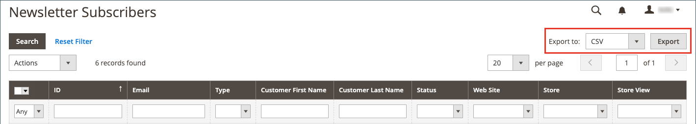

# Gestire gli abbonati alle newsletter

Come best practice, devi gestire regolarmente l’elenco degli abbonamenti e assicurarti di elaborare tutte le richieste di annullamento dell’abbonamento. In alcune giurisdizioni, la legge impone che le richieste di annullamento dell’abbonamento siano elaborate entro un determinato periodo di tempo.

Puoi gestire facilmente i tuoi abbonati utilizzando un semplice elenco di abbonamenti attivi. Quando un cliente invia una richiesta di annullamento dell’abbonamento, puoi semplicemente applicare una _Annulla iscrizione_ a una o più sottoscrizioni selezionate.

Nelle configurazioni per un singolo sito con più visualizzazioni dello store, un abbonamento a un account cliente può essere associato a una visualizzazione dello store specifica.

In configurazioni multi-store e multi-sito con un [ambito account cliente](../customers/customer-account-scope.md), un account cliente può essere abbonato alle newsletter per più siti/negozi. In questo caso, può essere utile modificare l&#39;account del cliente per gestire un gruppo di abbonamenti o annullare un abbonamento per un sito o un negozio specifico per soddisfare una richiesta.

Se si desidera utilizzare un servizio di terze parti per l&#39;invio di newsletter, è possibile esportare l&#39;elenco di iscrizioni come file CSV o XML.

## Gestire gli abbonamenti per un cliente

1. Il giorno _Amministratore_ barra laterale, vai a **[!UICONTROL Customers]** > **[!UICONTROL All Customers]**.

1. Individuare il cliente nella griglia e fare clic su **[!UICONTROL Edit]** nel _[!UICONTROL Action]_colonna.

1. Clic **[!UICONTROL Newsletter]** nel pannello a sinistra.

1. Modifica gli abbonamenti per il cliente in base alla configurazione del tuo sito o negozio.

   Per la configurazione di un singolo sito/singolo negozio, è sufficiente selezionare o cancellare la **[!UICONTROL Subscribed to Newsletter]** casella di controllo.

   {width="500" zoomable="yes"}

   Per una configurazione con un solo sito o più store, è possibile selezionare o deselezionare **[!UICONTROL Subscribed to Newsletter]** casella di controllo e impostazione **[!UICONTROL Subscribed on Store View]** alla visualizzazione corretta dello store per l’abbonamento.

   {width="500" zoomable="yes"}

   Per una configurazione multisito/multischermo con un ambito account cliente globale, la pagina visualizza lo stato di abbonamento per tutti i siti. È possibile selezionare o deselezionare **[!UICONTROL Subscribed]** e/o modificare la **[!UICONTROL Store View]** per l’abbonamento.

   {width="500" zoomable="yes"}

1. Clic **[!UICONTROL Save Customer]**.

## Annullare un abbonamento dall’elenco degli abbonati

1. Il giorno _Amministratore_ barra laterale, vai a **[!UICONTROL Marketing]** > _[!UICONTROL Communications]_>**[!UICONTROL Newsletter Subscribers]**.

   Per una configurazione multisito in cui alcuni clienti dispongono di sottoscrizioni per più siti, ogni sottoscrizione viene visualizzata come una riga nella griglia.

1. Individuare il sottoscrittore nella griglia e selezionare la casella di controllo nella prima colonna.

   >[!NOTE]
   >
   >Per annullare un abbonamento in blocco, seleziona la casella di controllo di ciascun abbonato che desideri annullare.

1. Imposta il _[!UICONTROL Action]_controllo a **[!UICONTROL Unsubscribe]**e fai clic su **[!UICONTROL Submit]**.

   {width="600" zoomable="yes"}

   Lo stato del record cambia in `Unsubscribed`.

## Esporta l’elenco degli abbonati

1. Dalla sezione _[!UICONTROL Newsletter Subscribers]_, utilizzare i controlli filtro per includere solo i record con_ Stato _di `Subscribed` e per la visualizzazione appropriata del sito Web, dello store o dello store.

1. Imposta il **[!UICONTROL Export to]** controllo a uno dei seguenti elementi:

   - `CSV`
   - `XML`

1. Clic **[!UICONTROL Export]** e cerca il prompt nella parte inferiore dello schermo e salva il file.

   {width="600" zoomable="yes"}

## Eliminare un sottoscrittore dall&#39;elenco sottoscrittori

1. Il giorno _Amministratore_ barra laterale, vai a **[!UICONTROL Marketing]** > _[!UICONTROL Communications]_>**[!UICONTROL Newsletter Subscribers]**.

1. Individuare il sottoscrittore nella griglia e selezionare la casella di controllo nella prima colonna.

1. Imposta il _[!UICONTROL Action]_controllo a **[!UICONTROL Delete]**e fai clic su **[!UICONTROL Submit]**.

1. Quando viene richiesto di confermare, fai clic su **[!UICONTROL OK]**.
