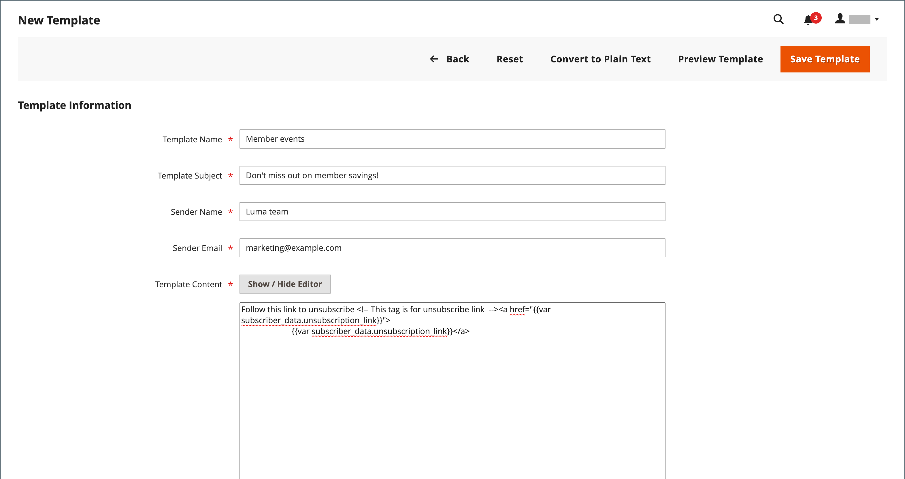

# Modelli di newsletter

Puoi creare tutti i modelli di newsletter necessari per scopi diversi. Puoi inviare un aggiornamento settimanale del prodotto, una newsletter mensile o una newsletter annuale sulle feste. I modelli di newsletter possono essere preparati con markup HTML o come testo normale. A differenza di HTML, le newsletter in formato testo normale non contengono immagini, testo formattato o collegamenti formattati. Nella griglia, la colonna Tipo di modello indica se un modello è HTML o testo.

{width="700" zoomable="yes"}

## Creare un modello di newsletter

1. Nella barra laterale di amministrazione, vai a **[!UICONTROL Marketing]** > _[!UICONTROL Communications]_>**[!UICONTROL Newsletter Template]**.

1. Per aggiungere un modello, scegliere **[!UICONTROL Add New Template]**.

1. Completa le impostazioni del modello:

   - Per **[!UICONTROL Template Name]**, immettere il nome per il riferimento interno.

   - Per **[!UICONTROL Template Subject]**, descrivi lo scopo della newsletter.

   - Per **[!UICONTROL Sender Name]**, immettere il nome della persona che deve apparire come mittente della newsletter.

   - Per **[!UICONTROL Sender Email]**, immetti l&#39;indirizzo e-mail del mittente della newsletter.

   {width="600" zoomable="yes"}

   - Per **[!UICONTROL Template Content]**, fare clic su **[!UICONTROL Show / Hide Editor]** per visualizzare l&#39;editor WYSIWYG e aggiornare il contenuto in base alle esigenze.

     Per ulteriori informazioni, vedere [Utilizzo dell&#39;editor](../content-design/editor.md).

     >[!NOTE]
     >
     >Non rimuovere il collegamento di annullamento dell’iscrizione nella parte inferiore del contenuto del modello. In alcune giurisdizioni, il collegamento è richiesto dalla legge.

   - Per **[!UICONTROL Template Styles]**, immetti le dichiarazioni CSS necessarie per formattare il contenuto.

1. Fare clic su **[!UICONTROL Preview Template]** per visualizzarne l&#39;aspetto e apportare le modifiche necessarie.

1. Al termine, fare clic su **[!UICONTROL Save Template]**.

   Dopo aver salvato un modello, **[!UICONTROL Save As]** verrà visualizzato alla successiva modifica del modello. Può essere utilizzato per salvare varianti del modello senza sovrascrivere l’originale.

## Convertire il modello in testo normale

1. Nella parte superiore della pagina, fare clic su **[!UICONTROL Convert to Plain Text]** e su **[!UICONTROL OK]** quando richiesto.

1. Per visualizzare in anteprima la versione in testo normale del modello, fare clic su **[!UICONTROL Preview Template]**.

   L’anteprima viene visualizzata in una nuova scheda del browser.

1. Per salvare la versione in testo normale, fare clic su **[!UICONTROL Save Template]**.

## Ripristina il HTML

1. Nella parte superiore della pagina, fare clic su **[!UICONTROL Return HTML Version]**.  

1. Per visualizzare in anteprima la versione HTML del modello, fare clic su **[!UICONTROL Preview Template]**.

   L’anteprima viene visualizzata in una nuova scheda del browser.

1. Per salvare la versione di HTML, fare clic su **[!UICONTROL Save Template]**.

## Eliminare un modello di newsletter

1. Nella barra laterale _Admin_, passa a **[!UICONTROL Marketing]** > _[!UICONTROL Communications]_>**[!UICONTROL Newsletter Template]**.

1. Trova il modello di newsletter da eliminare e aprilo in modalità di modifica.

1. Nella barra dei menu fare clic sul pulsante **[!UICONTROL Delete Template]**.

1. Per confermare l&#39;azione, fare clic su **[!UICONTROL OK]**.

## Colonne griglia

| Colonna | Descrizione |
|--- |--- |
| [!UICONTROL ID] | Un identificatore numerico univoco assegnato a ciascun modello di newsletter |
| [!UICONTROL Template] | Nome dell’entità modello |
| [!UICONTROL Added] | Data di creazione dell’entità modello |
| [!UICONTROL Updated] | Data dell’ultimo aggiornamento dell’entità modello |
| [!UICONTROL Subject] | Oggetto del modello di newsletter |
| [!UICONTROL Sender] | Informazioni di contatto per il mittente |
| [!UICONTROL Template Type] | Tipo di modello: `html` o `text` |
| [!UICONTROL Actions] | **[!UICONTROL Preview]**: apre una finestra separata per l&#39;anteprima del modello  **[!UICONTROL Queue Newsletter]**: inserisce il modello di newsletter nella coda di invio. |

{style="table-layout:auto"}
