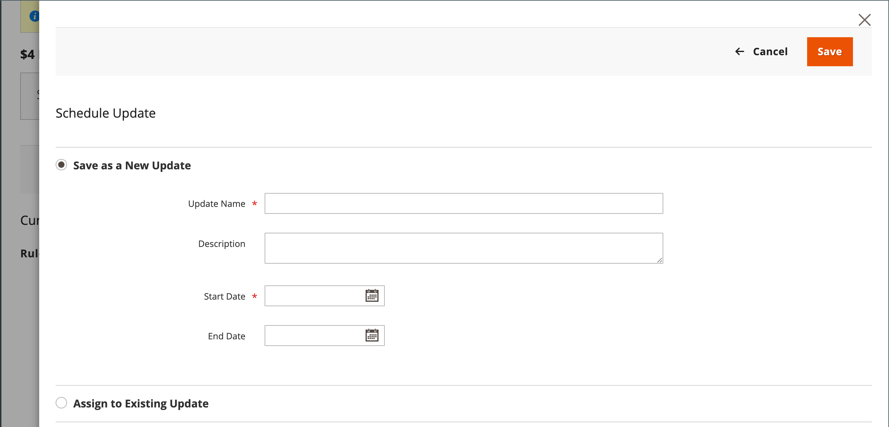
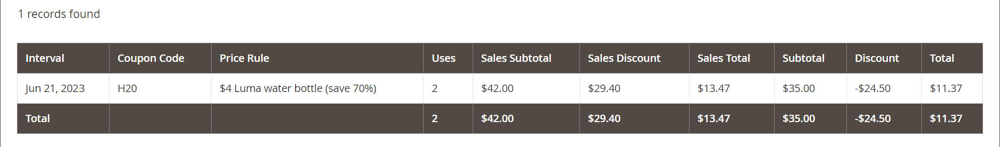

# Codici coupon

I codici coupon vengono utilizzati con [regole prezzi carrello](price-rules-cart.md) per applicare uno sconto quando viene soddisfatta una serie di condizioni. Ad esempio, è possibile creare un codice coupon per un gruppo di clienti specifico o per chiunque effettui un acquisto su un determinato importo. Per applicare il coupon a un acquisto, il cliente può inserire il codice del coupon nel carrello o eventualmente nel registro di cassa del _mattoni_ archiviare. Di seguito sono riportati alcuni modi in cui puoi utilizzare i coupon nel tuo negozio:

- Inviare coupon tramite e-mail ai clienti
- Produrre coupon stampati
- Creare coupon in-store per gli utenti di dispositivi mobili

I codici coupon possono essere inviati tramite e-mail o inclusi in newsletter, cataloghi e annunci pubblicitari. L&#39;elenco dei codici coupon può essere esportato e inviato a un servizio di stampa esterno. Puoi anche creare coupon in-store con un codice di risposta rapida che gli acquirenti possono scansionare con i loro smartphone. Il codice QR può essere collegato a una pagina del sito con ulteriori informazioni sulla promozione.

A partire dalla versione 2.4.7 di Commerce, gli acquirenti possono applicare più coupon a un carrello. Gli esercenti possono anche applicare più coupon utilizzando l’assistenza per lo shopping.

## Configurare i codici coupon

La lunghezza e il formato dei codici coupon generati automaticamente sono controllati dalla configurazione. I caratteri possono essere impostati su tutti i numeri, su tutte le lettere o su una combinazione. È possibile inserire un trattino a intervalli impostati per facilitarne la lettura e aggiungere un prefisso e un suffisso per associare il codice a una campagna o iniziativa specifica.

1. Il giorno _Amministratore_ barra laterale, vai a **[!UICONTROL Stores]** > _[!UICONTROL Settings]_>**[!UICONTROL Configuration]**.

1. Nel pannello a sinistra, espandi **[!UICONTROL Customers]** e scegli **[!UICONTROL Promotions]**.

   {width="600" zoomable="yes"}

1. Espandi **[!UICONTROL Auto Generated Specific Coupon Codes]** sezione.

   {width="600" zoomable="yes"}

1. Inserisci il **[!UICONTROL Code Length]**, inclusi prefisso, suffisso e separatori.

1. Imposta il **[!UICONTROL Code Format]** a uno dei seguenti elementi:

   - `Alphanumeric`
   - `Alphabetical`
   - `Numeric`

1. Per **[!UICONTROL Code Prefix]**, immettere il valore che si desidera visualizzare all&#39;inizio di tutti i codici coupon.

1. Per **[!UICONTROL Code Suffix]**, immettere il valore che si desidera visualizzare alla fine di tutti i codici coupon.

1. Per **[!UICONTROL Dash Every X Characters]**, inserisci il numero di caratteri tra ciascun trattino.

   I codici coupon con pattern di trattino diversi sono considerati codici diversi, anche se i numeri sono gli stessi.

1. Al termine, fai clic su **[!UICONTROL Save Config]**.

## Crea coupon

>[!NOTE]
>
>Prima di creare i coupon, utilizza `bin/magento cron:run` per verificare che cron sia in esecuzione. Consulta [Esegui cron dalla riga di comando](https://experienceleague.adobe.com/docs/commerce-operations/configuration-guide/cli/configure-cron-jobs.html#run-cron-from-the-command-line) nel _Guida alla configurazione_ per ulteriori informazioni.

### Metodo 1: creazione di un coupon specifico

1. Segui le istruzioni per creare una [regola prezzo carrello](price-rules-cart.md).

1. In **[!UICONTROL Rule Information]** sezione, set **[!UICONTROL Coupon]** a `Specific Coupon`.

1. Immetti un **[!UICONTROL Coupon Code]** da utilizzare con la promozione.

   Il formato del codice (numerico, alfanumerico o alfabetico) è determinato dalla [configurazione](#configure-coupon-codes).

1. Per limitare il numero di volte in cui è possibile utilizzare il coupon, eseguire le operazioni seguenti:

   - Immetti il numero di **[!UICONTROL Uses per Coupon]**.
   - Immetti il numero di **[!UICONTROL Uses per Customer]**.

   Per un utilizzo illimitato, lascia vuoti questi campi.

   {width="600" zoomable="yes"}

   >[!NOTE]
   >
   >In caso di utilizzo simultaneo dello stesso coupon da parte di più clienti contemporaneamente, è possibile che il limite di utilizzo impostato possa essere superato a causa di un ritardo nell’elaborazione del coupon.

1. Per rendere valido il coupon per un periodo di tempo, effettuare le seguenti operazioni:

   -  (Solo Magento Open Source) Completa il **Da** e **A** date. Per selezionare la data, fare clic su **Calendario** () accanto a ciascun campo. Se lasci vuoto l’intervallo di date, la regola non scade.

   -  (Solo Adobe Commerce) Effettua una delle seguenti operazioni:

     **Opzione 1:** Pianifica un nuovo aggiornamento

      - Clic **[!UICONTROL Schedule New Update]** nell’angolo superiore destro della pagina.

        {width="600" zoomable="yes"}

      - Inserisci il **[!UICONTROL Update Name]** e **[!UICONTROL Description]**.

      - Scegli la **Data di inizio** e **[!UICONTROL End Date]** dal calendario (  ). Se lasci vuoto l’intervallo di date, la regola non scade.

      - Al termine, fai clic su **[!UICONTROL Save]**.

        {width="600" zoomable="yes"}

     **Opzione 2:** Assegna a un aggiornamento esistente:

      - Seleziona **[!UICONTROL Assign to Another Update]**.

      - Trova l’aggiornamento nell’elenco e fai clic su **[!UICONTROL Select]**.

1. Completa il [regola prezzo carrello](price-rules-cart.md) secondo necessità.

### Metodo 2: generare un batch di coupon

La generazione di buoni sconto è un’operazione asincrona, che viene eseguita in background in modo da poter continuare a lavorare in Admin senza attendere il completamento dell’operazione. Il sistema visualizza un messaggio al completamento dell&#39;operazione.

1. Segui le istruzioni per creare una [regola prezzo carrello](price-rules-cart.md).

1. Sotto **[!UICONTROL Coupon Code]**, seleziona la **[!UICONTROL Use Auto Generation]** casella di controllo.

1. Per limitare il numero di volte in cui ogni cliente può utilizzare il coupon, immettere il numero di **[!UICONTROL Uses per Customer]**.

   {width="600" zoomable="yes"}

   >[!NOTE]
   >
   >In caso di utilizzo simultaneo dello stesso coupon da parte di più clienti contemporaneamente, è possibile che il limite di utilizzo impostato possa essere superato a causa di un ritardo nell’elaborazione del coupon.

1. Scorri verso il basso ed espandi  il **[!UICONTROL Manage Coupon Codes]** ed effettuare le seguenti operazioni:

   {width="600" zoomable="yes"}

   - Per **[!UICONTROL Coupons Qty]**, immettere il numero di coupon che si desidera generare.

   - Inserisci il **[!UICONTROL Code Length]**, esclusi prefisso, suffisso o separatori.

   - Imposta il **[!UICONTROL Code Format]** a uno dei seguenti elementi:

      - `Alphanumeric`
      - `Alphabetical`
      - `Numeric`

   - (Facoltativo) Inserisci un **[!UICONTROL Code Prefix]** da aggiungere all&#39;inizio del codice.

   - (Facoltativo) Inserisci un **[!UICONTROL Code Suffix]** da aggiungere alla fine del codice.

   - (Facoltativo) Per **[!UICONTROL Dash Every X Characters]**, inserisci il numero di caratteri tra ciascun trattino. Ad esempio, se la lunghezza del codice è di 12 caratteri ed è presente un trattino ogni quattro caratteri, il codice avrà l’aspetto di `xxxx-xxxx-xxxx`. I trattini facilitano la lettura e l&#39;immissione dei codici.

1. Al termine, fai clic su **[!UICONTROL Generate]**.

   Il sistema visualizza `Message is added to queue, wait to get your coupons soon`.

   Al termine del processo cron, viene visualizzato l’elenco dei codici generati.

   | Campo | Descrizione |
   |-------------|-------------|
   | [!UICONTROL Coupon Code] | Codice univoco del coupon creato che può essere utilizzato per ricevere condizioni speciali. |
   | [!UICONTROL Created] | Data di creazione del codice coupon. |
   | [!UICONTROL Used] | Indica se è stato utilizzato il coupon. |
   | [!UICONTROL Times Used] | Indica quante volte è stato utilizzato il codice coupon. |

   {style="table-layout:auto"}

È possibile esportare i codici coupon in un file CSV o Excel XML selezionando il formato di file e facendo clic su **[!UICONTROL Export]**.

Per eliminare i codici coupon, selezionare uno o più codici dall&#39;elenco. Seleziona `Delete` dal **[!UICONTROL Actions]**  e quindi fare clic su **[!UICONTROL Submit]**.

>[!NOTE]
>
>Anche se Commerce consente la configurazione di più codici coupon, un cliente può utilizzare un solo codice coupon nel carrello. Per consentire l’utilizzo simultaneo di più codici coupon nel carrello, puoi utilizzare un’estensione corrispondente proveniente da [Commerce Marketplace](https://marketplace.magento.com/).

## Rapporto Coupon

Il _Coupon_ report aggrega i dati di ogni cedola utilizzata durante un intervallo di date specifico. Poiché i coupon vengono applicati dal carrello, il rapporto include i dati di tutti i coupon rimborsati, indipendentemente da [stato ordine](../stores-purchase/order-status.md). Di conseguenza, il rapporto potrebbe includere sia i totali previsti che quelli effettivi. Il rapporto può essere filtrato per una specifica vista negozio, periodo di tempo, stato dell’ordine e regola del prezzo del carrello.

Nell&#39;esempio seguente, il codice coupon &quot;H20&quot; è stato utilizzato da due clienti. Uno degli ordini viene fatturato, ma l&#39;altro è ancora _in sospeso_. Nelle colonne Subtotale vendite previsto, Sconto vendite e Totale vendite vengono visualizzati gli importi aggregati di entrambi gli ordini, ma solo l&#39;ordine fatturato effettivo viene visualizzato nelle colonne Subtotale, Sconto e Totale. Ogni riga del rapporto rappresenta una singola promozione di coupon.

{width="600" zoomable="yes"}

### Eseguire il rapporto

1. Il giorno _Amministratore_ barra laterale, vai a **[!UICONTROL Reports]** > _[!UICONTROL Sales]_>**[!UICONTROL Coupons]**.

1. Se si dispone di più visualizzazioni dello store, impostare **[!DNL Store View]** nell’angolo in alto a sinistra per stabilire l’ambito del rapporto.

1. Per aggiornare le vendite [statistiche](../getting-started/sales-reports.md#refresh-statistics) per il giorno, fai clic su _Ultimo aggiornamento_ nella parte superiore dell’area di lavoro.

   Quindi, fai clic su per selezionare **[!UICONTROL Coupons]** e fai clic su **[!UICONTROL Refresh]**.

   {width="600" zoomable="yes"}

1. Per filtrare i dati, eseguire le operazioni seguenti:

   {width="600" zoomable="yes"}

   - Imposta **[!UICONTROL Date Used]** a uno dei seguenti elementi:

      - `Order Created`
      - `Order Updated`

     Il _Ordine aggiornato_ Il report viene creato in tempo reale e non richiede un aggiornamento.

   - Per definire il periodo di tempo coperto dal rapporto, impostare **[!UICONTROL Period]** a uno dei seguenti elementi:

      - `Day`
      - `Month`
      - `Year`

   - Per definire l’intervallo di date del rapporto, inserisci **Da** e **A** date in formato M/G/AA.

   - Per stampare un report per un [stato ordine](../stores-purchase/order-status.md), impostato **[!UICONTROL Order Status]** a `Specified` e scegliere lo stato dell&#39;ordine dall&#39;elenco.

   - Per omettere righe senza dati dal report, impostare **[!UICONTROL Empty Rows]** a `No`.

   - Per definire l&#39;attività coupon inclusa nel rapporto, effettuare una delle seguenti operazioni:

      - Per includere tutte le attività coupon da tutte le regole di prezzo, impostare **[!UICONTROL Cart Price Rule]** a `Any`.
      - Per includere solo l&#39;attività correlata a una regola di prezzo specifica, impostare **[!UICONTROL Cart Price Rule]** a `Specified` e seleziona la regola prezzo carrello nell’elenco.

1. Quando è il momento di eseguire il rapporto, fai clic su **[!UICONTROL Show Report]**.

   Il rapporto viene visualizzato nella parte inferiore della pagina.

### Opzioni filtro

| Campo | Descrizione |
|--- |--- |
| [!UICONTROL Date Used] | Identifica il campo data utilizzato come base del rapporto. Opzioni: **[!UICONTROL Order Created]**: genera il rapporto in base alla data in cui l’ordine è stato effettuato dal cliente. Per includere i dati più recenti, fai clic sul collegamento nel messaggio per aggiornare le statistiche. **[!UICONTROL Order Updated]**: genera il rapporto in base alla data dell’ultimo aggiornamento degli ordini. Questo report utilizza dati in tempo reale e non richiede l&#39;aggiornamento delle statistiche. |
| [!UICONTROL Period] | Determina il tipo di intervallo di date utilizzato per il rapporto. Opzioni: `Day` / `Month` / `Year` |
| [!UICONTROL From] | Indica la prima data nell&#39;intervallo di dati dell&#39;ordine inclusa nel rapporto. |
| [!UICONTROL To] | Indica l&#39;ultima data dell&#39;intervallo di dati dell&#39;ordine incluso nel rapporto. |
| [!UICONTROL Order Status] | Filtra il report in base allo stato dell&#39;ordine. Il rapporto può essere generato per tutti gli ordini o limitato a uno stato specifico dell’ordine. Opzioni:  **[!UICONTROL Any]**: include tutti gli ordini a prescindere dallo stato. **[!UICONTROL Specified]**: include solo gli ordini con lo stato specificato. Gli ordini annullati non sono inclusi nel rapporto. |
| [!UICONTROL Empty Rows] | Determina se il report include righe di dati vuoti che possono essere recuperate. Opzioni: `Yes` / `No` |
| [!UICONTROL Cart Price Rules] | Determina quali promozioni coupon includere nel rapporto. Opzioni: **[!UICONTROL Any]**: include informazioni sull’ordine per qualsiasi promozione di coupon utilizzata durante l’intervallo di date specificato. **[!UICONTROL Specified]**: include solo le informazioni sull’ordine per la promozione del coupon selezionata durante l’intervallo di date specificato. |

{style="table-layout:auto"}

### Colonne report

| Colonna | Descrizione |
|--- |--- |
| [!UICONTROL Interval] | Indica l’intervallo di date dell’utilizzo della cedola da includere nel rapporto. L’intervallo può essere un giorno, un mese, un anno o un intervallo di date specifico. La data dell&#39;intervallo viene formattata come negli esempi seguenti, in base al valore impostato in **[!UICONTROL Period]** impostazione: `Day`: 6/21/19 `Month`: 6/2019 `Year`: 2019 |
| [!UICONTROL Coupon Code] | Codice sconto inserito dai clienti nel carrello per ricevere lo sconto. |
| [!UICONTROL Price Rule] | Nome della regola di prezzo associata al coupon. |
| [!UICONTROL Uses] | Il numero di volte in cui il coupon è stato utilizzato durante l’intervallo di date specificato per il rapporto. |
| [!UICONTROL Sales Subtotal] | Subtotale previsto da tutti gli ordini inseriti con il coupon.  Il Subtotale vendite rappresenta il Subtotale aggregato da tutti gli ordini idonei e include `Pending` ordini cliente non ancora fatturati. |
| [!UICONTROL Sales Discount] | Importo dello sconto previsto da tutti gli ordini emessi con la cedola.  Lo sconto rappresenta l&#39;importo dello sconto aggregato da tutti gli ordini idonei e include `Pending` ordini cliente non ancora fatturati. |
| [!UICONTROL Sales Total] | Il totale complessivo previsto da tutti gli ordini effettuati con il buono sconto. Il totale vendite include tutte le spese di spedizione e imballaggio, meno l&#39;importo dello sconto.  Il totale vendite rappresenta l&#39;importo totale aggregato di tutti gli ordini idonei e include `Pending` ordini cliente non ancora fatturati. Il valore include il subtotale più la spedizione e la movimentazione, meno lo sconto, più l&#39;imposta.   Calcolato da: `((Subtotal + Shipping & Handling) - Discount) + Tax` |
| [!UICONTROL Subtotal] | Subtotale aggregato da tutti gli ordini fatturati che hanno utilizzato la cedola. |
| [!UICONTROL Discount] | Sconto aggregato da tutti gli ordini fatturati che hanno utilizzato la cedola. |
| [!UICONTROL Total] | Totale aggregato di tutti gli ordini fatturati che hanno utilizzato la cedola. |

{style="table-layout:auto"}
