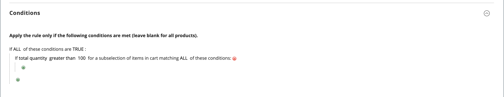
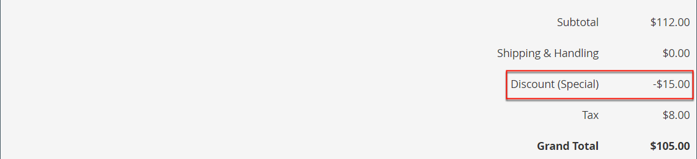

# Creare una regola di prezzo del carrello

Completa i passaggi seguenti per aggiungere una regola, descrivere le condizioni e definire le azioni. Completa anche le etichette e verifica la regola. Le condizioni della regola di prezzo possono essere basate su attributi del carrello o [attributi di prodotto](../catalog/product-attributes.md) o [Tipi di pubblico di Real-Time CDP](#use-real-time-cdp-audiences-to-set-a-condition), ma non su [opzioni personalizzabili](../catalog/settings-advanced-custom-options.md).

## Passaggio 1: aggiungere una regola

1. Nella barra laterale _Admin_, passa a **[!UICONTROL Marketing]** > _[!UICONTROL Promotions]_>**[!UICONTROL Cart Price Rules]**.

1. Fare clic su **[!UICONTROL Add New Rule]** ed effettuare le seguenti operazioni:

   - In _[!UICONTROL Rule Information]_, completare **[!UICONTROL Rule Name]**e **[!UICONTROL Description]**.

   - Se non si desidera che la regola venga applicata immediatamente, impostare **[!UICONTROL Active]** su `No`.

   {width="600" zoomable="yes"}

1. Per stabilire l&#39;[ambito](../getting-started/websites-stores-views.md#scope-settings) della regola, eseguire le operazioni seguenti:

   - Selezionare **[!UICONTROL Websites]** in cui la promozione deve essere disponibile.

   - Selezionare **[!UICONTROL Customer Groups]** a cui applicare la promozione.

     Se desideri che la promozione sia disponibile solo per i clienti registrati, **_non_** scegli l&#39;opzione `NOT LOGGED IN`.

1. Imposta la regola da applicare con o senza un [coupon](price-rules-cart-coupon.md) come segue:

   - Per applicare la regola del carrello senza l&#39;utilizzo di un codice coupon, impostare **[!UICONTROL Coupon]** su `No Coupon` e passare al passaggio 5.

   - Per associare un coupon a una regola di prezzo, impostare **[!UICONTROL Coupon]** su `Specific Coupon` ed effettuare le seguenti operazioni:

      - Immettere un testo libero **[!UICONTROL Coupon Code]** che il cliente deve immettere per ricevere lo sconto.

      - Per impostare un limite per il numero di volte in cui è possibile utilizzare il coupon, completare le seguenti opzioni:

     | Opzione | Descrizione |
     |------|-----------|
     | `Uses per Coupon` | Determina quante volte è possibile utilizzare il codice coupon. Se non è previsto alcun limite, lasciare vuoto il campo. |
     | `Uses per Customer` | Determina quante volte la regola del prezzo del carrello può essere utilizzata dallo stesso cliente registrato che appartiene a uno qualsiasi dei gruppi di clienti selezionati. L’impostazione non si applica agli acquirenti ospiti che sono membri del gruppo di clienti NOT LOGGED IN o ai clienti che effettuano acquisti senza effettuare l’accesso ai loro account. Se non è previsto alcun limite, lasciare vuoto il campo. |

     {style="table-layout:auto"}

     Per ulteriori informazioni, consulta [Codici coupon](price-rules-cart-coupon.md).

     {width="600" zoomable="yes"}

   -  (solo Magento Open Source) Utilizza il _Calendario_ () per scegliere l&#39;intervallo di date **[!UICONTROL From]** e **[!UICONTROL To]** per la promozione.

1. Immettere un numero per definire **[!UICONTROL Priority]** di questa regola prezzo in relazione alle impostazioni Azione di altre regole prezzo attive contemporaneamente.

   >[!NOTE]
   >
   >L’impostazione di priorità è importante quando due regole del carrello/codici coupon sono validi per lo stesso prodotto contemporaneamente. La regola con l&#39;impostazione di priorità più alta (`1` è il valore più alto) controlla l&#39;azione del carrello. Consulta _Ignorare le regole di prezzo successive_ nel passaggio _Definire le azioni_.

   >[!NOTE]
   >
   >Le regole di prezzo del carrello con la stessa priorità non generano uno sconto combinato. Ogni regola viene applicata ai prodotti corrispondenti separatamente, uno per uno.

1. Per applicare la regola ai [feed RSS](social-rss.md#rss-feeds) pubblicati, impostare **Pubblico nel feed RSS** su `Yes`.

1. Fare clic su **[!UICONTROL Save and Continue Edit]**.

   -  (solo Magento Open Source) Dopo il salvataggio della regola, il nome della regola del prezzo del carrello viene visualizzato nella parte superiore della pagina.

   -  (solo Adobe Commerce) Dopo il salvataggio della regola, il nome della regola del prezzo del carrello e la casella [Modifiche pianificate](price-rule-cart-scheduled-changes.md) vengono visualizzati nella parte superiore della pagina.

     {width="600" zoomable="yes"}

## Passaggio 2: descrivere le condizioni

In questa fase vengono descritte le condizioni che devono essere soddisfatte affinché un ordine possa beneficiare della promozione. La regola entra in azione ogni volta che viene soddisfatta l’insieme di condizioni.

Se utilizzi tipi di pubblico da Real-Time CDP, passa a [questa sezione](#use-real-time-cdp-audiences-to-set-a-condition).

>[!NOTE]
>
>La regola del prezzo del carrello viene applicata a **_ogni_** prodotto nel carrello ogni volta che viene soddisfatta la serie di condizioni nella scheda _[!UICONTROL Conditions]_. Aggiungi condizioni nella scheda_[!UICONTROL Actions]_ per limitare il numero di prodotti interessati dalla regola prezzo carrello.

>[!NOTE]
>
>Se almeno un attributo di prodotto condizionale ha un valore vuoto, la regola del prezzo del carrello non viene applicata al prodotto.

1. Nel pannello a sinistra, seleziona **[!UICONTROL Conditions]**.

   {width="600" zoomable="yes"}

   La prima condizione viene visualizzata per impostazione predefinita e viene indicata come segue:

   `If **ALL** of these conditions are **TRUE**:`

   L’istruzione dispone di due collegamenti in grassetto su cui è possibile fare clic per visualizzare la selezione delle opzioni per quella parte dell’istruzione. È possibile creare condizioni diverse modificando la combinazione di questi valori. Effettua una delle seguenti operazioni:

   - Fare clic su **[!UICONTROL ALL]** e selezionare `ALL` o `ANY`.
   - Fare clic su **[!UICONTROL TRUE]** e selezionare `TRUE` o `FALSE`.
   - Lascia invariata la condizione per applicare la regola a tutti i prodotti.

1. Fai clic su _Aggiungi_ () all&#39;inizio della riga successiva e seleziona un&#39;opzione per la condizione, ad esempio attributo carrello, sottoselezione prodotto o combinazione.

   In questo esempio, completare la parte successiva della condizione come indicato di seguito:

   - Quando viene richiesto di **[!UICONTROL Choose the condition to add]**, scegliere `Products Subselection`.

     {width="600" zoomable="yes"}

   - Nell&#39;istruzione condizionale, fare clic su **[!UICONTROL total quantity]** e selezionare `total quantity` o `total amount`.

   >[!IMPORTANT]
   >
   >[!UICONTROL Total amount] è un totale riga, pertanto le imposte non vengono incluse in `total amount` per la condizione della regola prezzo carrello [!UICONTROL Products Subselection]. Utilizzare la condizione [!UICONTROL Subtotal (Incl. Tax)] per includere le imposte.

   - Nell&#39;istruzione condizionale fare clic su **[!UICONTROL is]** e selezionare `greater than`.

1. Quando viene visualizzata la parte successiva della condizione, fai clic sugli elementi dell’istruzione in modo da visualizzare dove si trova ogni collegamento con i valori delle variabili.

1. Fai clic sul collegamento &quot;Altro&quot; (...) e immetti `100`.

   Questa condizione richiede che la quantità totale del carrello sia `101` o superiore.

   {width="600" zoomable="yes"}

1. Fai clic su **Aggiungi** () all&#39;inizio della riga successiva, quindi aggiungi una condizione basata su **Categoria**.

   {width="600" zoomable="yes"}

1. Nella parte successiva della condizione, fai clic sul collegamento _altro_ (**...**) per visualizzare il campo di input, quindi apri _Selettore_ () per visualizzare la struttura delle categorie.

1. Selezionare la casella di controllo della categoria che si desidera utilizzare come condizione per la regola prezzi e fare clic sull&#39;icona  per accettare le selezioni della categoria.

   La condizione può essere basata su qualsiasi categoria figlio della [categoria principale](../catalog/category-root.md) dell&#39;archivio.

   {width="600" zoomable="yes"}

1. Per aggiungere altre condizioni, fai clic su _Aggiungi_ () e definisci un&#39;altra condizione.

   È possibile ripetere il processo il numero di volte necessario per descrivere le condizioni che devono essere soddisfatte per la regola di prezzo. Di seguito sono riportati alcuni esempi:

   **Esempio 1:** Regola prezzi regionali

   Per creare una regola di prezzo regionale, utilizzare uno dei seguenti attributi del carrello:

   - `Shipping Postcode`
   - `Shipping Region`
   - `Shipping State/Province`
   - `Shipping Country`

   **Esempio 2:** Totali carrello

   Per basare la condizione sui totali del carrello, utilizza uno dei seguenti attributi del carrello:

   - `Subtotal`
   - `Total Items Quantity`
   - `Total Weight`

>[!NOTE]
>
>In caso di più promozioni parallele, la condizione _Subtotale_ viene applicata al subtotale del carrello **_base _prima_**di eventuali sconti._

>[!IMPORTANT]
>
>**Solo per ordini fornitore**: quando una regola del prezzo del carrello è impostata in base a uno o più metodi di pagamento specifici, lo sconto viene applicato al totale al momento della creazione di un ordine fornitore. Dopo la creazione dell&#39;ordine di acquisto, lo sconto rimane applicato al totale se il metodo di pagamento viene modificato in uno non coperto dalla regola del prezzo del carrello.

### Aggiungi un attributo di prodotto alle regole di prezzo del carrello

1. Vai a **[!UICONTROL Stores]** > _[!UICONTROL Attributes]_>**[!UICONTROL Product]**e apri l&#39;attributo del prodotto.

1. Nel pannello a sinistra, seleziona **[!UICONTROL Storefront Properties]**.

1. Imposta **[!UICONTROL Use for Promo Rule Conditions]** su `Yes`.

1. Fare clic su **[!UICONTROL Save Attribute]**.

1. Vai a **[!UICONTROL Marketing]** > **[!UICONTROL Cart Price Rules]** e apri la regola del prezzo del carrello richiesto.

1. Espandere  nella sezione **[!UICONTROL Condition]** e selezionare **[!UICONTROL Product attribute combination]**.

1. Imposta questa condizione su uno dei seguenti valori:

   - Fare clic su **[!UICONTROL FOUND]** e selezionare `FOUND` o `NOT FOUND`.

   - Fare clic su **[!UICONTROL ALL]** e selezionare `ALL` o `ANY`.

1. Fai clic sull&#39;icona _Aggiungi_ () e seleziona **[!UICONTROL Product Attribute]** configurato per le condizioni della regola promozionale.

1. Fare clic su **[!UICONTROL Save]**.

>[!NOTE]
>
>Quando si utilizza la condizione `is not one of` con un attributo di prodotto _SKU_ e un prodotto configurabile, è necessario selezionare sia gli SKU del prodotto padre che quelli del prodotto figlio. Per evitare di elencare tutti gli SKU figlio nella regola, è possibile utilizzare la condizione `does not contain` con parti SKU comuni di un prodotto configurabile e dei relativi prodotti figlio.

### Utilizzare il pubblico di Real-Time CDP per impostare una condizione

Puoi impostare una condizione per una regola del prezzo del carrello basata su un pubblico [di Real-Time CDP](../customers/audience-activation.md).

1. Espandere **[!UICONTROL Conditions]**, fare clic sull&#39;icona &quot;+&quot; e selezionare **[!UICONTROL Real-Time CDP Audience]** dall&#39;elenco.

   {width="300"}

1. Seleziona l&#39;icona _Altro_ (**...**), fai clic su **[!UICONTROL Open Chooser]** e visualizza tutti i tipi di pubblico di Real-Time CDP disponibili.

   {width="600" zoomable="yes"}

1. Seleziona il pubblico Real-Time CDP da utilizzare per la regola del prezzo del carrello.

   | Opzione | Descrizione |
   |------|-----------|
   | `ID` | Un identificatore interno del pubblico utilizzato all’interno dell’amministratore |
   | `Real-Time CDP Audience ID` | Identificatore univoco del pubblico al momento della creazione in Experience Platform |
   | `Name` | Nome del pubblico, ad esempio `Orders over $50` |
   | `Description` | Descrizione del pubblico, ad esempio `People who placed an order over $50 in the last month.`. |
   | `Source` | Indica da dove proviene il pubblico, ad esempio `Experience Platform`. |
   | `Website` | Indica quale sito web hai collegato allo stream di dati che contiene i tipi di pubblico. Questo collegamento viene creato quando si connette l&#39;istanza Commerce all&#39;Experience Platform tramite l&#39;estensione [[!DNL Data Connection]](https://experienceleague.adobe.com/docs/commerce-merchant-services/data-connection/fundamentals/connect-data.html). |

   {style="table-layout:auto"}

Nel passaggio successivo, definisci l’azione da eseguire quando la condizione viene soddisfatta.

## Passaggio 3: definire le azioni

Le azioni della regola prezzo del carrello descrivono il modo in cui i prezzi vengono aggiornati quando vengono soddisfatte le condizioni.

1. Scorri verso il basso fino a **[!UICONTROL Actions]** ed espandi  nella sezione.

   {width="600" zoomable="yes"}

1. Impostare **[!UICONTROL Apply]** su una delle seguenti opzioni di sconto:

   | Opzione | Descrizione |
   |------|-----------|
   | `Percent of product price discount` | Consente di applicare uno sconto all&#39;articolo sottraendo una percentuale dal prezzo originale. Lo sconto si applica a ogni articolo idoneo nel carrello. Ad esempio: immettere `10` in [!UICONTROL Discount Amount] per un prezzo aggiornato inferiore del 10% rispetto al prezzo originale. |
   | `Fixed amount discount` | Consente di applicare uno sconto all&#39;articolo sottraendo un importo fisso dal prezzo originale di ciascun articolo idoneo nel carrello. Ad esempio: immetti `10` in [!UICONTROL Discount Amount] per un prezzo aggiornato inferiore di 10 dollari al prezzo originale. |
   | Sconto importo fisso per carrello intero | Sconta l&#39;intero carrello sottraendo un importo fisso dal totale del carrello. Ad esempio: immetti 10 in [!UICONTROL Discount Amount] per sottrarre $ 10 dal totale del carrello. Per impostazione predefinita, lo sconto si applica solo al subtotale del carrello. Per applicare lo sconto al subtotale e alla spedizione separatamente, utilizzare l&#39;opzione _[!UICONTROL Apply to Shipping Amount]_. |
   | `Buy X get Y free` | Definisce una quantità X che il cliente deve acquistare per ricevere gratuitamente una quantità Y **dello stesso prodotto/variante**. (Il [!UICONTROL Discount Amount] è Y.) Una quantità totale di X+Y dello stesso articolo deve essere presente/aggiunta al carrello per applicare lo sconto. |

   {style="table-layout:auto"}

   - Immettere **[!UICONTROL Discount Amount]** come numero, senza simboli. Ad esempio, a seconda dell&#39;opzione di sconto selezionata, il numero 10 potrebbe indicare una percentuale, un importo fisso o una quantità di articoli.

   - Per uno sconto di _Acquista X ottieni Y gratuito_, immettere la quantità nel campo **[!UICONTROL Discount Qty Step (Buy X)]** di un singolo prodotto/SKU/riga che il cliente deve acquistare per ricevere lo sconto sulla quantità Y. Sia X che Y si riferiscono a quantità della stessa SKU, e quella quantità specifica (le varianti di un prodotto configurabile sono conteggiate separatamente) dell&#39;articolo deve essere aggiunta al carrello manualmente.

   - Nel campo **[!UICONTROL Maximum Qty Discount is Applied To]**, immettere la quantità massima dello stesso prodotto che può beneficiare dello sconto nello stesso acquisto.

   - Imposta **[!UICONTROL Apply to Shipping Amount]** () come segue:

     | Opzione | Descrizione |
     |------|-----------|
     | `Yes` | Applica l&#39;importo dello sconto separatamente al subtotale e agli importi di spedizione. |
     | `No` | Applica l&#39;importo dello sconto solo al subtotale. |

     {style="table-layout:auto"}

   - Per interrompere l&#39;elaborazione di altre regole dopo l&#39;applicazione di questa regola, impostare **[!UICONTROL Discard Subsequent Rules]** () su `Yes`. Questa impostazione impedisce l’applicazione di più sconti allo stesso prodotto.

     | Opzione | Descrizione |
     |------|-----------|
     | `Yes` | Impedisce l&#39;applicazione di qualsiasi altra regola di determinazione dei prezzi applicabile a un prodotto. Quando più regole di determinazione dei prezzi si applicano allo stesso prodotto, solo la regola di determinazione dei prezzi con la priorità definita più alta (in un campo regola [!UICONTROL Priority]) viene applicata al prodotto idoneo. Questo impedisce a più regole di determinazione dei prezzi di sovrapporsi e fornire sconti aggiuntivi non intenzionali. |
     | `No` | Consente l&#39;applicazione di più regole di determinazione prezzi allo stesso prodotto. Questo potrebbe comportare lo stacking e la fornitura di più sconti applicati al prezzo dell&#39;inserzione. |

     {style="table-layout:auto"}

     >[!IMPORTANT]
     >
     >Per ignorare le regole successive, una regola di determinazione dei prezzi deve utilizzare le priorità definite nel campo Priorità di ogni regola e più regole non devono avere la stessa priorità definita. Vedi **[!UICONTROL Priority]** nel passaggio _Aggiungi nuova regola_.

1. Per definire i prodotti **_esatti_** nel carrello interessati dalla regola del prezzo del carrello, aggiungi le **_condizioni aggiuntive_** necessarie per l&#39;azione.

   Per determinare se la spedizione gratuita viene applicata agli ordini che soddisfano le condizioni, impostare **[!UICONTROL Free Shipping]** su uno dei seguenti valori:

   | Opzione | Descrizione |
   |------|-----------|
   | `No` | La spedizione gratuita non è disponibile. |
   | `For matching items only` | La spedizione gratuita è disponibile solo per gli articoli che soddisfano le condizioni della regola. |
   | `For shipment with matching items` | La spedizione gratuita è disponibile per tutte le spedizioni che includono oggetti corrispondenti. Per utilizzare questa opzione, è necessario abilitare il metodo di consegna [Spedizione gratuita](../stores-purchase/shipping-free.md). |

   {style="table-layout:auto"}

1.  (solo Adobe Commerce) Per **[!UICONTROL Add Rewards Points]**, inserisci il numero fisso di punti che il cliente guadagna **_una_** per ordine ogni volta che viene applicata la regola del prezzo del carrello.

   Se i punti premio non sono attivati, lasciare vuoto questo campo.

1. Al termine, fare clic su **[!UICONTROL Save and Continue Edit]**.

## Passaggio 4: Completare le etichette

L&#39;etichetta viene visualizzata nella sezione dei totali dell&#39;ordine per identificare lo sconto. Il testo dell&#39;etichetta è racchiuso tra parentesi, dopo la parola `Discount`. È possibile immettere un&#39;etichetta predefinita per tutte le visualizzazioni dello store oppure un&#39;etichetta diversa per ciascuna visualizzazione.

{width="600"}

1. Scorri verso il basso fino a **[!UICONTROL Labels]** ed espandi la sezione.

1. Immettere il testo da utilizzare come **[!UICONTROL Default Rule Label for All Store Views]**.

   {width="600" zoomable="yes"}

1. Se lo store dispone di più visualizzazioni o di più siti Web con più visualizzazioni, immettere il testo dell&#39;etichetta appropriato per ciascuna visualizzazione.

   Ad esempio, se ogni visualizzazione Store è in una lingua diversa, immettere la traduzione dell&#39;etichetta per ogni visualizzazione.

   {width="600" zoomable="yes"}

## Passaggio 5: aggiungere blocchi dinamici correlati (facoltativo)

{{ee-feature}}

[I blocchi dinamici](../content-design/dynamic-blocks.md) associati alla regola vengono visualizzati nella vetrina ogni volta che vengono soddisfatte le condizioni.

1. Espandere  nella sezione **[!UICONTROL Related Dynamic Blocks]**.

1. Utilizza i [filtri di ricerca](../getting-started/admin-workspace.md) per individuare i blocchi da associare alla regola.

1. Seleziona la casella di controllo nella prima colonna per associare il blocco alla regola.

   Per ulteriori informazioni, consulta [Blocchi dinamici nelle regole di prezzo](../content-design/dynamic-blocks-price-rules.md).

## Passaggio 6: salvare e verificare la regola

1. Al termine, fare clic su **[!UICONTROL Save Rule]**.

1. Verifica la regola per assicurarti che funzioni correttamente.

   Le regole di prezzo vengono elaborate automaticamente ogni notte con altre regole di sistema. Quando crei una regola del prezzo, lascia il tempo necessario per l&#39;accesso al sistema. Verifica inoltre la regola per assicurarti che funzioni correttamente. Con l&#39;aggiunta di nuove regole, Commerce ricalcola di conseguenza i prezzi e le priorità.

## Dimostrazione regola prezzo carrello

Guarda questo video per scoprire come creare le regole di prezzo del carrello:

>[!VIDEO](https://video.tv.adobe.com/v/343835?quality=12)

## Descrizioni dei campi

### [!UICONTROL Rule Information]

| Campo | Descrizione |
|--- |--- |
| [!UICONTROL Rule Name] | (Obbligatorio) Il nome della regola serve come riferimento interno. |
| [!UICONTROL Description] | Una descrizione della regola deve includere lo scopo della regola e spiegare come viene utilizzata. |
| [!UICONTROL Active] | (Obbligatorio) Determina se la regola è attiva nell&#39;archivio. Opzioni: `Yes` / `No` |
| [!UICONTROL Websites] | (Obbligatorio) Identifica i siti web in cui è possibile utilizzare la regola. |
| [!UICONTROL Customer Groups] | (Obbligatorio) Identifica i gruppi di clienti a cui si applica la regola. |
| [!UICONTROL Coupon] | (Obbligatorio) Indica se alla regola è associato un buono sconto. Opzioni:  **[!UICONTROL No Coupon]**- Nessun coupon associato alla regola. **[!UICONTROL Specific Coupon]** - Un coupon specifico è associato alla regola.  **[!UICONTROL Coupon Code]**- Quando richiesto, immettere il codice coupon che il cliente deve inserire per usufruire della promozione. **[!UICONTROL Use Auto Generation]** - Selezionare la casella di controllo per generare automaticamente più codici coupon da utilizzare con la promozione.  **[!UICONTROL Auto]**- Visualizza la sezione _[!UICONTROL Manage Coupon Codes]_per definire il formato dei codici coupon da generare. |
| [!UICONTROL Uses per Coupon] | Determina quante volte è possibile utilizzare il codice coupon. Se non è previsto alcun limite, lasciare vuoto il campo. |
| [!UICONTROL Uses per Customer] | Determina quante volte la regola del prezzo del carrello può essere utilizzata dallo stesso cliente registrato che appartiene a qualsiasi gruppo di clienti selezionato. Non si applica agli acquirenti ospiti che sono membri del gruppo di clienti NOT LOGGED IN o ai clienti che effettuano acquisti senza effettuare l’accesso ai propri account. Per nessun limite, lascia vuoto il campo. |
| [!UICONTROL Priority] | Numero che indica la priorità di questa regola rispetto ad altre. La priorità più alta è il numero `1`. |
| [!UICONTROL Public in RSS Feed] | Determina se la promozione è inclusa nel feed RSS pubblico del negozio. Opzioni:  `Yes` / `No` |
| [!UICONTROL From] |  (solo Magento Open Source) La prima data in cui è possibile utilizzare il coupon. |
| [!UICONTROL To] |  (solo Magento Open Source) Ultima data in cui è possibile utilizzare il coupon. |

{style="table-layout:auto"}

### [!UICONTROL Conditions]

Specifica le condizioni che devono essere soddisfatte prima che la regola del prezzo del carrello entri in azione. Se non specificato, la regola viene applicata a tutti i prodotti nel carrello. Le condizioni possono essere basate su qualsiasi combinazione di carrello e attributi di prodotto. Tuttavia, non è possibile fare riferimento a [opzioni personalizzabili](../catalog/settings-advanced-custom-options.md) nelle condizioni della regola del prezzo del carrello.

| Campo | Descrizione |
|--- |--- |
| [!UICONTROL **Attributo elemento carrello**] |  |
| [!UICONTROL Price in cart] | Prezzo del prodotto. La regola si applica se il prezzo del prodotto nella condizione carrello è soddisfatto. |
| [!UICONTROL Quantity in cart] | Quantità di prodotto. La regola si applica se la quantità di prodotto nella condizione del carrello è soddisfatta. |
| [!UICONTROL Row total in cart] | Totale righe prodotto. La regola si applica se viene soddisfatto il totale della riga prodotto nella condizione carrello. |
| [!UICONTROL **Attributo prodotto**] |  |
| [!UICONTROL Attribute Set] | Set di attributi del prodotto. La regola si applica se il prodotto soddisfa la condizione dell’attributo del prodotto. |
| [!UICONTROL Category/Other attribute] | Categoria di prodotto/altro attributo. La regola si applica se il prodotto stesso o i figli soddisfano la condizione di categoria/altro attributo. [!UICONTROL Use for Promo Rule Conditions] deve essere impostato su `Yes`. |
| [!UICONTROL Category/Other attribute (Children Only)] | Categoria di prodotto figlio/altro attributo. La regola si applica se solo i figli del prodotto soddisfano la condizione di categoria/altro attributo (il prodotto stesso non è selezionato qui). L&#39;attributo deve avere [!UICONTROL Use for Promo Rule Conditions] su `Yes`. |
| [!UICONTROL Category/Other attribute (Parent Only)] | Categoria prodotto principale/altro attributo. La regola si applica se solo il prodotto stesso soddisfa la condizione di categoria/altro attributo (i prodotti secondari non sono selezionati qui). [!UICONTROL Use for Promo Rule Conditions] deve essere impostato su `Yes`. |
| [!UICONTROL **Attributo carrello**] |  |
| [!UICONTROL Subtotal (Excl. Tax)] | Subtotale carrello (IVA esclusa). La regola si applica se il carrello soddisfa la condizione del subtotale (IVA esclusa). |
| [!UICONTROL Subtotal (Incl. Tax)] | Subtotale carrello (IVA inclusa). La regola si applica se il carrello soddisfa la condizione del subtotale (imposte incluse). |
| [!UICONTROL Subtotal] | Subtotale carrello. La regola si applica se il carrello soddisfa una condizione di subtotale. L&#39;assegno include o esclude l&#39;imposta in base alle impostazioni correnti dell&#39;imposta. |
| [!UICONTROL Total Items Quantity] | Quantità totale di tutti i prodotti nel carrello. La regola si applica se il carrello soddisfa una condizione relativa alla quantità totale di articoli. |
| [!UICONTROL Total Weight] | Peso totale di tutti i prodotti nel carrello. La regola si applica se il carrello soddisfa la condizione di peso totale. |
| [!UICONTROL Payment Method] | Metodo di pagamento selezionato al momento del pagamento. La regola si applica se la condizione del metodo di pagamento è soddisfatta. |
| [!UICONTROL Shipping Method] | Metodo di spedizione selezionato al momento del pagamento. La regola si applica se la condizione del metodo di spedizione è soddisfatta. |
| [!UICONTROL Shipping Postcode] | CAP indirizzo di spedizione. La regola si applica se l&#39;indirizzo di spedizione soddisfa la condizione del codice postale. |
| [!UICONTROL Shipping Region] | Area dell&#39;indirizzo di spedizione. La regola si applica se l&#39;indirizzo di spedizione soddisfa la condizione dell&#39;area. |
| [!UICONTROL Shipping State/Province] | Indirizzo/provincia di spedizione. La regola si applica se l’indirizzo di spedizione soddisfa la condizione di stato/provincia. |
| [!UICONTROL Shipping Country] | Paese dell’indirizzo di spedizione. La regola si applica se l’indirizzo di spedizione soddisfa la condizione del paese. |
| [!UICONTROL Customer Segment] | La regola si applica se un cliente registrato o ospite soddisfa la condizione del segmento cliente. |

### [!UICONTROL Actions]

| Campo | Descrizione |
|--- |--- |
| [!UICONTROL Apply] | Determina il tipo di calcolo applicato all’acquisto. Opzioni:  **[!UICONTROL Percent of product price discount]**- Consente di applicare uno sconto all&#39;articolo sottraendo una percentuale dal prezzo originale. Ad esempio: immettere `10` in _[!UICONTROL Discount Amount]_per un prezzo aggiornato inferiore del 10% rispetto al prezzo originale. **[!UICONTROL Fixed amount discount]**- Consente di applicare uno sconto all&#39;articolo sottraendo un importo fisso dal prezzo originale di ciascun articolo idoneo nel carrello. Ad esempio: immetti `10` in_[!UICONTROL Discount Amount]_ per un prezzo aggiornato inferiore di 10 dollari al prezzo originale.  **[!UICONTROL Fixed amount discount for whole cart]**- Sconta l&#39;intero carrello sottraendo un importo fisso dal subtotale del carrello. Ad esempio: immetti `10` in _[!UICONTROL Discount Amount]_per sottrarre $ 10 dal subtotale del carrello. Per impostazione predefinita, lo sconto si applica solo al subtotale del carrello. Per applicare lo sconto al subtotale e alla spedizione separatamente, vedere_Applica all&#39;importo spedizione _. **[!UICONTROL Buy X Get Y Free (discount amount is Y)]**- Definisce una quantità che il cliente deve acquistare per ricevere gratuitamente una quantità._[!UICONTROL Discount Amount]_ è Y. |
| [!UICONTROL Discount Amount] | (Obbligatorio) L’importo dello sconto offerto. |
| [!UICONTROL Maximum Qty Discount is Applied To] | Imposta il numero massimo di prodotti a cui può essere applicato lo sconto nello stesso acquisto. |
| [!UICONTROL Discount Qty Step (Buy X)] | Imposta il numero di prodotti rappresentati da `X` in una promozione `Buy X Get Y Free`. Definisce inoltre quanti prodotti devono essere aggiunti al carrello insieme in batch per applicare `Fixed amount discount` e `Percent of product price discount` promozioni. |
| [!UICONTROL Apply to Shipping Amount] | Determina se lo sconto viene applicato separatamente al subtotale e agli importi di spedizione. In caso contrario, viene applicato solo al subtotale. Opzioni: `Yes` / `No` |
| [!UICONTROL Discard Subsequent Rules] | Determina se è possibile applicare al prodotto regole di priorità inferiore (1 è la priorità più alta) quando questa regola di prezzo del carrello è una corrispondenza. Abilita questa opzione per evitare l’applicazione di più sconti allo stesso prodotto. Opzioni: `Yes` / `No` |
| [!UICONTROL Free Shipping] | Determina se la spedizione gratuita è inclusa nella promozione e, in caso affermativo, per quali articoli. Opzioni:  **[!UICONTROL No]**- La spedizione gratuita non è disponibile per la regola corrente. **[!UICONTROL For matching items only]** - La spedizione gratuita è disponibile solo per articoli specifici nel carrello che corrispondono alla regola.  **[!UICONTROL For shipment with matching items]**- La spedizione gratuita è disponibile per tutti gli articoli nel carrello. Per utilizzare questa opzione, è necessario abilitare il metodo di consegna [Spedizione gratuita](../stores-purchase/shipping-free.md). |
| [!UICONTROL Add Reward Points] |  (solo Adobe Commerce) Specifica il numero di [punti premio](rewards-loyalty.md) che vengono guadagnati dal cliente ogni volta che viene applicata la regola del prezzo. |

{style="table-layout:auto"}

### [!UICONTROL Labels]

| Campo | Descrizione |
|--- |--- |
| [!UICONTROL Default Rule Label for All Store Views] | Etichetta predefinita che identifica lo sconto e può essere utilizzata per tutte le visualizzazioni dello store. |
| [!UICONTROL Store View Specific Labels] | Se applicabile, specifica un’etichetta diversa per identificare lo sconto per ogni visualizzazione del negozio. |

{style="table-layout:auto"}

### [!UICONTROL Related Dynamic Blocks]

{{ee-feature}}

Identifica qualsiasi [blocco dinamico](../content-design/dynamic-blocks.md) associato alla regola.
