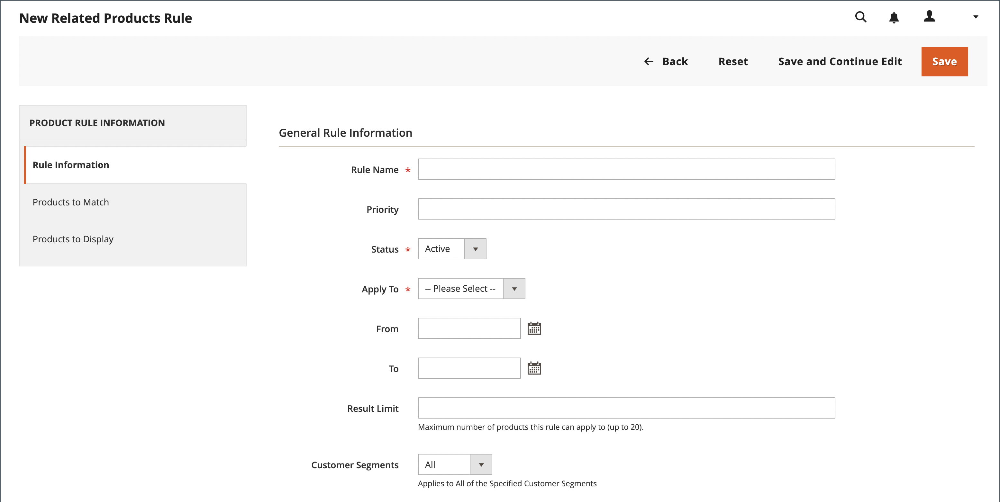

# Creare una regola di prodotto correlata

{{ee-feature}}

Il processo di creazione di una regola prodotto correlata è simile all&#39;impostazione di una regola prezzo. Innanzitutto, puoi definire le condizioni da soddisfare, quindi scegliere i prodotti da visualizzare. In qualsiasi momento, potrebbero essere presenti diverse regole attive che possono essere attivate per visualizzare prodotti correlati, up-sell e cross-selling. La priorità di ciascuna regola determina l’ordine in cui il blocco di prodotti viene visualizzato sulla pagina.

>[!NOTE]
>
>Per utilizzare un attributo in una regola di destinazione, [_[!UICONTROL Use for Promo Rule Conditions]_](../catalog/product-attributes.md) la proprietà deve essere impostata su `Yes`.

>[!NOTE]
>
>Il `All Store Views` il valore di ambito viene sempre utilizzato per entrambi [!UICONTROL Products to Match] e [!UICONTROL Products to Display] condizioni per tutti gli attributi di prodotto. Ciò si applica anche quando gli attributi del prodotto hanno valori diversi per visualizzazioni store e siti web diversi.

## Creare una regola di prodotto correlata

1. Il giorno _Amministratore_ barra laterale, vai a **[!UICONTROL Marketing]** > _[!UICONTROL Promotions]_>**[!UICONTROL Related Product Rules]**.

1. Nell’angolo superiore destro, fai clic su **[!UICONTROL Add Rule]**.

   {width="600" zoomable="yes"}

1. Completa il **[!UICONTROL Rule Information]** come segue:

   - Immetti un **[!UICONTROL Rule Name]** per identificare la regola quando si lavora in Admin.

   - Per **[!UICONTROL Priority]**, immettere un numero che determini l&#39;ordine di visualizzazione dei risultati nella pagina quando i risultati di altre regole sono destinati alla stessa posizione. Numero `1` è la priorità principale.

   - Per abilitare la regola, imposta **[!UICONTROL Status]** a `Active`.

   - Imposta **[!UICONTROL Apply To]** a uno dei seguenti elementi:

      - `Related Products`
      - `Up-sells`
      - `Cross-sells`

   - Se la regola deve essere attiva per un intervallo di tempo specifico, immettere **[!UICONTROL From]** e **[!UICONTROL To]** date.

   - Per **[!UICONTROL Result Limit]**, immettere il numero di record da visualizzare nell&#39;elenco dei risultati. Il numero massimo è 20.

   - Se la regola si applica a un [segmento cliente](../customers/customer-segments.md), impostato **[!UICONTROL Customer Segments]** a `Specified` e scegli il segmento cliente dall’elenco.

   - Se la regola si applica a un [Pubblico Real-Time CDP](../customers/audience-activation.md), impostato **[!UICONTROL Real-Time CDP Audience]** a `Specified` e scegli il pubblico Real-Time CDP dall’elenco. Questa funzione è in versione beta. Se desideri partecipare al programma beta, invia una richiesta a [dataconnection@adobe.com](mailto:dataconnection@adobe.com).

     {width="500"}

1. Nel pannello a sinistra, scegli **[!UICONTROL Products to Match]** e creare le condizioni come faresti per un [regola prezzo catalogo](price-rules-catalog.md).

   {width="500"}

1. Nel pannello a sinistra, scegli **[!UICONTROL Products to Display]** e creare le condizioni dei risultati come faresti per un [regola prezzo catalogo](price-rules-catalog.md).

   {width="500"}

   Completa la condizione per descrivere i prodotti che desideri includere nei risultati visualizzati.

1. Al termine, fai clic su **[!UICONTROL Save]**.

## Eliminare una regola di prodotto correlata

1. Il giorno _Amministratore_ barra laterale, vai a **[!UICONTROL Marketing]** > _[!UICONTROL Promotions]_>**[!UICONTROL Related Product Rules]**.

1. Trova la regola prodotto correlata da eliminare.

1. Fai clic sulla regola per aprire la pagina dei dettagli.

1. Nell’angolo superiore destro, fai clic su **[!UICONTROL Delete]**.

1. Per confermare l’azione, fai clic su **[!UICONTROL OK]**.

## Demo sulle regole di prodotto correlate

Guarda questo video per scoprire come creare regole di prodotto correlate:

>[!VIDEO](https://video.tv.adobe.com/v/343837?quality=12&learn=on)

## Descrizioni dei campi

| Campo | Descrizione |
|--- |--- |
| [!UICONTROL Rule Name] | Nome che identifica la regola per uso interno. |
| [!UICONTROL Priority] | Determina la sequenza in cui vengono visualizzati i risultati della regola quando vengono visualizzati con altri set di risultati che hanno come destinazione la stessa posizione sulla pagina. Il valore può essere impostato su qualsiasi numero intero, con la priorità più elevata di 1. Ad esempio, in presenza di più regole di up-sell applicabili, quello con la priorità più elevata viene visualizzato prima degli altri. L’ordinamento dei prodotti all’interno di ogni set di risultati è casuale. Eventuali up-sell, cross-selling e prodotti correlati configurati manualmente vengono sempre visualizzati sulla pagina prima di qualsiasi promozione di prodotti basata su regole. |
| [!UICONTROL Status] | Controlla lo stato attivo della regola. Opzioni: `Active` / `Inactive` |
| [!UICONTROL Apply To] | Identifica il tipo di relazione di prodotto associata alla regola. Opzioni: `Related Products` / `Up-sells` / `Cross-sells` |
| [!UICONTROL From Date] | Se la regola è attiva per un intervallo di tempo, questa impostazione determina la prima data di attivazione della regola. |
| [!UICONTROL To Date] | Se la regola è attiva per un intervallo di tempo, questa impostazione determina l&#39;ultima data in cui la regola è attiva. |
| [!UICONTROL Result Limit] | Determina il numero di prodotti visualizzati nei risultati contemporaneamente. Il numero massimo è 20. Se vengono trovati altri risultati corrispondenti, i prodotti ruotano attraverso il blocco ogni volta che la pagina viene aggiornata. |
| [!UICONTROL Customer Segments] | Identifica i segmenti cliente a cui si applica la regola. Opzioni: `All` / `Specified` |

{style="table-layout:auto"}
