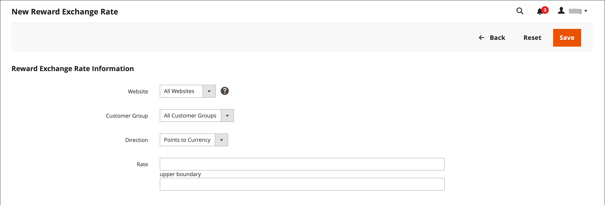

# Tassi di cambio premi

{{ee-feature}}

I tassi di cambio premi determinano il numero di punti guadagnati in base all&#39;importo dell&#39;ordine e al valore dei punti guadagnati. Possono essere applicati tassi di cambio diversi a siti web diversi e a gruppi di clienti diversi. Se più tassi di cambio di diversi siti web e gruppi di clienti si applicano allo stesso cliente, si applicano le seguenti regole di priorità:

## Priorità del tasso di cambio

**1**: si applica a un sito web specifico e a un gruppo di clienti specifico.

**2**: si applica a tutti i siti web e a un gruppo di clienti specifico.

**3**: si applica a un sito web specifico e a tutti i gruppi di clienti.

**4**: si applica a tutti i siti web e a tutti i gruppi di clienti.

Quando si converte una valuta in punti, il numero di punti non può essere diviso. Il resto della valuta è arrotondato per difetto. Ad esempio, se $2,00 viene convertito in dieci punti, i punti vengono guadagnati in gruppi di $2,00. Pertanto, un ordine di 7 dollari guadagnerebbe 30 punti e i restanti 1 dollaro sarebbero arrotondati per difetto. L&#39;importo monetario dell&#39;ordine è definito come l&#39;importo che il commerciante riceve o il totale complessivo meno le spese di spedizione, le imposte, gli sconti, il credito del negozio e le carte regalo. I punti vengono guadagnati nel momento in cui non sono presenti elementi non fatturati nell&#39;ordine (tutti gli elementi vengono pagati o annullati). Se un utente amministratore non desidera consentire ai clienti di ottenere punti premio per gli ordini annullati, questi possono essere dedotti manualmente dalla pagina Gestisci clienti.

## Imposta tassi di cambio

{width="700" zoomable="yes"}

1. Il giorno _Amministratore_ barra laterale, vai a **[!UICONTROL Stores]** > _[!UICONTROL Other Settings]_>**[!UICONTROL Reward Exchange Rates]**.

1. Nell’angolo superiore destro, fai clic su **[!UICONTROL Add New Rate]**.

1. In **[!UICONTROL Reward Exchange Rate Information]** eseguire le operazioni seguenti:

   {width="600" zoomable="yes"}

   - Imposta **[!UICONTROL Website]** ai siti in cui si applica il tasso di cambio del premio.

   - Imposta **[!UICONTROL Customer Group]** ai gruppi ai quali si applica il tasso di cambio del premio.

   - Imposta **[!UICONTROL Direction]** a uno dei seguenti elementi:

      - `Points to Currency`
      - `Currency to Points`

   Per entrambe le impostazioni di direzione, l&#39;importo viene rappresentato nella valuta di base del sito Web.

1. Inserisci il **[!UICONTROL Rate]** valori in base alla _[!UICONTROL Direction]_impostazione.

   | Direzione | Impostazioni della tariffa |
   |---------|-------------|
   | [!UICONTROL Points to Currency] | Nel primo _[!UICONTROL Rate]_immettere il numero di punti. Nel secondo_[!UICONTROL Rate]_ immettere il valore monetario dei punti. |
   | [!UICONTROL Currency to Points] | Nel primo  _[!UICONTROL Rate]_immettere il valore monetario. Nel secondo_[!UICONTROL Rate]_ immettere il numero di punti rappresentato dal valore monetario. |

   Quando si convertono i punti in valuta, il numero di punti non può essere diviso. Ad esempio, se dieci punti vengono convertiti in $ 2,00, i punti devono essere riscattati in gruppi di dieci. Pertanto, 25 punti verrebbero rimborsati per $ 4,00, con 5 punti rimanenti nel saldo del cliente.

   È consigliabile impostare una conversione per entrambi `Points to Currency` e `Currency to Points`.

1. Al termine, fai clic su **[!UICONTROL Save]**.

## Eliminare un tasso di cambio premio

1. Il giorno _Amministratore_ barra laterale, vai a **[!UICONTROL Stores]** > _[!UICONTROL Other Settings]_>**[!UICONTROL Reward Exchange Rates]**.

1. Individuare il tasso di cambio premio da eliminare e aprirlo in modalità di modifica.

1. Nella barra dei menu, fai clic su **[!UICONTROL Delete]**.

1. Per confermare l’azione, fai clic su **[!UICONTROL OK]**.

## Descrizioni dei campi

| Campo | Descrizione |
|--- |--- |
| [!UICONTROL Website] | I siti web in cui si applicano i tassi di ricompensa. |
| [!UICONTROL Customer Group] | I gruppi di clienti a cui si applicano i tassi di premio. |
| [!UICONTROL Direction] | Determina il tipo di transazione definito dal tasso di cambio. Opzioni:  **[!UICONTROL Points to Currency]**- Definisce il numero di punti che possono essere applicati come credito verso l&#39;importo di un ordine. Nel primo _[!UICONTROL Rate]_immettere il numero di punti. Nel secondo_[!UICONTROL Rate]_ immettere il valore monetario dei punti. **[!UICONTROL Currency to Points]** - Definisce l&#39;importo di un ordine che può guadagnare punti cliente. Nel primo  _[!UICONTROL Rate]_immettere il valore monetario. Nel secondo_[!UICONTROL Rate]_ immettere il numero di punti rappresentato dal valore monetario. |
