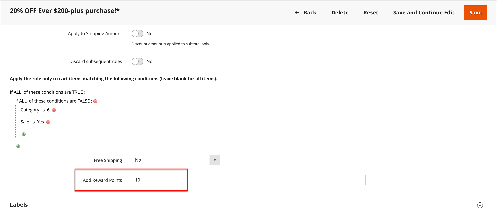

# Punti premio nelle regole di prezzo

{{ee-feature}}

I punti premio possono essere assegnati ai clienti in base a una [regola prezzo carrello](price-rules-cart.md). L&#39;aggiudicazione di punti può essere l&#39;unica azione della regola del prezzo o può essere utilizzata con uno sconto.

>[!NOTE]
>
>[La configurazione dei tassi di cambio premi](reward-exchange-rates.md) è necessaria per il rimborso dei punti premio da parte dei clienti e degli utenti amministratori durante l&#39;estrazione.

## Aggiungere punti premio a una regola di prezzo

1. Nella barra laterale _Admin_, passa a **[!UICONTROL Marketing]** > _[!UICONTROL Promotions]_>**[!UICONTROL Cart Price Rules]**.

1. Fare clic su **[!UICONTROL Add New Rule]** per creare una regola prezzo carrello oppure fare clic su una regola prezzo carrello esistente per aprirla.

1. Scorri verso il basso, espandi il  nella sezione **[!UICONTROL Actions]**, imposta le condizioni e immetti il numero di punti nel campo **[!UICONTROL Add Reward Points]**.

   {width="600" zoomable="yes"}

1. Segui le istruzioni standard per completare la [regola prezzo carrello](price-rules-cart-create.md).

   Quando la regola del prezzo è attivata, nel carrello viene visualizzato un messaggio per comunicare ai clienti quanti punti possono guadagnare effettuando l’ordine. Questo vale solo per gli utenti registrati e può variare quando un utente è connesso.
