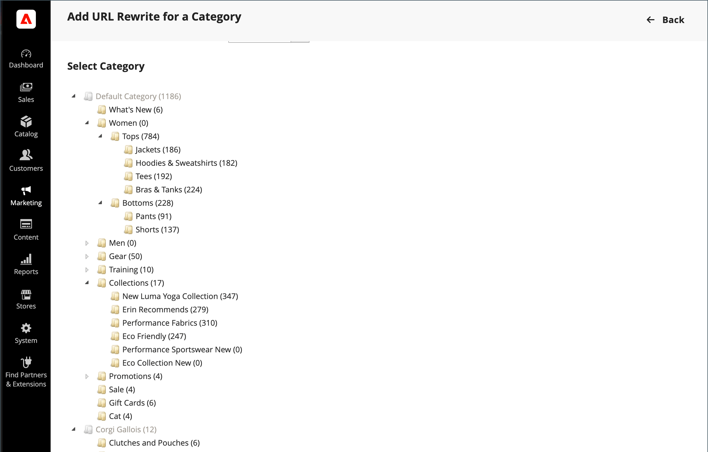

# L’URL della categoria viene riscritto

Se una categoria viene rimossa dal catalogo, puoi riscriverla per reindirizzare i collegamenti all’URL di un’altra categoria nel tuo store. Pensa in termini di _destinazione_ / _richiesta originale_  o _reindirizzare a_ / _reindirizzare da_. Anche se le persone possono ancora passare alla pagina precedente da motori di ricerca o collegamenti obsoleti, il reindirizzamento fa sì che il tuo negozio passi alla nuova destinazione.

Se [reindirizzamenti automatici](url-redirect-product-automatic.md) sono abilitati per il tuo archivio, non è necessario creare una riscrittura quando una categoria [Chiave URL](../catalog/catalog-urls.md) è stato modificato.

{{url-rewrite-skip}}

## Passaggio 1: Pianificare la riscrittura

Per evitare errori, annota _reindirizzare a_ percorso e _reindirizzare da_ e includono la chiave URL e il suffisso (se applicabile).

Se non sei sicuro, apri ogni pagina di categoria nel tuo store e copia il percorso dalla barra degli indirizzi del browser.

**Esempio:**

Reindirizza a: `gear/backpacks-and-bags.html`

Reindirizza da: `gear/bags.html`

## Passaggio 2: Creare la riscrittura

{{url-rewrite-params}}

1. Il giorno _Amministratore_ barra laterale, vai a **[!UICONTROL Marketing]** > _[!UICONTROL SEO & Search]_>**[!UICONTROL URL Rewrites]**.

1. Prima di procedere, eseguire le operazioni seguenti per verificare che il percorso della richiesta sia disponibile:

   - Nel filtro di ricerca nella parte superiore della sezione **[!UICONTROL Request Path]** , immetti la chiave URL della categoria da reindirizzare e fai clic su **[!UICONTROL Search]**.

   - Se esistono più record di reindirizzamento per la pagina, individua quello che corrisponde alla visualizzazione store applicabile e apri il record di reindirizzamento in modalità di modifica.

   - Nell’angolo superiore destro, fai clic su **[!UICONTROL Delete]**. Quando richiesto, fai clic su **[!UICONTROL OK]** per confermare.

1. Quando ritorni al _[!UICONTROL URL Rewrites]_pagina, fai clic su **[!UICONTROL Add URL Rewrite]**.

1. Imposta **[!UICONTROL Create URL Rewrite]** a `For category` e scegli la categoria target nella struttura che è la destinazione del reindirizzamento.

   {width="700" zoomable="yes"}

1. In _Riscrittura URL_ eseguire le operazioni seguenti:

   - Se sono presenti più store, selezionare **[!UICONTROL Store]** dove si applica la riscrittura.

   - Per **[!UICONTROL Request Path]**, immetti la chiave URL della categoria richiesta dal cliente. Questo è il _reindirizzare da_ categoria.

     >[!NOTE]
     >
     >Il percorso della richiesta deve essere univoco per l’archivio specificato. Se esiste già un reindirizzamento che utilizza lo stesso percorso di richiesta, quando tenti di salvare il reindirizzamento riceverai un errore. Prima di poterne creare uno, devi eliminare il reindirizzamento precedente.

   - Imposta **[!UICONTROL Redirect]** a uno dei seguenti elementi:

      - `Temporary (302)`
      - `Permanent (301)`

   - Per il riferimento, immettere una breve descrizione della riscrittura.

   {width="700" zoomable="yes"}

1. Prima di salvare il reindirizzamento, verifica quanto segue:

   - Il collegamento nell’angolo in alto a sinistra mostra il nome della categoria di destinazione.
   - Il percorso della richiesta contiene il percorso dell’originale _reindirizzare da_ categoria.

1. Al termine, fai clic su **[!UICONTROL Save]** pulsante.

   La nuova categoria riscrittura viene visualizzata nella parte superiore della griglia URL riscritture.

## Passaggio 3: Verifica il risultato

1. Vai alla pagina principale del tuo negozio.

1. Effettuare una delle seguenti operazioni:

   - Passa all&#39;originale _reindirizzare da_ categoria.
   - Nella barra degli indirizzi del browser, immetti il percorso dell’originale _reindirizzare da_ categoria immediatamente dopo l’URL dello store e premi **[!UICONTROL Enter]**.

   Viene visualizzata la nuova categoria di destinazione invece della richiesta della categoria originale.

## Descrizioni dei campi

| Campo | Descrizione |
|--- |--- |
| [!UICONTROL Create URL Rewrite] | Indica il tipo di riscrittura. Impossibile modificare il tipo dopo la creazione della riscrittura. Opzioni: `Custom` / `For category` / `For product` / `For CMS page` |
| [!UICONTROL Request Path] | Categoria da reindirizzare. A seconda della configurazione, il percorso della richiesta potrebbe includere il suffisso .html o .htm e la categoria padre. Il percorso della richiesta deve essere univoco e non può essere utilizzato da un altro reindirizzamento. Se ricevi un errore che indica che il percorso della richiesta esiste, elimina il reindirizzamento esistente e riprova. |
| [!UICONTROL Target Path] | Percorso interno utilizzato dal sistema per puntare alla destinazione del reindirizzamento. Il percorso di destinazione è disattivato e non può essere modificato. |
| [!UICONTROL Redirect] | Determina il tipo di reindirizzamento. Opzioni:  **[!UICONTROL No]**- Nessun reindirizzamento specificato. Molte operazioni creano richieste di reindirizzamento di questo tipo. Ad esempio, ogni volta che aggiungi prodotti a una categoria, un reindirizzamento del `No` Il tipo viene creato in ogni visualizzazione store. **[!UICONTROL Temporary (302)]** - Indica ai motori di ricerca che la riscrittura è per un periodo di tempo limitato. I motori di ricerca generalmente non conservano le informazioni sul rango delle pagine per le riscritture temporanee.  **[!UICONTROL Permanent (301)]**- Indica ai motori di ricerca che la riscrittura è permanente. I motori di ricerca in genere conservano le informazioni sulla classificazione delle pagine per le riscritture permanenti. |
| [!UICONTROL Description] | Descrive lo scopo della riscrittura per riferimento interno. |

{style="table-layout:auto"}
