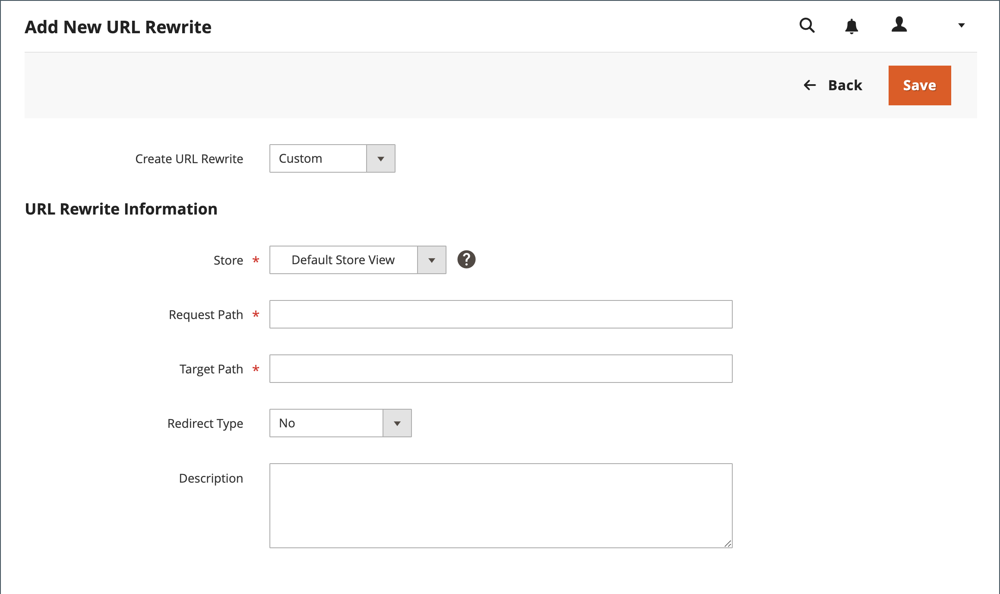

# Riscrittura di URL personalizzati

Una riscrittura personalizzata può essere utilizzata per gestire reindirizzamenti vari, ad esempio per reindirizzare una pagina dal negozio a un sito web esterno. Ad esempio, potresti avere due siti web Commerce, ciascuno con il proprio dominio. Puoi utilizzare un reindirizzamento personalizzato per reindirizzare le richieste di un prodotto, di una categoria o di una pagina all’altro sito web. A differenza di altri tipi di reindirizzamento, la destinazione di un reindirizzamento personalizzato non viene scelta da un elenco di pagine esistenti nell’archivio.

Prima di iniziare, assicurati di comprendere esattamente cosa deve essere realizzato il reindirizzamento. Pensa in termini di _destinazione_ / _origine_ o _reindirizzamento a_ / _reindirizzamento da_. Anche se le persone possono ancora passare alla pagina precedente da motori di ricerca o collegamenti obsoleti, il reindirizzamento fa sì che il tuo negozio passi alla nuova destinazione.

## Passaggio 1: Pianificare la riscrittura

Per evitare errori, prendere nota dell&#39;URL del reindirizzamento _alla pagina_ e della chiave URL del reindirizzamento _dalla pagina_.

In caso di dubbi, apri ogni pagina e copia l’URL dalla barra degli indirizzi del browser.

**Esempio**

Reindirizza a:

    http://www.different-website.com/page.html

Reindirizza da:

    cms-page
    category.html
    category/subcategory.html
    product.html
    category/product.html

## Passaggio 2: Creare la riscrittura

{{url-rewrite-params}}

1. Nella barra laterale _Admin_, passa a **[!UICONTROL Marketing]** > _[!UICONTROL SEO & Search]_>**[!UICONTROL URL Rewrites]**.

1. Prima di procedere, eseguire le operazioni seguenti per verificare che il percorso della richiesta sia disponibile:

   - Nel filtro di ricerca nella parte superiore della colonna **[!UICONTROL Request Path]**, immettere la chiave URL della pagina da reindirizzare e fare clic su **[!UICONTROL Search]**.

   - Se esistono più record di reindirizzamento per la pagina, individua quello che corrisponde alla visualizzazione store applicabile e aprilo in modalità di modifica.

   - Nell&#39;angolo superiore destro fare clic su **[!UICONTROL Delete]**. Quando richiesto, fare clic su **[!UICONTROL OK]** per confermare.

1. Quando si torna alla pagina URL riscrive, fare clic su **[!UICONTROL Add URL Rewrite]**.

1. Imposta **[!UICONTROL Create URL Rewrite]** su `Custom`.

   {width="600" zoomable="yes"}

1. In Informazioni di riscrittura URL eseguire le operazioni seguenti:

   - Se sono presenti più visualizzazioni dello store, selezionare **[!UICONTROL Store]** a cui applicare la riscrittura.

   - Per **[!UICONTROL Request Path]**, immettere la chiave URL e il percorso, se applicabile, della pagina di prodotto, categoria o CMS da reindirizzare.

     >[!NOTE]
     >
     >Il percorso della richiesta deve essere univoco per l’archivio specificato. Se esiste già un reindirizzamento che utilizza lo stesso percorso di richiesta, quando tenti di salvare il reindirizzamento riceverai un errore. Prima di poterne creare uno, devi eliminare il reindirizzamento precedente.

   - Per **[!UICONTROL Target Path]**, immettere l&#39;URL della destinazione. Se la destinazione si trova su un altro sito Web, immettere l&#39;URL completo.

   - Imposta **Reindirizza** a uno dei seguenti:

      - `Temporary (302)`
      - `Permanent (301)`

   - Per il riferimento, immettere una breve descrizione della riscrittura.

1. Prima di salvare il reindirizzamento, verifica quanto segue:

   - [!UICONTROL Request Path] contiene la chiave URL o il percorso del _reindirizzamento originale dalla_ pagina.
   - [!UICONTROL Target Path] contiene l&#39;URL del _reindirizzamento a_ pagina.

1. Al termine, fare clic su **[!UICONTROL Save]**.

   La nuova riscrittura viene visualizzata nella griglia nella parte superiore dell&#39;elenco.

## Passaggio 3: Verifica il risultato

1. Vai alla pagina principale del tuo negozio.

1. Effettuare una delle seguenti operazioni:

   - Passa alla pagina _reindirizzamento originale da_.
   - Nella barra degli indirizzi del browser, immetti il nome del _reindirizzamento originale da_ pagina subito dopo l&#39;URL dell&#39;archivio e premi **Invio**.

   Viene visualizzata la nuova pagina di destinazione invece della richiesta della pagina originale.

## Descrizioni dei campi

| Campo | Descrizione |
|--- |--- |
| [!UICONTROL Create URL Rewrite] | Indica il tipo di riscrittura. Impossibile modificare il tipo dopo la creazione della riscrittura. Opzioni: `Custom` / `For category` / `For product` / `For CMS page` |
| [!UICONTROL Request Path] | Pagina da reindirizzare. Il percorso della richiesta deve essere univoco e non può essere utilizzato da un altro reindirizzamento. Se ricevi un messaggio di errore indicante che il percorso della richiesta esiste, elimina il reindirizzamento esistente e riprova. |
| [!UICONTROL Target Path] | Percorso interno utilizzato dal sistema per puntare alla destinazione. Il percorso di destinazione è disattivato e non può essere modificato. |
| [!UICONTROL Redirect] | Determina il tipo di reindirizzamento. Opzioni:  **No** - Nessun reindirizzamento specificato.  **[!UICONTROL Temporary (302)]**- Indica ai motori di ricerca che la riscrittura ha una durata limitata. I motori di ricerca generalmente non conservano le informazioni sul rango delle pagine per le riscritture temporanee. **[!UICONTROL Permanent (301)]** - Indica ai motori di ricerca che la riscrittura è permanente. I motori di ricerca in genere conservano le informazioni sulla classificazione delle pagine per le riscritture permanenti. |
| [!UICONTROL Description] | Descrive lo scopo della riscrittura per riferimento interno. |

{style="table-layout:auto"}
