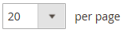
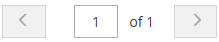

# Visual Merchandiser

{{ee-feature}}

Il _Visual Merchandiser_ è un insieme di strumenti avanzati che ti consente di posizionare i prodotti e applicare condizioni che determinano quali prodotti visualizzare nell’elenco delle categorie. Il risultato può essere una selezione dinamica di prodotti che si adatta alle modifiche nel catalogo. È possibile lavorare in _modalità visiva_, che mostra ogni prodotto come una sezione su una griglia o per lavorare da un elenco di prodotti nella categoria. Gli stessi strumenti sono disponibili in ogni modalità e puoi utilizzare i pulsanti nell’angolo superiore destro per passare da un tipo di visualizzazione all’altro.

{width="600" zoomable="yes"}

## Accedere a Visual Merchandiser

1. Il giorno _Amministratore_ barra laterale, vai a **[!UICONTROL Catalog]** > **[!UICONTROL Categories]**.

1. Espandere la struttura delle categorie e fare clic sulla categoria da modificare.

1. Scorri verso il basso ed espandi  il **[!UICONTROL Products in Category]** sezione.

1. Fai clic su _Visualizza come riquadri_ (  ) per visualizzare i prodotti come una griglia.

1. Al termine, fai clic su **[!UICONTROL Save Category]**.

## Modificare la posizione di un prodotto

1. Utilizza il [ordinamento](../catalog/navigation-product-listings.md) per visualizzare il prodotto che desideri spostare.

   - **Metodo 1: trascinamento della selezione**

     Acquisisci _Trascina_ () nell&#39;angolo superiore destro del riquadro del prodotto e posizionare il prodotto. Il numero di ciascun prodotto viene regolato in base alla nuova posizione.

   - **Metodo 2: Imposta valore posizione**

     In _Posizione_ controller () nel riquadro del prodotto, inserisci il numero in cui desideri visualizzare il prodotto. Invio `0` per posizionare il prodotto all’inizio dell’elenco.

1. Al termine, fai clic su **[!UICONTROL Save Category]**.

>[!NOTE]
>
>In un’installazione pulita, Adobe Commerce riserva l’ID categoria `2` per il catalogo principale dell&#39;archivio predefinito. Visual Merchandiser può utilizzare solo categorie con un numero ID di `3` o superiore.

## Controlli di Workspace

| Controllo | Descrizione |
|--- |--- |
|  | Visualizza come elenco |
|  | Visualizza come sezioni |
|  | Corrispondenza per regola - no |
|  | Corrispondenza per regola - sì |
|  | Trascina |
|  | Posizione |
|  | Rimuovi dalla categoria |
|  | Visualizza per pagina |
|  | Vai a successivo/precedente |

{style="table-layout:auto"}
