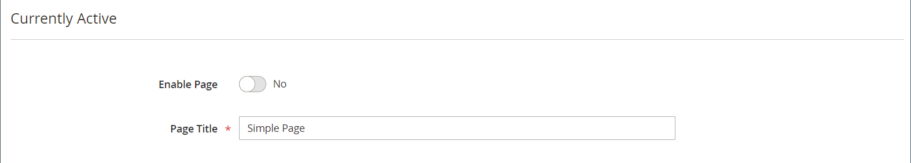
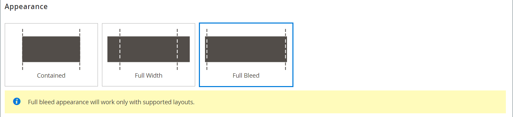
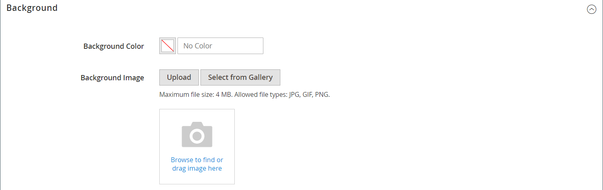
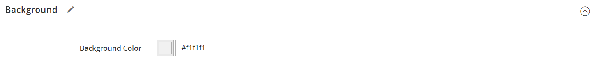
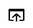
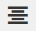

# [!DNL Page Builder] Procedura dettagliata parte 1: pagina semplice

Segui questo esercizio in tre parti per acquisire familiarità con [!DNL Page Builder] Workspace creando una pagina semplice che illustri quanto sia semplice creare pagine ricche di contenuti con il tuo design.

{width="700" zoomable="yes"}

>[!NOTE]
>
>Questi esercizi di procedura dettagliata vengono aggiornati per riflettere le recenti modifiche apportate al [!DNL Page Builder] nella versione 2.4.1. Se utilizzi una versione precedente di Adobe Commerce, utilizza [!DNL Page Builder] esercitazioni dettagliate incluse nel [[!DNL Commerce] 2.3 Guida utente](https://docs.magento.com/user-guide/v2.3/cms/page-builder-learn.html).

## Prima di iniziare

Prima di iniziare questo esercizio, si consiglia di aumentare il [Durata sessione amministratore](../systems/security-admin.md) per evitare il timeout della sessione mentre si lavora.

Verifica le impostazioni di configurazione di Content Management richieste:

- L&#39;editor WYSIWYG è abilitato in [Opzioni WYSIWYG](../content-design/editor.md#configure-the-editor) configurazione.

- [!DNL Page Builder] è abilitato in [Strumenti di contenuto avanzati](setup.md) configurazione.

### Scaricare le risorse immagine della procedura dettagliata

1. Scarica il file [`simple-page-assets`](./assets/simple-page-assets.zip) e salvare il file nel sistema locale.

1. Passare al file scaricato ed estrarre i file compressi.

   In un sistema Windows, fare clic con il pulsante destro del mouse e scegliere **[!UICONTROL Extract All]** file. Quindi, scegli la cartella di destinazione e fai clic su **[!UICONTROL Extract]**.

   In un sistema Mac, è sufficiente fare doppio clic sul file zip e spostare i file estratti nella cartella di destinazione.

   La cartella contiene i seguenti file di immagine:

   ![[!DNL Page Builder] file della procedura dettagliata - risorse di pagina semplici](./assets/pb-tutorial-simple-page-assets.png){width="500"}

Seguire le tre parti della procedura dettagliata in ordine.

## Parte 1: riga a tutto pagina con banner

In questa parte dell&#39;esercizio Pagina semplice viene creata una pagina con una riga e un banner al vivo. La riga presenta immagini di sfondo diverse per i dispositivi desktop e mobili.

![[!DNL Page Builder] riga al vivo completa con banner](./assets/pb-tutorial1-full-bleed-with-banner.png){width="700" zoomable="yes"}

### Passaggio 1: creare una pagina

1. Il giorno _Amministratore_ barra laterale, vai a **[!UICONTROL Content]** > _[!UICONTROL Elements]_>**[!UICONTROL Pages]**.

1. Nell’angolo superiore destro, fai clic su **[!UICONTROL Add New Page]** ed effettuare le seguenti operazioni:

   - Per evitare che la pagina venga pubblicata nel Negozio, impostare **[!UICONTROL Enable Page]** a `No`.

   - Per **[!UICONTROL Page Title]**, immetti `Simple Page`.

   {width="600" zoomable="yes"}

1. Espandi  il **[!UICONTROL Design]** sezione.

   Tieni presente che **[!UICONTROL Layout]** è impostato su `Page -- Full Width` per impostazione predefinita. Oltre ai cinque standard [layout](../content-design/page-layout.md) opzioni, [!DNL Page Builder] aggiunge layout a larghezza intera per pagine, categorie e prodotti.

1. Se i dati di esempio sono disponibili, impostare **[!UICONTROL New Theme]** a `Magento Luma`. In caso contrario, è possibile scegliere un altro tema disponibile o lasciarlo vuoto per utilizzare il tema predefinito.

   Il _[!UICONTROL New Theme]_può essere utilizzata per sostituire il tema predefinito e per applicare un tema diverso alla pagina.

   >[!NOTE]
   >
   >Il layout Larghezza intera può essere utilizzato solo con un [tema](../content-design/themes.md).

   {width="600" zoomable="yes"}

1. Nell’angolo superiore destro, fai clic su **[!UICONTROL Save]**.

   Quando la pagina viene salvata, il nome _Pagina semplice_ viene visualizzato nell&#39;angolo superiore sinistro della pagina.

### Passaggio 2: formattare la riga

1. Espandi  il **[!UICONTROL Content]** sezione.

   Questa azione visualizza [!DNL Page Builder] visualizza l’anteprima con una riga vuota.

   >[!NOTE]
   >
   >Il [Intestazione contenuto](workspace.md) è facoltativo. Per impostazione predefinita, è formattato come livello di intestazione 1 (H1) in base al tema. Per questo esercizio, il _Intestazione contenuto_ viene lasciato vuoto.

   {width="600" zoomable="yes"}

1. Clic **[!UICONTROL Edit with Page Builder]** o all&#39;interno dell&#39;area di anteprima dei contenuti.

   Nella sezione espansa [!DNL Page Builder] [workspace](workspace.md), il pannello a sinistra fornisce gli strumenti di contenuto che è possibile utilizzare per creare il contenuto nell’area di visualizzazione.

1. Passa il cursore del mouse sulla riga vuota per visualizzare la casella degli strumenti.

   Ogni contenitore di contenuto ha una casella degli strumenti con un set di opzioni simile.

   ![[!DNL Page Builder] casella degli strumenti riga](./assets/pb-layout-page-add-content-row-tools.png){width="600" zoomable="yes"}

1. Nella casella degli strumenti Riga, scegliere _Impostazioni_ ({width="20"} icona.

1. Sotto _[!UICONTROL Appearance]_, scegli **Emorragia completa**.

   L&#39;impostazione dell&#39;aspetto a pagina intera estende i bordi sinistro e destro dell&#39;area contenuto della riga e dello sfondo fino alla larghezza completa della pagina.

   {width="600" zoomable="yes"}

1. Scorri verso il basso fino a _[!UICONTROL Advanced]_sezione e imposta tutto **[!UICONTROL Margins and Padding]**impostazioni per `0`.

   Questa impostazione assicura che il banner estenda l&#39;intera larghezza della riga.

   {width="600" zoomable="yes"}

1. Per salvare le impostazioni e tornare al [!DNL Page Builder] , scorri verso l’alto fino alla parte superiore della pagina e fai clic **[!UICONTROL Save]** nell’angolo superiore destro.

### Passaggio 3: aggiungere un banner

>[!NOTE]
>
>[!DNL Page Builder] ha un nuovo tipo di contenuto denominato _Banner_, descritto in questo passaggio. Precedentemente il _Banner_ nel menu Contenuto, è ora un&#39;opzione _Blocco dinamico_.

1. In [!DNL Page Builder] pannello, espandere **[!UICONTROL Media]** e trascina un **Banner** segnaposto nell&#39;area di visualizzazione.

   {width="600" zoomable="yes"}
1. Passa il puntatore del mouse sul contenitore del banner per visualizzare la casella degli strumenti.

   >[!NOTE]
   >
   >L’area di visualizzazione ora dispone di due contenitori di contenuto, ciascuno con una casella degli strumenti separata. Poiché il banner è nidificato all&#39;interno della riga, assicurarsi di utilizzare la casella degli strumenti corretta.

   Oltre alla casella degli strumenti, la _Carica immagine_ e _Seleziona dalla raccolta_ sono inclusi pulsanti che consentono di apportare modifiche rapide al banner direttamente dall&#39;area di visualizzazione.

   {width="600" zoomable="yes"}

1. Nella casella degli strumenti Banner, scegliere _Impostazioni_ ( {width="20"} ).

1. Sotto _[!UICONTROL Appearance]_, scegli **[!UICONTROL Collage Right]**.

   L&#39;impostazione Collage Right posiziona il contenuto sul lato destro del banner.

   {width="600" zoomable="yes"}

1. Scorri verso il basso fino a _[!UICONTROL Background]_e impostare l&#39;immagine di sfondo per il banner:

   - Per **[!UICONTROL Background Image]**, fai clic su **Carica**.

     {width="600" zoomable="yes"}

     Passa alla directory in cui sono state salvate le risorse di pagina semplici estratte e scegli `wide-banner-background.jpg` file.

     L’immagine viene caricata e viene visualizzata una miniatura dell’immagine caricata. Il nome del file, le dimensioni dell&#39;immagine e le dimensioni del file sono indicati di seguito.

     {width="600" zoomable="yes"}

   - Per **[!UICONTROL Background Mobile Image]**, fai clic su **Carica**.

     Nella stessa directory di file, scegliere `wide-banner-background-mobile.jpg` file.

     L’immagine di sfondo mobile viene utilizzata per i dispositivi mobili e anche ogni volta che una finestra del browser desktop viene ridimensionata alla larghezza di un dispositivo mobile.

     {width="600" zoomable="yes"}

   - Scorri indietro fino alla parte superiore della pagina e fai clic su **[!UICONTROL Save]** per salvare le impostazioni e tornare a [!DNL Page Builder] Workspace.

     Lo sfondo viene visualizzato sullo stage e estende l&#39;intera larghezza della riga.

     {width="600" zoomable="yes"}

   Osserva il testo segnaposto visualizzato sul lato destro della riga. La posizione di questo testo riflette _Collage Right_ impostazione dell&#39;aspetto.

1. Fare clic sul testo segnaposto e immettere il seguente messaggio come due righe:

   `Get fit and look fab in new seasonal styles.`

   `New LUMA yoga collection`

   La barra degli strumenti dell&#39;editor viene visualizzata sopra la casella di testo. Il testo può essere immesso e formattato direttamente dall&#39;area di visualizzazione oppure scegliendo _Impostazioni_ nella casella degli strumenti del banner.

   {width="600" zoomable="yes"}

1. Applica formattazione al testo:

   - Selezionare la prima riga di testo. Quindi, nella barra degli strumenti dell’editor in **Formati**, scegli `Heading 2`.

     {width="600" zoomable="yes"}

   - Selezionare la seconda riga di testo. Quindi, nella barra degli strumenti dell’editor in **Formati**, scegli `Paragraph`.

   Le impostazioni di formato applicano gli stili del foglio di stile associato al tema corrente.

   {width="600" zoomable="yes"}
__

1. Passare il puntatore del mouse sulla casella degli strumenti del banner, scegliere _Impostazioni_ ( {width="20"} ), quindi scorrere fino alla _[!UICONTROL Content]_sezione.

   Il testo viene visualizzato in _Testo messaggio_ casella. Il testo può essere inserito e modificato sia dall&#39;area di visualizzazione che dall&#39;area di visualizzazione _[!UICONTROL Content]_sezione delle impostazioni del banner.

   {width="600" zoomable="yes"}

1. Continuando in _[!UICONTROL Content]_, impostare il collegamento e il pulsante del banner:

   - Imposta **Collegamento** a `Category`e quindi fare clic su **[!UICONTROL Select]** per visualizzare l&#39;albero delle categorie.

   - Scegli `What's New` come categoria collegata.

     {width="600" zoomable="yes"}

   - Imposta **[!UICONTROL Show Button]** a `Always`.

   - Per **[!UICONTROL Button Text]**, immetti `Shop Now` come testo visualizzato sul pulsante.

   - Per **[!UICONTROL Button Type]**, accetta `Primary` impostazione predefinita.

     Lo stile del pulsante del tema corrente determina il formato del pulsante.

1. Imposta la sovrapposizione banner:

   È possibile utilizzare una sovrapposizione per applicare un colore di sfondo all&#39;area di contenuto attiva definita dall&#39;impostazione Aspetto. L&#39;immagine di sfondo del banner rimane visibile per l&#39;intera larghezza del banner.

   - Imposta **[!UICONTROL Show Overlay]** a `Always`.

   - Per **[!UICONTROL Overlay Color]**, eseguire una delle operazioni seguenti:

      - Fate clic sul quadrato di colore e scegliete il campione bianco.
      - Fai clic su nella _Nessun colore_ e immettere `White` o il valore esadecimale `#ffffff`.

     Quindi, fai clic su **[!UICONTROL Apply]**.

     {width="600" zoomable="yes"}

   - Scorri indietro fino alla parte superiore della pagina e fai clic su **[!UICONTROL Save]** per salvare le impostazioni e tornare a [!DNL Page Builder] Workspace.

     Il pulsante viene visualizzato sotto il messaggio del banner sullo stage.

     {width="600" zoomable="yes"}

1. Nell&#39;angolo superiore destro dell&#39;area di visualizzazione fare clic sul pulsante _Chiudi schermo intero_ ().

   Facendo clic su questa icona, si ritorna al _[!UICONTROL Content]_per la pagina con l&#39;anteprima visualizzata.

   È possibile passare da una modalità all&#39;altra in qualsiasi momento.

1. Nell’angolo in alto a destra, fai clic su **[!UICONTROL Save]** freccia e scegli **[!UICONTROL Save & Close]**.

1. Se richiesto, fare clic su [Gestione cache](../systems/cache-management.md) nel messaggio nella parte superiore della pagina e aggiorna eventuali cache non valide.

## Parte 2: riga contenente due colonne uguali

In questa parte dell&#39;esercizio aggiungerete una riga alla pagina e la dividerete in due colonne uguali. Quindi, aggiungi un’immagine collegata a ogni colonna. Nelle istruzioni, ogni nuova riga viene aggiunta prima della prima riga per rendere [!DNL Page Builder] pannello allineato con stage. Alla fine dell&#39;esercizio ridisporrete le righe in modo che corrispondano all&#39;esempio Pagina semplice.

{width="600" zoomable="yes"}

### Passaggio 1: aggiungere una riga

1. Nella griglia Pagine individuare _Pagina semplice_ creato nella prima parte di questo esercizio e selezionare **[!UICONTROL Edit]** nel _[!UICONTROL Action]_colonna.

1. Espandi  il **[!UICONTROL Content]** sezione.

1. Clic **[!UICONTROL Edit with Page Builder]** o all&#39;interno dell&#39;area di anteprima dei contenuti.

1. In [!DNL Page Builder] pannello in _[!UICONTROL Layout]_, trascina un **[!UICONTROL Row]**segnaposto nell&#39;area di visualizzazione e posizionarlo sopra il banner.

   La linea guida rossa segna il limite tra le due righe.

   {width="600" zoomable="yes"}

1. Passa il puntatore del mouse sulla nuova riga per visualizzare la casella degli strumenti e scegli la _Impostazioni_ ( {width="20"} ).

   {width="600" zoomable="yes"}

1. Sotto _[!UICONTROL Appearance]_, accetta **Contenuto**impostazione predefinita.

   Questa impostazione limita l’area del contenuto della riga alla larghezza della pagina definita dal tema.

   {width="600" zoomable="yes"}

1. Nell’angolo superiore destro, fai clic su **[!UICONTROL Save]** per salvare le impostazioni e tornare a [!DNL Page Builder] Workspace.

### Passaggio 2: aggiungere una colonna

1. In [!DNL Page Builder] pannello in _[!UICONTROL Layout]_, trascina un **[!UICONTROL Column]**segnaposto per la nuova riga.

   {width="600" zoomable="yes"}

   La riga è ora divisa in due colonne di uguale larghezza. Ogni colonna è un contenitore separato per il contenuto con la propria casella strumenti dedicata di opzioni.

   {width="600" zoomable="yes"}

1. Nell&#39;angolo superiore sinistro della prima colonna fare clic sulla forma circolare _Griglia_ controllo () per visualizzare le linee guida della griglia.

   La griglia garantisce che il contenuto sia allineato in modo coerente e che venga riprodotto correttamente sia sui desktop che sui dispositivi mobili. Per informazioni sulla configurazione delle dimensioni della griglia, vedere [Configura [!DNL Page Builder]](setup.md#configure-page-builder) sezione nella sezione [!DNL Page Builder] Argomento di configurazione.

   I numeri tra parentesi (6/12) nel bordo superiore di ogni contenitore di colonne indicano il numero di divisioni della griglia in ogni colonna e il numero totale di divisioni nella riga.

   {width="600" zoomable="yes"}

### Passaggio 3: aggiungere immagini con collegamenti

In questo passaggio imparerai a caricare un’immagine nel banner.

1. In [!DNL Page Builder] , espandere **[!UICONTROL Media]** e trascina un **[!UICONTROL Image]** segnaposto alla prima colonna.

   {width="600" zoomable="yes"}

1. Inserite l&#39;immagine di esempio nel segnaposto.

   {width="600" zoomable="yes"}

   Per un&#39;immagine che si trova nel sistema, è possibile scegliere uno dei seguenti metodi:

   - **Carica il file di immagine**: nella prima colonna, fai clic su **[!UICONTROL Upload Image]**. Quindi, passa alla directory in cui sono state salvate le risorse di pagina semplici estratte e scegli la `small-banner-1.jpg` file.

     {width="600" zoomable="yes"}

     Ripeti questa azione per aggiungere `small-banner-2.jpg` alla seconda colonna.

   - **Trascina il file di immagine**: sul desktop, apri la cartella delle risorse della pagina semplice e posizionala accanto alla finestra del browser Amministratore in cui stai lavorando con [!DNL Page Builder] fase. Quindi, trascina il file `small-banner-1.jpg` dalla cartella delle risorse di pagina semplici e rilasciala nella prima colonna.

     {width="600" zoomable="yes"}

     Ripeti questa azione per aggiungere `small-banner-2.jpg` alla seconda colonna.

1. Determina quale pagina del catalogo desideri collegare a ogni immagine.

1. Passa il puntatore del mouse sull&#39;immagine nella prima colonna per visualizzare la casella degli strumenti e scegli _Impostazioni_ ( {width="20"} ).

   {width="600" zoomable="yes"}

1. Collega l&#39;immagine a una categoria:

   - Scorri verso il basso e imposta **Collegamento** a `Category`.

   - Nell&#39;albero delle categorie eseguire il drilling verso il basso e scegliere `Men's Hoodies & Sweatshirt` categoria.

   - Nell&#39;angolo superiore destro, **[!UICONTROL Save]** le impostazioni e tornare al [!DNL Page Builder] Workspace.

1. Ripeti il passaggio precedente per collegare l’immagine nella seconda colonna al _Ingranaggio_ categoria.

1. Nell&#39;angolo superiore destro dell&#39;area di visualizzazione fare clic sul pulsante _Chiudi schermo intero_ ().

   Facendo clic su questa icona, si ritorna al _[!UICONTROL Content]_per la pagina con l&#39;anteprima visualizzata.

1. Nell’angolo in alto a destra, fai clic su **[!UICONTROL Save]** freccia e scegli **[!UICONTROL Save & Close]**.

1. Quando richiesto, fare clic su [Gestione cache](../systems/cache-management.md) nel messaggio nella parte superiore della pagina e aggiorna eventuali cache non valide.

## Parte 3: riga a larghezza intera con colonne diseguali

L’ultima riga di questa pagina presenta il contenuto di una recensione di prodotto. Aggiungere una riga a larghezza intera e dividerla in due colonne di larghezza diversa. Alla prima colonna viene aggiunta un&#39;immagine di sfondo con un colore di sfondo corrispondente applicato alla riga per un effetto unificato.

{width="500"}

### Passaggio 1: aggiungere una riga

1. Nella griglia Pagine individuare _Pagina semplice_ creato nella prima parte di questo esercizio e selezionare **[!UICONTROL Edit]** nel _[!UICONTROL Action]_colonna.

1. Espandi  il **[!UICONTROL Content]** sezione.

1. Clic **[!UICONTROL Edit with Page Builder]** o all&#39;interno dell&#39;area di anteprima dei contenuti.

1. In [!DNL Page Builder] pannello in _[!UICONTROL Layout]_, trascina un **[!UICONTROL Row]**posizionare il segnaposto sullo stage e posizionarlo sopra la riga creata nella seconda parte dell&#39;esercizio.

   Una linea guida rossa segna il limite tra le due righe.

   {width="600" zoomable="yes"}

1. Passa il puntatore del mouse sulla nuova riga per visualizzare la casella degli strumenti e scegli la _Impostazioni_ ({width="20"} ).

   {width="600" zoomable="yes"}

1. Nella pagina Modifica riga sotto _[!UICONTROL Appearance]_, scegli **[!UICONTROL Full Width]**.

   Questa impostazione limita l’area del contenuto alla larghezza massima della pagina definita dal tema. Il colore e/o l’immagine di sfondo non sono limitati ed estendono l’intera larghezza della riga.

   {width="600" zoomable="yes"}

1. In _[!UICONTROL Background]_, immetti `#f1f1f1` come **[!UICONTROL Background Color]**.

   {width="600" zoomable="yes"}

1. Scorri verso il basso fino a _[!UICONTROL Advanced]_sezione e imposta tutto **Margini e spaziatura**valori per `0`.

   {width="600" zoomable="yes"}

1. Scorri indietro fino alla parte superiore della pagina e fai clic su **[!UICONTROL Save]** per salvare le impostazioni e tornare a [!DNL Page Builder] Workspace.

   Il colore di sfondo della riga è ora un beige chiaro.

   {width="600" zoomable="yes"}

### Passaggio 2: aggiungere colonne di larghezza diversa

1. In [!DNL Page Builder] pannello in _[!UICONTROL Layout]_, trascina un **[!UICONTROL Column]**segnaposto nella riga superiore sullo stage.

   {width="600" zoomable="yes"}

1. Trascinare il bordo destro della prima colonna sui quattro di 12 (`4/12`) sulla griglia.

   La dimensione della seconda colonna viene regolata su otto di 12 (`8/12`).

   {width="600" zoomable="yes"}

1. Passa il puntatore del mouse sul primo contenitore di colonne per visualizzare la casella degli strumenti e scegli _Impostazioni_ ( {width="20"} ).

1. Scorri verso il basso fino a _[!UICONTROL Advanced]_sezione e imposta tutto **Margini e spaziatura**valori per `0`.

   {width="600" zoomable="yes"}

1. Scorri indietro fino alla parte superiore della pagina e fai clic su **[!UICONTROL Save]** per salvare le impostazioni e tornare a [!DNL Page Builder] Workspace.

### Passaggio 3: aggiungere un’immagine alla prima colonna

1. In [!DNL Page Builder] pannello, espandere **[!UICONTROL Media]** e trascina un **[!UICONTROL Image]** tipo di contenuto alla prima colonna.

   {width="600" zoomable="yes"}

1. Nel segnaposto immagine, fai clic su **[!UICONTROL Upload Image]**.

   {width="600" zoomable="yes"}

1. Passa alla directory in cui sono state salvate le risorse di pagina semplici estratte e scegli `review-image.jpg` file.

   L’immagine caricata viene visualizzata nella prima colonna e si fonde perfettamente con il colore di sfondo della riga.

   {width="600" zoomable="yes"}

### Passaggio 4: aggiungere il contenuto della revisione alla seconda colonna

La seconda colonna della riga deve contenere il contenuto di una recensione del cliente, inclusa l’immagine di valutazione a cinque stelle e un messaggio di testo formattato.

1. In [!DNL Page Builder] , espandere **[!UICONTROL Elements]** e trascinare il **[!UICONTROL Text]** alla seconda colonna.

   {width="600" zoomable="yes"}

1. Fai clic sull’elemento di testo per visualizzare la barra degli strumenti dell’editor.

1. Nella barra degli strumenti, fai clic su _Inserisci immagine_ () ed effettuare le seguenti operazioni:

   {width="600" zoomable="yes"}

   - In _[!UICONTROL Insert/edit image]_, fai clic sul pulsante_ Trova _(  ) accanto al simbolo_[!UICONTROL Source]_ campo.

     {width="600" zoomable="yes"}

   - Il giorno _[!UICONTROL Select Images]_pagina, fai clic su **[!UICONTROL Choose Files]**.

   - Nella cartella in cui sono state salvate le risorse di pagina semplici, scegli `rating.png`.

   - Tornando alla pagina, fai doppio clic sulla sezione dell’immagine per selezionarla e inserirne l’URL nel campo Sorgente.

     {width="600" zoomable="yes"}

   - Per **[!UICONTROL Image Description]**, immetti `5-Star Rating` e fai clic su **[!UICONTROL OK]** per inserire l&#39;immagine nella colonna.

   - Nella barra degli strumenti dell’editor, fai clic su **Allinea al centro** () per centrare l&#39;immagine nella colonna.

     {width="600" zoomable="yes"}

1. Posizionare il punto di inserimento subito dopo l&#39;immagine a cinque stelle, premere Invio o A capo per iniziare una nuova riga e immettere il testo seguente:

   `Awesome Tank!`

   `I'm a long distance runner and it keeps me pretty comfortable, although these companies always act like their shirts are magical and really it's just pretty basic stuff. Still it's a great shirt, and I would recommend it.`

   `Antonia Racer Tank – Reviewed by Allyson`

   Il testo viene centrato durante la digitazione.

   {width="600" zoomable="yes"}

1. Formattare il testo:

   - Fai clic in un punto qualsiasi della prima riga di testo e nella barra degli strumenti dell’editor in **Formati**, scegli `Heading 2`.

   - Seleziona il testo rimanente e nella barra degli strumenti dell’editor in **Formati**, scegli `Paragraph`.

   Il testo viene formattato in base al foglio di stile associato al tema.

1. Ottieni le dimensioni dell’immagine in modo da poter centrare il contenuto verticalmente nella colonna:

   - Passa il puntatore del mouse sull&#39;immagine nella prima colonna per visualizzare la casella degli strumenti e scegli _Impostazioni_ ({width="20"} ).

   - Sotto la miniatura dell&#39;immagine, prendere nota delle dimensioni dell&#39;immagine.

     {width="600" zoomable="yes"}

   - Nell’angolo superiore destro, fai clic su **Chiudi**.

1. Centra il contenuto verticalmente nella seconda colonna:

   - Passa il puntatore del mouse sulla seconda colonna per visualizzare la casella degli strumenti e scegli la _Impostazioni_ ({width="20"} ).

   >[!NOTE]
   >
   >Per visualizzare la casella degli strumenti corretta, assicurarsi di selezionare il contenitore di colonne anziché il contenitore di testo.

   - Per **[!UICONTROL Minimum Height]**, immetti `450` come altezza in pixel dell’immagine nella prima colonna.

   - Imposta **[!UICONTROL Vertical Alignment]** a `Center`.

   {width="600" zoomable="yes"}

1. Scorri verso il basso fino a _[!UICONTROL Advanced]_sezione e imposta tutto **[!UICONTROL Margins and Padding]**valori a zero ( `0` ).

   {width="600" zoomable="yes"}

1. Scorri indietro fino alla parte superiore della pagina e fai clic su nell’angolo superiore destro **[!UICONTROL Save]** per salvare le impostazioni e tornare a [!DNL Page Builder] Workspace.

   {width="600" zoomable="yes"}

### Passaggio 5: inserire un collegamento a un prodotto catalogo

1. Seleziona la `Antonia Racer Tank` e fare clic sul pulsante _Inserisci collegamento_ () nella barra degli strumenti dell’editor.

1. In _Inserisci collegamento_ specifica il collegamento al prodotto del catalogo:

   - Inserisci il prodotto **[!UICONTROL URL]**.

     Puoi immettere un URL relativo o completo. Per questo esempio viene inserito il seguente collegamento relativo:

     `../antonia-racer-tank.html`

   - (Facoltativo) Per **Titolo**, immetti il nome del prodotto.

     L’attributo di collegamento Titolo viene utilizzato da alcuni browser come descrizione comando.

     {width="600" zoomable="yes"}

   - Al termine, fai clic su **[!UICONTROL OK]** per salvare il collegamento.

     Il testo collegato viene ora evidenziato nel banner.

     {width="600" zoomable="yes"}

1. Nell&#39;angolo superiore destro dell&#39;area di visualizzazione fare clic sul pulsante _Chiudi schermo intero_ ().

   Facendo clic su questa icona, si ritorna al _[!UICONTROL Content]_per la pagina con l&#39;anteprima visualizzata.

1. Nell’angolo superiore destro, fai clic su **[!UICONTROL Save]**.

### Passaggio 6: ridisporre le righe

Quando tutte e tre le righe sono state completate, il passaggio finale consiste nel ridisporre le righe in modo che corrispondano all’originale _Pagina semplice_ esempio. Per corrispondere all&#39;esempio originale, la prima riga deve essere spostata in basso e l&#39;ultima riga deve essere spostata in alto.

1. Se necessario, espandere  il **[!UICONTROL Content]** sezione.

1. Clic **[!UICONTROL Edit with Page Builder]** o all&#39;interno dell&#39;area di anteprima dei contenuti.

1. Passa il puntatore del mouse sulla prima riga dello stage per visualizzare la casella degli strumenti e scegli la _Sposta_ ( ).

   {width="600" zoomable="yes"}

1. Tenere premuto il pulsante del mouse mentre si verifica che tutto il contenuto della riga sia selezionato e trascinare la riga nella posizione sotto la linea guida rossa nella parte inferiore della pagina.

   >[!NOTE]
   >
   >Se sposti accidentalmente solo una parte del contenuto, ad esempio l’immagine, è sufficiente spostare il contenuto nella posizione in cui appartiene e riprovare.

   {width="600" zoomable="yes"}

1. Ripetete questa procedura per spostare la prima riga nella seconda posizione.

   L’ordine delle righe sulla pagina ora corrisponde all’esempio Pagina semplice.

1. Nell&#39;angolo superiore destro dell&#39;area di visualizzazione fare clic sul pulsante _Chiudi schermo intero_ ().

   Facendo clic su questa icona, si ritorna al _[!UICONTROL Content]_per la pagina con l&#39;anteprima visualizzata.

1. Nell’angolo in alto a destra, fai clic su **[!UICONTROL Save]** freccia e scegli **[!UICONTROL Save & Close]**.

1. Se richiesto, fare clic su [Gestione cache](../systems/cache-management.md) nel messaggio nella parte superiore della pagina e aggiorna eventuali cache non valide.

Hai completato l’esercizio Pagina semplice. Conserva il lavoro creato, in modo da poterci fare riferimento in un secondo momento.

Quando sei pronto, procedi a [Parte 2: Blocchi](2-blocks.md).
