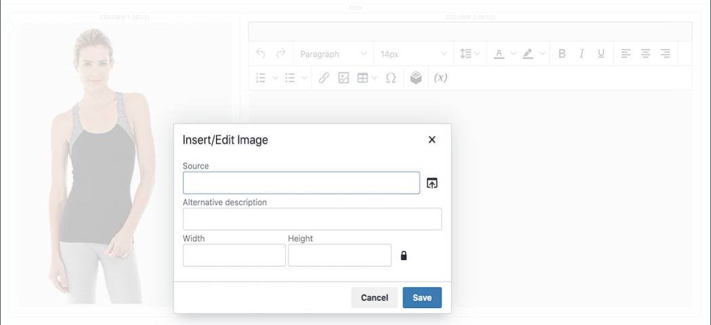
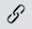
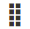

# [!DNL Page Builder] Procedura dettagliata parte 1: pagina semplice

Segui questo esercizio in tre parti per acquisire familiarità con l&#39;area di lavoro [!DNL Page Builder] creando una semplice pagina che illustra quanto sia semplice creare pagine ricche di contenuti con la tua progettazione.

{width="700" zoomable="yes"}

>[!NOTE]
>
>Questi esercizi di procedura dettagliata vengono aggiornati per riflettere le recenti modifiche apportate all&#39;area di lavoro [!DNL Page Builder] nella versione 2.4.1.

## Prima di iniziare

Prima di iniziare questo esercizio, è consigliabile aumentare la [durata della sessione di amministrazione](../systems/security-admin.md) per evitare che si verifichi il timeout della sessione mentre si lavora.

Verifica le impostazioni di configurazione di Content Management richieste:

- WYSIWYG Editor è abilitato nella configurazione [Opzioni WYSIWYG](../content-design/editor.md#configure-the-editor).

- [!DNL Page Builder] è abilitato nella configurazione di [Strumenti di contenuto avanzati](setup.md).

### Scaricare le risorse immagine della procedura dettagliata

1. Scaricare il file [`simple-page-assets`](./assets/simple-page-assets.zip) e salvarlo nel sistema locale.

1. Passare al file scaricato ed estrarre i file compressi.

   In un sistema Windows, fare clic con il pulsante destro del mouse e scegliere **[!UICONTROL Extract All]** file. Scegliere quindi la cartella di destinazione e fare clic su **[!UICONTROL Extract]**.

   In un sistema Mac, è sufficiente fare doppio clic sul file zip e spostare i file estratti nella cartella di destinazione.

   La cartella contiene i seguenti file di immagine:

   ![[!DNL Page Builder] file di procedura dettagliata - risorse di pagina semplici](./assets/pb-tutorial-simple-page-assets.png){width="500"}

Seguire le tre parti della procedura dettagliata in ordine.

## Parte 1: riga a tutto pagina con banner

In questa parte dell&#39;esercizio Pagina semplice viene creata una pagina con una riga e un banner al vivo. La riga presenta immagini di sfondo diverse per i dispositivi desktop e mobili.

![[!DNL Page Builder] riga al vivo completa con banner](./assets/pb-tutorial1-full-bleed-with-banner.png){width="700" zoomable="yes"}

### Passaggio 1: creare una pagina

1. Nella barra laterale _Admin_, passa a **[!UICONTROL Content]** > _[!UICONTROL Elements]_>**[!UICONTROL Pages]**.

1. Nell&#39;angolo superiore destro fare clic su **[!UICONTROL Add New Page]** ed eseguire le operazioni seguenti:

   - Per impedire la pubblicazione della pagina nello store, impostare **[!UICONTROL Enable Page]** su `No`.

   - Per **[!UICONTROL Page Title]**, immettere `Simple Page`.

   {width="600" zoomable="yes"}

1. Espandere  nella sezione **[!UICONTROL Design]**.

   **[!UICONTROL Layout]** è impostato su `Page -- Full Width` per impostazione predefinita. Oltre alle cinque opzioni [layout](../content-design/page-layout.md) standard, [!DNL Page Builder] aggiunge layout a larghezza intera per pagine, categorie e prodotti.

1. Se i dati di esempio sono disponibili, impostare **[!UICONTROL New Theme]** su `Magento Luma`. In caso contrario, è possibile scegliere un altro tema disponibile o lasciarlo vuoto per utilizzare il tema predefinito.

   L&#39;impostazione _[!UICONTROL New Theme]_può essere utilizzata per sostituire il tema predefinito e per applicare un tema diverso alla pagina.

   >[!NOTE]
   >
   >Il layout Larghezza intera può essere utilizzato solo con un [tema](../content-design/themes.md) compatibile.

   {width="600" zoomable="yes"}

1. Nell&#39;angolo superiore destro fare clic su **[!UICONTROL Save]**.

   Quando la pagina viene salvata, il nome _Pagina semplice_ viene visualizzato nell&#39;angolo superiore sinistro della pagina.

### Passaggio 2: formattare la riga

1. Espandere  nella sezione **[!UICONTROL Content]**.

   Questa azione visualizza l&#39;anteprima [!DNL Page Builder] con una riga vuota.

   >[!NOTE]
   >
   >Il campo [Intestazione contenuto](workspace.md) è facoltativo. Per impostazione predefinita, è formattato come livello di intestazione 1 (H1) in base al tema. Per questo esercizio, _Intestazione contenuto_ è lasciato vuoto.

   {width="600" zoomable="yes"}

1. Fare clic su **[!UICONTROL Edit with Page Builder]** o all&#39;interno dell&#39;area di anteprima del contenuto.

   Nell&#39;[!DNL Page Builder] [area di lavoro](workspace.md) espansa, il pannello a sinistra fornisce gli strumenti di contenuto che è possibile utilizzare per creare il contenuto nell&#39;area di visualizzazione.

1. Passa il cursore del mouse sulla riga vuota per visualizzare la casella degli strumenti.

   Ogni contenitore di contenuto ha una casella degli strumenti con un set di opzioni simile.

   ![[!DNL Page Builder] casella degli strumenti riga](./assets/pb-layout-page-add-content-row-tools.png){width="600" zoomable="yes"}

1. Nella casella degli strumenti Riga, scegliere l&#39;icona _Impostazioni_ ({width="20"}.

1. In _[!UICONTROL Appearance]_scegliere **Smarginatura completa**.

   L&#39;impostazione dell&#39;aspetto a pagina intera estende i bordi sinistro e destro dell&#39;area contenuto della riga e dello sfondo fino alla larghezza completa della pagina.

   {width="600" zoomable="yes"}

1. Scorri verso il basso fino alla sezione _[!UICONTROL Advanced]_e imposta tutte le impostazioni **[!UICONTROL Margins and Padding]**su `0`.

   Questa impostazione assicura che il banner estenda l&#39;intera larghezza della riga.

   {width="600" zoomable="yes"}

1. Per salvare le impostazioni e tornare all&#39;area di lavoro [!DNL Page Builder], scorrere fino all&#39;inizio della pagina e fare clic su **[!UICONTROL Save]** nell&#39;angolo superiore destro.

### Passaggio 3: aggiungere un banner

>[!NOTE]
>
>[!DNL Page Builder] ha un nuovo tipo di contenuto denominato _Banner_, presentato in questo passaggio. Precedentemente l&#39;opzione _Banner_ nel menu Contenuto è ora un _blocco dinamico_.

1. Nel pannello [!DNL Page Builder], espandi **[!UICONTROL Media]** e trascina un segnaposto **Banner** nell&#39;area di visualizzazione.

   {width="600" zoomable="yes"}
1. Passa il puntatore del mouse sul contenitore del banner per visualizzare la casella degli strumenti.

   >[!NOTE]
   >
   >L’area di visualizzazione ora dispone di due contenitori di contenuto, ciascuno con una casella degli strumenti separata. Poiché il banner è nidificato all&#39;interno della riga, assicurarsi di utilizzare la casella degli strumenti corretta.

   Oltre alla casella degli strumenti, sono inclusi i pulsanti _Carica immagine_ e _Seleziona da raccolta_, per consentire di apportare modifiche rapide al banner direttamente dall&#39;area di visualizzazione.

   {width="600" zoomable="yes"}

1. Nella casella degli strumenti del banner, scegli l&#39;icona _Impostazioni_ ( {width="20"} ).

1. In _[!UICONTROL Appearance]_scegliere **[!UICONTROL Collage Right]**.

   L&#39;impostazione Collage Right posiziona il contenuto sul lato destro del banner.

   {width="600" zoomable="yes"}

1. Scorri verso il basso fino alla sezione _[!UICONTROL Background]_e imposta l&#39;immagine di sfondo per il banner:

   - Per **[!UICONTROL Background Image]**, fare clic su **Carica**.

     {width="600" zoomable="yes"}

     Passare alla directory in cui sono state salvate le risorse di pagina semplici estratte e scegliere il file `wide-banner-background.jpg`.

     L’immagine viene caricata e viene visualizzata una miniatura dell’immagine caricata. Il nome del file, le dimensioni dell&#39;immagine e le dimensioni del file sono indicati di seguito.

     {width="600" zoomable="yes"}

   - Per **[!UICONTROL Background Mobile Image]**, fare clic su **Carica**.

     Nella stessa directory di file, scegliere il file `wide-banner-background-mobile.jpg`.

     L’immagine di sfondo mobile viene utilizzata per i dispositivi mobili e anche ogni volta che una finestra del browser desktop viene ridimensionata alla larghezza di un dispositivo mobile.

     {width="600" zoomable="yes"}

   - Tornare alla parte superiore della pagina e fare clic su **[!UICONTROL Save]** per salvare le impostazioni e tornare all&#39;area di lavoro [!DNL Page Builder].

     Lo sfondo viene visualizzato sullo stage e estende l&#39;intera larghezza della riga.

     {width="600" zoomable="yes"}

   Osserva il testo segnaposto visualizzato sul lato destro della riga. La posizione di questo testo riflette l&#39;impostazione dell&#39;aspetto _Collage Right_.

1. Fare clic sul testo segnaposto e immettere il seguente messaggio come due righe:

   `Get fit and look fab in new seasonal styles.`

   `New LUMA yoga collection`

   La barra degli strumenti dell&#39;editor viene visualizzata sopra la casella di testo. Il testo può essere immesso e formattato direttamente dall&#39;area di visualizzazione oppure scegliendo _Impostazioni_ nella casella degli strumenti del banner.

   {width="600" zoomable="yes"}

1. Applica formattazione al testo:

   - Selezionare la prima riga di testo. Quindi, nella barra degli strumenti dell&#39;editor in **Formati**, scegli `Heading 2`.

     {width="600" zoomable="yes"}

   - Selezionare la seconda riga di testo. Quindi, nella barra degli strumenti dell&#39;editor in **Formati**, scegli `Paragraph`.

   Le impostazioni di formato applicano gli stili del foglio di stile associato al tema corrente.

   {width="600" zoomable="yes"}
__

1. Passa il puntatore del mouse per visualizzare la casella degli strumenti del banner, scegli nuovamente l&#39;icona _Impostazioni_ ( {width="20"} ), quindi scorri fino alla sezione _[!UICONTROL Content]_.

   Il testo verrà visualizzato nella casella _Testo messaggio_. Il testo può essere immesso e modificato dalla fase o dalla sezione _[!UICONTROL Content]_delle impostazioni del banner.

   {width="600" zoomable="yes"}

1. Continuando nella sezione _[!UICONTROL Content]_, impostare il collegamento e il pulsante del banner:

   - Impostare **Link** su `Category`, quindi fare clic su **[!UICONTROL Select]** per visualizzare la struttura delle categorie.

   - Scegliere `What's New` come categoria collegata.

     {width="600" zoomable="yes"}

   - Imposta **[!UICONTROL Show Button]** su `Always`.

   - Per **[!UICONTROL Button Text]**, immettere `Shop Now` come testo visualizzato sul pulsante.

   - Per **[!UICONTROL Button Type]**, accettare l&#39;impostazione predefinita `Primary`.

     Lo stile del pulsante del tema corrente determina il formato del pulsante.

1. Imposta la sovrapposizione banner:

   È possibile utilizzare una sovrapposizione per applicare un colore di sfondo all&#39;area di contenuto attiva definita dall&#39;impostazione Aspetto. L&#39;immagine di sfondo del banner rimane visibile per l&#39;intera larghezza del banner.

   - Imposta **[!UICONTROL Show Overlay]** su `Always`.

   - Per **[!UICONTROL Overlay Color]**, eseguire una delle operazioni seguenti:

      - Fate clic sul quadrato di colore e scegliete il campione bianco.
      - Fare clic nella casella di testo _Nessun colore_ e immettere `White` o il valore esadecimale `#ffffff`.

     Quindi fare clic su **[!UICONTROL Apply]**.

     {width="600" zoomable="yes"}

   - Tornare alla parte superiore della pagina e fare clic su **[!UICONTROL Save]** per salvare le impostazioni e tornare all&#39;area di lavoro [!DNL Page Builder].

     Il pulsante viene visualizzato sotto il messaggio del banner sullo stage.

     {width="600" zoomable="yes"}

1. Nell&#39;angolo superiore destro dell&#39;area di visualizzazione fare clic sull&#39;icona _Chiudi schermo intero_ ().

   Facendo clic su questa icona si ritorna alla sezione _[!UICONTROL Content]_per la pagina con l&#39;anteprima visualizzata.

   È possibile passare da una modalità all&#39;altra in qualsiasi momento.

1. Nell&#39;angolo superiore destro fare clic sulla freccia **[!UICONTROL Save]** e scegliere **[!UICONTROL Save & Close]**.

1. Se richiesto, fare clic sul collegamento [Gestione cache](../systems/cache-management.md) nel messaggio nella parte superiore della pagina e aggiornare eventuali cache non valide.

## Parte 2: riga contenente due colonne uguali

In questa parte dell&#39;esercizio aggiungerete una riga alla pagina e la dividerete in due colonne uguali. Quindi, aggiungi un’immagine collegata a ogni colonna. Nelle istruzioni, ogni nuova riga viene aggiunta prima della prima per allineare il pannello [!DNL Page Builder] con l&#39;area di visualizzazione. Alla fine dell&#39;esercizio ridisporrete le righe in modo che corrispondano all&#39;esempio Pagina semplice.

{width="600" zoomable="yes"}

### Passaggio 1: aggiungere una riga

1. Nella griglia Pagine individuare la _pagina semplice_ creata nella prima parte dell&#39;esercizio e selezionare **[!UICONTROL Edit]** nella colonna _[!UICONTROL Action]_.

1. Espandere  nella sezione **[!UICONTROL Content]**.

1. Fare clic su **[!UICONTROL Edit with Page Builder]** o all&#39;interno dell&#39;area di anteprima del contenuto.

1. Nel pannello [!DNL Page Builder] sotto _[!UICONTROL Layout]_, trascina un segnaposto **[!UICONTROL Row]**nell&#39;area di visualizzazione e posizionalo sopra il banner.

   La linea guida rossa segna il limite tra le due righe.

   {width="600" zoomable="yes"}

1. Passa il puntatore del mouse sulla nuova riga per visualizzare la casella degli strumenti e scegli l&#39;icona _Impostazioni_ ( {width="20"} ).

   {width="600" zoomable="yes"}

1. In _[!UICONTROL Appearance]_, accettare l&#39;impostazione predefinita **Contains**.

   Questa impostazione limita l’area del contenuto della riga alla larghezza della pagina definita dal tema.

   {width="600" zoomable="yes"}

1. Nell&#39;angolo superiore destro fare clic su **[!UICONTROL Save]** per salvare le impostazioni e tornare all&#39;area di lavoro [!DNL Page Builder].

### Passaggio 2: aggiungere una colonna

1. Nel pannello [!DNL Page Builder] sotto _[!UICONTROL Layout]_, trascina un segnaposto **[!UICONTROL Column]**nella nuova riga.

   {width="600" zoomable="yes"}

   La riga è ora divisa in due colonne di uguale larghezza. Ogni colonna è un contenitore separato per il contenuto con la propria casella strumenti dedicata di opzioni.

   {width="600" zoomable="yes"}

1. Nell&#39;angolo superiore sinistro della prima colonna fare clic sul controllo circolare _Griglia_ () per visualizzare le linee guida della griglia.

   La griglia garantisce che il contenuto sia allineato in modo coerente e che venga riprodotto correttamente sia sui desktop che sui dispositivi mobili. Per informazioni sulla configurazione delle dimensioni della griglia, vedere la sezione [Configure [!DNL Page Builder]](setup.md#configure-page-builder) nell&#39;argomento del programma di installazione di [!DNL Page Builder].

   I numeri tra parentesi (6/12) nel bordo superiore di ogni contenitore di colonne indicano il numero di divisioni della griglia in ogni colonna e il numero totale di divisioni nella riga.

   {width="600" zoomable="yes"}

### Passaggio 3: aggiungere immagini con collegamenti

In questo passaggio imparerai a caricare un’immagine nel banner.

1. Nel pannello [!DNL Page Builder], espandere la sezione **[!UICONTROL Media]** e trascinare un segnaposto **[!UICONTROL Image]** nella prima colonna.

   {width="600" zoomable="yes"}

1. Inserite l&#39;immagine di esempio nel segnaposto.

   {width="600" zoomable="yes"}

   Per un&#39;immagine che si trova nel sistema, è possibile scegliere uno dei seguenti metodi:

   - **Carica il file di immagine**: nella prima colonna fare clic su **[!UICONTROL Upload Image]**. Passare quindi alla directory in cui sono state salvate le risorse di pagina semplici estratte e scegliere il file `small-banner-1.jpg`.

     {width="600" zoomable="yes"}

     Ripetere questa azione per aggiungere il file `small-banner-2.jpg` alla seconda colonna.

   - **Trascina il file immagine**: sul desktop, apri la cartella delle risorse di pagina semplice e posizionala accanto alla finestra del browser Amministratore in cui stai lavorando con la fase [!DNL Page Builder]. Trascinare quindi il file `small-banner-1.jpg` dalla cartella delle risorse di pagina semplici e rilasciarlo nella prima colonna.

     {width="600" zoomable="yes"}

     Ripetere questa azione per aggiungere il file `small-banner-2.jpg` alla seconda colonna.

1. Determina quale pagina del catalogo desideri collegare a ogni immagine.

1. Passa il puntatore del mouse sull&#39;immagine nella prima colonna per visualizzare la casella degli strumenti e scegli l&#39;icona _Impostazioni_ ( {width="20"} ).

   {width="600" zoomable="yes"}

1. Collega l&#39;immagine a una categoria:

   - Scorri verso il basso e imposta **Link** su `Category`.

   - Nell&#39;albero delle categorie espandere e scegliere la categoria `Men's Hoodies & Sweatshirt`.

   - Nell&#39;angolo superiore destro **[!UICONTROL Save]** le impostazioni e tornare all&#39;area di lavoro [!DNL Page Builder].

1. Ripetere il passaggio precedente per collegare l&#39;immagine nella seconda colonna alla categoria _Ingranaggio_.

1. Nell&#39;angolo superiore destro dell&#39;area di visualizzazione fare clic sull&#39;icona _Chiudi schermo intero_ ().

   Facendo clic su questa icona si ritorna alla sezione _[!UICONTROL Content]_per la pagina con l&#39;anteprima visualizzata.

1. Nell&#39;angolo superiore destro fare clic sulla freccia **[!UICONTROL Save]** e scegliere **[!UICONTROL Save & Close]**.

1. Quando richiesto, fare clic sul collegamento [Gestione cache](../systems/cache-management.md) nel messaggio nella parte superiore della pagina e aggiornare eventuali cache non valide.

## Parte 3: riga a larghezza intera con colonne diseguali

L’ultima riga di questa pagina presenta il contenuto di una recensione di prodotto. Aggiungere una riga a larghezza intera e dividerla in due colonne di larghezza diversa. Alla prima colonna viene aggiunta un&#39;immagine di sfondo con un colore di sfondo corrispondente applicato alla riga per un effetto unificato.

{width="500"}

### Passaggio 1: aggiungere una riga

1. Nella griglia Pagine individuare la _pagina semplice_ creata nella prima parte dell&#39;esercizio e selezionare **[!UICONTROL Edit]** nella colonna _[!UICONTROL Action]_.

1. Espandere  nella sezione **[!UICONTROL Content]**.

1. Fare clic su **[!UICONTROL Edit with Page Builder]** o all&#39;interno dell&#39;area di anteprima del contenuto.

1. Nel pannello [!DNL Page Builder] sotto _[!UICONTROL Layout]_, trascina un segnaposto **[!UICONTROL Row]**nell&#39;area di visualizzazione e posizionalo sopra la riga creata nella seconda parte di questo esercizio.

   Una linea guida rossa segna il limite tra le due righe.

   {width="600" zoomable="yes"}

1. Passa il puntatore del mouse sulla nuova riga per visualizzare la casella degli strumenti e scegli l&#39;icona _Impostazioni_ ({width="20"} ).

   {width="600" zoomable="yes"}

1. Nella pagina Modifica riga in _[!UICONTROL Appearance]_, scegliere **[!UICONTROL Full Width]**.

   Questa impostazione limita l’area del contenuto alla larghezza massima della pagina definita dal tema. Il colore e/o l’immagine di sfondo non sono limitati ed estendono l’intera larghezza della riga.

   {width="600" zoomable="yes"}

1. Nella sezione _[!UICONTROL Background]_immettere `#f1f1f1` come **[!UICONTROL Background Color]**.

   {width="600" zoomable="yes"}

1. Scorri verso il basso fino alla sezione _[!UICONTROL Advanced]_e imposta tutti i valori **Margini e spaziatura interna**su `0`.

   {width="600" zoomable="yes"}

1. Tornare alla parte superiore della pagina e fare clic su **[!UICONTROL Save]** per salvare le impostazioni e tornare all&#39;area di lavoro [!DNL Page Builder].

   Il colore di sfondo della riga è ora un beige chiaro.

   {width="600" zoomable="yes"}

### Passaggio 2: aggiungere colonne di larghezza diversa

1. Nel pannello [!DNL Page Builder] sotto _[!UICONTROL Layout]_, trascina un segnaposto **[!UICONTROL Column]**nella riga superiore dell&#39;area di visualizzazione.

   {width="600" zoomable="yes"}

1. Trascinare il bordo destro della prima colonna nella posizione quattro di 12 (`4/12`) sulla griglia.

   La dimensione della seconda colonna viene regolata su otto di 12 (`8/12`).

   {width="600" zoomable="yes"}

1. Passa il puntatore del mouse sul primo contenitore di colonne per visualizzare la casella degli strumenti e scegli l&#39;icona _Impostazioni_ ( {width="20"} ).

1. Scorri verso il basso fino alla sezione _[!UICONTROL Advanced]_e imposta tutti i valori **Margini e spaziatura interna**su `0`.

   {width="600" zoomable="yes"}

1. Tornare alla parte superiore della pagina e fare clic su **[!UICONTROL Save]** per salvare le impostazioni e tornare all&#39;area di lavoro [!DNL Page Builder].

### Passaggio 3: aggiungere un’immagine alla prima colonna

1. Nel pannello [!DNL Page Builder], espandere **[!UICONTROL Media]** e trascinare un tipo di contenuto **[!UICONTROL Image]** nella prima colonna.

   {width="600" zoomable="yes"}

1. Nel segnaposto immagine, fare clic su **[!UICONTROL Upload Image]**.

   {width="600" zoomable="yes"}

1. Passare alla directory in cui sono state salvate le risorse di pagina semplici estratte e scegliere il file `review-image.jpg`.

   L’immagine caricata viene visualizzata nella prima colonna e si fonde perfettamente con il colore di sfondo della riga.

   {width="600" zoomable="yes"}

### Passaggio 4: aggiungere il contenuto della revisione alla seconda colonna

La seconda colonna della riga deve contenere il contenuto di una recensione del cliente, inclusa l’immagine di valutazione a cinque stelle e un messaggio di testo formattato.

1. Nel pannello [!DNL Page Builder], espandere la sezione **[!UICONTROL Elements]** e trascinare il tipo di contenuto **[!UICONTROL Text]** nella seconda colonna.

   {width="600" zoomable="yes"}

1. Fai clic sull’elemento di testo per visualizzare la barra degli strumenti dell’editor.

1. Nella barra degli strumenti fare clic sull&#39;icona _Inserisci immagine_ () ed eseguire le operazioni seguenti:

   {width="600" zoomable="yes"}

   - Nella finestra di dialogo _[!UICONTROL Insert/edit image]_, fai clic sull&#39;icona_ Trova _(  ) accanto al campo_[!UICONTROL Source]_.

     {width="600" zoomable="yes"}

   - Nella pagina _[!UICONTROL Select Images]_, fare clic su **[!UICONTROL Choose Files]**.

   - Nella cartella in cui sono state salvate le risorse di pagina semplici, scegli `rating.png`.

   - Tornando alla pagina, fai doppio clic sulla sezione dell’immagine per selezionarla e inserirne l’URL nel campo Source.

     {width="600" zoomable="yes"}

   - Per **[!UICONTROL Image Description]**, immettere `5-Star Rating` e fare clic su **[!UICONTROL OK]** per inserire l&#39;immagine nella colonna.

   - Nella barra degli strumenti dell&#39;editor fare clic su **Allinea al centro** () per centrare l&#39;immagine nella colonna.

     {width="600" zoomable="yes"}

1. Posizionare il punto di inserimento subito dopo l&#39;immagine a cinque stelle, premere Invio o A capo per iniziare una nuova riga e immettere il testo seguente:

   `Awesome Tank!`

   `I'm a long distance runner and it keeps me pretty comfortable, although these companies always act like their shirts are magical and really it's just pretty basic stuff. Still it's a great shirt, and I would recommend it.`

   `Antonia Racer Tank – Reviewed by Allyson`

   Il testo viene centrato durante la digitazione.

   {width="600" zoomable="yes"}

1. Formattare il testo:

   - Fare clic in un punto qualsiasi della prima riga di testo e nella barra degli strumenti dell&#39;editor in **Formati** scegliere `Heading 2`.

   - Selezionare il testo rimanente e nella barra degli strumenti dell&#39;editor in **Formati** scegliere `Paragraph`.

   Il testo viene formattato in base al foglio di stile associato al tema.

1. Ottieni le dimensioni dell’immagine in modo da poter centrare il contenuto verticalmente nella colonna:

   - Passa il puntatore del mouse sull&#39;immagine nella prima colonna per visualizzare la casella degli strumenti e scegli l&#39;icona _Impostazioni_ ({width="20"} ).

   - Sotto la miniatura dell&#39;immagine, prendere nota delle dimensioni dell&#39;immagine.

     {width="600" zoomable="yes"}

   - Nell&#39;angolo superiore destro fare clic su **Chiudi**.

1. Centra il contenuto verticalmente nella seconda colonna:

   - Passa il puntatore del mouse sulla seconda colonna per visualizzare la casella degli strumenti e scegli l&#39;icona _Impostazioni_ ({width="20"} ).

   >[!NOTE]
   >
   >Per visualizzare la casella degli strumenti corretta, assicurarsi di selezionare il contenitore di colonne anziché il contenitore di testo.

   - Per **[!UICONTROL Minimum Height]**, immetti `450` come altezza in pixel per l&#39;immagine nella prima colonna.

   - Imposta **[!UICONTROL Vertical Alignment]** su `Center`.

   {width="600" zoomable="yes"}

1. Scorri verso il basso fino alla sezione _[!UICONTROL Advanced]_e imposta tutti i valori **[!UICONTROL Margins and Padding]**su zero ( `0` ).

   {width="600" zoomable="yes"}

1. Scorrere indietro fino alla parte superiore della pagina e nell&#39;angolo superiore destro fare clic su **[!UICONTROL Save]** per salvare le impostazioni e tornare all&#39;area di lavoro [!DNL Page Builder].

   {width="600" zoomable="yes"}

### Passaggio 5: inserire un collegamento a un prodotto catalogo

1. Selezionare il testo `Antonia Racer Tank` e fare clic sull&#39;icona _Inserisci collegamento_ () nella barra degli strumenti dell&#39;editor.

1. Nella finestra di dialogo _Inserisci collegamento_, specifica il collegamento al prodotto del catalogo:

   - Immettere il prodotto **[!UICONTROL URL]**.

     Puoi immettere un URL relativo o completo. Per questo esempio viene inserito il seguente collegamento relativo:

     `../antonia-racer-tank.html`

   - (Facoltativo) Per **Titolo**, immettere il nome del prodotto.

     L’attributo di collegamento Titolo viene utilizzato da alcuni browser come descrizione comando.

     {width="600" zoomable="yes"}

   - Al termine, fare clic su **[!UICONTROL OK]** per salvare il collegamento.

     Il testo collegato viene ora evidenziato nel banner.

     {width="600" zoomable="yes"}

1. Nell&#39;angolo superiore destro dell&#39;area di visualizzazione fare clic sull&#39;icona _Chiudi schermo intero_ ().

   Facendo clic su questa icona si ritorna alla sezione _[!UICONTROL Content]_per la pagina con l&#39;anteprima visualizzata.

1. Nell&#39;angolo superiore destro fare clic su **[!UICONTROL Save]**.

### Passaggio 6: ridisporre le righe

Quando tutte e tre le righe sono state completate, il passaggio finale consiste nel ridisporre le righe in modo che corrispondano all&#39;esempio originale di _Pagina semplice_. Per corrispondere all&#39;esempio originale, la prima riga deve essere spostata in basso e l&#39;ultima riga deve essere spostata in alto.

1. Se necessario, espandere  nella sezione **[!UICONTROL Content]**.

1. Fare clic su **[!UICONTROL Edit with Page Builder]** o all&#39;interno dell&#39;area di anteprima del contenuto.

1. Passa il puntatore del mouse sulla prima riga nell&#39;area di visualizzazione per visualizzare la casella degli strumenti e scegli l&#39;icona _Sposta_ ( ).

   {width="600" zoomable="yes"}

1. Tenere premuto il pulsante del mouse mentre si verifica che tutto il contenuto della riga sia selezionato e trascinare la riga nella posizione sotto la linea guida rossa nella parte inferiore della pagina.

   >[!NOTE]
   >
   >Se sposti accidentalmente solo una parte del contenuto, ad esempio l’immagine, è sufficiente spostare il contenuto nella posizione in cui appartiene e riprovare.

   {width="600" zoomable="yes"}

1. Ripetete questa procedura per spostare la prima riga nella seconda posizione.

   L’ordine delle righe sulla pagina ora corrisponde all’esempio Pagina semplice.

1. Nell&#39;angolo superiore destro dell&#39;area di visualizzazione fare clic sull&#39;icona _Chiudi schermo intero_ ().

   Facendo clic su questa icona si ritorna alla sezione _[!UICONTROL Content]_per la pagina con l&#39;anteprima visualizzata.

1. Nell&#39;angolo superiore destro fare clic sulla freccia **[!UICONTROL Save]** e scegliere **[!UICONTROL Save & Close]**.

1. Se richiesto, fare clic sul collegamento [Gestione cache](../systems/cache-management.md) nel messaggio nella parte superiore della pagina e aggiornare eventuali cache non valide.

Hai completato l’esercizio Pagina semplice. Conserva il lavoro creato, in modo da poterci fare riferimento in un secondo momento.

Quando sei pronto, procedi a [Parte 2: Blocchi](2-blocks.md).
