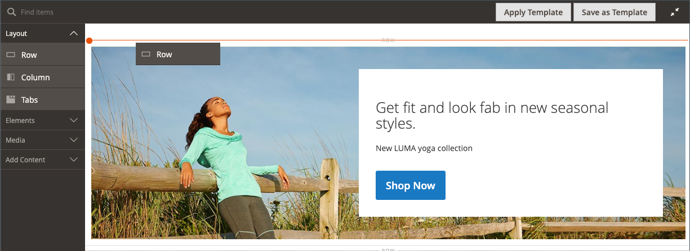
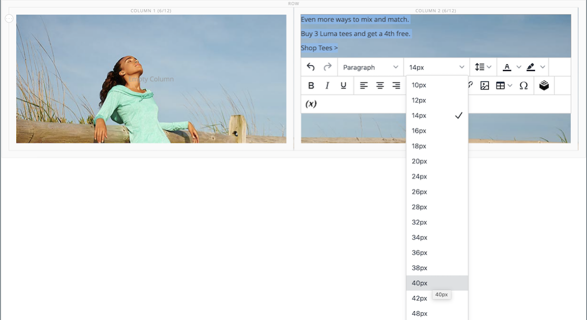
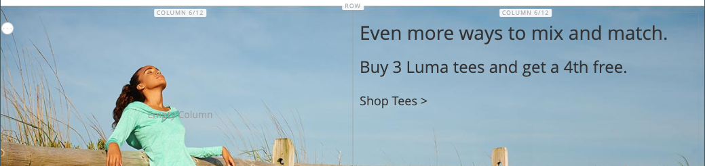
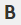
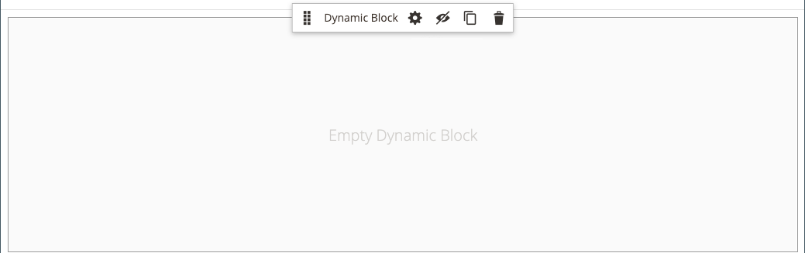

# [!DNL Page Builder] Procedura dettagliata parte 2: blocchi

L&#39;esercizio seguente illustra la differenza tra [blocchi semplici](../content-design/blocks.md) e [blocchi dinamici](dynamic-block.md) e come utilizzare [!DNL Page Builder] per creare ogni tipo di blocco.

>[!NOTE]
>
>[!DNL Page Builder] ha un nuovo tipo di contenuto denominato _Banner_, che è presente nel primo esercizio di procedura dettagliata e non è correlato alla funzionalità precedente del banner. Precedentemente l&#39;opzione Banner nel [menu Contenuto](../content-design/content-menu.md) era _Blocco dinamico_.

{width="700" zoomable="yes"}

Questo esercizio presuppone che tu abbia completato [Parte 1: Pagina semplice](1-simple-page.md), inclusi i prerequisiti e [file di esempio scaricati](./assets/simple-page-assets.zip). Seguire le parti di questo esercizio di procedura dettagliata in ordine.

>[!NOTE]
>
>Questi esercizi di procedura dettagliata vengono aggiornati per riflettere le recenti modifiche apportate all&#39;area di lavoro [!DNL Page Builder] nella versione 2.4.1. Se utilizzi una versione precedente di Adobe Commerce, utilizza gli esercizi [!DNL Page Builder] inclusi nella [[!DNL Commerce] 2.3 Guida utente](https://docs.magento.com/user-guide/v2.3/cms/page-builder-learn.html).

## Parte 1: Creare un blocco semplice

In questo esercizio di procedura dettagliata verrà creato un blocco semplice con il contenuto di [!DNL Google Maps]. I blocchi semplici sono talvolta denominati _blocchi CMS_ o _blocchi statici_, perché il contenuto non cambia. Un blocco semplice è ideale per i contenuti che potresti voler riutilizzare.

### Passaggio 1: creare un blocco

1. Nella barra laterale _Admin_, passa a **[!UICONTROL Content]** > _[!UICONTROL Elements]_>**[!UICONTROL Blocks]**.

1. Nell&#39;angolo superiore destro fare clic su **[!UICONTROL Add New Block]**.

1. Per **[!UICONTROL Block Title]**, immettere `Google Map`.

1. Per **[!UICONTROL Identifier]**, immettere `google-map`.

1. Scegli **[!UICONTROL Store View]** dove il blocco deve essere disponibile.

   {width="600" zoomable="yes"}

1. Nell&#39;angolo superiore destro fare clic su **[!UICONTROL Save]**.

### Passaggio 2: aggiungere [!DNL Google Map]

1. Scorri verso il basso fino all&#39;anteprima del contenuto [!DNL Page Builder] (attualmente vuota) e fai clic su **[!UICONTROL Edit with Page Builder]**.

1. Nel pannello [!DNL Page Builder], espandere **[!UICONTROL Media]** e trascinare un segnaposto **[!UICONTROL Map]** nell&#39;area di visualizzazione.

   {width="600" zoomable="yes"}

   Se [!DNL Google Maps] è configurato per il tuo archivio, verrà visualizzata una mappa con il percorso del tuo archivio.

   {width="600" zoomable="yes"}

   Se [!DNL Google Maps] non è ancora configurato per l&#39;archivio, verrà visualizzata una mappa segnaposto.

   ![[!DNL Google Maps] segnaposto](./assets/pb-tutorial2-media-map-not-configured.png){width="600" zoomable="yes"}

1. Nell&#39;angolo superiore destro dell&#39;area di visualizzazione fare clic sull&#39;icona _Chiudi schermo intero_ ().

   Facendo clic su questa icona si ritorna alla sezione _[!UICONTROL Content]_per il blocco con l&#39;anteprima visualizzata.

1. Nell&#39;angolo superiore destro fare clic sulla freccia **[!UICONTROL Save]** e scegliere **[!UICONTROL Save & Close]**.

### Passaggio 3: configurare [!DNL Google Maps]

Se [!DNL Google Maps] è già configurato per il tuo archivio, puoi saltare questo passaggio e passare a quello successivo.

1. Passa alla [console della piattaforma Google Cloud](https://console.cloud.google.com/google/maps-apis/overview).

1. Fai clic sull’elenco a discesa del progetto e seleziona o crea il progetto per il quale desideri aggiungere una chiave API.

1. Per configurare le credenziali API, segui le [istruzioni][1] nella documentazione di [!DNL Google Maps].

1. Copia la chiave API negli Appunti.

1. Torna all&#39;amministratore [!DNL Commerce] e passa a **[!UICONTROL Stores]** > _[!UICONTROL Settings]_>**[!UICONTROL Configuration]**.

1. Nel pannello a sinistra in _[!UICONTROL General]_, scegli **[!UICONTROL Content Management]**.

1. Espandere  **[!UICONTROL Advanced Content Tools]**.

   {width="600" zoomable="yes"}

   Per ulteriori informazioni sulle opzioni di configurazione [!UICONTROL Content Management Advanced Tools], vedere la [_Guida di riferimento alla configurazione_](../configuration-reference/general/content-management.md).

1. Per **[!UICONTROL Google Maps API Key]**, incolla la chiave copiata.

1. Fare clic su **[!UICONTROL Test Key]**.

   Se si è verificato un problema con la chiave, tornare al sito di [!DNL Google Maps] Platform per risolvere il problema. Riprovare.

1. Dopo aver verificato la chiave, fare clic su **[!UICONTROL Save Config]**.

### Passaggio 4: aggiungere il blocco a una pagina

1. Nella barra laterale _Admin_, passa a **[!UICONTROL Content]** > _[!UICONTROL Elements]_>**[!UICONTROL Pages]**.

1. Nella griglia, trovare _[!UICONTROL Simple Page]_creato nel primo tutorial e selezionare **[!UICONTROL Edit]**nella colonna_[!UICONTROL Action]_.

1. Espandere  nella sezione **[!UICONTROL Content]** e fare clic su **[!UICONTROL Edit with Page Builder]** o all&#39;interno dell&#39;area di anteprima del contenuto.

1. Nel pannello [!DNL Page Builder] sotto _[!UICONTROL Layout]_, trascina un segnaposto **[!UICONTROL Row]**nella parte superiore dell&#39;area di visualizzazione.

   {width="600" zoomable="yes"}

1. Nel pannello [!DNL Page Builder], espandi **[!UICONTROL Add Content]** e trascina un segnaposto **[!UICONTROL Block]** nella nuova riga.

1. Passa il puntatore del mouse sul contenitore di blocchi vuoto per visualizzare la casella degli strumenti e scegli l&#39;icona _Impostazioni_ ({width="20"} ).

   {width="600" zoomable="yes"}

1. Nella pagina Modifica blocco fare clic su **[!UICONTROL Select Block]**.

   {width="600" zoomable="yes"}

1. Nella casella di ricerca, immettere `map` e premere Invio/Ritorno per trovare il blocco creato.

   {width="600" zoomable="yes"}

1. Nella griglia, fare clic su **[!UICONTROL Select]** per scegliere il blocco [!DNL Google Maps].

1. Nell&#39;angolo superiore destro fare clic su **[!UICONTROL Save]** per salvare le impostazioni e tornare all&#39;area di lavoro [!DNL Page Builder].

1. Nell&#39;angolo superiore destro dell&#39;area di visualizzazione fare clic sull&#39;icona _Chiudi schermo intero_ ().

   Facendo clic su questa icona si ritorna alla sezione _[!UICONTROL Content]_per la pagina con l&#39;anteprima visualizzata.

1. Nell&#39;angolo superiore destro fare clic sulla freccia **[!UICONTROL Save]** e scegliere **[!UICONTROL Save & Close]**.

**Congratulazioni!** È stata completata la prima parte dell&#39;esercizio di blocco. Assicurati di conservare il tuo lavoro come riferimento.

## Parte 2: Creare un blocco dinamico

Un blocco dinamico include una logica che determina dove, quando e a chi viene visualizzato. In questo esercizio di procedura dettagliata, viene creato un blocco dinamico per una promozione che viene attivato quando vengono soddisfatte le condizioni della regola di prezzo e che viene visualizzato solo a un segmento di clienti specifico. Il risultato di questo esempio è simile al banner creato nel primo esercizio, ma con una logica che controlla quando viene visualizzato nella vetrina.

{width="600" zoomable="yes"}

### Passaggio 1: creare un nuovo blocco dinamico

1. Nella barra laterale _Admin_, passa a **[!UICONTROL Content]** > _[!UICONTROL Elements]_>**[!UICONTROL Dynamic Blocks]**.

   {width="700" zoomable="yes"}

1. Nell&#39;angolo superiore destro fare clic su **[!UICONTROL Add Dynamic Block]**.

   {width="600" zoomable="yes"}

1. Completa le impostazioni di base per il nuovo blocco dinamico:

   - Imposta **[!UICONTROL Enable Dynamic Block]** su `Yes`.

   - Per **[!UICONTROL Dynamic Block Name]**, immettere `Tee Shirt Promo`.

   - Impostare **[!UICONTROL Dynamic Block Type]** su `Content Area` e fare clic su **[!UICONTROL Done]**.

     Il tipo di blocco dinamico determina la posizione del blocco nel [layout di pagina](../content-design/page-layout.md). Quando imposti un blocco dinamico per il tuo archivio, considera sia il layout di pagina che il [tema](../content-design/themes.md), in modo da poter sfruttare lo spazio disponibile. Alcuni negozi hanno un’area di contenuto attiva limitata a una larghezza fissa, mentre altri estendono l’intera larghezza dello schermo.

     {width="600" zoomable="yes"}

   - Per **[!UICONTROL Customer Segment]**, seleziona la casella di controllo di ciascun segmento che desideri applicare al blocco dinamico e fai clic su **Fine** per salvare l&#39;elenco dei segmenti.

     Nell&#39;esempio seguente sono presenti due [segmenti di clienti](../customers/customer-segments.md) che identificano i clienti registrati in base al sesso. Questo blocco dinamico viene visualizzato solo per le clienti di sesso femminile registrate che hanno effettuato l’accesso ai loro account mentre fanno acquisti nel tuo negozio.

     {width="600" zoomable="yes"}

### Passaggio 2: completare le impostazioni

Scorri verso il basso fino alla sezione _[!UICONTROL Content]_, che visualizza un&#39;anteprima del contenuto [!DNL Page Builder] vuota, e fai clic su **[!UICONTROL Edit with Page Builder]**. Quindi, completa le seguenti attività:

**Attività 1:** Aggiungi un&#39;immagine di sfondo

1. Passa il puntatore del mouse sul contenitore righe per visualizzare la casella degli strumenti e scegli l&#39;icona _Impostazioni_ ({width="20"} ).

1. In _[!UICONTROL Appearance]_scegliere **[!UICONTROL Full Bleed]**.

1. Per **[!UICONTROL Minimum Height]**, immettere `400px`.

1. Scorri fino alla sezione _[!UICONTROL Background]_e imposta **[!UICONTROL Background Image]**facendo clic su **[!UICONTROL Select from Gallery]**e scegliendo l&#39;immagine `wide-banner-background.png` caricata nella prima esercitazione.

1. Nell&#39;angolo superiore destro fare clic su **[!UICONTROL Save]** per applicare le impostazioni e tornare all&#39;area di lavoro [!DNL Page Builder].

   {width="600" zoomable="yes"}

**Attività 2:** Aggiungi colonne

Nel pannello [!DNL Page Builder] sotto _[!UICONTROL Layout]_, trascina un segnaposto **[!UICONTROL Column]**nella riga.

{width="600" zoomable="yes"}

La riga è ora divisa in due colonne di uguale larghezza.

**Attività 3:** Aggiungi testo

1. Nel pannello [!DNL Page Builder], espandi **[!UICONTROL Elements]** e trascina un segnaposto **Testo** nella seconda colonna.

   {width="600" zoomable="yes"}

1. Immetti nell’editor le tre righe di testo seguenti:

   `Even more ways to mix and match.`

   `Buy 3 Luma tees and get a 4th free.`

   `Shop Tees >`

   {width="600" zoomable="yes"}

1. Selezionare tutte e tre le righe di testo e utilizzare la barra degli strumenti per impostare **Altezza riga** su `40px`.

   {width="600" zoomable="yes"}

1. Impostare **[!UICONTROL Font Size]** per ogni riga come segue:

   | Linea | Dimensione font |
   |-----| ---------- |
   | Riga 1: | `28px` |
   | Riga 2: | `24px` |
   | Riga 3: | `18px` |

   Poiché questo blocco può essere posizionato in qualsiasi punto della pagina, utilizza lo stile di paragrafo predefinito, anziché i livelli di intestazione. Inoltre, non preoccuparti che il testo non venga ancora disposto correttamente nella colonna.  

   {width="600" zoomable="yes"}

**Attività 4:** Aggiungi un collegamento

Nel primo esercizio hai imparato a utilizzare il tipo di contenuto [Button](buttons.md) per creare un collegamento. Questo esempio mostra come inserire un collegamento dalla barra degli strumenti dell’editor.

1. In un’altra scheda del browser, apri la vetrina e passa alla pagina che deve essere la destinazione del collegamento.

   Puoi utilizzare l’URL completo o un URL relativo che omette il riferimento al dominio dello store.

   URL completo
: `https://mystore.com/women/tops-women/tees-women.html`

   URL relativo
: `../women/tops-women/tees-women.html`

1. Torna alla scheda dell&#39;area di lavoro [!DNL Page Builder] e all&#39;editor di testo, seleziona il testo `Shop Tees >` nella terza riga e scegli **Bold** () nella barra degli strumenti dell&#39;editor.

1. Con il testo `Shop Tees >` nella terza riga ancora selezionato, scegli **Inserisci/modifica collegamento** () nella barra degli strumenti dell&#39;editor.

   {width="600" zoomable="yes"}

1. Per **[!UICONTROL URL]**, immettere il collegamento relativo preparato.

1. Imposta **[!UICONTROL Target]** su `None`.

   Questa impostazione consente di aprire la pagina nella stessa finestra del browser, anziché aprire una nuova scheda.

1. Per **[!UICONTROL Title]**, immettere `Shop Tees`.

   L’attributo di collegamento Titolo viene utilizzato da alcuni browser come descrizione comando.

1. Per salvare il collegamento e tornare all&#39;area di lavoro [!DNL Page Builder], fare clic su **[!UICONTROL OK]**.

   {width="600" zoomable="yes"}

1. Nell&#39;angolo superiore destro dell&#39;area di visualizzazione fare clic sull&#39;icona _Chiudi schermo intero_ ().

   Facendo clic su questa icona si ritorna alla sezione _[!UICONTROL Content]_per il blocco dinamico con l&#39;anteprima visualizzata.

1. Nell&#39;angolo superiore destro fare clic su **[!UICONTROL Save]**.

### Passaggio 3: aggiungere una regola di prezzo

1. Apri di nuovo il blocco dinamico _Tee Shirt Promo_ in modalità di modifica.

1. Espandere  nella sezione **[!UICONTROL Related Promotions]** e fare clic su **[!UICONTROL Add Cart Price Rules]**.

   {width="600" zoomable="yes"}

1. Nella pagina _Aggiungi regole prezzo carrello correlato_, seleziona la casella di controllo per _Acquista 3 magliette e ottieni la quarta regola di prezzo gratuita_, quindi fai clic su **[!UICONTROL Add Selected]**.

   {width="600" zoomable="yes"}

   La regola prezzo viene visualizzata nella sezione _Promozioni correlate_ in _Regola prezzo carrello correlato_. È possibile associare più regole di prezzo a un blocco dinamico. Tuttavia, questo semplice esempio ne utilizza solo uno.

   {width="600" zoomable="yes"}

1. Nell&#39;angolo superiore destro fare clic su **[!UICONTROL Save]**.

### Passaggio 4: aggiungere il blocco dinamico a una pagina

1. Nella barra laterale _Admin_, passa a **[!UICONTROL Content]** > _[!UICONTROL Elements]_>**[!UICONTROL Pages]**

1. Trovare la _pagina semplice_ creata nel [primo esercizio di procedura dettagliata](1-simple-page.md) e aprirla in modalità di modifica.

1. Espandere  nella sezione **[!UICONTROL Content]** e fare clic su **[!UICONTROL Edit with Page Builder]**.

1. Passa il puntatore del mouse sulla riga superiore con la stessa immagine del blocco dinamico per visualizzare la casella degli strumenti e l&#39;icona _Rimuovi_ ( {width="20"} ).

   Per confermare la rimozione della riga dalla pagina, fare clic su **[!UICONTROL OK]**.

1. Nel pannello [!DNL Page Builder] sotto _[!UICONTROL Layout]_, trascina un nuovo segnaposto **[!UICONTROL Row]**nella parte superiore dell&#39;area di visualizzazione.

1. Nel pannello [!DNL Page Builder], espandi **[!UICONTROL Add Content]** e trascina un segnaposto **[!UICONTROL Dynamic Block]** nella nuova riga.

   {width="600" zoomable="yes"}

1. Passa il puntatore del mouse sul contenitore di blocchi dinamici per visualizzare la casella degli strumenti e scegli l&#39;icona _Impostazioni_ ( {width="20"} ).

   {width="600" zoomable="yes"}

1. Nella pagina _[!UICONTROL Edit Dynamic Block]_, fare clic su **[!UICONTROL Select Dynamic Block]**.

   {width="600" zoomable="yes"}

1. Trovare il blocco dinamico _[!DNL Tee Shirt Promo]_creato e fare clic su **[!UICONTROL Select]**.

   Di seguito viene visualizzato un riepilogo delle informazioni sul blocco dinamico.

   {width="600" zoomable="yes"}

1. Accettare **[!UICONTROL Template]**, `Dynamic Block Block Template` predefiniti.

1. Al termine, fare clic su **[!UICONTROL Save]** per salvare le impostazioni e tornare all&#39;area di lavoro [!DNL Page Builder].

   {width="600" zoomable="yes"}

1. Nell&#39;angolo superiore destro dell&#39;area di visualizzazione fare clic sull&#39;icona _Chiudi schermo intero_ ().

   Facendo clic su questa icona si ritorna alla sezione _[!UICONTROL Content]_per la pagina con l&#39;anteprima visualizzata.

1. Nell&#39;angolo superiore destro fare clic sulla freccia **[!UICONTROL Save]** e scegliere **[!UICONTROL Save & Close]**.

La seconda parte dell&#39;esercizio Blocca è stata completata. Assicurati di conservare il tuo lavoro come riferimento.

## Parte 3: Aggiornare il blocco dinamico

In questa parte finale dell’esercizio modificherai un blocco dinamico mentre la pagina è attiva nel tuo store. Quindi, accedi al negozio come membro del segmento del cliente per far apparire il blocco.

{width="600" zoomable="yes"}

### Passaggio 1: modificare il blocco dinamico

1. Nella barra laterale _Admin_, passa a **[!UICONTROL Content]** > _[!UICONTROL Elements]_>**[!UICONTROL Dynamic Blocks]**.

1. Trova il blocco dinamico _[!DNL Tee Shirt Promo]_nella griglia e aprilo in modalità di modifica.

1. Espandere  nella sezione **[!UICONTROL Content]** e fare clic su **[!UICONTROL Edit with Page Builder]**.

1. Modifica la larghezza delle colonne:

   - Passa il cursore del mouse sul bordo tra le due colonne.

   - Tenere premuto il pulsante del mouse e trascinare il bordo di due divisioni verso sinistra.

     {width="600" zoomable="yes"}

     La prima colonna è ora quattro su 12 (4/12) divisioni di griglia, e la seconda colonna è otto su 12 (8/12) divisioni di larghezza.

     {width="600" zoomable="yes"}

1. Modificare il colore del testo:

   - Selezionare le prime due righe di testo.

   - Sulla barra degli strumenti dell&#39;editor, scegliere **[!UICONTROL Text Color]** e fare clic sul campione **[!UICONTROL White]**.

   {width="600" zoomable="yes"}

1. Nell&#39;angolo superiore destro dell&#39;area di visualizzazione fare clic sull&#39;icona _Chiudi schermo intero_ ().

   Facendo clic su questa icona si ritorna alla sezione _[!UICONTROL Content]_per il blocco dinamico con l&#39;anteprima visualizzata.

1. Nell&#39;angolo superiore destro fare clic su **[!UICONTROL Save]**.

### Passaggio 2: visualizzare il blocco dinamico

Poiché questo blocco dinamico è visibile solo ai membri di uno specifico segmento di clienti, è necessario accedere come cliente membro del segmento di clienti per visualizzare la promozione. In questo esempio, il blocco viene visualizzato solo ai clienti di sesso femminile.

1. Apri una finestra del browser nella vetrina.

1. Per visualizzare la pagina di esempio, modifica l’URL nella barra degli indirizzi come segue:

   mystore.com/sample-page

   Se l’archivio è configurato per includere il suffisso html, includi il suffisso come segue:

   mystore.com/sample-page.html

1. Accedi come cliente donna:

   - Nell&#39;angolo superiore destro della home page, fare clic su **[!UICONTROL Sign In]**.

   - Se i dati Luma di esempio sono installati nel sistema, usa le seguenti credenziali:

     **[!UICONTROL Email]** - `roni_cost@example.com`

     **[!UICONTROL Password]** - `roni_cost3@example.com`

   - Fare clic su **[!UICONTROL Sign In]**.

   - Torna alla pagina di esempio per visualizzare il blocco dinamico creato con la promozione Tee Shirt.

   {width="700" zoomable="yes"}

Hai completato l&#39;esercizio Blocca. Assicurati di conservare il tuo lavoro come riferimento.

Quando sei pronto, procedi alla [Parte 3: Contenuto catalogo](3-catalog-content.md)

[1]: https://developers.google.com/maps/documentation/javascript/get-api-key
