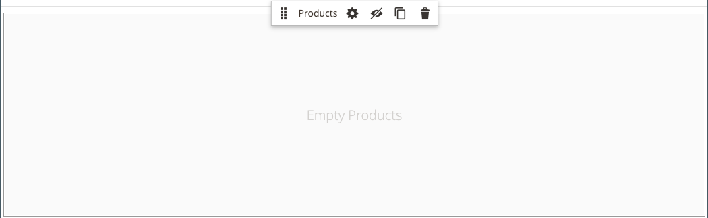
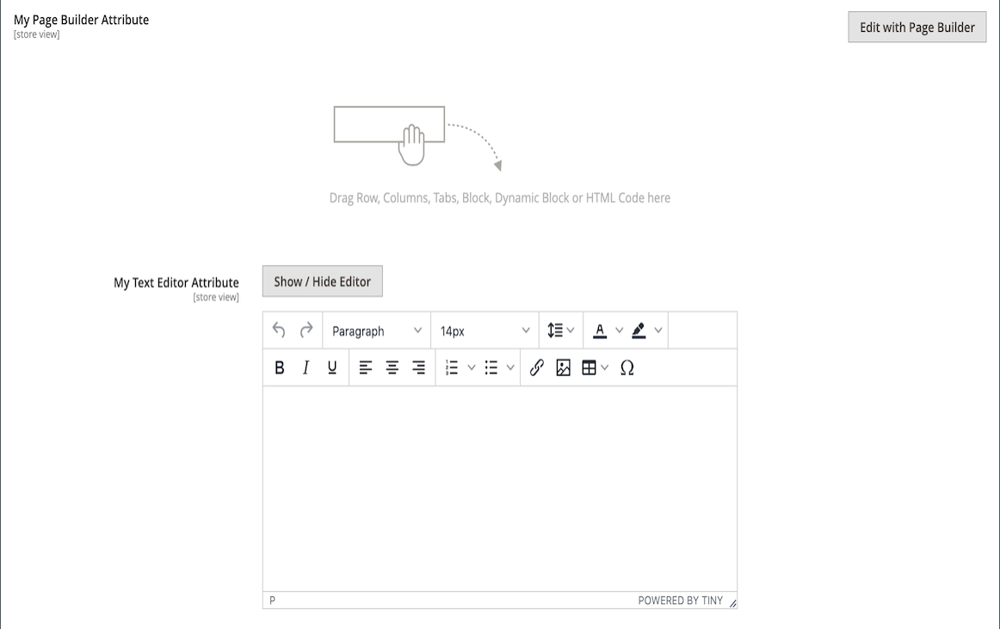

# [!DNL Page Builder] Procedura dettagliata parte 3: contenuto del catalogo

In questo esercizio viene illustrata la semplicità con cui aggiungere un elenco di prodotti a una pagina, personalizzare le pagine di prodotti e creare un attributo personalizzato che aggiunga l&#39;area di lavoro [!DNL Page Builder] a un set di attributi di prodotto.

{width="600" zoomable="yes"}

Questo esercizio presuppone che tu abbia completato [Parte 1: Pagina semplice](1-simple-page.md) e [Parte 2: Blocchi](2-blocks.md), inclusi i prerequisiti e i file di esempio scaricati. Seguire le tre parti di questo esercizio nell&#39;ordine desiderato.

## Parte 1: Aggiungere un elenco di prodotti

[!DNL Page Builder] semplifica l&#39;aggiunta di un elenco di prodotti alla fase. In questo esempio, l’elenco dei prodotti viene aggiunto direttamente a una pagina.

### Passaggio 1: aggiungere un elenco di prodotti alla fase

1. Nella barra laterale _Admin_, passa a **[!UICONTROL Content]** > _[!UICONTROL Elements]_>**[!UICONTROL Pages]**.

1. Trovare la _pagina semplice_ creata nel primo esercizio e modificata nel secondo e selezionare **[!UICONTROL Edit]** nella colonna _[!UICONTROL Action]_.

1. Espandere  nella sezione **[!UICONTROL Content]** e fare clic su **[!UICONTROL Edit with Page Builder]** o all&#39;interno dell&#39;area di anteprima del contenuto.

1. Nel pannello [!DNL Page Builder] sotto _[!UICONTROL Layout]_, trascina un **[!UICONTROL Row]**nella parte superiore dell&#39;area di visualizzazione.

1. Nel pannello [!DNL Page Builder], espandi **[!UICONTROL Add Content]** e trascina un segnaposto **[!UICONTROL Products]** nella nuova riga.

   {width="600" zoomable="yes"}

### Passaggio 2: comporre la condizione

1. Passa il puntatore del mouse sul contenitore prodotti vuoto per visualizzare la casella degli strumenti e scegli l&#39;icona _Impostazioni_ ( {width="20"} ).

   {width="600" zoomable="yes"}

1. Per **[!UICONTROL Select Products By]**, scegliere `Condition`.

1. Aggiungi una condizione:

   - Fai clic sull&#39;icona _Aggiungi_ ().

   - In _[!UICONTROL Product Attribute]_scegliere **[!UICONTROL Category]**.

     {width="600" zoomable="yes"}

   - Completare la parte _[!UICONTROL Category is]..._ della condizione facendo clic sull&#39;icona Altro (...), quindi fare clic sull&#39;icona _Selettore_ ().

     {width="600" zoomable="yes"}

   - Nell&#39;albero delle categorie, espandere la categoria **Donne > Superiori** e selezionare la casella di controllo **Tees**.

     {width="600" zoomable="yes"}

   - Fare clic sull&#39;icona del segno di spunta ().

     L’ID della categoria corrispondente viene visualizzato nel campo per completare la condizione.

### Passaggio 3: completare le impostazioni

1. Immettere **[!UICONTROL Number of Products to Display]**.

   Per impostazione predefinita, nell’elenco vengono visualizzati cinque prodotti.

1. Completare le impostazioni rimanenti in base alle esigenze.

   Se necessario, utilizzare le descrizioni dei campi alla fine della pagina [Aggiungi contenuto - Prodotti](products.md) come riferimento.

1. Al termine, fare clic su **[!UICONTROL Save]** per salvare le impostazioni e tornare all&#39;area di lavoro [!DNL Page Builder].

   {width="600" zoomable="yes"}

1. Nell&#39;angolo superiore destro dell&#39;area di visualizzazione fare clic sull&#39;icona _Chiudi schermo intero_ ( {width="20"} ).

   Facendo clic su questa icona si ritorna alla sezione _[!UICONTROL Content]_per la pagina con l&#39;anteprima visualizzata.

1. Nell&#39;angolo superiore destro fare clic sulla freccia **[!UICONTROL Save]** e scegliere **[!UICONTROL Save & Close]**.

## Parte 2: Personalizzare la pagina del prodotto

>[!NOTE]
>
>Per visualizzare i pulsanti [!UICONTROL Edit with Page Builder] e utilizzare Page Builder, un utente amministratore deve disporre delle autorizzazioni [!UICONTROL Content] per il proprio ambito [ruolo](../systems/permissions-user-roles.md).

In questa parte dell’esercizio imparerai quanto sia facile personalizzare una pagina di prodotto inserendo un video sotto il set di schede nella pagina di prodotto. Il processo per aggiornare il contenuto della [pagina categoria](../catalog/categories-content-settings.md) è sostanzialmente lo stesso.

1. Nella barra laterale _Admin_, passa a **[!UICONTROL Catalog]** > **[!UICONTROL Products]**.

1. Trova un prodotto semplice da utilizzare per questo esempio e aprilo in modalità di modifica.

1. Scorri verso il basso ed espandi il  nella sezione **[!UICONTROL Content]**.

1. Accanto a _[!UICONTROL Description]_, fare clic su **[!UICONTROL Edit with Page Builder]**.

   {width="600" zoomable="yes"}

   Se la descrizione del prodotto è stata immessa in precedenza senza [!DNL Page Builder], la descrizione corrente verrà visualizzata come HTML in un contenitore [Codice HTML](html-code.md). Con il tema Luma, la descrizione del prodotto viene visualizzata nella scheda Dettaglio.

1. Nel pannello [!DNL Page Builder] sotto _[!UICONTROL Layout]_, trascina un **[!UICONTROL Row]**nell&#39;area di visualizzazione, posizionandolo sotto il contenitore di codice HTML.

   Cercate la linea guida rossa da visualizzare quando la riga si trova nella posizione corretta.

   {width="600" zoomable="yes"}

1. Nel pannello [!DNL Page Builder], espandi **[!UICONTROL Media]** e trascina un segnaposto **[!UICONTROL Video]** nella nuova riga.

   {width="600" zoomable="yes"}

1. Passa il puntatore del mouse sul contenitore video vuoto per visualizzare la casella degli strumenti e scegli l&#39;icona _Impostazioni_ ( {width="20"} ).

   {width="500" zoomable="yes"}

1. Immettere **[!UICONTROL Video URL]**.

   Il video può essere ospitato su [YouTube][1] o [Vimeo][2]. Il video di questo esempio è disponibile su YouTube al seguente URL:

   `https://www.youtube.com/watch?v=ZpFrNyD4100`

   {width="500" zoomable="yes"}

1. Immetti **[!UICONTROL Maximum Width]** in pixel per la visualizzazione del video.

   Se si lascia vuota questa opzione, il video riempie lo spazio disponibile.

1. Fare clic su **[!UICONTROL Save]** per salvare le impostazioni e tornare all&#39;area di lavoro [!DNL Page Builder].

   {width="600" zoomable="yes"}

1. Nell&#39;angolo superiore destro dell&#39;area di visualizzazione fare clic sull&#39;icona _Chiudi schermo intero_ ( {width="20"} ).

   Facendo clic su questa icona si ritorna alla sezione _[!UICONTROL Content]_per la pagina con l&#39;anteprima visualizzata.

1. Nell&#39;angolo superiore destro fare clic sulla freccia **[!UICONTROL Save]** e scegliere **[!UICONTROL Save & Close]**.

Nella vetrina, il video viene visualizzato sotto il set di schede. Per visualizzare l’aspetto della pagina su un dispositivo mobile, puoi ridimensionare la finestra.

{width="600" zoomable="yes"}

**Congratulazioni!** Hai completato la seconda parte dell&#39;esercitazione sul contenuto del catalogo. Conserva il lavoro creato, in modo da poterci fare riferimento in un secondo momento.

## Parte 3: Aggiungere attributi personalizzati

Utilizzare l&#39;attributo personalizzato [!DNL Page Builder] per aggiungere un&#39;area di lavoro [!DNL Page Builder] perfettamente funzionante a una pagina di prodotto, che è possibile utilizzare per creare contenuti coinvolgenti. In questa parte dell&#39;esercizio imparerai a creare un attributo personalizzato utilizzando il tipo di input [!DNL Page Builder] e ad applicarlo alle pagine di prodotti del catalogo. Per ulteriori informazioni su questi attributi, vedere [Attributi del prodotto](../catalog/product-attributes.md).

### Passaggio 1: creare un prodotto

Per evitare modifiche al tuo archivio live, crea un prodotto utilizzando le proprietà descritte.

1. Nella barra laterale _Admin_, passa a **[!UICONTROL Catalog]** > **[!UICONTROL Products]**.

1. Nell&#39;angolo superiore destro fare clic su **[!UICONTROL Add Product]**.

1. Crea il prodotto con le seguenti proprietà:

   - 
     [!UICONTROL Attributo Set]: Default
   - [!UICONTROL Product Name]: Il mio prodotto
   - 
     [!UICONTROL SKU]: Tutorial
   - 
     [!UICONTROL Price]: 75.00
   - 
     [!UICONTROL Quantity]: 100
   - [!UICONTROL Stock Status]: In magazzino
   - 
     [!UICONTROL Weight]: 1
   - [!UICONTROL Categories]: Donne > Superiori > Tees

1. Nell&#39;angolo superiore destro fare clic sulla freccia **[!UICONTROL Save]** e scegliere **[!UICONTROL Save & Close]**.

### Passaggio 2: creare attributi personalizzati

In questo passaggio verranno creati due nuovi attributi personalizzati per mostrare come utilizzare i tipi di input [!DNL Page Builder] e Editor di testo.

1. Nella barra laterale _Admin_, passa a **[!UICONTROL Stores]** > _[!UICONTROL Attributes]_>**[!UICONTROL Product]**.

1. Nell&#39;angolo superiore destro fare clic su **[!UICONTROL Add New Attribute]**.

1. Immettere **[!UICONTROL Default Label]** per l&#39;attributo.

   Per questo esempio, utilizzare `My Page Builder Attribute` per l&#39;etichetta.

1. Imposta **[!UICONTROL Catalog Input Type for Store Owner]** su `Page Builder`.

   Durante la creazione di un attributo personalizzato, è possibile specificare l&#39;editor più adatto all&#39;applicazione come `Page Builder` o come standard, WYSIWYG `Text Editor`.

   Tipo di input ![[!DNL Page Builder]](./assets/pb-attribute-page-builder.png){width="600" zoomable="yes"}

1. Espandere  nella sezione **[!UICONTROL Advanced Attribute Properties]** e configurare le impostazioni seguenti:

   - [!UICONTROL Attribute Code]: immettere un codice attributo in caratteri minuscoli, utilizzando i trattini invece degli spazi. Per questo esempio, utilizzare `my_page_builder_attribute`.
   - [!UICONTROL Scope]: accettare il valore predefinito, `Store View`.
   - [!UICONTROL Default Value]: immettere un valore predefinito per l&#39;attributo.
   - 
     [!UICONTROL Unique Value]: `No`
   - 
     [!UICONTROL Add to Column Options]: `No`
   - 
     [!UICONTROL Use in Filter Options]: `Yes`

1. Nel pannello _[!UICONTROL Attribute Information]_a sinistra, scegli **[!UICONTROL Storefront Properties]**e apporta le seguenti impostazioni:

   - 
     [!UICONTROL Use for Promo Rule Conditions]: `Yes`
   - 
     [!UICONTROL Visible on Catalog Pages on Storefront]: `Yes`
   - 
     [!UICONTROL Used in Product Listing]: `Yes`

1. Al termine, fare clic su **[!UICONTROL Save Attribute]**.

1. Ripeti i passaggi precedenti per creare un secondo attributo con le stesse proprietà di base, ma con il tipo di input Editor di testo come segue:

   - [!UICONTROL Default Label]: attributo Editor di testo personale
   - [!UICONTROL Catalog Input Type for Store Owner]: Editor di testo
   - 
     [!UICONTROL Attributo Code]: `my_text_editor_attribute`

### Passaggio 3: aggiornare la serie di attributi del prodotto

1. Nella barra laterale _Admin_, passa a **[!UICONTROL Stores]** > _[!UICONTROL Attributes]_>**[!UICONTROL Attribute Set]**.

   In questo esempio i nuovi attributi vengono aggiunti temporaneamente al set di attributi `default`. Al termine di questo esercizio, rimuovi gli attributi dal set di attributi, in modo da non influire sul catalogo.

   >[!NOTE]
   >
   >Se non desideri modificare il tuo archivio live, puoi procedere senza aggiornare il set di attributi.

1. Trovare l&#39;attributo _[!UICONTROL Default]_impostato nell&#39;elenco e fare doppio clic per aprirlo in modalità di modifica.

1. Nell&#39;elenco _Attributi non assegnati_, individuare i nuovi attributi creati e trascinarli nella colonna _[!UICONTROL Groups]_, in **[!UICONTROL Content]**.

   La posizione dell&#39;attributo nella colonna [!UICONTROL Groups] determina la posizione in cui viene visualizzato nella pagina.

   {width="600" zoomable="yes"}

1. Fare clic su **[!UICONTROL Save]** per tornare all&#39;elenco Set di attributi.

1. Quando richiesto, fare clic sul collegamento **[!UICONTROL Cache Management]** nella parte superiore della pagina e aggiornare eventuali cache non valide.

### Passaggio 4: Aggiornare il prodotto

1. Nella barra laterale _Admin_, passa a **[!UICONTROL Catalog]** > **[!UICONTROL Products]**.

1. Nella griglia Prodotti, individua _Il mio prodotto_ e aprilo in modalità di modifica.

1. Scorri verso il basso ed espandi il  nella sezione **[!UICONTROL Content]**.

   Nella parte superiore della sezione sono disponibili due attributi standard per il contenuto del prodotto:

   - _Descrizione breve_, che utilizza l&#39;editor [standard](../content-design/editor.md) di WYSIWYG.
   - _Descrizione_, che visualizza l&#39;anteprima di [!DNL Page Builder].

   {width="600" zoomable="yes"}

   Mentre scorri verso la metà inferiore della sezione, sono presenti i due attributi creati e assegnati:

   - _Il mio attributo [!DNL Page Builder]_, che visualizza l&#39;anteprima di [!DNL Page Builder].
   - _Attributo editor testo_, che utilizza l&#39;editor standard di WYSIWYG.

   {width="600" zoomable="yes"}

1. Nell&#39;editor **Attributo editor testo** immettere `Text Editor Attribute placeholder text`.

   - Nell&#39;angolo superiore destro fare clic sulla freccia **[!UICONTROL Save]** e scegliere **[!UICONTROL Save & Close]**.

1. Per **Attributo My Page Builder**, fare clic su **[!UICONTROL Edit with Page Builder]** e aggiungere il testo della descrizione:

   - Nel pannello [!DNL Page Builder], espandi **[!UICONTROL Elements]** e trascina un **[!UICONTROL Text object]** nell&#39;area di visualizzazione.

   - Immettere `Page Builder attribute placeholder text`.

   - Nell&#39;angolo superiore destro dell&#39;area di visualizzazione fare clic sull&#39;icona _Chiudi schermo intero_ ( {width="20"} ).

     {width="600" zoomable="yes"}

1. Scorrere fino a **[!UICONTROL Description]**, fare clic su **[!UICONTROL Edit with Page Builder]** e aggiungere il testo desiderato utilizzando lo stesso metodo del passaggio precedente.

1. Nell&#39;angolo superiore destro della pagina del prodotto fare clic sulla freccia **[!UICONTROL Save]** e scegliere **[!UICONTROL Save & Close]**.

1. Se richiesto, fare clic sul collegamento **[!UICONTROL Cache Management]** nel messaggio nella parte superiore della pagina e aggiornare eventuali cache non valide.

### Passaggio 5: visualizzare il risultato

1. Vai alla pagina del prodotto di esempio nella vetrina.

   In questo esempio, il prodotto si trova nella navigazione superiore in Donne > Cime > Tees.

1. Scorri verso il basso fino alle informazioni dell&#39;_Attributo My Page Builder_.

   La posizione degli attributi sulla pagina del prodotto è determinata dal tema. Nel tema Luma, i nuovi attributi si trovano subito dopo la descrizione del prodotto.

   Attributi ![[!DNL Page Builder] ed editor di testo nella vetrina](./assets/pb-storefront-product-attribute.png){width="600" zoomable="yes"}

Hai completato l&#39;esercizio [!DNL Page Builder] sul contenuto del catalogo. Conserva il lavoro creato, in modo da poterci fare riferimento in un secondo momento.

[1]: https://www.youtube.com/
[2]: https://vimeo.com/
