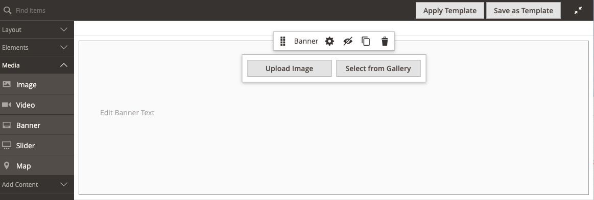
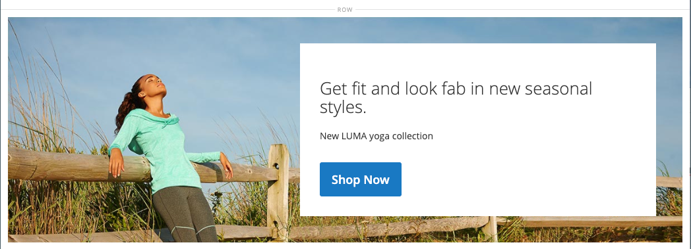

# Media - Banner

Utilizza il tipo di contenuto _Banner_ per aggiungere un componente illustrato e interattivo che coinvolge gli utenti con un invito all&#39;azione e un pulsante nella [[!DNL Page Builder] fase](workspace.md#stage).

>[!NOTE]
>
>Precedentemente l&#39;opzione _Banner_ nel menu Contenuto era [Blocco dinamico](../content-design/dynamic-blocks.md).

{width="700" zoomable="yes"}

{{$include /help/_includes/page-builder-save-timeout.md}}

## Casella degli strumenti banner

La casella degli strumenti del banner viene visualizzata quando si passa il puntatore sul contenitore del banner.

{width="600" zoomable="yes"}

| Strumento | Icona | Descrizione |
|--- |--- |--- |
| Sposta | {width="25"} | Sposta il banner in un&#39;altra posizione sullo stage. |
| (etichetta) | Banner | Identifica il contenitore di contenuto corrente come banner. Passa il cursore del mouse sul contenitore per visualizzare la casella degli strumenti. |
| Impostazioni | {width="25"} | Apre la pagina Modifica banner, in cui è possibile modificare le proprietà del banner e del contenitore. |
| Nascondi | {width="25"} | Nasconde il banner corrente. |
| Spettacolo | {width="25"} | Mostra il banner nascosto. |
| Duplica | {width="25"} | Crea una copia del banner. |
| Rimuovi | {width="25"} | Elimina il banner dalla fase. |
| [!UICONTROL Upload New Image] |  | Carica un&#39;immagine dal file system locale nella raccolta per lo sfondo del banner. |
| [!UICONTROL Select from Gallery] |  | Utilizza un&#39;immagine esistente della raccolta per lo sfondo del banner. |

{style="table-layout:auto"}

{{$include /help/_includes/page-builder-hidden-element-note.md}}

## Aggiungi un banner

1. Nel pannello [!DNL Page Builder], espandere **[!UICONTROL Media]** e trascinare un segnaposto **[!UICONTROL Banner]** nell&#39;area di visualizzazione.

   {width="600" zoomable="yes"}

   I pulsanti _[!UICONTROL Upload Image]_e_[!UICONTROL Select from Gallery]_ sono inclusi per consentire modifiche rapide al contenuto del banner direttamente dall&#39;area di visualizzazione. È inoltre possibile modificare il contenuto della pagina _[!UICONTROL Edit Banner]_.

1. Fai clic sul segnaposto del banner per visualizzare l&#39;[editor di testo](../content-design/editor.md) e immettere il contenuto per il banner.

   È inoltre possibile includere contenuto banner più complesso utilizzando le impostazioni [Contenuto](#content).

## Modificare le impostazioni del banner

1. Passa il puntatore del mouse sul contenitore del banner per visualizzare la casella degli strumenti e scegli l&#39;icona _Impostazioni_ ().

1. Utilizzare le sezioni seguenti per informazioni dettagliate sull&#39;aggiornamento delle impostazioni disponibili:

   - [[!UICONTROL Appearance]](#appearance)
   - [[!UICONTROL Content]](#content)
   - [[!UICONTROL Background]](#background)
   - [[!UICONTROL Advanced]](#advanced)

1. Al termine, fare clic su **[!UICONTROL Save]** nell&#39;angolo superiore destro per chiudere la pagina _[!UICONTROL Edit Banner]_.

1. Nell&#39;angolo superiore destro fare clic su **[!UICONTROL Save]** per applicare le impostazioni e tornare all&#39;area di lavoro [!DNL Page Builder].

## [!UICONTROL Appearance]

I banner sono facili da configurare e mantenere, poiché si basano su uno dei quattro modelli predefiniti.

- Scegliete uno dei seguenti tipi di posizionamento del banner:

  | Posizionamento | Descrizione |
  | --------- | ----------- |
  | [!UICONTROL Poster] | Centra contenuto e pulsante sul banner. Se utilizzata, la sovrapposizione estende l&#39;intera larghezza del banner. |
  | [!UICONTROL Collage Left] | Inserisce il contenuto e il pulsante in un&#39;area definita sul lato sinistro del banner. La sovrapposizione, se utilizzata, copre solo l&#39;area definita. |
  | [!UICONTROL Collage Center] | Posiziona il contenuto e il pulsante in un&#39;area definita centrata sul banner. La sovrapposizione, se utilizzata, copre solo l&#39;area definita. |
  | [!UICONTROL Collage Right] | Inserisce il contenuto e il pulsante in un&#39;area definita sul lato destro del banner. La sovrapposizione, se utilizzata, copre solo l&#39;area definita. |

  {style="table-layout:auto"}

  {width="600" zoomable="yes"}

- (Facoltativo) Immettere **[!UICONTROL Minimum Height]** per la riga.

  L&#39;altezza minima può essere un numero con qualsiasi unità CSS valida (come `100px`, `50%`, `50em`, `100vh`) o un calcolo (come `100vh - 237px`).

  Ad esempio, puoi impostare l’altezza minima di un banner in modo da estendere l’intera altezza della pagina, fornendo opzioni interessanti per immagini e video di sfondo a pagina intera.

## [!UICONTROL Background]

Sono disponibili molte opzioni per definire la visualizzazione di sfondo di un banner. Potete applicare un colore semplice o un&#39;immagine di sfondo e gestire effetti più sofisticati.

### [!UICONTROL Background Color]

Specificate il colore di sfondo scegliendo un campione, facendo clic sul selettore del colore o immettendo un nome di colore valido o un valore esadecimale equivalente. Questa impostazione determina il colore di sfondo della riga. Potete anche regolare l&#39;opacità del colore.

{width="200"}

È possibile impostare il valore in uno dei tre modi seguenti:

- Un nome di colore predefinito, ad esempio `White`
- Valore esadecimale del colore, ad esempio `#ffffff`
- Il valore rgba del colore, con percentuale di opacità, ad esempio `rgba(255, 255, 255, 0.75)`

Per scegliere un colore, fare clic sul campione a sinistra della casella _Nessun colore_.

{width="600" zoomable="yes"}

Se fate clic sulla casella del colore per aprire nuovamente il selettore colore, la casella sotto il cursore mostra i valori correnti di rosso, verde, blu e alfa (rgba). L&#39;ultimo numero indica la percentuale di opacità corrente come valore decimale. È possibile utilizzare il dispositivo di scorrimento per regolare l&#39;opacità o immettere il valore decimale desiderato.

{width="600" zoomable="yes"}

>[!NOTE]
>
>[!DNL Page Builder] supporta anche un livello di trasparenza, o _canale alfa_, nelle immagini di sfondo che possono essere utilizzate per creare sfondi con diversi gradi di opacità.

### [!UICONTROL Background Type]

Un tipo di sfondo può essere un&#39;immagine o un video. [!DNL Page Builder] utilizza `Image` per impostazione predefinita e mostra varie impostazioni immagine. Se si seleziona `Video`, [!DNL Page Builder] scambia le impostazioni dell&#39;immagine con le impostazioni video. Entrambe le impostazioni del tipo di sfondo sono descritte nelle sezioni seguenti.

{width="200"}

### Impostazioni del tipo di immagine

Se si imposta il _Tipo di sfondo_ su `Image`, utilizzare le impostazioni seguenti per definire la visualizzazione dell&#39;immagine di sfondo.

{width="600" zoomable="yes"}

- **[!UICONTROL Background Image]** - Se necessario, utilizzare gli strumenti forniti per scegliere un&#39;immagine di sfondo da applicare al banner:

  | Strumento | Descrizione |
  | ---- | ----------- |
  | [!UICONTROL Upload] | Carica un file di immagine dal computer locale alla raccolta e lo applica come immagine di sfondo del banner. |
  | [!UICONTROL Select from Gallery] | Richiede di scegliere un&#39;immagine esistente dalla raccolta come immagine di sfondo per il banner. |
  | {width="25"} | Consente di trascinare l&#39;immagine nella sezione della fotocamera o di spostarsi sull&#39;immagine nel file system locale. |

  {style="table-layout:auto"}

- **[!UICONTROL Background Mobile Image]** - Se necessario, utilizzare gli stessi strumenti per scegliere un&#39;immagine di sfondo diversa da utilizzare per la visualizzazione sui dispositivi mobili.

- **[!UICONTROL Background Size]** - Impostare questa opzione per determinare il ridimensionamento dell&#39;immagine di sfondo in relazione alla larghezza del banner:

  | Opzione | Descrizione |
  | ------ | ----------- |
  | `Cover` | L&#39;immagine di sfondo copre l&#39;intera larghezza del banner. |
  | `Contain` | L&#39;immagine di sfondo è limitata alla larghezza dell&#39;area dei contenuti. |
  | `Auto` | Applica le dimensioni dal foglio di stile corrente. |

  {style="table-layout:auto"}

  {width="200"}

- **[!UICONTROL Background Position]** - Impostare questa opzione per determinare il modo in cui l&#39;immagine di sfondo viene ancorata in relazione al banner:

  | Ancoraggio | Posizioni |
  | ------ | ----------- |
  | `Top` | Sinistra/Centro/Destra |
  | `Center` | Sinistra/Centro/Destra |
  | `Bottom` | Sinistra/Centro/Destra |

  {style="table-layout:auto"}

  Il punto di ancoraggio è simile a una spina che collega l&#39;immagine al banner nella posizione di sfondo specificata.

- **[!UICONTROL Background Attachment]** - Impostare il tipo di allegato per determinare la modalità di spostamento dell&#39;immagine di sfondo in relazione alla pagina di scorrimento:

  | Opzione | Descrizione |
  | ------ | ----------- |
  | `Scroll` | L&#39;immagine di sfondo collegata viene sincronizzata per spostarsi verso il basso durante lo scorrimento della pagina. |
  | `Fixed` | (Non disponibile per dispositivi mobili) L’immagine di sfondo non si sposta quando il contenitore scorre sopra l’immagine ed è fisso nella posizione di sfondo specificata. |

  {style="table-layout:auto"}

- **[!UICONTROL Background Repeat]** - Se si desidera ripetere l&#39;immagine di sfondo per riempire lo spazio, modificare questa impostazione `Yes`.

### Impostazioni del tipo di video

Se si imposta _[!UICONTROL Background Type]_su `Video`, utilizzare le impostazioni seguenti per definire la visualizzazione dell&#39;immagine di sfondo.

- **[!UICONTROL Video URL]** - Immettere un URL video valido. Gli URL video validi possono essere collegamenti a:

   - Video su YouTube: `https://youtu.be/CoDhMRUUjeI`
   - Video su Vimeo: `https://vimeo.com/190156113`
   - File video validi (`.mp4` è consigliato): `https://myvideos.com/spiral.mp4`

  {width="200"}

- **[!UICONTROL Overlay Color]** - Selezionare un colore per applicare una tinta trasparente al video.

- **[!UICONTROL Infinite Loop]** - Imposta su `No` per riprodurre il video una volta e arrestarlo. Quando è impostato su `Yes` (impostazione predefinita), il video si ripete in un ciclo infinito.

- **[!UICONTROL Lazy Load]** - Imposta su `No` per caricare il video con la pagina, anche quando non è visibile. Se è impostato su `Yes` (impostazione predefinita), il video viene caricato dall&#39;origine solo se visibile sullo schermo.

- **[!UICONTROL Play Only When Visible]** - Impostare su `No` per avviare la riproduzione del video subito dopo il caricamento, indipendentemente dal fatto che sia visibile o meno. Se è impostato su `Yes` (impostazione predefinita), la riproduzione del video inizia solo quando è visibile.

- **[!UICONTROL Fallback Image]** - Se necessario, specificare un&#39;immagine da visualizzare sullo schermo prima del caricamento del video e se il video non viene caricato per qualche motivo.

## [!UICONTROL Content]

È possibile modificare il contenuto del banner direttamente sullo stage o quando si modificano le impostazioni. Le impostazioni offrono funzioni di contenuto più complesse, ad esempio collegamenti e pulsanti dei banner e sovrapposizioni. La posizione del contenuto riflette l&#39;impostazione di posizionamento [Aspetto](#appearance).

### Contenuto semplice sull’area di visualizzazione

1. Fare clic sul testo segnaposto e immettere il testo che si desidera visualizzare sul banner.

   La barra degli strumenti dell&#39;editor viene visualizzata sopra la casella di testo.

   {width="600" zoomable="yes"}

1. Utilizza la barra degli strumenti dell’editor per immettere e formattare il testo, nonché per inserire elementi quali collegamenti, immagini e widget.

   {width="600" zoomable="yes"}

### Contenuto complesso nelle impostazioni

1. Passa il puntatore del mouse sul contenitore del banner per visualizzare la casella degli strumenti e scegli l&#39;icona _Impostazioni_ ( {width="25"} ).

1. Scorri verso il basso fino alla sezione _[!UICONTROL Content]_e utilizza l&#39;editor **[!UICONTROL Message Text]**per immettere e formattare il testo del banner.

   È inoltre possibile inserire elementi quali collegamenti di testo, immagini e widget.

   {width="600" zoomable="yes"}

1. Se necessario, specificare **[!UICONTROL Link]** per il banner.

   Il collegamento è la pagina di destinazione visualizzata quando il cliente fa clic sul pulsante o sull&#39;area del banner. Puoi utilizzare uno dei tre tipi di collegamento seguenti:

   - **[!UICONTROL URL]** - Collegamenti a un URL relativo o completo.
   - **[!UICONTROL Product]** - Identifica la pagina di destinazione in base al nome del prodotto o allo SKU. Cerca il prodotto per nome in base a un nome parziale o completo. Scegli il prodotto dall’elenco dei risultati della ricerca.
   - **[!UICONTROL Category]** - Identifica la pagina di destinazione come categoria o sottocategoria specifica nella struttura delle categorie. Cerca la categoria in base a un nome parziale o completo. Scegliete la categoria dalla sezione espansa della struttura visualizzata.
   - **[!UICONTROL Page]** - Identifica la pagina di destinazione come pagina di contenuto specifica. Cerca la pagina in base a un nome parziale o completo. Scegliere la pagina dall&#39;elenco dei risultati di ricerca.

   >[!NOTE]
   >
   >A partire dalla versione 2.4.1, [!DNL Page Builder] non supporta più il collegamento del banner e dei collegamenti all&#39;interno del testo nidificato a causa di problemi di visualizzazione nella vetrina. Se si utilizza un collegamento in _[!UICONTROL Message Text]_, non è possibile configurare l&#39;opzione_[!UICONTROL Link]_. Se si preferisce utilizzare un solo collegamento per l&#39;intero banner, è possibile rimuovere tutti i collegamenti dal testo. 
   >
   >{width="200"}

1. Se necessario, aggiungi un pulsante per richiedere ai clienti di seguire il collegamento.

   L&#39;impostazione Aspetto banner posiziona un singolo collegamento o pulsante sotto il testo. Completa le proprietà del collegamento o del pulsante che desideri aggiungere.

   {width="600" zoomable="yes"}

   >[!NOTE]
   >
   >È inoltre possibile utilizzare più pulsanti o collegamenti aggiungendo un [blocco](block.md) al banner. Per evitare conflitti, mantenere tutti i collegamenti o i pulsanti nel blocco separato e non aggiungere un collegamento o un pulsante direttamente al banner.

   - Imposta **[!UICONTROL Show Button]** su uno dei seguenti:

     | Opzione | Descrizione |
     | ------ | ----------- |
     | `Always` | Sul banner viene sempre visualizzato un pulsante. |
     | `On Hover` | Sul banner compare un pulsante solo al passaggio del mouse. |
     | `Never Show` | Sul banner non viene mai visualizzato un pulsante. |

     {style="table-layout:auto"}

   - Immetti **[!UICONTROL Button Text]** da visualizzare sul pulsante.

   - Imposta **[!UICONTROL Button Type]** su uno dei seguenti:

     | Opzione | Descrizione |
     | ------ | ----------- |
     | `Primary` | Applica lo stile del pulsante principale dal foglio di stile corrente. |
     | `Secondary` | Applica lo stile del pulsante secondario dal foglio di stile corrente, se applicabile. |
     | `Link` | Crea un collegamento ipertestuale anziché un pulsante. |

     {style="table-layout:auto"}

     Lo stile del pulsante del tema corrente determina il formato del pulsante. In genere, un pulsante principale ha un colore di sfondo più prominente rispetto a un pulsante secondario.

1. Imposta **[!UICONTROL Show Overlay]** su uno dei seguenti:

   | Opzione | Descrizione |
   | ------ | ----------- |
   | `Always` | La sovrapposizione è sempre visibile. |
   | `On Hover` | La sovrapposizione viene visualizzata solo al passaggio del mouse. |
   | `Never Show` | La sovrapposizione non è visibile. |

   {style="table-layout:auto"}

   È possibile utilizzare una sovrapposizione per applicare un colore di sfondo all&#39;area di contenuto attiva definita dall&#39;impostazione [!UICONTROL Appearance]. L&#39;immagine di sfondo del banner rimane visibile per l&#39;intera larghezza del banner.

   Se scegli di mostrare una sovrapposizione, imposta **[!UICONTROL Overlay Color]**:

   - Fare clic sul campione **Nessun colore** e scegliere un campione.
   - Nel campo **Nessun colore** immettere un nome di colore valido o un valore esadecimale.

   {width="600" zoomable="yes"}

1. Nell&#39;angolo superiore destro fare clic su **[!UICONTROL Save]** per applicare le impostazioni e tornare all&#39;area di lavoro [!DNL Page Builder].

   {width="600" zoomable="yes"}

## [!UICONTROL Search Engine Optimization] {#seo}

Il testo di queste impostazioni è visibile ai motori di ricerca e migliora l’indicizzazione della pagina.

- Per **[!UICONTROL Alternative Text]**, immettere una descrizione di testo _alt_ per gli strumenti di Accesso facilitato digitale da visualizzare.

  L’utilizzo di testo alternativo è una best practice in materia di accessibilità ed è richiesto per legge in alcune lingue. In HTML, l&#39;attributo `alt` è un sottoinsieme del tag `image`: `<image title="tooltip" alt="description" src="image.jpg">`.

- Per **[!UICONTROL Title Attribute]**, immettere il testo da visualizzare come descrizione al passaggio del mouse.

  Come best practice, scegli un titolo descrittivo ricco di parole chiave per migliorare il modo in cui l’immagine viene indicizzata dai motori di ricerca. In HTML, l&#39;attributo `title` è un sottoinsieme del tag `image`: `<image title="tooltip" alt="description" src="image.jpg">`.

## [!UICONTROL Advanced]

1. Per controllare il posizionamento orizzontale dei contenitori di contenuto aggiunti al banner, scegliere un **[!UICONTROL Alignment]**:

   | Opzione | Descrizione |
   | ------ | ----------- |
   | `Default` | Applica l&#39;impostazione predefinita di allineamento specificata nel foglio di stile del tema corrente. |
   | `Left` | Allinea i contenitori di contenuto lungo il bordo sinistro del contenitore del banner, tenendo conto della spaziatura specificata. |
   | `Center` | Allinea il contenitore di contenuto al centro del contenitore del banner, tenendo conto di eventuali spaziature specificate. |
   | `Right` | Allinea il contenitore di contenuto al bordo destro del contenitore del banner, tenendo conto di eventuali spaziature specificate. |

   {style="table-layout:auto"}

1. Imposta lo stile **[!UICONTROL Border]** applicato a tutti e quattro i lati del contenitore del banner:

   | Opzione | Descrizione |
   | ------ | ----------- |
   | `Default` | Applica lo stile di bordo predefinito specificato dal foglio di stile associato. |
   | `None` | Non fornisce alcuna indicazione visibile dei bordi del contenitore. |
   | `Dotted` | Il bordo del contenitore viene visualizzato come una linea tratteggiata. |
   | `Dashed` | Il bordo del contenitore viene visualizzato come una linea tratteggiata. |
   | `Solid` | Il bordo del contenitore viene visualizzato come linea continua. |
   | `Double` | Il bordo del contenitore viene visualizzato come una doppia riga. |
   | `Groove` | Il bordo del contenitore viene visualizzato come una linea scanalata. |
   | `Ridge` | Il bordo del contenitore viene visualizzato come una linea scanalata. |
   | `Inset` | Il bordo del contenitore viene visualizzato come una linea interna. |
   | `Outset` | Il bordo del contenitore viene visualizzato come una linea di contorno. |

   {style="table-layout:auto"}

1. Se si imposta uno stile di bordo diverso da `None`, completare le opzioni di visualizzazione del bordo:

   - **[!UICONTROL Border Color]** - Specificare il colore scegliendo un campione, facendo clic sul selettore del colore o immettendo un nome di colore valido o un valore esadecimale equivalente.

     {width="600" zoomable="yes"}

   - **[!UICONTROL Border Width]** - Immettere il numero di pixel per lo spessore della linea del bordo.

   - **[!UICONTROL Border Radius]** - Immettere il numero di pixel per definire la dimensione del raggio utilizzato per arrotondare ogni angolo del bordo.

1. (Facoltativo) Specificare i nomi di **[!UICONTROL CSS classes]** dal foglio di stile corrente da applicare al contenitore del banner.

   Separare più nomi di classe con uno spazio.

1. Immettere i valori in pixel per **[!UICONTROL Margins and Padding]** per specificare i margini esterni e la spaziatura interna del banner.

   Immettere ogni valore corrispondente nel diagramma contenitore banner.

   | Opzione | Descrizione |
   | ------ | ----------- |
   | [!UICONTROL Margins] | Quantità di spazio vuoto applicata al bordo esterno di tutti i lati del contenitore. |
   | [!UICONTROL Padding] | Quantità di spazio vuoto applicata al bordo interno di tutti i lati del contenitore. |

   {style="table-layout:auto"}
