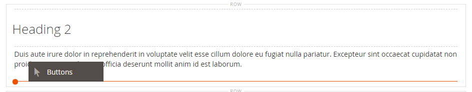
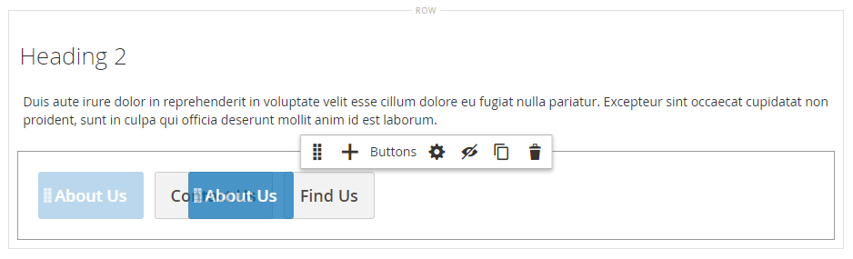

# Elementi - Pulsanti

Utilizza il tipo di contenuto _Pulsanti_ per aggiungere un singolo pulsante o un set di pulsanti nella [[!DNL Page Builder] fase](workspace.md#stage). È possibile disporre i pulsanti orizzontalmente o verticalmente e aggiungerli direttamente a righe, colonne, schede e banner sullo stage.

{width="600" zoomable="yes"}

{{$include /help/_includes/page-builder-save-timeout.md}}

## Caselle degli strumenti

Quando si utilizza il tipo di contenuto Pulsanti, è possibile aggiungere e modificare singoli pulsanti e il relativo contenitore che contiene uno o più pulsanti. Ciascuno di essi dispone di una propria casella degli strumenti che è possibile utilizzare per progettare i pulsanti nella fase [!DNL Page Builder].

### Casella degli strumenti pulsante singolo

{width="500" zoomable="yes"}

| Strumento | Icona | Descrizione |
| --------- | -------- | -------------- |
| Impostazioni | {width="25"} | Apre la pagina Modifica pulsante, in cui è possibile modificare le proprietà del pulsante. |
| Duplica | {width="25"} | Crea una copia del pulsante. |
| Rimuovi | {width="25"} | Elimina il pulsante dall&#39;area di visualizzazione. |

{style="table-layout:auto"}

### Casella degli strumenti contenitore pulsanti

{width="500" zoomable="yes"}

| Strumento | Icona | Descrizione |
| --------- | ----------------- | ----------- |
| Sposta | {width="25"} | Sposta il contenitore del pulsante in un&#39;altra posizione valida nella pagina. |
| Aggiungi | {width="25"} | Aggiunge un pulsante al contenitore. |
| (etichetta) | Pulsante | Identifica il contenitore corrente come elemento pulsante. |
| Impostazioni | {width="25"} | Apre la pagina Modifica pulsanti, in cui è possibile modificare le proprietà del contenitore. |
| Nascondi | {width="25"} | Nasconde il contenitore del pulsante. |
| Spettacolo | {width="25"} | Mostra il contenitore del pulsante nascosto. |
| Duplica | {width="25"} | Crea una copia del contenitore del pulsante. |
| Rimuovi | {width="25"} | Elimina dall’area di visualizzazione il contenitore del pulsante e il relativo contenuto. |

{style="table-layout:auto"}

{{$include /help/_includes/page-builder-hidden-element-note.md}}

## Aggiungi un singolo pulsante

1. Nel pannello [!DNL Page Builder], espandi **[!UICONTROL Elements]** e trascina un segnaposto **[!UICONTROL Buttons]** in una riga, colonna o set di schede sull&#39;area di visualizzazione.

   {width="500" zoomable="yes"}

1. Passa il puntatore del mouse sul pulsante per visualizzare la casella degli strumenti e scegli l&#39;icona _Impostazioni_ ().

1. Immettere **[!UICONTROL Button Text]** da visualizzare sul pulsante.

   {width="600" zoomable="yes"}

1. Imposta **[!UICONTROL Button Type]** su uno dei seguenti:

   | Tipo | Descrizione |
   | ------ | ----------- |
   | `Primary` | Applica lo stile del pulsante principale dal foglio di stile corrente. |
   | `Secondary` | Applica lo stile del pulsante secondario dal foglio di stile corrente, se applicabile. |
   | `Link` | Crea un collegamento ipertestuale anziché un pulsante. |

   {style="table-layout:auto"}

   {width="500" zoomable="yes"}

1. Impostare **[!UICONTROL Button Link]** utilizzando uno dei tipi seguenti:

   - **[!UICONTROL URL]** - Immettere l&#39;URL di destinazione del collegamento.

     L’URL può essere un collegamento relativo a un prodotto o a una pagina del tuo store, oppure un URL completo.

     Esempio di URL relativo - `../luma-analog-watch.html`

     Esempio di URL completo - `http://mystore.com/luma-analog-watch.html`

     Se il collegamento consente di accedere a un sito Web diverso, è possibile mantenere aperta la pagina corrente del negozio aprendo il collegamento in una nuova scheda del browser.

     Per impedire al visitatore di uscire dal tuo archivio, seleziona la casella di controllo **[!UICONTROL Open in new tab]**.

   - **[!UICONTROL Product]** - Immettere un nome di prodotto (parziale o completo) o uno SKU, quindi scegliere il nome del prodotto nell&#39;elenco.

     >[!NOTE]
     >
     >I prodotti vengono visualizzati nell&#39;elenco in base alle impostazioni di _Mostra prodotti esauriti_. Per gli esercenti Multi Source che utilizzano [Inventory management](../inventory-management/introduction.md), l&#39;elenco dei prodotti è limitato dall&#39;origine assegnata solo al sito Web predefinito.

     {width="600" zoomable="yes"}

   - **[!UICONTROL Category]** - Immettere un nome di categoria (parziale o completo) oppure fare clic nel campo vuoto per visualizzare la struttura delle categorie. Quindi, scegli il nome della categoria nella struttura.

     {width="600" zoomable="yes"}

   - **[!UICONTROL Page]** - Immettere il nome di una pagina CMS (parziale o completa) oppure fare clic nel campo vuoto per visualizzare l&#39;elenco completo. Scegliere quindi il nome della pagina nell&#39;elenco dei risultati della ricerca.

     {width="600" zoomable="yes"}

1. Completa le [impostazioni avanzate][advanced-settings] in base alle esigenze.

1. Al termine, fare clic su **[!UICONTROL Save]** nell&#39;angolo superiore destro per applicare le impostazioni e tornare all&#39;area di lavoro [!DNL Page Builder].

## Aggiungi un set di pulsanti

Nelle sezioni seguenti viene descritta una serie di passaggi per iniziare con un singolo pulsante e creare un set di tre pulsanti all&#39;interno di un contenitore. Se non si dispone già di un singolo pulsante, seguire le istruzioni precedenti per aggiungere un singolo pulsante all&#39;area di visualizzazione.

### Passaggio 1: creare il secondo pulsante

1. Passa il puntatore del mouse sul contenitore del pulsante per visualizzare la casella degli strumenti e scegli l&#39;icona _Aggiungi_ ( {width="20"} ).

   {width="500" zoomable="yes"}

1. Immettere il testo da visualizzare sul secondo pulsante.

1. Fai clic sul nuovo pulsante per visualizzare la casella degli strumenti e scegli l&#39;icona _Impostazioni_ ( {width="20"} ).

   {width="500" zoomable="yes"}

1. Imposta **[!UICONTROL Button Type]** su `Secondary`.

1. Configura **[!UICONTROL Button Link]** come necessario.

   Nell&#39;esempio seguente, il collegamento è un URL relativo che va alla pagina [Contattaci](../getting-started/store-details.md#contact-us-form).

   {width="600" zoomable="yes"}

1. Completa le [impostazioni avanzate][advanced-settings] in base alle esigenze.

1. Al termine, fare clic su **[!UICONTROL Save]** per applicare le impostazioni e tornare all&#39;area di lavoro [!DNL Page Builder].

### Passaggio 2: creare il terzo pulsante

1. Fai nuovamente clic sul secondo pulsante sullo stage e scegli l&#39;icona _Duplica_ ( {width="20"} ).

   {width="500" zoomable="yes"}

1. Immettere il testo da visualizzare sul terzo pulsante.

1. Fai clic sul terzo pulsante per visualizzare la casella degli strumenti e scegli l&#39;icona _Impostazioni_ ( {width="20"} ).

   {width="500" zoomable="yes"}

1. Aggiorna **[!UICONTROL Button Link]** in base alle esigenze.

1. Nell&#39;angolo superiore destro fare clic su **[!UICONTROL Save]** per applicare le impostazioni e tornare all&#39;area di lavoro [!DNL Page Builder].

### Passaggio 3: aggiornare il contenitore del pulsante

1. Passa il puntatore del mouse sul contenitore del pulsante per visualizzare la casella degli strumenti e scegli l&#39;icona _Impostazioni_ ( {width="20"} ).

   {width="500" zoomable="yes"}

1. In _[!UICONTROL Appearance]_scegliere **[!UICONTROL Stacked]**.

1. Imposta **[!UICONTROL All Buttons are same size]** su `Yes`.

   {width="300"}

1. Aggiornare le impostazioni rimanenti in base alle esigenze, utilizzando le descrizioni di [Modificare le impostazioni per un contenitore di pulsanti][button-container].

1. Al termine, fare clic su **[!UICONTROL Save]** per applicare le impostazioni e tornare all&#39;area di lavoro [!DNL Page Builder].

   Il set completo di pulsanti in pila viene visualizzato sullo stage, con un pulsante principale e due pulsanti secondari.

   {width="500" zoomable="yes"}

## Spostare un pulsante

1. Fare clic sul pulsante da spostare.

1. Selezionare e trascinare l&#39;icona Sposta ( {width="20"} ), visualizzata immediatamente prima del testo del pulsante, in una nuova posizione per il pulsante all&#39;interno del relativo contenitore.

   {width="500" zoomable="yes"}

## Modificare le impostazioni di un pulsante

1. Fai clic sul pulsante sull&#39;area di visualizzazione per visualizzare la casella degli strumenti e scegli l&#39;icona _Impostazioni_ ( {width="20"} ).

   {width="500" zoomable="yes"}

1. Se necessario, aggiorna le impostazioni standard.

   - **[!UICONTROL Button Text]** - Immettere il testo da visualizzare sul pulsante (può anche essere aggiornato direttamente dalla fase).

   - **[!UICONTROL Button Type]** - Determina il formato del pulsante.

     | Tipo | Descrizione |
     | ------ | ----------- |
     | `Primary` | Applica lo stile del pulsante principale dal foglio di stile corrente. |
     | `Secondary` | Applica lo stile del pulsante secondario dal foglio di stile corrente, se applicabile. |
     | `Link` | Crea un collegamento ipertestuale anziché un pulsante. |

     {style="table-layout:auto"}

   - **[!UICONTROL Button Link]** - Determina la pagina di destinazione che viene visualizzata quando si fa clic sul pulsante.

     | Opzione | Descrizione |
     | ------ | ----------- |
     | `URL` | Utilizza un URL relativo o completo per identificare la pagina di destinazione. |
     | `Product` | Identifica la pagina di destinazione in base al nome del prodotto o allo SKU. È possibile cercare il nome del prodotto in base a un nome completo o parziale. Il prodotto viene quindi scelto dall’elenco dei risultati della ricerca. |
     | `Category` | Identifica la pagina di destinazione come una categoria o sottocategoria specifica nella struttura delle categorie. |
     | `Page` | Identifica la pagina di destinazione come una pagina CMS specifica. |

     {style="table-layout:auto"}

1. Completa le [impostazioni avanzate][advanced-settings] in base alle esigenze.

1. Per salvare le impostazioni e tornare all&#39;area di lavoro [!DNL Page Builder], fare clic su **[!UICONTROL Save]** nell&#39;angolo superiore destro.

## Modificare le impostazioni per un contenitore di pulsanti

1. Passa il puntatore del mouse sul contenitore del pulsante per visualizzare la casella degli strumenti e scegli l&#39;icona _Impostazioni_ ( {width="20"} ).

1. Aggiornare le impostazioni di **[!UICONTROL Appearance]** in base alle esigenze.

   - Utilizza le opzioni di disposizione per visualizzare i pulsanti orizzontalmente o verticalmente nel contenitore:

     | Opzione | Descrizione |
     | ------ | ----------- |
     | `Inline` | Dispone i pulsanti orizzontalmente. |
     | `Stacked` | Dispone i pulsanti verticalmente. |

     {style="table-layout:auto"}

   - Impostare l&#39;opzione **[!UICONTROL All buttons are same size]** in base alle proprie preferenze.

     Se è impostato su `Yes`, tutti i pulsanti del contenitore hanno dimensioni coerenti, in base alla lunghezza del testo del pulsante più lungo.

1. Completa le [Impostazioni avanzate][advanced-settings] in base alle esigenze.

1. Al termine, fare clic su **[!UICONTROL Save]** per applicare le impostazioni e tornare all&#39;area di lavoro [!DNL Page Builder].

## Modificare le impostazioni avanzate

È possibile modificare le impostazioni di _[!UICONTROL Advanced]_per i singoli pulsanti e per il contenitore di pulsanti.

1. Per controllare il posizionamento all&#39;interno del contenitore padre, scegliere **[!UICONTROL Alignment]**:

   | Opzione | Descrizione |
   | ------ | ----------- |
   | `Default` | Applica l&#39;impostazione predefinita di allineamento specificata nel foglio di stile del tema corrente. |
   | `Left` | Allinea il contenuto lungo il bordo sinistro del contenitore principale, tenendo conto della spaziatura specificata. |
   | `Center` | Allinea il contenuto al centro del contenitore principale, tenendo conto di eventuali spaziature specificate. |
   | `Right` | Allinea il contenuto lungo il bordo destro del contenitore principale, tenendo conto della spaziatura specificata. |

   {style="table-layout:auto"}

1. Impostare lo stile **[!UICONTROL Border]** applicato a tutti e quattro i lati del pulsante o del contenitore pulsanti:

   | Opzione | Descrizione |
   | ------ | ----------- |
   | `Default` | Applica lo stile di bordo predefinito specificato dal foglio di stile associato. |
   | `None` | Non fornisce alcuna indicazione visibile dei bordi del contenitore. |
   | `Dotted` | Il bordo del contenitore viene visualizzato come una linea tratteggiata. |
   | `Dashed` | Il bordo del contenitore viene visualizzato come una linea tratteggiata. |
   | `Solid` | Il bordo del contenitore viene visualizzato come linea continua. |
   | `Double` | Il bordo del contenitore viene visualizzato come una doppia riga. |
   | `Groove` | Il bordo del contenitore viene visualizzato come una linea scanalata. |
   | `Ridge` | Il bordo del contenitore viene visualizzato come una linea scanalata. |
   | `Inset` | Il bordo del contenitore viene visualizzato come una linea interna. |
   | `Outset` | Il bordo del contenitore viene visualizzato come una linea di contorno. |

   {style="table-layout:auto"}

1. Se si imposta uno stile di bordo diverso da `None`, completare le opzioni di visualizzazione del bordo:

   | Opzione | Descrizione |
   | ------ |------------ |
   | [!UICONTROL Border Color] | Specificate il colore scegliendo un campione, facendo clic sul selettore del colore oppure immettendo un nome di colore valido o un valore esadecimale equivalente. |
   | [!UICONTROL Border Width] | Immettere il numero di pixel per lo spessore della linea del bordo. |
   | [!UICONTROL Border Radius] | Immettere il numero di pixel per definire la dimensione del raggio utilizzato per arrotondare ogni angolo del bordo. |

   {style="table-layout:auto"}

1. (Facoltativo) Specificare i nomi di **[!UICONTROL CSS classes]** dal foglio di stile corrente da applicare al contenitore di pulsanti.

   Separare più nomi di classe con uno spazio.

1. Immettere i valori, in pixel, per **[!UICONTROL Margins and Padding]** per determinare i margini esterni e la spaziatura interna del pulsante o del contenitore pulsanti.

   Immettere i valori corrispondenti nel diagramma.

   | Area contenitore | Descrizione |
   | -------------- | ----------- |
   | [!UICONTROL Margins] | Quantità di spazio vuoto applicata al bordo esterno di tutti i lati del contenitore. Opzioni: `Top` / `Right` / `Bottom` / `Left` |
   | [!UICONTROL Padding] | Quantità di spazio vuoto applicata al bordo interno di tutti i lati del contenitore. Opzioni: `Top` / `Right` / `Bottom` / `Left` |

   {style="table-layout:auto"}

[advanced-settings]: #change-advanced-settings
[button-container]: #change-settings-for-a-button-container

<!-- Last updated from includes: 2023-09-11 14:30:19 -->
