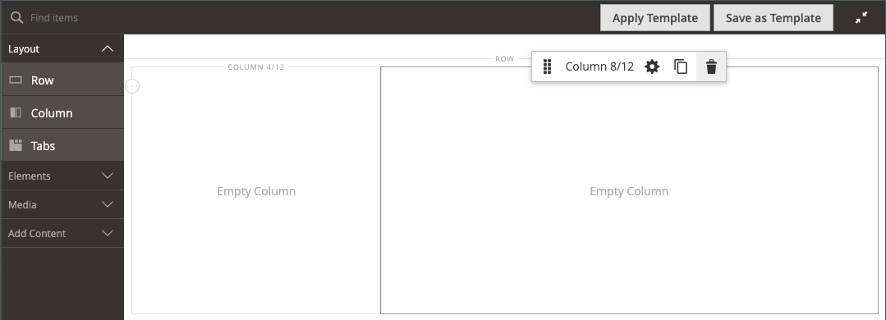

# Layout - Colonna

Utilizza il _Colonna_ tipo di contenuto per suddividere una pagina in più colonne nel [[!DNL Page Builder] fase](workspace.md#stage). Quando si aggiunge una colonna a una riga o a una scheda oppure direttamente all&#39;area di visualizzazione, il gruppo di colonne viene inizialmente diviso in due colonne di larghezza uguale. Puoi aggiungere o rimuovere colonne in base alle esigenze. È possibile ridimensionare una colonna trascinando il bordo tra due colonne. La larghezza della colonna successiva viene regolata in modo da riempire lo spazio disponibile all’interno della riga, della scheda o dell’area di visualizzazione. Una singola colonna estende l&#39;intera larghezza dell&#39;area di visualizzazione o del relativo contenitore.

{width="600" zoomable="yes"}

{{$include /help/_includes/page-builder-save-timeout.md}}

## Aggiornamenti nella versione 2.4.5

Le funzionalità di Page Builder vengono aggiornate nella versione 2.4.5 in modo che gli utenti ora utilizzino _[!DNL Columns]_come contenitore principale per le singole colonne. Questo nuovo contenitore supporta anche le proprietà per lo sfondo ed elimina la necessità di racchiudere le colonne in una riga. Riduce i markup superflui e offre un controllo più preciso sullo schermo e sull&#39;esperienza della vetrina.

È possibile modificare il layout del [!DNL Columns] trascinando una colonna sopra o sotto altre colonne del gruppo e sovrapponendole. Si apre una nuova varietà di possibili combinazioni di layout che possono essere ottenute senza la necessità di personalizzazione da parte degli sviluppatori.

Guarda questo video per una dimostrazione di come [!DNL Columns] Il contenitore può essere utilizzato per perfezionare i layout di pagina:

>[!VIDEO](https://video.tv.adobe.com/v/345828?quality=12)

## Casella degli strumenti Colonna

Ogni colonna ha una casella strumenti di opzioni che viene visualizzata quando passi il cursore sul contenitore.

| Strumento | Icona | Descrizione |
|--- |--- |--- |
| Sposta | {width="25"} | Sposta la colonna e il relativo contenuto in un&#39;altra posizione in relazione ad altre colonne. |
| (etichetta) | Colonna | Identifica il contenitore corrente come colonna. Passa il puntatore del mouse sul contenitore colonne per visualizzare la casella degli strumenti. |
| Impostazioni | {width="25"} | Apre la pagina Modifica colonna, in cui è possibile modificare le proprietà del contenitore. |
| Duplica | {width="25"} | Crea una copia della colonna corrente. |
| Rimuovi | {width="25"} | Elimina la colonna corrente e il relativo contenuto. |

{style="table-layout:auto"}

## Griglia colonna

Il [griglia](workspace.md) garantisce che il contenuto sia allineato in modo coerente in una colonna e aiuta la pagina a eseguire correttamente il rendering sia sui desktop che sui dispositivi mobili. Per ulteriori informazioni, vedere [Strumenti di contenuto avanzati](setup.md) sezione del [!DNL Page Builder] configurazione.

{width="500" zoomable="yes"}

Nell&#39;esempio di due colonne riportato di seguito, i numeri tra parentesi (6/12) nel bordo superiore di ogni contenitore di colonne indicano il numero di divisioni della griglia in ogni colonna e il numero totale di divisioni. In questo caso, la colonna corrisponde alla larghezza di sei unità della griglia su un totale di 12.

{width="600" zoomable="yes"}

## Aggiungi una colonna

1. In [!DNL Page Builder] pannello in _[!UICONTROL Layout]_, trascina un **[!UICONTROL Column]**sul palco.

   {width="600" zoomable="yes"}

   Il gruppo di colonne è ora diviso in due colonne di uguale larghezza. Ogni colonna è un contenitore separato per il contenuto e dispone di un set specifico di opzioni della casella degli strumenti.

   {width="600" zoomable="yes"}

1. Nell&#39;angolo superiore sinistro del gruppo di colonne fare clic sul pulsante _Griglia_ strumento () e regolare le dimensioni della griglia in base alle esigenze.

   Il posizionamento dei contenuti sulla griglia consente di allineare i contenuti in modo coerente ed esegue il rendering corretto della pagina sia sui dispositivi desktop che mobili. Per ulteriori informazioni, vedere [Strumenti di contenuto avanzati](../configuration-reference/general/content-management.md) sezione del [!DNL Page Builder] configurazione.

   {width="600" zoomable="yes"}

## Ridimensionare una colonna

1. Passa il cursore del mouse sul bordo tra due colonne.

   Il bordo viene evidenziato e viene visualizzata la casella degli strumenti per la colonna selezionata.

   {width="600" zoomable="yes"}

1. Tenere premuto il pulsante del mouse per visualizzare la griglia e trascinare il bordo in una nuova posizione sulla griglia.

   La larghezza di entrambe le colonne viene regolata in modo da riflettere la modifica. La nuova larghezza di ciascuna colonna viene visualizzata dopo l’etichetta, ad esempio `4/12` (quattro su 12) e `8/12` (otto su dodici).

   {width="600" zoomable="yes"}

## Rimuovere una colonna

1. Passa il puntatore del mouse sulla colonna da rimuovere per visualizzare la casella degli strumenti e scegli la _Rimuovi_ ( {width="20"} ).

   {width="600" zoomable="yes"}

1. Se la colonna contiene del contenuto, fai clic su **[!UICONTROL OK]** per confermare.

   Per accelerare il processo in futuro, puoi saltare il passaggio di conferma selezionando la **[!UICONTROL Do not show this again]** casella di controllo.

   Il gruppo di colonne ora ha una singola colonna (12/12) e una griglia. Poiché la griglia è disponibile solo per le colonne, è possibile utilizzare questa tecnica per visualizzare la griglia.

   {width="600" zoomable="yes"}

1. Se si desidera che il gruppo di colonne estenda la colonna rimanente fino alla larghezza completa della riga o dell&#39;area di visualizzazione:

   - Passa il puntatore del mouse sulla colonna per visualizzare la casella degli strumenti e scegli la _Impostazioni_ ( {width="20"} ).

   - Scorri verso il basso fino a _[!UICONTROL Advanced]_e imposta tutti e quattro **[!UICONTROL Padding]**valori per `0`.

     {width="600" zoomable="yes"}

   - Nell’angolo superiore destro, fai clic su **[!UICONTROL Save]** per chiudere _[!UICONTROL Edit Column]_pagina.

1. Fai clic su _Chiudi schermo intero_ ( {width="20"} ) nell&#39;angolo superiore destro dell&#39;area di lavoro e quindi fare clic su **[!UICONTROL Save]** nell’angolo superiore destro.

## Modificare le impostazioni delle colonne

1. Passa il puntatore del mouse sulla colonna per visualizzare la casella degli strumenti e scegli la _Impostazioni_ ( {width="20"} ).

   {width="600" zoomable="yes"}

1. Modificare il **[!UICONTROL Appearance]** in base alle esigenze.

   - Scegliere l&#39;impostazione di allineamento che determina la posizione della colonna rispetto al relativo contenitore.

     | Opzione | Descrizione |
     | ------ | ----------- |
     | `Full Height` | La colonna estende l’intera altezza del relativo contenitore. |
     | `Top Aligned` | La colonna è allineata nella parte superiore del relativo contenitore. |
     | `Centered` | La colonna è centrata al centro del relativo contenitore. |
     | `Bottom Aligned` | La colonna è allineata nella parte inferiore del relativo contenitore. |

     {style="table-layout:auto"}

   - Se necessario, immettere **[!UICONTROL Minimum Height]** per la colonna. Ad esempio, potete impostare l&#39;altezza minima in modo che corrisponda all&#39;altezza di un&#39;immagine di sfondo.

   - Se si imposta l&#39;altezza minima, impostare **[!UICONTROL Vertical Alignment]**  per controllare la posizione dei contenitori di contenuto aggiunti alla colonna (`Top`, `Center`, o `Bottom`).

1. Modifica lo sfondo per il contenuto della colonna.

   - **[!UICONTROL Background Color]** - Specificare il colore scegliendo un campione, facendo clic sul selettore di colori o immettendo un nome di colore valido o un valore esadecimale equivalente. Questa impostazione determina il colore di sfondo della colonna.

   - **[!UICONTROL Background Image]** - Se necessario, utilizza gli strumenti forniti per scegliere un’immagine di sfondo da applicare alla colonna:

     | Strumento | Descrizione |
     | ------ | ----------- |
     | [!UICONTROL Upload] | Carica un file di immagine dal computer locale alla raccolta e quindi lo applica come immagine di sfondo per la colonna. |
     | [!UICONTROL Select from Gallery] | Richiede di scegliere un&#39;immagine esistente dalla raccolta come immagine di sfondo per la colonna. |
     | {width="25"} | Consente di trascinare l&#39;immagine nella sezione della fotocamera o di spostarsi sull&#39;immagine nel file system locale. |

     {style="table-layout:auto"}

   - **[!UICONTROL Background Mobile Image]** - Se necessario, utilizzare gli stessi strumenti per scegliere un&#39;immagine di sfondo diversa da utilizzare per la visualizzazione su dispositivi mobili.

   - **[!UICONTROL Background Size]** - Modifica questa impostazione per determinare come viene ridimensionata l’immagine di sfondo in relazione alla larghezza della colonna:

     | Opzione | Descrizione |
     | ------ | ----------- |
     | `Cover` | L&#39;immagine di sfondo copre l&#39;intera larghezza della colonna. |
     | `Contain` | L&#39;immagine di sfondo è limitata alla larghezza dell&#39;area dei contenuti. |
     | `Auto` | Applica la dimensione di sfondo predefinita specificata nel foglio di stile del tema corrente. |

     {style="table-layout:auto"}

   - **[!UICONTROL Background Position]** : modifica questa impostazione per determinare il punto di ancoraggio dell’immagine in relazione alla colonna. Opzioni: `Top Left`, `Top Center`, `Top Right`, `Center Left`, `Center`, `Center Right`, `Bottom Left`, `Bottom Center`, o `Bottom Right`

   - **[!UICONTROL Background Attachment]** - Modifica questa impostazione per determinare il modo in cui l&#39;immagine di sfondo si sposta in relazione alla pagina di scorrimento:

     | Opzione | Descrizione |
     | ------ | ----------- |
     | `Scroll` | L&#39;immagine di sfondo viene sincronizzata per spostarsi verso il basso durante lo scorrimento della pagina. |
     | `Fixed` | (Non disponibile per dispositivi mobili) L’immagine di sfondo non si sposta quando il contenitore scorre sopra l’immagine ed è fisso nella posizione di sfondo specificata. |

     {style="table-layout:auto"}

   - **[!UICONTROL Background Repeat]** - Se si desidera ripetere l&#39;immagine di sfondo per riempire lo spazio, modificare questa impostazione `Yes`.

1. Aggiornare il _[!UICONTROL Advanced]_in base alle esigenze.

   - Per controllare il posizionamento orizzontale dei contenitori di contenuto aggiunti alla colonna, scegli un **[!UICONTROL Alignment]**:

     | Opzione | Descrizione |
     | ------ | ----------- |
     | `Default` | Applica l&#39;impostazione predefinita di allineamento specificata nel foglio di stile del tema corrente. |
     | `Left` | Allinea i contenitori di contenuto lungo il bordo sinistro del contenitore di colonne, tenendo conto della spaziatura specificata. |
     | `Center` | Allinea il contenitore di contenuto al centro del contenitore di colonne, tenendo conto di eventuali spaziature specificate. |
     | `Right` | Allinea il contenitore di contenuto al bordo destro del contenitore di colonne, tenendo conto della spaziatura specificata. |

     {style="table-layout:auto"}

   - Imposta il **[!UICONTROL Border]** stile, applicato a tutti e quattro i lati del contenitore colonne:

     | Opzione | Descrizione |
     | ------ | ----------- |
     | `Default` | Applica lo stile di bordo predefinito specificato dal foglio di stile associato. |
     | `None` | Non fornisce alcuna indicazione visibile dei bordi del contenitore. |
     | `Dotted` | Il bordo del contenitore viene visualizzato come una linea tratteggiata. |
     | `Dashed` | Il bordo del contenitore viene visualizzato come una linea tratteggiata. |
     | `Solid` | Il bordo del contenitore viene visualizzato come linea continua. |
     | `Double` | Il bordo del contenitore viene visualizzato come una doppia riga. |
     | `Groove` | Il bordo del contenitore viene visualizzato come una linea scanalata. |
     | `Ridge` | Il bordo del contenitore viene visualizzato come una linea scanalata. |
     | `Inset` | Il bordo del contenitore viene visualizzato come una linea interna. |
     | `Outset` | Il bordo del contenitore viene visualizzato come una linea di contorno. |

     {style="table-layout:auto"}

   - Se si imposta uno stile di bordo diverso da `None`, completare le opzioni di visualizzazione del bordo:

     | Opzione | Descrizione |
     | ------ |------------ |
     | [!UICONTROL Border Color] | Specificate il colore scegliendo un campione, facendo clic sul selettore del colore oppure immettendo un nome di colore valido o un valore esadecimale equivalente. |
     | [!UICONTROL Border Width] | Immettere il numero di pixel per lo spessore della linea del bordo. |
     | [!UICONTROL Border Radius] | Immettere il numero di pixel per definire la dimensione del raggio utilizzato per arrotondare ogni angolo del bordo. |

     {style="table-layout:auto"}

   - (Facoltativo) Specifica i nomi di **[!UICONTROL CSS classes]** dal foglio di stile corrente da applicare al contenitore colonne.

     Separare più nomi di classe con uno spazio.

   - Immetti i valori, in pixel, per il **[!UICONTROL Margins and Padding]** per specificare i margini esterni e la spaziatura interna della colonna.

     Immetti ogni valore corrispondente nel diagramma contenitore colonne.

     | Area contenitore | Descrizione |
     | -------------- | ----------- |
     | [!UICONTROL Margins] | Quantità di spazio vuoto applicata al bordo esterno di tutti i lati del contenitore. Opzioni: `Top` / `Right` / `Bottom` / `Left` |
     | [!UICONTROL Padding] | Quantità di spazio vuoto applicata al bordo interno di tutti i lati del contenitore. Opzioni: `Top` / `Right` / `Bottom` / `Left` |

     {style="table-layout:auto"}

1. Al termine, fai clic su **[!UICONTROL Save]** per applicare le impostazioni e tornare al [!DNL Page Builder] Workspace.
