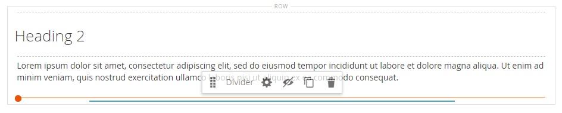

# Elementi - Divisore

Utilizza il tipo di contenuto _Divider_ per aggiungere una regola come interruzione visiva tra sezioni di contenuto in [[!DNL Page Builder] stage](workspace.md#stage). È possibile specificare il colore, lo spessore e la larghezza della linea del divisore. È inoltre possibile controllare l&#39;allineamento, impostare i margini e la spaziatura interna e il formato del bordo del contenitore. Per impostazione predefinita, il divisore è una regola per i capelli che estende l’intera larghezza del contenitore, con tolleranza per la spaziatura interna.

{width="500" zoomable="yes"}

Anche se la maggior parte dei contenitori divisore sono invisibili, l&#39;esempio seguente visualizza il contenitore con un bordo tratteggiato rosso in modo da visualizzare la relazione tra il divisore, la spaziatura interna e il contenitore. Potete regolare la spaziatura interna nella parte superiore e inferiore del divisore per controllare la spaziatura tra gli elementi.

{width="500" zoomable="yes"}

{{$include /help/_includes/page-builder-save-timeout.md}}

## Casella degli strumenti Divisore

| Strumento | Icona | Descrizione |
| ---- | --------------------| ------------|
| Sposta | {width="25"} | Sposta il contenitore del divisore in un altro punto valido della pagina. |
| (etichetta) | DIVISORE | Identifica il contenitore corrente come elemento divisore. |
| Impostazioni | {width="25"} | Apre la pagina Modifica divisore, in cui è possibile modificare le proprietà del divisore e del relativo contenitore. |
| Nascondi | {width="25"} | Nasconde il contenitore divisore. |
| Spettacolo | {width="25"} | Mostra il contenitore divisore nascosto. |
| Duplica | {width="25"} | Crea una copia del contenitore del divisore. |
| Rimuovi | {width="25"} | Elimina dall&#39;area di visualizzazione il contenitore del divisore e il relativo contenuto. |

{style="table-layout:auto"}

{{$include /help/_includes/page-builder-hidden-element-note.md}}

## Aggiungi un divisore

1. Nel pannello [!DNL Page Builder], espandi **[!UICONTROL Elements]** e trascina un segnaposto **[!UICONTROL Divider]** in una riga, colonna o set di schede sull&#39;area di visualizzazione.

   Utilizza la linea guida rossa come riferimento quando posizioni il divisore prima o dopo un altro contenitore di contenuto sullo stage.

   {width="600" zoomable="yes"}

   Nell&#39;esempio seguente, il divisore indica l&#39;inizio di una nuova sezione di testo.

   {width="500" zoomable="yes"}

1. Per specificare le impostazioni del nuovo divisore, attenersi alla procedura seguente.

## Modificare le impostazioni del divisore

1. Passa il puntatore del mouse sul contenitore del divisore per visualizzare la casella degli strumenti e scegli l&#39;icona _Impostazioni_ ( {width="20"} ).

   {width="500" zoomable="yes"}

1. Modificare il divisore **[!UICONTROL Line Color]** utilizzando uno dei metodi seguenti:

   - Immettere un nome colore [HTML][1] valido. Ad esempio, `Teal`.
   - Immetti il valore esadecimale del colore. Ad esempio, `#008080`.

   Al termine, fare clic su **[!UICONTROL Apply]**.

   {width="600" zoomable="yes"}

1. Immetti **[!UICONTROL Line Thickness]** in pixel.

1. Per indicare l&#39;unità di misura, immettere **[!UICONTROL Line Width]** seguito da `px` o `%`.

   {width="600" zoomable="yes"}

1. Aggiornare le impostazioni di _[!UICONTROL Advanced]_in base alle esigenze.

   - Per controllare il posizionamento del divisore all&#39;interno del contenitore principale, scegliere **[!UICONTROL Alignment]**:

     | Opzione | Descrizione |
     | ------ | ----------- |
     | `Default` | Applica l&#39;impostazione predefinita di allineamento specificata nel foglio di stile del tema corrente. |
     | `Left` | Allinea l&#39;elenco lungo il bordo sinistro del contenitore principale, tenendo conto di eventuali spaziature specificate. |
     | `Center` | Allinea l&#39;elenco al centro del contenitore padre, tenendo conto di eventuali spaziature specificate. |
     | `Right` | Allinea il blocco lungo il bordo destro del contenitore principale, tenendo conto della spaziatura specificata. |

     {style="table-layout:auto"}

     Nell&#39;esempio seguente, le opzioni sono impostate in modo da utilizzare un allineamento centrale per il divisore.

     {width="600" zoomable="yes"}

   - Impostare lo stile **[!UICONTROL Border]** applicato a tutti e quattro i lati del contenitore divisore:

     | Opzione | Descrizione |
     | ------ | ----------- |
     | `Default` | Applica lo stile di bordo predefinito specificato dal foglio di stile associato. |
     | `None` | Non fornisce alcuna indicazione visibile dei bordi del contenitore. |
     | `Dotted` | Il bordo del contenitore viene visualizzato come una linea tratteggiata. |
     | `Dashed` | Il bordo del contenitore viene visualizzato come una linea tratteggiata. |
     | `Solid` | Il bordo del contenitore viene visualizzato come linea continua. |
     | `Double` | Il bordo del contenitore viene visualizzato come una doppia riga. |
     | `Groove` | Il bordo del contenitore viene visualizzato come una linea scanalata. |
     | `Ridge` | Il bordo del contenitore viene visualizzato come una linea scanalata. |
     | `Inset` | Il bordo del contenitore viene visualizzato come una linea interna. |
     | `Outset` | Il bordo del contenitore viene visualizzato come una linea di contorno. |

     {style="table-layout:auto"}

   - Se si imposta uno stile di bordo diverso da `None`, completare le opzioni di visualizzazione del bordo:

     | Opzione | Descrizione |
     | ------ |------------ |
     | [!UICONTROL Border Color] | Specificate il colore scegliendo un campione, facendo clic sul selettore del colore oppure immettendo un nome di colore valido o un valore esadecimale equivalente. |
     | [!UICONTROL Border Width] | Immettere il numero di pixel per lo spessore della linea del bordo. |
     | [!UICONTROL Border Radius] | Immettere il numero di pixel per definire la dimensione del raggio utilizzato per arrotondare ogni angolo del bordo. |

     {style="table-layout:auto"}

   - (Facoltativo) Specificare i nomi di **[!UICONTROL CSS classes]** dal foglio di stile corrente da applicare al contenitore.

     Separare più nomi di classe con uno spazio.

   - Immettere i valori, in pixel, per **[!UICONTROL Margins and Padding]** per determinare i margini esterni e la spaziatura interna del contenitore divisore.

     Immettere i valori corrispondenti nel diagramma.

     | Area contenitore | Descrizione |
     | -------------- | ----------- |
     | [!UICONTROL Margins] | Quantità di spazio vuoto applicata al bordo esterno di tutti i lati del contenitore. Opzioni: `Top` / `Right` / `Bottom` / `Left` |
     | [!UICONTROL Padding] | Quantità di spazio vuoto applicata al bordo interno di tutti i lati del contenitore. Opzioni: `Top` / `Right` / `Bottom` / `Left` |

     {style="table-layout:auto"}

1. Al termine, fare clic su **[!UICONTROL Save]** per applicare le impostazioni e tornare all&#39;area di lavoro [!DNL Page Builder].

   {width="500" zoomable="yes"}

## Duplicare un divisore

Per un divisore formattato con impostazioni specifiche, è più efficiente creare un duplicato, anziché ricominciare con un nuovo segnaposto.

1. Passa il puntatore del mouse sul contenitore del divisore per visualizzare la casella degli strumenti e scegli l&#39;icona _Duplica_ ( {width="20"} ).

   Il contenitore del divisore duplicato viene visualizzato immediatamente sotto l&#39;originale.

   {width="500" zoomable="yes"}

1. Passa il puntatore del mouse sul nuovo contenitore del divisore per visualizzare la casella degli strumenti e scegli l&#39;icona _Sposta_ ( {width="20"} ).

   {width="500" zoomable="yes"}

1. Selezionate e trascinate il divisore finché la linea guida rossa non contrassegna la nuova posizione.

   Durante lo spostamento del divisore, i bordi superiore e inferiore di ciascun contenitore vengono visualizzati come linee tratteggiate.

   {width="500" zoomable="yes"}

[1]: https://en.wikipedia.org/wiki/Web_colors

<!-- Last updated from includes: 2023-09-11 14:30:19 -->
