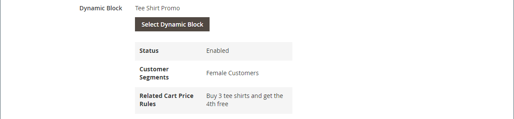

# Aggiungi contenuto - Blocco dinamico

Utilizza il tipo di contenuto Blocco dinamico per aggiungere un [blocco dinamico](../content-design/dynamic-blocks.md) esistente a [[!DNL Page Builder] stage](workspace.md#stage).

{width="700" zoomable="yes"}

{{$include /help/_includes/page-builder-save-timeout.md}}

## Casella degli strumenti Blocco dinamico

| Strumento | Icona | Descrizione |
| --------- | ------------- | ----------------- |
| Sposta | {width="25"} | Sposta il contenitore di blocchi e il relativo contenuto in un&#39;altra posizione sullo stage. |
| Impostazioni | {width="25"} | Apre la pagina _Modifica blocco_, in cui è possibile scegliere il blocco e modificare le proprietà del contenitore. |
| Nascondi | {width="25"} | Nasconde il contenitore di blocchi corrente e il relativo contenuto. |
| Spettacolo | {width="25"} | Mostra il contenitore di blocchi nascosto e il relativo contenuto. |
| Duplica | {width="25"} | Crea una copia del contenitore di blocchi e del relativo contenuto. |
| Rimuovi | {width="25"} | Elimina dall’area di visualizzazione il contenitore di blocchi e il relativo contenuto. |

{style="table-layout:auto"}

{{$include /help/_includes/page-builder-hidden-element-note.md}}

## Aggiungi un blocco dinamico esistente all&#39;area di visualizzazione

1. Passare all&#39;area di lavoro [!DNL Page Builder] nella pagina, nel blocco, nel prodotto o nella categoria di destinazione.

1. Nel pannello [!DNL Page Builder], espandere **[!UICONTROL Add Content]** e trascinare un segnaposto **[!UICONTROL Dynamic Block]** nell&#39;area di visualizzazione.

   {width="600" zoomable="yes"}

1. Passa il puntatore del mouse sul contenitore del blocco dinamico vuoto per visualizzare la casella degli strumenti e scegli l&#39;icona _Impostazioni_ ( {width="20"} ).

   {width="600" zoomable="yes"}

1. Nella pagina _Modifica blocco dinamico_ fare clic su **[!UICONTROL Select Dynamic Block]** e utilizzare l&#39;elenco per selezionare il blocco.

   {width="600" zoomable="yes"}

   Nell&#39;elenco trovare il blocco dinamico che si desidera inserire e fare clic su **[!UICONTROL Select]**. Quindi fare clic su **[!UICONTROL Add Selected]**.

   {width="600" zoomable="yes"}

   Di seguito viene visualizzato un riepilogo delle informazioni sul blocco dinamico.

   {width="600" zoomable="yes"}

1. Imposta **[!UICONTROL Template]** su uno dei seguenti:

   | Opzione | Descrizione |
   | ------ | ----------- |
   | `Dynamic Block Block Template` | Aggiunge un blocco autonomo. |
   | `Dynamic Block Inline Template` | Inserisce il contenuto del blocco nel testo. |

   {style="table-layout:auto"}

   {width="200"}

1. Completare le impostazioni avanzate in base alle esigenze.

1. Al termine, fare clic su **[!UICONTROL Save]** per applicare le impostazioni e tornare all&#39;area di lavoro [!DNL Page Builder].

### Impostazioni avanzate

1. Per controllare il posizionamento del blocco dinamico all&#39;interno del contenitore principale, scegliere un **[!UICONTROL Alignment]**:

   | Opzione | Descrizione |
   | ------ | ----------- |
   | `Default` | Applica l&#39;impostazione predefinita di allineamento specificata nel foglio di stile del tema corrente. |
   | `Left` | Allinea l&#39;elenco lungo il bordo sinistro del contenitore principale, tenendo conto di eventuali spaziature specificate. |
   | `Center` | Allinea l&#39;elenco al centro del contenitore padre, tenendo conto di eventuali spaziature specificate. |
   | `Right` | Allinea il blocco lungo il bordo destro del contenitore principale, tenendo conto della spaziatura specificata. |

   {style="table-layout:auto"}

1. Imposta lo stile **[!UICONTROL Border]** applicato a tutti e quattro i lati del contenitore di blocchi dinamici:

   | Opzione | Descrizione |
   | ------ | ----------- |
   | `Default` | Applica lo stile di bordo predefinito specificato dal foglio di stile associato. |
   | `None` | Non fornisce alcuna indicazione visibile dei bordi del contenitore. |
   | `Dotted` | Il bordo del contenitore viene visualizzato come una linea tratteggiata. |
   | `Dashed` | Il bordo del contenitore viene visualizzato come una linea tratteggiata. |
   | `Solid` | Il bordo del contenitore viene visualizzato come linea continua. |
   | `Double` | Il bordo del contenitore viene visualizzato come una doppia riga. |
   | `Groove` | Il bordo del contenitore viene visualizzato come una linea scanalata. |
   | `Ridge` | Il bordo del contenitore viene visualizzato come una linea scanalata. |
   | `Inset` | Il bordo del contenitore viene visualizzato come una linea interna. |
   | `Outset` | Il bordo del contenitore viene visualizzato come una linea di contorno. |

   {style="table-layout:auto"}

1. Se si imposta uno stile di bordo diverso da `None`, completare le opzioni di visualizzazione del bordo:

   | Opzione | Descrizione |
   | ------ |------------ |
   | [!UICONTROL Border Color] | Specificate il colore scegliendo un campione, facendo clic sul selettore del colore oppure immettendo un nome di colore valido o un valore esadecimale equivalente. |
   | [!UICONTROL Border Width] | Immettere il numero di pixel per lo spessore della linea del bordo. |
   | [!UICONTROL Border Radius] | Immettere il numero di pixel per definire la dimensione del raggio utilizzato per arrotondare ogni angolo del bordo. |

   {style="table-layout:auto"}

1. (Facoltativo) Specificare i nomi di **[!UICONTROL CSS classes]** dal foglio di stile corrente da applicare al contenitore.

   Separare più nomi di classe con uno spazio.

1. Immettere i valori, in pixel, per **[!UICONTROL Margins and Padding]** per determinare i margini esterni e la spaziatura interna del contenitore di blocchi dinamici.

   Immettere i valori corrispondenti nel diagramma.

   | Area contenitore | Descrizione |
   | -------------- | ----------- |
   | [!UICONTROL Margins] | Quantità di spazio vuoto applicata al bordo esterno di tutti i lati del contenitore. Opzioni: `Top` / `Right` / `Bottom` / `Left` |
   | [!UICONTROL Padding] | Quantità di spazio vuoto applicata al bordo interno di tutti i lati del contenitore. Opzioni: `Top` / `Right` / `Bottom` / `Left` |

   {style="table-layout:auto"}

## Modifica impostazioni contenitore blocco dinamico

1. Passa il puntatore del mouse sul contenitore di blocchi dinamici per visualizzare la casella degli strumenti e scegli l&#39;icona _Impostazioni_ ( {width="20"} ).

   {width="500" zoomable="yes"}

1. Se necessario, modificare il blocco dinamico:

   - Fare clic su **[!UICONTROL Select Dynamic Block]**.

     {width="20"}

   - Nell&#39;elenco dei blocchi dinamici attivi fare clic su **[!UICONTROL Select]** per il blocco che si desidera aggiungere.

1. Se necessario, aggiorna le impostazioni rimanenti.

1. Al termine, fare clic su **[!UICONTROL Save]** per applicare le impostazioni e tornare all&#39;area di lavoro [!DNL Page Builder].

## Duplicare un blocco dinamico

1. Passa il puntatore del mouse sul contenitore del blocco dinamico per visualizzare la casella degli strumenti e scegli l&#39;icona _Duplica_ ( {width="20"} ).

   Il duplicato viene visualizzato immediatamente sotto l&#39;originale.

   {width="500" zoomable="yes"}

1. Per spostare il nuovo blocco dinamico in una posizione diversa, posizionare il puntatore del mouse sul relativo contenitore, quindi scegliere _Sposta_ ( {width="20"} ) nella casella degli strumenti.

1. Selezionate e trascinate il blocco dinamico fino a quando la linea guida rossa non viene visualizzata nella nuova posizione.

   Durante lo spostamento del blocco dinamico, i bordi superiore e inferiore di ciascun contenitore vengono visualizzati come linee tratteggiate.

## Rimuovere un blocco dinamico dall&#39;area di visualizzazione

1. Passa il puntatore del mouse sul contenitore del blocco dinamico per visualizzare la casella degli strumenti e scegli l&#39;icona _Rimuovi_ ( {width="20"} ).

1. Quando viene richiesto di confermare, fare clic su **[!UICONTROL OK]**.

<!-- Last updated from includes: 2023-09-11 14:30:19 -->
