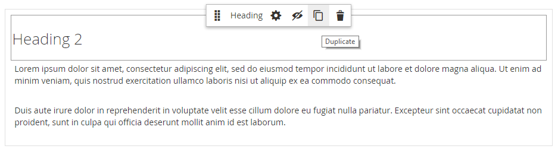

# Elementi - Intestazione

I livelli di intestazione stabiliscono una gerarchia che organizza il contenuto e aiuta i motori di ricerca a indicizzare ogni pagina. Utilizzare il tipo di contenuto _Intestazione_ nella [[!DNL Page Builder] fase](workspace.md#stage) per aggiungere all&#39;area di visualizzazione un contenitore di testo con un livello di intestazione da H1 a H6. Le intestazioni vengono formattate in base al foglio di stile associato al tema corrente.

Il campo [Intestazione contenuto](workspace.md) nella sezione _[!UICONTROL Content]_può essere utilizzato per aggiungere un&#39;intestazione H1 nella parte superiore della pagina. Tuttavia, il campo è legacy rispetto alle versioni precedenti di [!DNL Commerce] ed è fornito per supportare contenuti meno recenti. Questo campo non sfrutta le funzionalità avanzate di [!DNL Page Builder]. È consigliabile lasciare vuoto il campo Intestazione contenuto e utilizzare il tipo di contenuto Intestazione [!DNL Page Builder] per aggiungere alla pagina titoli di qualsiasi livello.

L’esempio seguente mostra come vengono visualizzati l’intestazione di contenuto e il tipo di contenuto Intestazione quando vengono formattati dal tema Luma.

{width="700" zoomable="yes"}

È possibile trascinare un&#39;intestazione dalla sezione _Elementi_ del pannello [!DNL Page Builder] in una riga, colonna o scheda impostata sull&#39;area di visualizzazione. Il livello di intestazione e l&#39;allineamento possono essere controllati dalla barra degli strumenti dell&#39;editor sullo stage o utilizzando il controllo _Impostazioni_ ( {width="20"} ).

{{$include /help/_includes/page-builder-save-timeout.md}}

## Editor titoli

{width="500" zoomable="yes"}

## Casella degli strumenti Contenitore intestazione

Come per tutti i contenitori di contenuto, la casella degli strumenti viene visualizzata quando si passa il puntatore del mouse sul contenitore.

{width="500" zoomable="yes"}

| Strumento | Icona | Descrizione |
| --------- | ----------------- | ---------------------- |
| Sposta | {width="25"} | Sposta il contenitore del titolo in un&#39;altra posizione valida nella pagina. |
| (etichetta) | Intestazione | Identifica il contenitore corrente come intestazione. |
| Impostazioni | {width="25"} | Apre la pagina Modifica intestazione, in cui è possibile modificare le proprietà del contenitore. |
| Nascondi | {width="25"} | Nasconde il contenitore del titolo. |
| Spettacolo | {width="25"} | Mostra il contenitore del titolo nascosto. |
| Duplica | {width="25"} | Crea una copia del contenitore del titolo. |
| Rimuovi | {width="25"} | Elimina dall’area di visualizzazione il contenitore dell’intestazione e il relativo contenuto. |

{style="table-layout:auto"}

{{$include /help/_includes/page-builder-hidden-element-note.md}}

## Aggiungi un’intestazione

1. Nel pannello [!DNL Page Builder], espandi **[!UICONTROL Elements]** e trascina un segnaposto **[!UICONTROL Heading]** in una riga, colonna o set di schede sull&#39;area di visualizzazione.

   {width="600" zoomable="yes"}

1. Nell&#39;editor, immettere il testo dell&#39;intestazione sopra il segnaposto `Edit Heading Text`.

   Per impostazione predefinita, al testo dell’intestazione viene assegnato un tipo di intestazione di livello due (H2).

   {width="500" zoomable="yes"}

1. Nella barra degli strumenti, scegli il tipo di intestazione appropriato tra H1 e H6.

1. Se necessario, modificate l&#39;allineamento.

## Modifica impostazioni intestazione

1. Passa il puntatore del mouse sul contenitore dell&#39;intestazione per visualizzare la casella degli strumenti e scegli l&#39;icona _Impostazioni_ ( {width="20"} ).

   {width="500" zoomable="yes"}

1. Aggiornare il contenuto dell&#39;intestazione (**[!UICONTROL Heading Type]** e **[!UICONTROL Heading Text]**) se necessario.

   Puoi anche aggiornare questo contenuto nell’editor delle intestazioni.

1. Aggiornare le impostazioni di _[!UICONTROL Advanced]_in base alle esigenze.

   - Per controllare il posizionamento dell&#39;intestazione all&#39;interno del contenitore padre, scegliere un **[!UICONTROL Alignment]**:

     | Opzione | Descrizione |
     | ------ | ----------- |
     | `Default` | Applica l&#39;impostazione predefinita di allineamento specificata nel foglio di stile del tema corrente. |
     | `Left` | Allinea l&#39;elenco lungo il bordo sinistro del contenitore principale, tenendo conto di eventuali spaziature specificate. |
     | `Center` | Allinea l&#39;elenco al centro del contenitore padre, tenendo conto di eventuali spaziature specificate. |
     | `Right` | Allinea il blocco lungo il bordo destro del contenitore principale, tenendo conto della spaziatura specificata. |

     {style="table-layout:auto"}

   - Imposta lo stile **[!UICONTROL Border]** applicato a tutti e quattro i lati del contenitore di titoli:

     | Opzione | Descrizione |
     | ------ | ----------- |
     | `Default` | Applica lo stile di bordo predefinito specificato dal foglio di stile associato. |
     | `None` | Non fornisce alcuna indicazione visibile dei bordi del contenitore. |
     | `Dotted` | Il bordo del contenitore viene visualizzato come una linea tratteggiata. |
     | `Dashed` | Il bordo del contenitore viene visualizzato come una linea tratteggiata. |
     | `Solid` | Il bordo del contenitore viene visualizzato come linea continua. |
     | `Double` | Il bordo del contenitore viene visualizzato come una doppia riga. |
     | `Groove` | Il bordo del contenitore viene visualizzato come una linea scanalata. |
     | `Ridge` | Il bordo del contenitore viene visualizzato come una linea scanalata. |
     | `Inset` | Il bordo del contenitore viene visualizzato come una linea interna. |
     | `Outset` | Il bordo del contenitore viene visualizzato come una linea di contorno. |

     {style="table-layout:auto"}

   - Se si imposta uno stile di bordo diverso da `None`, completare le opzioni di visualizzazione del bordo:

     | Opzione | Descrizione |
     | ------ |------------ |
     | [!UICONTROL Border Color] | Specificate il colore scegliendo un campione, facendo clic sul selettore del colore oppure immettendo un nome di colore valido o un valore esadecimale equivalente. |
     | [!UICONTROL Border Width] | Immettere il numero di pixel per lo spessore della linea del bordo. |
     | [!UICONTROL Border Radius] | Immettere il numero di pixel per definire la dimensione del raggio utilizzato per arrotondare ogni angolo del bordo. |

     {style="table-layout:auto"}

   - (Facoltativo) Specificare i nomi di **[!UICONTROL CSS classes]** dal foglio di stile corrente da applicare al contenitore.

     Separare più nomi di classe con uno spazio.

   - Immettere i valori, in pixel, per **[!UICONTROL Margins and Padding]** per determinare i margini esterni e la spaziatura interna del contenitore titoli.

     Immettere i valori corrispondenti nel diagramma.

     | Area contenitore | Descrizione |
     | -------------- | ----------- |
     | [!UICONTROL Margins] | Quantità di spazio vuoto applicata al bordo esterno di tutti i lati del contenitore. Opzioni: `Top` / `Right` / `Bottom` / `Left` |
     | [!UICONTROL Padding] | Quantità di spazio vuoto applicata al bordo interno di tutti i lati del contenitore. Opzioni: `Top` / `Right` / `Bottom` / `Left` |

     {style="table-layout:auto"}

1. Al termine, fare clic su **[!UICONTROL Save]** per applicare le impostazioni e tornare all&#39;area di lavoro [!DNL Page Builder].

## Duplicare un’intestazione

Per un titolo formattato con impostazioni specifiche, è più efficiente duplicare l’intestazione, anziché ricominciare con un nuovo segnaposto.

1. Passa il puntatore del mouse sul contenitore dell&#39;intestazione per visualizzare la casella degli strumenti e scegli l&#39;icona _Duplica_ ( {width="20"} ).

   Il duplicato viene visualizzato immediatamente sotto l&#39;originale.

   {width="500" zoomable="yes"}

1. Passa il puntatore del mouse sul nuovo contenitore del titolo per visualizzare la casella degli strumenti e scegli l&#39;icona _Sposta_ ( {width="20"} ).

   {width="500" zoomable="yes"}

1. Seleziona e trascina l’intestazione fino a quando la linea guida rossa non contrassegna la nuova posizione.

   Durante lo spostamento dell&#39;intestazione, i bordi superiore e inferiore di ogni contenitore vengono visualizzati come linee tratteggiate.

   {width="500" zoomable="yes"}

1. Se si desidera modificare il livello di intestazione, fare clic sul testo dell&#39;intestazione e scegliere il nuovo livello nella barra degli strumenti dell&#39;editor.

   {width="500" zoomable="yes"}
