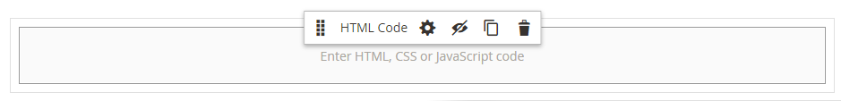

# Elementi - Codice HTML

Utilizza il _Codice HTML_ tipo di contenuto per aggiungere snippet di codice HTML, CSS e JavaScript nel [[!DNL Page Builder] fase](workspace.md#stage). Ad esempio, potrebbe essere utile aggiungere HTML personalizzati, dichiarare una classe CSS che può essere applicata a un elemento della pagina. In alternativa, è possibile aggiungere uno snippet di codice per un logo, un pulsante o un banner ricevuto da un provider di terze parti.

## Casella degli strumenti Codice HTML

{width="500" zoomable="yes"}

| Strumento | Icona | Descrizione |
| --------- | ---------- | ----------------- |
| Sposta | {width="25"} | Sposta il contenitore Codice HTML in un altro punto valido della pagina. |
| Impostazioni | {width="25"} | Apre la pagina Modifica codice HTML, in cui è possibile modificare le proprietà del contenitore. |
| Nascondi | {width="25"} | Nasconde il contenitore Codice HTML. |
| Spettacolo | {width="25"} | Mostra il contenitore Codice HTML nascosto. |
| Duplica | {width="25"} | Crea una copia del contenitore Codice HTML. |
| Rimuovi | {width="25"} | Elimina dall’area di visualizzazione il contenitore Codice HTML e il relativo contenuto. |

{{$include /help/_includes/page-builder-hidden-element-note.md}}

## Aggiungi codice HTML

L’esempio seguente illustra come incorporare [Carattere Google][1] codificare e dichiarare classi di intestazione personalizzate che sostituiscono il foglio di stile corrente.

### Passaggio 1: scegliere un tipo di carattere Google

1. Visita il [Google Fonts][1] e scegliere la famiglia di caratteri che si desidera utilizzare.

1. Copia il codice generato da incorporare nel `<head>` e incollarla temporaneamente in un editor di testo.

   - Incorpora codice font
   - Regola CSS

1. Aggiungere la regola font-family a ciascuna classe di intestazione, racchiudendo le classi di intestazione in una `<style>` tag.

   Questo codice viene incollato in [!DNL Page Builder].

   ```html
   <style>
      h1 {color: teal; font-family: 'Khand', sans-serif; }
      h2 {color: teal; font-family: 'Khand', sans-serif; }
      h3 {color: teal; font-family: 'Khand', sans-serif; }
   </style>
   ```

### Passaggio 2: aggiungi il codice alla pagina

1. In _Amministratore_ barra laterale del negozio, vai a **[!UICONTROL Content]** > _[!UICONTROL Elements]_>**[!UICONTROL Pages]**.

1. Individuare la pagina in cui deve essere disponibile il tipo di carattere e aprirla in modalità di modifica.

1. Scorri verso il basso ed espandi **[!UICONTROL Content]** sezione.

1. In [!DNL Page Builder] pannello, espandere **[!UICONTROL Elements]** e trascina un **[!UICONTROL HTML Code]** segnaposto per una riga, colonna o gruppo di schede sullo stage.

   Utilizza la linea guida rossa per posizionare il divisore prima o dopo un altro contenitore di contenuto nella riga, nella colonna o nel set di schede.

   {width="600" zoomable="yes"}

1. Passa il puntatore del mouse sul contenitore HTML per visualizzare la casella degli strumenti e scegli _Impostazioni_ ( {width="20"} ), icona.

1. Nella casella di testo incollare il codice Google Fonts da incorporare e le dichiarazioni di stile preparate.

   Per semplificare la lettura, è possibile inserire alcuni spazi per applicare un rientro al codice.

   {width="500" zoomable="yes"}

1. Aggiornare le impostazioni rimanenti in base alle esigenze (vedere [Modificare le impostazioni del codice HTML](#html-settings) per i dettagli).

1. Nell’angolo superiore destro, fai clic su **[!UICONTROL Save]** per applicare le impostazioni e tornare al [!DNL Page Builder] Workspace.

   Il nuovo font viene riprodotto quando la pagina viene visualizzata tramite un browser.

### Passaggio 3: visualizzare l’anteprima della pagina

1. In _[!UICONTROL Currently Active]_sezione, set **[!UICONTROL Enable Page]**a `Yes`.

   {width="600" zoomable="yes"}

1. Nell’angolo in alto a destra, fai clic su **[!UICONTROL Save]** freccia e scegli **[!UICONTROL Save & Close]**.

1. Trova la pagina nella griglia e seleziona **[!UICONTROL View]** nel _[!UICONTROL Actions]_colonna.

   {width="700" zoomable="yes"}

## Modificare le impostazioni del codice HTML {#html-settings}

1. Passa il puntatore del mouse sul contenitore HTML per visualizzare la casella degli strumenti e scegli _Impostazioni_ ( {width="20"} ).

1. Nella casella di testo modificare il codice in base alle esigenze.

   Sono supportati i codici HTML, CSS e JavaScript. Frammenti di codice che appartengono al `<head>` sezione della pagina può essere immessa qui.

   L’editor fornisce anche pulsanti per inserire elementi speciali nel codice:

   | Pulsante | Descrizione |
   | ------ | ----------- |
   | Inserisci widget... | Fate clic su per inserire un widget nella posizione del cursore nella casella di testo HTML. |
   | Inserisci immagine... | Fare clic per inserire un&#39;immagine caricata o un&#39;immagine dalla raccolta nella posizione del cursore nella casella di testo HTML. |
   | Inserisci variabile... | Fare clic per inserire una variabile nella posizione del cursore nella casella di testo HTML. |

1. Aggiornare il _[!UICONTROL Advanced]_in base alle esigenze.

   - Per controllare il posizionamento del codice all’interno del contenitore principale, scegli un **[!UICONTROL Alignment]**:

     | Opzione | Descrizione |
     | ------ | ----------- |
     | `Default` | Applica l&#39;impostazione predefinita di allineamento specificata nel foglio di stile del tema corrente. |
     | `Left` | Allinea l&#39;elenco lungo il bordo sinistro del contenitore principale, tenendo conto di eventuali spaziature specificate. |
     | `Center` | Allinea l&#39;elenco al centro del contenitore padre, tenendo conto di eventuali spaziature specificate. |
     | `Right` | Allinea il blocco lungo il bordo destro del contenitore principale, tenendo conto della spaziatura specificata. |

     Nell&#39;esempio seguente, le opzioni sono impostate per utilizzare un allineamento centrale per il blocco di codice sottoposto a rendering.

     {width="600" zoomable="yes"}

   - Imposta il **[!UICONTROL Border]** stile applicato a tutti e quattro i lati del contenitore di codice:

     | Opzione | Descrizione |
     | ------ | ----------- |
     | `Default` | Applica lo stile di bordo predefinito specificato dal foglio di stile associato. |
     | `None` | Non fornisce alcuna indicazione visibile dei bordi del contenitore. |
     | `Dotted` | Il bordo del contenitore viene visualizzato come una linea tratteggiata. |
     | `Dashed` | Il bordo del contenitore viene visualizzato come una linea tratteggiata. |
     | `Solid` | Il bordo del contenitore viene visualizzato come linea continua. |
     | `Double` | Il bordo del contenitore viene visualizzato come una doppia riga. |
     | `Groove` | Il bordo del contenitore viene visualizzato come una linea scanalata. |
     | `Ridge` | Il bordo del contenitore viene visualizzato come una linea scanalata. |
     | `Inset` | Il bordo del contenitore viene visualizzato come una linea interna. |
     | `Outset` | Il bordo del contenitore viene visualizzato come una linea di contorno. |

   - Se si imposta uno stile di bordo diverso da `None`, completare le opzioni di visualizzazione del bordo:

     | Opzione | Descrizione |
     | ------ |------------ |
     | [!UICONTROL Border Color] | Specificate il colore scegliendo un campione, facendo clic sul selettore del colore oppure immettendo un nome di colore valido o un valore esadecimale equivalente. |
     | [!UICONTROL Border Width] | Immettere il numero di pixel per lo spessore della linea del bordo. |
     | [!UICONTROL Border Radius] | Immettere il numero di pixel per definire la dimensione del raggio utilizzato per arrotondare ogni angolo del bordo. |

     {style="table-layout:auto"}

   - (Facoltativo) Specifica i nomi di **[!UICONTROL CSS classes]** dal foglio di stile corrente da applicare al contenitore.

     Separare più nomi di classe con uno spazio.

   - Immetti i valori, in pixel, per il **[!UICONTROL Margins and Padding]** per determinare i margini esterni e la spaziatura interna del contenitore di codice.

     Immettere i valori corrispondenti nel diagramma.

     | Area contenitore | Descrizione |
     | -------------- | ----------- |
     | [!UICONTROL Margins] | Quantità di spazio vuoto applicata al bordo esterno di tutti i lati del contenitore. Opzioni: `Top` / `Right` / `Bottom` / `Left` |
     | [!UICONTROL Padding] | Quantità di spazio vuoto applicata al bordo interno di tutti i lati del contenitore. Opzioni: `Top` / `Right` / `Bottom` / `Left` |

[1]: https://fonts.google.com/
