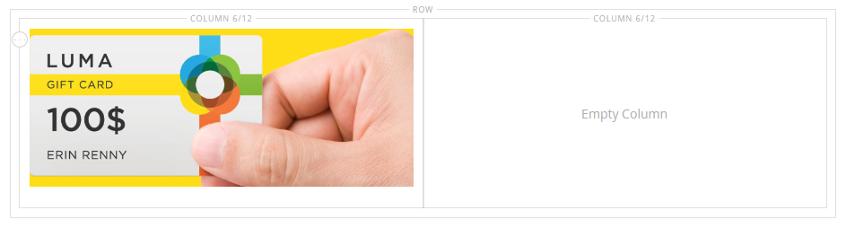

# Media - Immagine

Utilizza il tipo di contenuto _Immagine_ per aggiungere un&#39;immagine JPG GIF o PNG alla [[!DNL Page Builder] fase](workspace.md#stage). Oltre all&#39;immagine desktop predefinita, è possibile specificare un&#39;immagine secondaria per i dispositivi mobili. Puoi anche aggiungere una didascalia che appare sotto l&#39;immagine e collegarla a qualsiasi URL, prodotto, categoria o pagina.

>[!TIP]
>
>Puoi utilizzare l&#39;[Integrazione Adobe Stock](../content-design/adobe-stock.md) per trovare e salvare una risorsa appropriata tra le milioni fornite da [Adobe Stock](https://stock.adobe.com). Consulta [Utilizzo di immagini Adobe Stock](../content-design/adobe-stock-manage.md) per informazioni dettagliate su come cercare, perfezionare e salvare risorse Adobe Stock nella tua raccolta.

{{$include /help/_includes/page-builder-save-timeout.md}}

## Casella degli strumenti Immagine

La casella degli strumenti Immagine viene visualizzata quando passi il cursore del mouse sul contenitore immagine.

{width="500" zoomable="yes"}

| Strumento | Icona | Descrizione |
|--- |--- |--- |
| Sposta | {width="25"} | Sposta l&#39;immagine in un&#39;altra posizione sullo stage. |
| (etichetta) | Immagine | Identifica il contenitore di contenuto corrente come immagine. Passa il cursore del mouse sul contenitore di immagini per visualizzare la casella degli strumenti. |
| Impostazioni | {width="25"} | Apre la pagina _Modifica immagine_, in cui è possibile modificare le proprietà dell&#39;immagine e del contenitore. |
| Nascondi | {width="25"} | Nasconde l&#39;immagine corrente. |
| Spettacolo | {width="25"} | Mostra l&#39;immagine nascosta. |
| Duplica | {width="25"} | Crea una copia dell&#39;immagine. |
| Rimuovi | {width="25"} | Elimina l&#39;immagine dalla fase. |
| Carica nuova immagine |  | Carica un&#39;immagine dal file system locale alla raccolta. |
| Seleziona dalla raccolta |  | Consente di scegliere un&#39;immagine esistente dalla raccolta. |

{style="table-layout:auto"}

{{$include /help/_includes/page-builder-hidden-element-note.md}}

## Aggiungi un&#39;immagine

1. Nel pannello [!DNL Page Builder], espandi **[!UICONTROL Media]** e trascina un segnaposto **[!UICONTROL Image]** nel contenitore di destinazione.

   È possibile aggiungere un&#39;immagine a una riga, colonna o scheda. Nell’esempio seguente, l’immagine viene trascinata in una colonna vuota.

   {width="600" zoomable="yes"}

1. Per aggiungere la risorsa immagine, utilizza uno dei seguenti metodi:

   {width="500" zoomable="yes"}

   >[!NOTE]
   >
   >La dimensione massima del file è di 4 MB. I tipi di file supportati sono JPG GIF e PNG.

   - _&#x200B;**Carica una nuova immagine**&#x200B;_: utilizzare questo metodo per caricare un nuovo file di immagine dal sistema.

      - Fare clic su **[!UICONTROL Upload Image]**.

      - Individua e scegli l’immagine da aggiungere alla galleria e al contenitore di destinazione.

     In alternativa, puoi anche trascinare un file di immagine dal sistema e rilasciarlo sull&#39;icona _Fotocamera_ ( {width="20"} ).

   - _&#x200B;**Seleziona una risorsa esistente**&#x200B;_: utilizza questo metodo per selezionare una risorsa immagine esistente dall&#39;archivio multimediale o dalla raccolta.

      - Fare clic su **[!UICONTROL Select from Gallery]**.

      - Utilizza la struttura ad albero per passare all’immagine.

      - Fare clic sulla miniatura e fare clic su **[!UICONTROL Add Selected]**.

        {width="600" zoomable="yes"}

   - _&#x200B;**Cerca e seleziona un&#39;immagine Adobe Stock**&#x200B;_: utilizza questo metodo per trovare un&#39;immagine da Adobe Stock.

     >[!NOTE]
     >
     >Questo metodo richiede un&#39;integrazione di [Adobe Stock](../content-design/adobe-stock.md) configurata per l&#39;amministratore.

      - Fare clic su **[!UICONTROL Search Adobe Stock]** e cercare un&#39;immagine.

      - Salvare l&#39;anteprima o l&#39;immagine con licenza nella raccolta.

        Consulta [Utilizzo di immagini Adobe Stock](../content-design/adobe-stock-manage.md) per ulteriori informazioni sull&#39;utilizzo delle risorse Adobe Stock.

      - Selezionare la miniatura della risorsa nella raccolta e fare clic su **[!UICONTROL Add Selected]**.

   L’immagine viene visualizzata nel contenitore di destinazione nella posizione del segnaposto. A differenza di un’immagine di sfondo, puoi spostare l’immagine in una posizione diversa all’interno del contenitore corrente o in un contenitore diverso.

   >[!NOTE]
   >
   >I tipi di contenuto [Banner](banner.md) e [Slider](slider.md) includono anche le opzioni _Carica immagine_ e _Seleziona da raccolta_ per l&#39;aggiunta di immagini.

   {width="500" zoomable="yes"}

## Modifica impostazioni immagine

1. Passa il puntatore del mouse sul contenitore di immagini per visualizzare la casella degli strumenti e scegli l&#39;icona _Impostazioni_ ({width="20"} ).
Il nome del file, le dimensioni e le dimensioni vengono visualizzati sotto l&#39;immagine corrente.

   {width="600" zoomable="yes"}

1. Per modificare **[!UICONTROL Image]** corrente, eseguire una delle operazioni seguenti:

   - _&#x200B;**Carica una nuova immagine**&#x200B;_: utilizzare questo metodo per caricare un nuovo file di immagine dal sistema.

      - Fare clic su **[!UICONTROL Upload Image]**.

      - Individua e scegli l’immagine da aggiungere alla galleria e al contenitore di destinazione.

   - _&#x200B;**Seleziona una risorsa esistente**&#x200B;_: utilizza questo metodo per selezionare una risorsa immagine esistente dall&#39;archivio multimediale o dalla raccolta.

      - Fare clic su **[!UICONTROL Select from Gallery]**.

      - Utilizza la struttura ad albero per passare all’immagine.

      - Fare clic sulla miniatura e fare clic su **[!UICONTROL Add Selected]**.

        {width="600" zoomable="yes"}

   - **Cerca e seleziona un&#39;immagine Adobe Stock**: utilizza questo metodo per trovare un&#39;immagine da Adobe Stock.

     >[!NOTE]
     >
     >Questo metodo richiede un&#39;integrazione di [Adobe Stock](../content-design/adobe-stock.md) configurata per l&#39;amministratore.

      - Fare clic su **[!UICONTROL Search Adobe Stock]** e cercare un&#39;immagine.

      - Salvare l&#39;anteprima o l&#39;immagine con licenza nella raccolta.

        Consulta [Utilizzo di immagini Adobe Stock](../content-design/adobe-stock-manage.md) per ulteriori informazioni sull&#39;utilizzo delle risorse Adobe Stock.

      - Selezionare la miniatura della risorsa nella raccolta e fare clic su **[!UICONTROL Add Selected]**.

1. Per aggiungere un **[!UICONTROL Mobile Image]**, utilizzare gli stessi metodi descritti nel passaggio precedente per selezionare un&#39;immagine da utilizzare per la visualizzazione su dispositivi mobili.

   {width="600" zoomable="yes"}

1. Se necessario, specificare **[!UICONTROL Link]** per l&#39;immagine.

   Il collegamento è la pagina di destinazione che viene visualizzata quando il cliente fa clic sull&#39;immagine. Puoi utilizzare uno dei tre tipi di collegamento seguenti:

   - **[!UICONTROL URL]** - Collegamenti a un URL relativo o completo.

   - **[!UICONTROL Product]** - Identifica la pagina di destinazione in base al nome del prodotto o allo SKU. Cerca il prodotto per nome in base a un nome parziale o completo. Scegli il prodotto dall’elenco dei risultati della ricerca.

     {width="600" zoomable="yes"}

   - **[!UICONTROL Category]** - Identifica la pagina di destinazione come categoria o sottocategoria specifica nella struttura delle categorie. Cerca la categoria in base a un nome parziale o completo. Scegliete la categoria dalla sezione espansa della struttura visualizzata.

     {width="600" zoomable="yes"}

   - **[!UICONTROL Page]** - Identifica la pagina di destinazione come pagina di contenuto specifica. Cerca la pagina in base a un nome parziale o completo. Scegliere la pagina dall&#39;elenco dei risultati di ricerca.

     {width="600" zoomable="yes"}

   Per impedire al visitatore di uscire dal tuo archivio, seleziona la casella di controllo **[!UICONTROL Open in new tab]**. Quando la casella di controllo è deselezionata, la destinazione collegata si apre nella stessa scheda del browser, in modo da allontanare il visitatore dal tuo archivio.

1. Per aggiungere un **[!UICONTROL Image Caption]**, immettere il testo che si desidera visualizzare sotto l&#39;immagine.

   Il formato della didascalia è determinato dal foglio di stile associato al tema corrente.

   La didascalia viene in genere visualizzata sotto l’immagine e fornisce informazioni sull’immagine ai visitatori e ai motori di ricerca. Se il sito è disponibile in più lingue, è possibile utilizzare la stessa immagine, ma tradurre la didascalia. In HTML, il tag `<figcaption>` è un sottoinsieme del tag `<figure>`. `<figcaption>This is the image caption</figcaption>`

1. Aggiorna le altre impostazioni in base alle esigenze:

   - [Ottimizzazione motore di ricerca](#search-engine-optimization)
   - [Avanzate](#advanced)

1. Al termine, fare clic su **[!UICONTROL Save]** per applicare le impostazioni e tornare all&#39;area di lavoro [!DNL Page Builder].

## Spostare un’immagine

1. Passa il puntatore del mouse sul contenitore di immagini per visualizzare la casella degli strumenti e scegli l&#39;icona _Sposta_ ({width="20"} ).

   {width="500" zoomable="yes"}

1. Seleziona e trascina l’immagine nella nuova posizione, appena sotto la linea guida rossa.

   {width="500" zoomable="yes"}

## Rimuovere un&#39;immagine

1. Passa il puntatore del mouse sul contenitore di immagini per visualizzare la casella degli strumenti e scegli l&#39;icona _Rimuovi_ ( {width="20"} ).

1. Quando viene richiesto di confermare, fare clic su **[!UICONTROL OK]**.

## Ottimizzazione motore di ricerca

Il testo di queste impostazioni è visibile ai motori di ricerca e migliora l’indicizzazione della pagina.

- Per **[!UICONTROL Alternative Text]**, immettere una descrizione di testo _alt_ per gli strumenti di Accesso facilitato digitale da visualizzare.

  L’utilizzo di testo alternativo è una best practice in materia di accessibilità ed è richiesto per legge in alcune lingue. In HTML, l&#39;attributo `alt` è un sottoinsieme del tag `image`: `<image title="tooltip" alt="description" src="image.jpg">`.

- Per **[!UICONTROL Title Attribute]**, immettere il testo da visualizzare come descrizione al passaggio del mouse.

  Come best practice, scegli un titolo descrittivo ricco di parole chiave per migliorare il modo in cui l’immagine viene indicizzata dai motori di ricerca. In HTML, l&#39;attributo `title` è un sottoinsieme del tag `image`: `<image title="tooltip" alt="description" src="image.jpg">`.

## [!UICONTROL Advanced]

- Per controllare il posizionamento orizzontale delle immagini aggiunte al contenitore, scegliere un **[!UICONTROL Alignment]**.

  | Opzione | Descrizione |
  | ------ | ----------- |
  | `Default` | Applica l&#39;impostazione predefinita di allineamento specificata nel foglio di stile del tema corrente. |
  | `Left` | Allinea il contenuto dell’immagine lungo il bordo sinistro del contenitore di immagini, tenendo conto di eventuali spaziature specificate. |
  | `Center` | Allinea il contenuto dell’immagine al centro del contenitore immagini, tenendo conto di eventuali spaziature specificate. |
  | `Right` | Allinea il contenuto dell’immagine al bordo destro del contenitore immagini, tenendo conto di eventuali spaziature specificate. |

  {style="table-layout:auto"}

- Imposta lo stile **[!UICONTROL Border]** applicato a tutti e quattro i lati del contenitore di immagini:

  | Opzione | Descrizione |
  | ------ | ----------- |
  | `Default` | Applica lo stile di bordo predefinito specificato dal foglio di stile associato. |
  | `None` | Non fornisce alcuna indicazione visibile dei bordi del contenitore. |
  | `Dotted` | Il bordo del contenitore viene visualizzato come una linea tratteggiata. |
  | `Dashed` | Il bordo del contenitore viene visualizzato come una linea tratteggiata. |
  | `Solid` | Il bordo del contenitore viene visualizzato come linea continua. |
  | `Double` | Il bordo del contenitore viene visualizzato come una doppia riga. |
  | `Groove` | Il bordo del contenitore viene visualizzato come una linea scanalata. |
  | `Ridge` | Il bordo del contenitore viene visualizzato come una linea scanalata. |
  | `Inset` | Il bordo del contenitore viene visualizzato come una linea interna. |
  | `Outset` | Il bordo del contenitore viene visualizzato come una linea di contorno. |

  {style="table-layout:auto"}

- Se si imposta uno stile di bordo diverso da `None`, completare le opzioni di visualizzazione del bordo:

  {width="600" zoomable="yes"}

  | Opzione | Descrizione |
  | ------ |------------ |
  | [!UICONTROL Border Color] | Specificate il colore scegliendo un campione, facendo clic sul selettore del colore oppure immettendo un nome di colore valido o un valore esadecimale equivalente. |
  | [!UICONTROL Border Width] | Immettere il numero di pixel per lo spessore della linea del bordo. |
  | [!UICONTROL Border Radius] | Immettere il numero di pixel per definire la dimensione del raggio utilizzato per arrotondare ogni angolo del bordo. |

  {style="table-layout:auto"}

- (Facoltativo) Specificare i nomi di **[!UICONTROL CSS classes]** dal foglio di stile corrente da applicare al contenitore di immagini.

  Separare più nomi di classe con uno spazio.

- Immettere i valori, in pixel, per **[!UICONTROL Margins and Padding]** per specificare i margini esterni e la spaziatura interna del contenitore di immagini.

  Immetti ogni valore corrispondente nel diagramma del contenitore di immagini.

  | Area contenitore | Descrizione |
  | -------------- | ----------- |
  | [!UICONTROL Margins] | Quantità di spazio vuoto applicata al bordo esterno di tutti i lati del contenitore. |
  | [!UICONTROL Padding] | Quantità di spazio vuoto applicata al bordo interno di tutti i lati del contenitore. |

  {style="table-layout:auto"}
