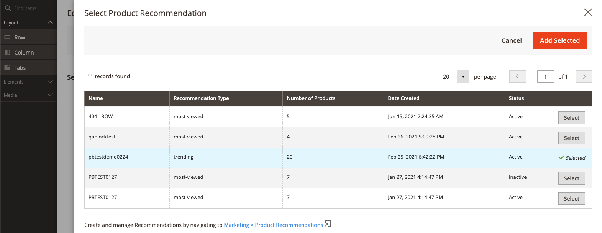

# Aggiungi contenuto - Product Recommendations

Utilizza il _Recommendations del prodotto_ tipo di contenuto per aggiungere un elemento attivo esistente [unità consigli](https://experienceleague.adobe.com/docs/commerce-merchant-services/product-recommendations/admin/create.html) al [[!DNL Page Builder] fase](workspace.md#stage) per una pagina CMS, un blocco o un blocco dinamico.

>[!NOTE]
>
>Il [!DNL Page Builder] _Recommendations del prodotto_ il tipo di contenuto è supportato in Adobe Commerce 2.4.4 e versioni successive e disponibile nella [Prodotto Recommendations metapackage versioni 3.0.x o successive](https://marketplace.magento.com/magento-product-recommendations.html). Da aggiungere [!DNL Page Builder] supporto per Product Recommendations, [vedere le informazioni di installazione](https://experienceleague.adobe.com/docs/commerce-merchant-services/product-recommendations/getting-started/install-configure.html#pbsupport). **Tipo di contenuto non disponibile per il Magento Open Source.**

{{$include /help/_includes/page-builder-save-timeout.md}}

## ToolBox Recommendations del prodotto

| Strumento | Icona | Descrizione |
| --- | --| --- |
| Sposta | {width="25"} | Sposta il contenitore di consigli del prodotto e il relativo contenuto in un’altra posizione sullo stage. |
| Impostazioni | {width="25"} | Apre la pagina Modifica consiglio prodotto, in cui è possibile scegliere l&#39;unità di consigli e modificare le proprietà del contenitore. |
| Nascondi | {width="25"} | Nasconde il contenitore di consigli prodotto corrente e il relativo contenuto. |
| Spettacolo | {width="25"} | Mostra il contenitore per consigli di prodotti nascosto e il relativo contenuto. |
| Duplica | {width="25"} | Crea una copia duplicata del contenitore per consigli di prodotto e del relativo contenuto. |
| Rimuovi | {width="25"} | Elimina dall’area di visualizzazione il contenitore per consigli di prodotto e il relativo contenuto. |

{style="table-layout:auto"}

{{$include /help/_includes/page-builder-hidden-element-note.md}}

## Aggiungi un&#39;unità di consigli esistente

1. Assicurati di avere già [ha creato un’unità di consigli](https://experienceleague.adobe.com/docs/commerce-merchant-services/product-recommendations/admin/create.html) per [!DNL Page Builder] tipo di pagina.

>[!NOTE]
>
>Puoi creare unità di consigli per [!DNL Page Builder] tipo di pagina solo nella visualizzazione store predefinita.

1. Apri la pagina, il blocco o il blocco dinamico in modalità di modifica.

1. Espandi _[!UICONTROL Content]_e fai clic su **[!UICONTROL Edit with Page Builder]**o nell&#39;area di anteprima del contenuto per aprire [!DNL Page Builder] Workspace.

1. In [!DNL Page Builder] pannello in _[!UICONTROL Layout]_, trascina un **[!UICONTROL Row]**segnaposto nell&#39;area di visualizzazione.

1. In [!DNL Page Builder] pannello in _[!UICONTROL Add Content]_, trascina un **[!UICONTROL Product Recommendation]**segnaposto alla riga.

   {width="600" zoomable="yes"}

1. Effettuare una delle seguenti operazioni:

   - Clic **[!UICONTROL Edit Product Recommendation]**.
   - Passa il puntatore del mouse sul contenitore vuoto per visualizzare la casella degli strumenti e fai clic su _Impostazioni_ ({width="20"} ).

   {width="600" zoomable="yes"}

1. In _[!UICONTROL Selection]_, fare clic su **[!UICONTROL Select]**.

1. Nell’elenco dei consigli di prodotto attivi, individua la riga con l’unità di consigli che desideri aggiungere e fai clic su **[!UICONTROL Select]** nell’ultima colonna.

   {width="600" zoomable="yes"}

1. Nell’angolo superiore destro, fai clic su **[!UICONTROL Add Selected]**.

   Il nome del consiglio di prodotto selezionato viene visualizzato nel _[!UICONTROL Selection]_sezione del_[!UICONTROL Edit Product Recommendation]_ pagina.

1. Apporta le modifiche necessarie al [Impostazioni avanzate](#advanced-settings).

   {width="600" zoomable="yes"}

1. Al termine, effettuare le seguenti operazioni:

   - Se si utilizza una finestra del browser completamente ingrandita, fare clic sul pulsante _Chiudi schermo intero_ () nell’angolo superiore destro dell’area di lavoro.

   - Clic **[!UICONTROL Save]** per applicare le impostazioni e tornare al [!DNL Page Builder] Workspace.

   Quando ritorni all’area di visualizzazione, nel contenitore vengono visualizzate le immagini segnaposto del prodotto.

## Modifica impostazioni unità di consigli

1. Passa il puntatore del mouse sul contenitore unità consigli per visualizzare la casella degli strumenti e fai clic su _Impostazioni_ ({width="20"} ).

   {width="600" zoomable="yes"}

1. Apporta le modifiche necessarie al [Impostazioni avanzate](#advanced-settings).

1. Al termine, fai clic su **[!UICONTROL Save]** per applicare le impostazioni e tornare al [!DNL Page Builder] Workspace.

## Duplicare un’unità di consigli

1. Passa il puntatore del mouse sul contenitore unità consigli per visualizzare la casella degli strumenti e fai clic su _Duplica_ ( {width="20"} ) nella casella degli strumenti.

   Il duplicato viene visualizzato immediatamente sotto l&#39;originale.

1. Per spostare l’unità di consigli duplicata in una nuova posizione, passa il cursore del mouse sul contenitore e fai clic su _Sposta_ ( {width="20"} ) nella casella degli strumenti.

1. Seleziona e trascina l’unità di consigli fino a quando la linea guida rossa non viene visualizzata nella nuova posizione.

   Durante lo spostamento dell’unità di consigli, i bordi superiore e inferiore di ciascun contenitore vengono visualizzati come linee tratteggiate.

## Rimuovere un’unità di consigli dalla fase

1. Passa il puntatore del mouse sul contenitore unità consigli e fai clic su _Rimuovi_ ( {width="20"} ) nella casella degli strumenti.

1. Quando viene richiesto di confermare, fai clic su **[!UICONTROL OK]**.

## Impostazioni avanzate

1. Per controllare il posizionamento dell&#39;unità Product Recommendations all&#39;interno del contenitore principale, scegliere **[!UICONTROL Alignment]**:

   | Opzione | Descrizione |
   | ------ | ----------- |
   | `Default` | Applica l&#39;impostazione predefinita di allineamento specificata nel foglio di stile del tema corrente. |
   | `Left` | Allinea l&#39;unità lungo il bordo sinistro del contenitore padre, tenendo conto di eventuali spaziature specificate. |
   | `Center` | Allinea l&#39;unità al centro del contenitore padre, tenendo conto di qualsiasi spaziatura specificata. |
   | `Right` | Allinea l&#39;unità lungo il bordo destro del contenitore principale, tenendo conto di qualsiasi spaziatura specificata. |

   {style="table-layout:auto"}

1. Imposta il **[!UICONTROL Border]** stile applicato a tutti e quattro i lati dell&#39;unità Recommendations del prodotto:

   | Opzione | Descrizione |
   | ------ | ----------- |
   | `Default` | Applica lo stile di bordo predefinito specificato dal foglio di stile associato. |
   | `None` | Non fornisce alcuna indicazione visibile dei bordi delle unità. |
   | `Dotted` | Il bordo dell&#39;unità viene visualizzato come una linea tratteggiata. |
   | `Dashed` | Il bordo unità viene visualizzato come una linea tratteggiata. |
   | `Solid` | Il bordo dell&#39;unità viene visualizzato come linea continua. |
   | `Double` | Il bordo dell&#39;unità viene visualizzato come una doppia riga. |
   | `Groove` | Il bordo unità viene visualizzato come una linea scanalata. |
   | `Ridge` | Il bordo unità viene visualizzato come una linea scanalata. |
   | `Inset` | Il bordo dell&#39;unità viene visualizzato come una linea di inserimento. |
   | `Outset` | Il bordo dell&#39;unità viene visualizzato come una linea di contorno. |

   {style="table-layout:auto"}

1. Se si imposta uno stile di bordo diverso da `None`, completare le opzioni di visualizzazione del bordo:

   | Opzione | Descrizione |
   | ------ |------------ |
   | [!UICONTROL Border Color] | Specificate il colore scegliendo un campione, facendo clic sul selettore del colore oppure immettendo un nome di colore valido o un valore esadecimale equivalente. |
   | [!UICONTROL Border Width] | Immettere il numero di pixel per lo spessore della linea del bordo. |
   | [!UICONTROL Border Radius] | Immettere il numero di pixel per definire la dimensione del raggio utilizzato per arrotondare ogni angolo del bordo. |

   {style="table-layout:auto"}

1. (Facoltativo) Specifica i nomi di **[!UICONTROL CSS classes]** dal foglio di stile corrente da applicare all&#39;unità.

   Separare più nomi di classe con uno spazio.

1. Immetti i valori, in pixel, per il **[!UICONTROL Margins and Padding]** per determinare i margini esterni e la spaziatura interna dell&#39;unità.

   Immettere i valori corrispondenti nel diagramma.

   | Area contenitore | Descrizione |
   | ------ | ----------- |
   | [!UICONTROL Margins] | Quantità di spazio vuoto applicata al bordo esterno di tutti i lati dell&#39;unità. Opzioni: `Top` / `Right` / `Bottom` / `Left` |
   | [!UICONTROL Padding] | Quantità di spazio vuoto applicata allo spigolo interno di tutti i lati dell&#39;unità. Opzioni: `Top` / `Right` / `Bottom` / `Left` |

   {style="table-layout:auto"}
