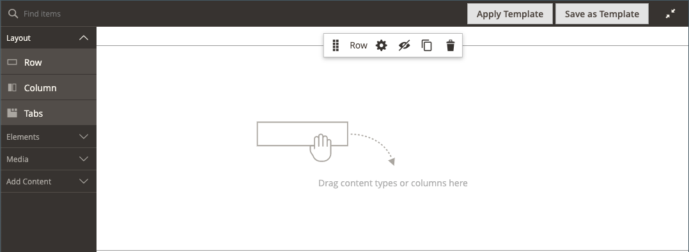

# Layout - Riga

Utilizza il tipo di contenuto _Riga_ per aggiungere una riga nella [[!DNL Page Builder] fase](workspace.md#stage).

{{$include /help/_includes/page-builder-save-timeout.md}}

## Casella degli strumenti Riga

La casella degli strumenti riga viene visualizzata quando si passa il puntatore del mouse sul contenitore riga. La casella degli strumenti include opzioni per spostare, nascondere, duplicare, modificare o rimuovere la riga. La selezione delle impostazioni determina l&#39;aspetto, lo sfondo e il layout della riga. È possibile trascinare altri elementi di contenuto nella riga dal pannello [!DNL Page Builder] a sinistra.

{width="600" zoomable="yes"}

| Strumento | Icona | Descrizione |
| --------- | ---------- | ----------- |
| Sposta | {width="25"} | Sposta la riga in un&#39;altra posizione rispetto alle altre righe sullo stage. |
| (etichetta) | [!UICONTROL Row] | Identifica il contenitore di contenuto corrente come riga. Passa il cursore del mouse sul contenitore per visualizzare la casella degli strumenti. |
| Impostazioni | {width="25"} | Apre la pagina Modifica riga, in cui è possibile modificare le proprietà del contenitore. |
| Nascondi | {width="25"} | Nasconde la riga corrente. |
| Spettacolo | {width="25"} | Mostra la riga nascosta. |
| Duplica | {width="25"} | Crea una copia della riga. |
| Rimuovi | {width="25"} | Elimina dall’area di visualizzazione il contenitore righe e il relativo contenuto. |

{style="table-layout:auto"}

{{$include /help/_includes/page-builder-hidden-element-note.md}}

## Aggiungi una riga

1. Nel pannello [!DNL Page Builder] sotto _[!UICONTROL Layout]_, trascina un nuovo **[!UICONTROL Row]**nell&#39;area di visualizzazione, appena sotto la prima riga.

1. Per formattare la riga, passa il puntatore del mouse sul contenitore della riga per visualizzare la casella degli strumenti e scegli l&#39;icona _Impostazioni_ ( {width="20"} ).

   Utilizzare le sezioni seguenti per informazioni dettagliate sul completamento delle impostazioni disponibili.

   {width="600" zoomable="yes"}

## Modificare le impostazioni delle righe

1. Passa il puntatore del mouse sul contenitore righe per visualizzare la casella degli strumenti e scegli l&#39;icona _Impostazioni_ ( {width="20"} ).

   {width="600" zoomable="yes"}

1. Utilizzare le sezioni seguenti per informazioni dettagliate sull&#39;aggiornamento delle impostazioni disponibili.

1. Al termine, fare clic su **[!UICONTROL Save]** per applicare le impostazioni e tornare all&#39;area di lavoro [!DNL Page Builder].

## Aspetto

Utilizza le impostazioni _Aspetto_ per determinare la modalità di visualizzazione del contenuto nella riga.

{width="600" zoomable="yes"}

- Per determinare la modalità di visualizzazione del colore e/o dell&#39;immagine di sfondo in relazione al contenitore e alla larghezza dell&#39;area contenuto, scegliere l&#39;allineamento:

  | Opzione | Descrizione |
  | ------ | ----------- |
  | [!UICONTROL Contained] | Il colore o l’immagine di sfondo è limitato alla larghezza massima della pagina definita dal tema. |
  | [!UICONTROL Full Width] | Limita il contenuto alla larghezza massima della pagina definita dal tema. Il colore e/o l’immagine di sfondo non sono limitati e si estende per l’intera larghezza della riga. |
  | [!UICONTROL Full Bleed] | Il contenuto e l’immagine di sfondo e/o il colore non sono limitati ed estendono l’intera larghezza della riga. L&#39;opzione Intero al vivo può essere utilizzata solo con [temi](../content-design/themes.md) che supportano il layout. |

  {style="table-layout:auto"}

- Immettere **[!UICONTROL Minimum Height]** per la riga. Questo valore può essere un numero con qualsiasi unità CSS valida (ad esempio `100px`, `50%`, `50em`, `100vh`) o un calcolo (ad esempio `100vh - 237px`).

  Ad esempio, puoi impostare l’altezza minima di una riga per estendere l’intera altezza della pagina, fornendo opzioni interessanti per immagini e video di sfondo di pagina intera.

- Scegliere un&#39;impostazione **[!UICONTROL Vertical Alignment]** per allineare tutti i contenitori di contenuto aggiunti alla riga (superiore, centrale o inferiore).

## Informazioni di base

Sono disponibili molte opzioni per definire la visualizzazione di sfondo di una riga. Potete applicare un colore semplice o un&#39;immagine di sfondo e gestire effetti più sofisticati.

### Colore di sfondo

Specificate il colore di sfondo scegliendo un campione, facendo clic sul selettore del colore o immettendo un nome di colore valido o un valore esadecimale equivalente. Questa impostazione determina il colore di sfondo della riga. Potete anche regolare l&#39;opacità del colore.

{width="200"}

È possibile impostare il valore in uno dei tre modi seguenti:

- Un nome di colore predefinito, ad esempio `White`
- Valore esadecimale del colore, ad esempio `#ffffff`
- Il valore rgba del colore, con percentuale di opacità, ad esempio `rgba(255, 255, 255, 0.75)`

Per scegliere un colore, fare clic sul campione a sinistra della casella _Nessun colore_.

{width="600" zoomable="yes"}

Se fate clic sulla casella del colore per aprire nuovamente il selettore colore, la casella sotto il cursore mostra i valori correnti di rosso, verde, blu e alfa (rgba). L&#39;ultimo numero indica la percentuale di opacità corrente come valore decimale. È possibile utilizzare il dispositivo di scorrimento per regolare l&#39;opacità o immettere il valore decimale desiderato.

{width="600" zoomable="yes"}

>[!NOTE]
>
>[!DNL Page Builder] supporta anche un livello di trasparenza, o _canale alfa_, nelle immagini di sfondo che possono essere utilizzate per creare sfondi con diversi gradi di opacità.

### [!UICONTROL Background Type]

Un tipo di sfondo può essere un&#39;immagine o un video. [!DNL Page Builder] utilizza `Image` per impostazione predefinita e mostra varie impostazioni immagine. Se si seleziona `Video`, [!DNL Page Builder] scambia le impostazioni dell&#39;immagine con le impostazioni video. Entrambi i tipi di sfondo sono descritti come segue.

{width="200"}

### Impostazioni del tipo di immagine

Se si imposta _[!UICONTROL Background Type]_su `Image`, utilizzare le impostazioni seguenti per definire la visualizzazione dell&#39;immagine di sfondo.

{width="600" zoomable="yes"}

- **[!UICONTROL Background Image]** - Se necessario, utilizzare gli strumenti forniti per scegliere un&#39;immagine di sfondo da applicare alla riga:

  | Opzione | Descrizione |
  | ------ | ----------- |
  | [!UICONTROL Upload] | Carica un file di immagine dal computer locale alla raccolta e quindi lo applica come immagine di sfondo per la riga. |
  | [!UICONTROL Select from Gallery] | Richiede di scegliere un&#39;immagine esistente dalla raccolta come immagine di sfondo per la riga. |
  | {width="25"} | Consente di trascinare l&#39;immagine nella sezione della fotocamera o di spostarsi sull&#39;immagine nel file system locale. |

  {style="table-layout:auto"}

- **[!UICONTROL Background Mobile Image]** - Se necessario, utilizzare gli stessi strumenti per scegliere un&#39;immagine di sfondo diversa da utilizzare per la visualizzazione sui dispositivi mobili.

- **[!UICONTROL Background Size]** - Impostare questa opzione per determinare il ridimensionamento dell&#39;immagine di sfondo in relazione alla larghezza della riga:

  | Opzione | Descrizione |
  | ------ | ----------- |
  | `Cover` | L&#39;immagine di sfondo copre l&#39;intera larghezza della riga. |
  | `Contain` | L&#39;immagine di sfondo è limitata alla larghezza dell&#39;area dei contenuti. |
  | `Auto` | Applica le dimensioni dal foglio di stile corrente. |

  {style="table-layout:auto"}

  {width="250"}

- **[!UICONTROL Background Position]** - Impostare questa opzione per determinare il modo in cui l&#39;immagine di sfondo viene ancorata in relazione alla riga:

  | Punto di ancoraggio | Posizione |
  | ------ | ----------- |
  | `Top` | Sinistra/Centro/Destra |
  | `Center` | Sinistra/Centro/Destra |
  | `Bottom` | Sinistra/Centro/Destra |

  {style="table-layout:auto"}

  Il punto di ancoraggio è simile a una spina che collega l&#39;immagine alla riga nella posizione di sfondo specificata.

- **[!UICONTROL Background Attachment]** - Impostare il tipo di allegato per determinare la modalità di spostamento dell&#39;immagine di sfondo in relazione alla pagina di scorrimento:

  | Opzione | Descrizione |
  | ------ | ----------- |
  | `Scroll` | L&#39;immagine di sfondo collegata viene sincronizzata per spostarsi verso il basso durante lo scorrimento della pagina. Utilizzate Sfondo parallax (Parallax Background) per controllare la velocità di scorrimento. |
  | `Fixed` | (Non disponibile per dispositivi mobili) L’immagine di sfondo non si sposta quando il contenitore scorre sopra l’immagine ed è fisso nella posizione di sfondo specificata. |

  {style="table-layout:auto"}

- **[!UICONTROL Background Repeat]** - Impostare su `Yes` per ripetere l&#39;immagine di sfondo per riempire lo spazio disponibile nella riga.

### Impostazioni del tipo di video

Se si imposta il _Tipo di sfondo_ su `Video`, utilizzare le impostazioni seguenti per definire la visualizzazione dell&#39;immagine di sfondo.

- **[!UICONTROL Video URL]** - Immettere un URL video valido. Gli URL video validi possono essere collegamenti a:

   - Video su YouTube: `https://youtu.be/CoDhMRUUjeI`
   - Video su Vimeo: `https://vimeo.com/190156113`
   - File video validi (`.mp4` è consigliato): `https://myvideos.com/spiral.mp4`

  {width="300"}

- **[!UICONTROL Overlay Color]** - Selezionare un colore per applicare una tinta trasparente al video.

- **[!UICONTROL Infinite Loop]** - Imposta su `No` per riprodurre il video una volta e arrestarlo. Se questa opzione è impostata su `Yes` (impostazione predefinita), il video viene ripetuto in un ciclo infinito.

- **[!UICONTROL Lazy Load]** - Imposta su `No` per caricare il video con la pagina, anche quando non è visibile. Se questa opzione è impostata su `Yes` (impostazione predefinita), il video viene caricato dall&#39;origine solo se visibile sullo schermo.

- **[!UICONTROL Play Only When Visible]** - Impostare su `No` per avviare la riproduzione del video subito dopo il caricamento, indipendentemente dal fatto che sia visibile o meno. Se questa opzione è impostata su `Yes` (impostazione predefinita), la riproduzione del video inizia solo quando è visibile.

- **[!UICONTROL Fallback Image]** - Se necessario, specificare un&#39;immagine da visualizzare sullo schermo prima del caricamento del video e se il video non viene caricato per qualche motivo.

## Sfondo Parallax

Utilizza queste opzioni per controllare la velocità di scorrimento di un’immagine o di un video di sfondo in relazione allo scorrimento della pagina. Lo sfondo può essere impostato per scorrere più lentamente per creare un senso di immersione.

- Imposta **Abilita sfondo Parallax** su `Yes`.
- Immettere la **Velocità Parallax** come valore decimale compreso tra `-1.0` e `2.0`.

{width="600" zoomable="yes"}

## Avanzate

- Per controllare il posizionamento orizzontale dei contenitori di contenuto aggiunti alla riga, scegliere un **[!UICONTROL Alignment]**:

  | Opzione | Descrizione |
  | ------ | ----------- |
  | `Default` | Applica l&#39;impostazione predefinita di allineamento specificata nel foglio di stile del tema corrente. |
  | `Left` | Allinea i contenitori di contenuto lungo il bordo sinistro del contenitore di righe, tenendo conto della spaziatura specificata. |
  | `Center` | Allinea il contenitore di contenuto al centro del contenitore di righe, tenendo conto di eventuali spaziature specificate. |
  | `Right` | Allinea il contenitore di contenuto al bordo destro del contenitore di righe, tenendo conto della spaziatura specificata. |

  {style="table-layout:auto"}

- Imposta lo stile **[!UICONTROL Border]** applicato a tutti e quattro i lati del contenitore righe:

  | Opzione | Descrizione |
  | ------ | ----------- |
  | `Default` | Applica lo stile di bordo predefinito specificato dal foglio di stile associato. |
  | `None` | Non fornisce alcuna indicazione visibile dei bordi del contenitore. |
  | `Dotted` | Il bordo del contenitore viene visualizzato come una linea tratteggiata. |
  | `Dashed` | Il bordo del contenitore viene visualizzato come una linea tratteggiata. |
  | `Solid` | Il bordo del contenitore viene visualizzato come linea continua. |
  | `Double` | Il bordo del contenitore viene visualizzato come una doppia riga. |
  | `Groove` | Il bordo del contenitore viene visualizzato come una linea scanalata. |
  | `Ridge` | Il bordo del contenitore viene visualizzato come una linea scanalata. |
  | `Inset` | Il bordo del contenitore viene visualizzato come una linea interna. |
  | `Outset` | Il bordo del contenitore viene visualizzato come una linea di contorno. |

  {style="table-layout:auto"}

- Se si imposta uno stile di bordo diverso da `None`, completare le opzioni di visualizzazione del bordo:

  {width="600" zoomable="yes"}

  | Opzione | Descrizione |
  | ------ |------------ |
  | [!UICONTROL Border Color] | Specificate il colore scegliendo un campione, facendo clic sul selettore del colore oppure immettendo un nome di colore valido o un valore esadecimale equivalente. |
  | [!UICONTROL Border Width] | Immettere il numero di pixel per lo spessore della linea del bordo. |
  | [!UICONTROL Border Radius] | Immettere il numero di pixel per definire la dimensione del raggio utilizzato per arrotondare ogni angolo del bordo. |

  {style="table-layout:auto"}

  La riga nell&#39;esempio seguente ha un raggio di bordo pari a 15.

  {width="500"}

- (Facoltativo) Specificare i nomi di **[!UICONTROL CSS classes]** dal foglio di stile corrente da applicare al contenitore righe.

  Separare più nomi di classe con uno spazio.

- Immettere i valori in pixel per **[!UICONTROL Margins and Padding]** per specificare i margini esterni e la spaziatura interna della riga.

  Immettere ogni valore corrispondente nel diagramma contenitore righe.

  | Area contenitore | Descrizione |
  | -------------- | ----------- |
  | [!UICONTROL Margins] | Quantità di spazio vuoto applicata al bordo esterno di tutti i lati del contenitore. Opzioni: `Top` / `Right` / `Bottom` / `Left` |
  | [!UICONTROL Padding] | Quantità di spazio vuoto applicata al bordo interno di tutti i lati del contenitore. Opzioni: `Top` / `Right` / `Bottom` / `Left` |

  {style="table-layout:auto"}

  {width="600" zoomable="yes"}
