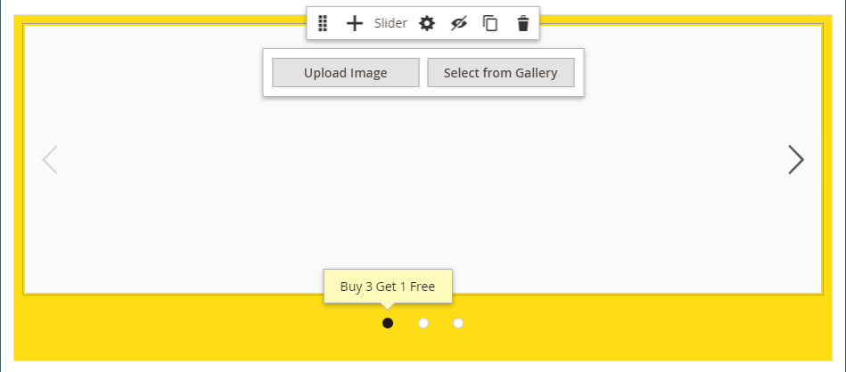

# Media - Cursore

Utilizza il tipo di contenuto _Slider_ per aggiungere una presentazione di immagini allo [[!DNL Page Builder] stage](workspace.md#stage). Puoi caricare nuove immagini o scegliere quelle esistenti dalla galleria o dal catalogo dei prodotti. Un dispositivo di scorrimento può essere impostato per la riproduzione automatica o controllato manualmente con i pulsanti di navigazione. Per associare il cursore a una promozione specifica, vedere [Blocco dinamico](dynamic-block.md).

{width="700" zoomable="yes"}

{{$include /help/_includes/page-builder-save-timeout.md}}

## Caselle degli strumenti

Quando si utilizza il tipo di contenuto Dispositivo di scorrimento, è possibile aggiungere e modificare singole diapositive e il relativo contenitore che contiene una o più diapositive. Ogni diapositiva dispone della propria casella degli strumenti che consente di progettare diapositive sullo stage [!DNL Page Builder].

## Casella degli strumenti di una singola diapositiva

{width="500" zoomable="yes"}

| Strumento | Icona | Descrizione |
|--- |--- |--- |
| Sposta | {width="25"} | Sposta la diapositiva in un&#39;altra posizione sul dispositivo di scorrimento. |
| (etichetta) | N. diapositiva | Identifica il numero della diapositiva corrente. |
| Impostazioni | {width="25"} | Apre la pagina _[!UICONTROL Edit Slide]_, in cui è possibile modificare le proprietà della diapositiva corrente. |
| Duplica | {width="25"} | Crea una copia della diapositiva corrente. |
| Rimuovi | {width="25"} | Elimina la diapositiva corrente dal cursore. |

{style="table-layout:auto"}

## Casella degli strumenti cursore

| Strumento | Icona | Descrizione |
|--- |--- |--- |
| Sposta | {width="25"} | Sposta il dispositivo di scorrimento in un&#39;altra posizione sullo stage. |
| (etichetta) | [!UICONTROL Slider] | Identifica il contenitore cursore. |
| Impostazioni | {width="25"} | Apre la pagina _[!UICONTROL Edit Slider]_, in cui è possibile modificare le proprietà del video e del contenitore. |
| Nascondi | {width="25"} | Nasconde il cursore corrente. |
| Spettacolo | {width="25"} | Mostra il cursore nascosto. |
| Duplica | {width="25"} | Crea una copia del cursore. |
| Rimuovi | {width="25"} | Elimina il cursore dall&#39;area di visualizzazione. |

{style="table-layout:auto"}

{{$include /help/_includes/page-builder-hidden-element-note.md}}

## Aggiungere una singola diapositiva

1. Aprire la pagina, il blocco o il blocco dinamico in cui si desidera posizionare il dispositivo di scorrimento ed espandere la sezione **[!UICONTROL Content]**.

1. Nel pannello [!DNL Page Builder], espandi **[!UICONTROL Media]** e trascina un segnaposto **[!UICONTROL Slider]** in una riga, colonna o scheda sull&#39;area di visualizzazione.

   Nell&#39;esempio seguente il colore di sfondo della riga è giallo (`#fffd16`).

   {width="600" zoomable="yes"}

   Il contenitore del dispositivo di scorrimento viene visualizzato sullo stage con una singola diapositiva vuota.

1. Fare clic nel contenitore del dispositivo di scorrimento per visualizzare l&#39;[editor di testo](../content-design/editor.md) e immettere il contenuto per la prima diapositiva.

   È inoltre possibile includere contenuto banner più complesso utilizzando le impostazioni [Contenuto](#content).

1. Fai clic sul punto di navigazione nella parte inferiore del cursore per visualizzare la casella degli strumenti per la singola diapositiva e scegli l&#39;icona _Impostazioni_ ( {width="20"} ).

   I cursori dispongono di due caselle degli strumenti. Assicurarsi di utilizzare la casella degli strumenti della diapositiva nella parte inferiore.

1. Completare le impostazioni, se necessario, in base alle sezioni seguenti:

   - [[!UICONTROL Appearance]](#appearance)
   - [[!UICONTROL Background]](#background)
   - [[!UICONTROL Content]](#content)
   - [[!UICONTROL Search Engine Optimization]](#seo)
   - [[!UICONTROL Advanced]](#advanced)

1. Al termine, fare clic su **[!UICONTROL Save]** per applicare le impostazioni e tornare all&#39;area di lavoro [!DNL Page Builder].

## Aggiungi altre diapositive

Nelle sezioni seguenti viene descritta una serie di passaggi per iniziare con una singola diapositiva e creare un cursore reattivo che presenta funzioni e collegamenti a prodotti specifici. Se non si dispone già di una singola diapositiva, seguire le istruzioni precedenti per aggiungere una singola diapositiva all&#39;area di visualizzazione.

Per aggiungere diapositive, utilizzare uno dei metodi seguenti o una loro combinazione:

### Metodo 1: duplicare una diapositiva esistente

È possibile risparmiare tempo duplicando una diapositiva già configurata con le impostazioni necessarie.

1. Fai clic sul punto di navigazione sotto la diapositiva per visualizzare la casella degli strumenti e scegli l&#39;icona _Duplica_ ( {width="20"} ).

   {width="500" zoomable="yes"}

1. Fai clic sul punto di navigazione per la nuova diapositiva e per visualizzare la casella degli strumenti e scegli l&#39;icona _Impostazioni_ ( {width="20"} ).

1. Modificare le impostazioni in base alle esigenze, secondo le sezioni riportate di seguito.

   - [[!UICONTROL Appearance]](#appearance)
   - [[!UICONTROL Background]](#background)
   - [[!UICONTROL Content]](#content)
   - [[!UICONTROL Advanced]](#advanced)

1. Al termine, fare clic su **[!UICONTROL Save]** per applicare le impostazioni e tornare all&#39;area di lavoro [!DNL Page Builder].

### Metodo 2: aggiungere una nuova diapositiva vuota

1. Passa il cursore del mouse sul contenitore nella parte superiore per visualizzare la casella degli strumenti e scegli l&#39;icona _Aggiungi_ ( {width="20"} ).

   {width="500" zoomable="yes"}

   Una nuova diapositiva vuota con un punto di navigazione e una casella degli strumenti specifici viene aggiunta al dispositivo di scorrimento e visualizzata sullo stage.

   {width="500" zoomable="yes"}

1. Fai clic sul punto di navigazione per la nuova diapositiva e per visualizzare la casella degli strumenti e scegli l&#39;icona _Impostazioni_ ( {width="20"} ).

1. Modificare le impostazioni in base alle esigenze, secondo le sezioni riportate di seguito.

   - [[!UICONTROL Appearance]](#appearance)
   - [[!UICONTROL Background]](#background)
   - [[!UICONTROL Content]](#content)
   - [[!UICONTROL Advanced]](#advanced)

1. Al termine, fare clic su **[!UICONTROL Save]** nell&#39;angolo superiore destro per chiudere la pagina _[!UICONTROL Edit Slide]_.

### Aggiungere un widget a una diapositiva

È possibile aggiungere qualsiasi tipo di [widget](../content-design/widgets.md#widget-types) alla diapositiva in una fase di [!DNL Page Builder] seguendo la procedura seguente:

1. [Creare il widget](../content-design/widget-create.md) che si desidera visualizzare in una diapositiva.

1. Aprire la pagina, il blocco o il blocco dinamico in cui si desidera posizionare il dispositivo di scorrimento ed espandere la sezione **[!UICONTROL Content]**.

1. Nel pannello [!DNL Page Builder], espandi **[!UICONTROL Media]** e trascina un segnaposto **[!UICONTROL Slider]** in una riga, colonna o scheda sull&#39;area di visualizzazione.

1. Fare clic nel contenitore del dispositivo di scorrimento per visualizzare la barra degli strumenti [editor di testo](../content-design/editor.md) e fare clic sull&#39;icona _Inserisci widget_ ( {width="20"} ).

1. Seleziona **[!UICONTROL Widget Type]** necessari.

1. Specifica le impostazioni, che sono diverse a seconda del tipo di widget

   {width="600" zoomable="yes"}

1. Al termine, fare clic su **[!UICONTROL Insert Widget]** nell&#39;angolo superiore destro.

1. Modificare le altre impostazioni in base alle esigenze.

1. Al termine, fare clic su **[!UICONTROL Save]** nell&#39;angolo superiore destro.

   {width="600" zoomable="yes"}

### Visualizza ogni diapositiva

Per visualizzare tutte le diapositive sullo stage, fare clic sul punto successivo sotto la diapositiva visualizzata.

{width="500" zoomable="yes"}

La diapositiva nell’esempio precedente presenta un’immagine di sfondo, un’immagine mobile trasparente e un’immagine in linea aggiunta dall’editor di testo. Questa tecnica funziona bene sui dispositivi mobili disattivando l’immagine di sfondo e visualizzando solo l’immagine in linea più piccola. La diapositiva prodotto in questo esempio presenta le seguenti impostazioni aggiuntive:

| Opzione | Impostazione di esempio |
|--- |--- |
| [!UICONTROL Appearance] | `Collage Right` |
| [!UICONTROL Background Color] | `#ffffff` (bianco) |
| [!UICONTROL Background Image] | L&#39;immagine in questa diapositiva è stata salvata dalla pagina del prodotto e caricata nella raccolta. |
| [!UICONTROL Mobile Background Image] | L’immagine di sfondo mobile è un’immagine trasparente quadrata di 10 pixel. L’utilizzo di un’immagine vuota per dispositivi mobili sostituisce efficacemente l’immagine di sfondo standard con un’immagine invisibile. |
| [!UICONTROL Background Size] | `Auto` |
| [!UICONTROL Message Text] | `Minerva LumaTech&trade; V-Tee` (Allinea al centro) con l&#39;immagine inserita ridimensionata al 40% (Allinea al centro) |
| [!UICONTROL Link] | `Product` |
| [!UICONTROL Show Button] | `Always` |
| [!UICONTROL Button Text] | `Buy Now` |
| [!UICONTROL Show Overlay] | `Never Show` |
| [!UICONTROL Alignment] | `Center` (per allineare il pulsante) |
| [!UICONTROL Border] | `Solid` |
| [!UICONTROL Border Color] | `#000000` (nero) |
| [!UICONTROL Border Width] | `1 px` |

{style="table-layout:auto"}

## Modificare le impostazioni delle singole diapositive

1. Modificare la visualizzazione del dispositivo di scorrimento sullo stage e visualizzare la diapositiva che si desidera modificare.

1. Nella casella degli strumenti delle singole diapositive, scegliere l&#39;icona _Impostazioni_ ( {width="20"} ) e completare le impostazioni, in base alle esigenze, in base alle sezioni seguenti.

1. Nell&#39;angolo superiore destro fare clic su **[!UICONTROL Save]** per applicare le impostazioni e tornare all&#39;area di lavoro [!DNL Page Builder].

### [!UICONTROL Appearance]

1. Scegliete uno dei seguenti tipi di posizionamento delle diapositive:

   | Tipo | Descrizione |
   | ---- | ----------- |
   | `Poster` | Centra il contenuto della diapositiva nel contenitore cursore. La sovrapposizione, se utilizzata, estende l&#39;intera larghezza del dispositivo di scorrimento. |
   | `Collage Left` | Inserisce il contenuto della diapositiva in un&#39;area definita sul lato sinistro del contenitore del dispositivo di scorrimento. La sovrapposizione, se utilizzata, copre solo l&#39;area definita. |
   | `Collage Center` | Posiziona il contenuto della diapositiva in un&#39;area definita centrata sul contenitore del dispositivo di scorrimento. La sovrapposizione, se utilizzata, copre solo l&#39;area definita. |
   | `Collage Right` | Inserisce il contenuto della diapositiva in un&#39;area definita sul lato destro del contenitore del dispositivo di scorrimento. La sovrapposizione, se utilizzata, copre solo l&#39;area definita. |

   {style="table-layout:auto"}

   {width="600" zoomable="yes"}

1. Immettere **[!UICONTROL Slide Name]**.

   Quando si utilizza la modalità di modifica, il nome della diapositiva viene visualizzato come descrizione comando sopra il punto di navigazione. Il nome della diapositiva non è visibile dalla vetrina.

   {width="500" zoomable="yes"}

1. Immettere **[!UICONTROL Minimum Height]** per la diapositiva.

   L&#39;altezza minima può essere un numero con qualsiasi unità CSS valida (come `100px`, `50%`, `50em`, `100vh`) o un calcolo (come `100vh - 237px`).

   Ad esempio, puoi impostare l’altezza minima della diapositiva in modo da coprire l’intera altezza della pagina, quindi utilizzare immagini e video di sfondo per opzioni di progettazione interessanti.

   >[!NOTE]
   >
   >Quando la diapositiva è impostata sull&#39;altezza completa della pagina (100 vh), il dispositivo di scorrimento che contiene la diapositiva estende anche l&#39;altezza completa della pagina per adattarla all&#39;altezza della diapositiva.

## [!UICONTROL Background]

Sono disponibili molte opzioni per definire la visualizzazione di sfondo di una diapositiva. Potete applicare un colore semplice o un&#39;immagine di sfondo e gestire effetti più sofisticati.

### [!UICONTROL Background Color]

Specificate il colore di sfondo scegliendo un campione, facendo clic sul selettore del colore o immettendo un nome di colore valido o un valore esadecimale equivalente. Questa impostazione determina il colore di sfondo della riga. Potete anche regolare l&#39;opacità del colore.

{width="200"}

È possibile impostare il valore in uno dei tre modi seguenti:

- Un nome di colore predefinito, ad esempio `White`
- Valore esadecimale del colore, ad esempio `#ffffff`
- Il valore rgba del colore, con percentuale di opacità, ad esempio `rgba(255, 255, 255, 0.75)`

Per scegliere un colore, fare clic sul campione a sinistra della casella _Nessun colore_.

{width="600" zoomable="yes"}

Se fate clic sulla casella del colore per aprire nuovamente il selettore colore, la casella sotto il cursore mostra i valori correnti di rosso, verde, blu e alfa (rgba). L&#39;ultimo numero indica la percentuale di opacità corrente come valore decimale. È possibile utilizzare il dispositivo di scorrimento per regolare l&#39;opacità o immettere il valore decimale desiderato.

{width="600" zoomable="yes"}

>[!NOTE]
>
>[!DNL Page Builder] supporta anche un livello di trasparenza, o _canale alfa_, nelle immagini di sfondo che possono essere utilizzate per creare sfondi con diversi gradi di opacità.

### [!UICONTROL Background Type]

Un tipo di sfondo può essere un&#39;immagine o un video. [!DNL Page Builder] utilizza `Image` per impostazione predefinita e mostra varie impostazioni immagine. Se si seleziona `Video`, [!DNL Page Builder] scambia le impostazioni dell&#39;immagine con le impostazioni video. Entrambe le impostazioni del tipo di sfondo sono descritte nelle sezioni seguenti.

{width="400"}

### Impostazioni del tipo di immagine

Se si imposta _[!UICONTROL Background Type]_su `Image`, utilizzare le impostazioni seguenti per definire la visualizzazione dell&#39;immagine di sfondo.

{width="600" zoomable="yes"}

- **[!UICONTROL Background Image]** - Se necessario, utilizzare gli strumenti forniti per scegliere un&#39;immagine di sfondo da applicare al banner:

  | Strumento | Descrizione |
  | ---- | ----------- |
  | [!UICONTROL Upload] | Carica un file di immagine dal computer locale alla raccolta e lo applica come immagine di sfondo del banner. |
  | [!UICONTROL Select from Gallery] | Richiede di scegliere un&#39;immagine esistente dalla raccolta come immagine di sfondo per il banner. |
  | {width="25"} | Consente di trascinare l&#39;immagine nella sezione della fotocamera o di spostarsi sull&#39;immagine nel file system locale. |

  {style="table-layout:auto"}

- **[!UICONTROL Background Mobile Image]** - Se necessario, utilizzare gli stessi strumenti per scegliere un&#39;immagine di sfondo diversa da utilizzare per la visualizzazione sui dispositivi mobili.

- **[!UICONTROL Background Size]** - Scegliere come ridimensionare l&#39;immagine di sfondo in relazione alla larghezza del banner:

  | Opzione | Descrizione |
  | ------ | ----------- |
  | `Cover` | L&#39;immagine di sfondo copre l&#39;intera larghezza del banner. |
  | `Contain` | L&#39;immagine di sfondo è limitata alla larghezza dell&#39;area dei contenuti. |
  | `Auto` | Applica le dimensioni dal foglio di stile corrente. |

  {style="table-layout:auto"}

  {width="400"}

- **[!UICONTROL Background Position]** - Scegli come l&#39;immagine di sfondo viene ancorata in relazione al banner:

  | Punto di ancoraggio | Posizione |
  | ------------ | -------- |
  | `Top` | Sinistra/Centro/Destra |
  | `Center` | Sinistra/Centro/Destra |
  | `Bottom` | Sinistra/Centro/Destra |

  {style="table-layout:auto"}

  Il punto di ancoraggio è simile a una spina che collega l&#39;immagine al banner nella posizione di sfondo specificata.

- **[!UICONTROL Background Repeat]** - Se si desidera ripetere l&#39;immagine di sfondo per riempire lo spazio, modificare questa impostazione `Yes`.

### Impostazioni del tipo di video

Se si imposta il _Tipo di sfondo_ su `Video`, utilizzare le impostazioni seguenti per definire la visualizzazione dell&#39;immagine di sfondo.

- **[!UICONTROL Video URL]** - Immettere un URL video valido. Gli URL video validi possono essere collegamenti a:

   - Video su YouTube: `https://youtu.be/CoDhMRUUjeI`
   - Video su Vimeo: `https://vimeo.com/190156113`
   - File video validi (`.mp4` è consigliato): `https://myvideos.com/spiral.mp4`

  {width="500"}

- **[!UICONTROL Overlay Color]** - Selezionare un colore per applicare una tinta trasparente al video.

- **[!UICONTROL Infinite Loop]** - Imposta su `No` per riprodurre il video una volta e arrestarlo. Se questa opzione è impostata su `Yes` (impostazione predefinita), il video viene ripetuto in un ciclo infinito.

- **[!UICONTROL Lazy Load]** - Imposta su `No` per caricare il video con la pagina, anche quando non è visibile. Se questa opzione è impostata su `Yes` (impostazione predefinita), il video viene caricato dall&#39;origine solo se visibile sullo schermo.

- **[!UICONTROL Play Only When Visible]** - Impostare su `No` per avviare la riproduzione del video subito dopo il caricamento, indipendentemente dal fatto che sia visibile o meno. Se questa opzione è impostata su `Yes` (impostazione predefinita), la riproduzione del video inizia solo quando è visibile.

- **[!UICONTROL Fallback Image]** - Se necessario, specificare un&#39;immagine da visualizzare sullo schermo prima del caricamento del video e se il video non viene caricato per qualche motivo.

## [!UICONTROL Content]

È possibile modificare il contenuto della diapositiva direttamente sullo stage o quando si modificano le impostazioni. Le impostazioni forniscono funzioni di contenuto più complesse, ad esempio collegamenti e pulsanti delle diapositive, e sovrapposizioni. La posizione del contenuto riflette l&#39;impostazione di posizionamento [Aspetto](#appearance).

### Contenuto semplice sull’area di visualizzazione

1. Fare clic sul segnaposto o sul testo esistente e immettere il nuovo testo che si desidera visualizzare nella diapositiva.

   La barra degli strumenti dell&#39;editor viene visualizzata sopra la casella di testo.

1. Utilizza la barra degli strumenti dell’editor per immettere e formattare il testo, nonché per inserire elementi quali collegamenti, immagini e widget.

   {width="500" zoomable="yes"}

### Contenuto complesso nelle impostazioni

1. Fai clic sul punto di navigazione nella parte inferiore del cursore per visualizzare la casella degli strumenti per la singola diapositiva e scegli l&#39;icona _Impostazioni_ ( {width="20"} ).

1. Nella sezione _[!UICONTROL Content]_, immettere **[!UICONTROL Message Text]**che si desidera visualizzare con la diapositiva.

1. Scorri verso il basso fino alla sezione _[!UICONTROL Content]_e utilizza l&#39;editor **[!UICONTROL Message Text]**per immettere e formattare il testo del banner.

   È inoltre possibile inserire elementi quali collegamenti di testo, immagini e widget.

1. Formatta il testo come necessario utilizzando la barra degli strumenti dell’editor.

   La prima diapositiva di questo esempio ha un&#39;immagine di sfondo, ma non un testo del messaggio. Il testo `Buy 3 Get 1 Free` sopra il dispositivo di scorrimento si trova in un contenitore di testo (aggiunto in seguito).

1. Se necessario, specificare **[!UICONTROL Link]** per la diapositiva.

   Il collegamento è la pagina di destinazione visualizzata quando il cliente fa clic sull&#39;area della diapositiva. Puoi utilizzare uno dei tre tipi di collegamento seguenti:

   - **[!UICONTROL URL]** - Collegamenti a un URL relativo o completo.

   - **[!UICONTROL Product]** - Identifica la pagina di destinazione in base al nome del prodotto o allo SKU. Cerca il prodotto per nome in base a un nome parziale o completo. Scegli il prodotto dall’elenco dei risultati della ricerca.

     {width="600" zoomable="yes"}

   - **[!UICONTROL Category]** - Identifica la pagina di destinazione come categoria o sottocategoria specifica nella struttura delle categorie. Cerca la categoria in base a un nome parziale o completo. Scegliete la categoria dalla sezione espansa della struttura visualizzata.

     {width="600" zoomable="yes"}

   - **[!UICONTROL Page]** - Identifica la pagina di destinazione come pagina di contenuto specifica. Cerca la pagina in base a un nome parziale o completo. Scegliere la pagina dall&#39;elenco dei risultati di ricerca.

     {width="600" zoomable="yes"}

   

   A partire dalla versione 2.4.1, [!DNL Page Builder] non supporta più il collegamento della diapositiva e dei collegamenti all'interno del testo nidificato a causa di problemi di visualizzazione nella vetrina. Se si utilizza un collegamento in _[!UICONTROL Message Text]_, non è possibile configurare l'opzione _[!UICONTROL Link]_. Se si preferisce utilizzare un solo collegamento per l'intera diapositiva, è possibile rimuovere tutti i collegamenti dal testo.

   {width="300"}
   

   Per impedire al visitatore di uscire dal tuo archivio, seleziona la casella di controllo **[!UICONTROL Open in new tab]**. Quando la casella di controllo è deselezionata, la destinazione collegata si apre nella stessa scheda del browser, in modo da allontanare il visitatore dal tuo archivio.

1. Se necessario, aggiungi un pulsante per richiedere ai clienti di seguire il collegamento.

   La posizione della diapositiva _Aspetto_ posiziona un singolo collegamento o pulsante sotto il testo. Completa le proprietà del collegamento o del pulsante che desideri aggiungere.

   {width="600" zoomable="yes"}

   >[!NOTE]
   >
   >È inoltre possibile utilizzare più pulsanti o collegamenti aggiungendo un [blocco](block.md) al banner. Per evitare conflitti, mantenere tutti i collegamenti o i pulsanti nel blocco separato e non aggiungere un collegamento o un pulsante direttamente al banner.

   - Imposta **[!UICONTROL Show Button]** su uno dei seguenti:

     | Opzione | Descrizione |
     | ------ | ----------- |
     | `Always` | Sulla diapositiva viene sempre visualizzato un pulsante. |
     | `On Hover` | Un pulsante appare sulla diapositiva solo al passaggio del mouse. |
     | `Never Show` | Sulla diapositiva non viene mai visualizzato un pulsante. |

     {style="table-layout:auto"}

   - Immettere **[!UICONTROL Button Text]** da visualizzare sul pulsante.

   - Imposta **[!UICONTROL Button Type]** su uno dei seguenti:

     | Opzione | Descrizione |
     | ------ | ----------- |
     | `Primary` | Applica lo stile del pulsante principale dal foglio di stile corrente. |
     | `Secondary` | Applica lo stile del pulsante secondario dal foglio di stile corrente, se applicabile. |
     | `Link` | Crea un collegamento ipertestuale anziché un pulsante. |

     {style="table-layout:auto"}

     Lo stile del pulsante del tema corrente determina il formato del pulsante. In genere, un pulsante principale ha un colore di sfondo più prominente rispetto a un pulsante secondario.

1. Imposta **[!UICONTROL Show Overlay]** su uno dei seguenti:

   | Opzione | Descrizione |
   | ------ | ----------- |
   | `Always` | La sovrapposizione è sempre visibile. |
   | `On Hover` | La sovrapposizione viene visualizzata solo al passaggio del mouse. |
   | `Never Show` | La sovrapposizione non è visibile. |

   {style="table-layout:auto"}

   È possibile utilizzare una sovrapposizione per applicare un colore di sfondo all&#39;area di contenuto attiva definita dall&#39;impostazione Aspetto. L&#39;immagine di sfondo della diapositiva rimane visibile per l&#39;intera larghezza della diapositiva.

   {width="600" zoomable="yes"}

   Se scegli di mostrare una sovrapposizione, imposta **[!UICONTROL Overlay Color]**:

   - Fare clic sul campione _Nessun colore_ e scegliere un campione.
   - Nel campo **[!UICONTROL Color]** immettere un nome di colore valido o un valore esadecimale.

   {width="600" zoomable="yes"}

## [!UICONTROL Search Engine Optimization] {#seo}

Il testo di queste impostazioni è visibile ai motori di ricerca e migliora l’indicizzazione della pagina.

- Per **[!UICONTROL Alternative Text]**, immettere una descrizione di testo _alt_ per gli strumenti di Accesso facilitato digitale da visualizzare.

  L’utilizzo di testo alternativo è una best practice in materia di accessibilità ed è richiesto per legge in alcune lingue. In HTML, l&#39;attributo `alt` è un sottoinsieme del tag `image`: `<image title="tooltip" alt="description" src="image.jpg">`.

- Per **[!UICONTROL Title Attribute]**, immettere il testo da visualizzare come descrizione al passaggio del mouse.

  Come best practice, scegli un titolo descrittivo ricco di parole chiave per migliorare il modo in cui l’immagine viene indicizzata dai motori di ricerca. In HTML, l&#39;attributo `title` è un sottoinsieme del tag `image`: `<image title="tooltip" alt="description" src="image.jpg">`.

## [!UICONTROL Advanced]

1. Per controllare il posizionamento orizzontale del contenuto aggiunto alla diapositiva, scegliere **[!UICONTROL Alignment]**:

   | Opzione | Descrizione |
   | ------ | ----------- |
   | `Default` | Applica l&#39;impostazione predefinita di allineamento specificata nel foglio di stile del tema corrente. |
   | `Left` | Allinea il contenuto lungo il bordo sinistro della diapositiva, tenendo conto della spaziatura specificata. |
   | `Center` | Allinea il contenuto al centro della diapositiva, tenendo conto della spaziatura specificata. |
   | `Right` | Allinea il contenuto lungo il bordo destro della diapositiva, tenendo conto della spaziatura specificata. |

   {style="table-layout:auto"}

1. Impostare lo stile **[!UICONTROL Border]** applicato a tutti e quattro i lati della diapositiva:

   | Opzione | Descrizione |
   | ------ | ----------- |
   | `Default` | Applica lo stile di bordo predefinito specificato dal foglio di stile associato. |
   | `None` | Non fornisce alcuna indicazione visibile dei bordi delle diapositive. |
   | `Dotted` | Il bordo del contenitore viene visualizzato come una linea tratteggiata. |
   | `Dashed` | Il bordo del contenitore viene visualizzato come una linea tratteggiata. |
   | `Solid` | Il bordo del contenitore viene visualizzato come linea continua. |
   | `Double` | Il bordo del contenitore viene visualizzato come una doppia riga. |
   | `Groove` | Il bordo del contenitore viene visualizzato come una linea scanalata. |
   | `Ridge` | Il bordo del contenitore viene visualizzato come una linea scanalata. |
   | `Inset` | Il bordo del contenitore viene visualizzato come una linea interna. |
   | `Outset` | Il bordo del contenitore viene visualizzato come una linea di contorno. |

   {style="table-layout:auto"}

1. Se si imposta uno stile di bordo diverso da `None`, completare le opzioni di visualizzazione del bordo:

   {width="600" zoomable="yes"}

   | Opzione | Descrizione |
   | ------ |------------ |
   | [!UICONTROL Border Color] | Specificate il colore scegliendo un campione, facendo clic sul selettore del colore oppure immettendo un nome di colore valido o un valore esadecimale equivalente. |
   | [!UICONTROL Border Width] | Immettere il numero di pixel per lo spessore della linea del bordo. |
   | [!UICONTROL Border Radius] | Immettere il numero di pixel per definire la dimensione del raggio utilizzato per arrotondare ogni angolo del bordo. |

   {style="table-layout:auto"}

1. (Facoltativo) Specificare i nomi di **[!UICONTROL CSS classes]** dal foglio di stile corrente da applicare alla diapositiva.

   Separare più nomi di classe con uno spazio.

1. Immettere i valori in pixel per **[!UICONTROL Margins and Padding]** per specificare i margini esterni e la spaziatura interna della diapositiva.

   Immettete ogni valore corrispondente nel diagramma diapositiva.

   | Area contenitore | Descrizione |
   | -------------- | ----------- |
   | [!UICONTROL Margins] | Quantità di spazio vuoto applicata al bordo esterno di tutti i lati della diapositiva. |
   | [!UICONTROL Padding] | Quantità di spazio vuoto applicata al bordo interno di tutti i lati della diapositiva. |

   {style="table-layout:auto"}

## Aggiungi un titolo cursore

Se desideri un titolo sopra il cursore, aggiungi semplicemente un [tipo di contenuto testo] sopra il cursore. Quindi, formattate il testo in base alle esigenze.

1. Nel pannello [!DNL Page Builder], espandi **[!UICONTROL Elements]** e trascina un segnaposto **Testo** in una riga, colonna o scheda impostata sull&#39;area di visualizzazione.

   Durante il trascinamento, il punto di inserimento sopra il dispositivo di scorrimento viene contrassegnato da una linea guida rossa.

   {width="600" zoomable="yes"}

1. Utilizza l’editor per formattare il testo in base alle esigenze.

   {width="500" zoomable="yes"}

## Modificare le impostazioni del cursore

1. Passa il cursore del mouse sul contenitore per visualizzare la casella degli strumenti principale e scegli l&#39;icona _Impostazioni_ ( {width="20"} ).

   {width="500" zoomable="yes"}

1. Immettere **[!UICONTROL Minimum Height]** per la diapositiva.

   L&#39;altezza minima può essere un numero con qualsiasi unità CSS valida (come `100px`, `50%`, `50em`, `100vh`) o un calcolo (come `100vh - 237px`).

   Ad esempio, puoi impostare l’altezza minima di un cursore per allungare l’intera altezza della pagina, fornendo opzioni interessanti per immagini e video di sfondo a pagina intera.

   {width="400"}

1. Se si desidera che il cursore inizi al caricamento della pagina, impostare **[!UICONTROL Autoplay]** su `Yes` e **[!UICONTROL Autoplay Speed]** sul numero di millisecondi di ritardo tra le diapositive.

   Per impostazione predefinita, la velocità è impostata su 4000 ms, ovvero quattro secondi. Se si imposta la riproduzione automatica su `No`, la prima diapositiva viene visualizzata per impostazione predefinita e il cliente deve fare clic sulla navigazione della diapositiva (punti o frecce) per visualizzare la diapositiva successiva in sequenza.

   {width="600" zoomable="yes"}

1. Per smussare la transizione da una diapositiva all&#39;altra, impostare **[!UICONTROL Fade]** su `Yes`.

   Con la dissolvenza, le diapositive sembrano rimanere al loro posto, ma il contenuto cambia uniformemente da una diapositiva all’altra. Senza dissolvenza, viene visualizzato il movimento orizzontale da una diapositiva all&#39;altra.

   {width="600" zoomable="yes"}

1. Per fare in modo che la presentazione venga ripetuta indefinitamente mentre la pagina è aperta, impostare **[!UICONTROL Infinite Loop]** su `Yes`.

1. Per scegliere il tipo di controlli di navigazione per il dispositivo di scorrimento, effettuare le seguenti operazioni:

   - Per includere le frecce _Successivo_ e _Precedente_ sul lato sinistro e destro di ciascuna diapositiva, impostare **[!UICONTROL Show Arrows]** su `Yes`.

   - Per includere un set di punti di navigazione sotto il cursore, impostare **[!UICONTROL Show Dots]** su `Yes`.

   {width="600" zoomable="yes"}

1. Completa le impostazioni del cursore [Avanzate](#slider-advanced) in base alle esigenze.

1. Al termine, fare clic su **[!UICONTROL Save]** per applicare le impostazioni e tornare all&#39;area di lavoro [!DNL Page Builder].

### Avanzato - cursore {#slider-advanced}

1. Per controllare il posizionamento delle diapositive all&#39;interno del contenitore cursore padre, scegliere **[!UICONTROL Alignment]**:

   | Opzione | Descrizione |
   | ------ | ----------- |
   | `Default` | Applica l&#39;impostazione predefinita di allineamento specificata nel foglio di stile del tema corrente. |
   | `Left` | Allinea le diapositive lungo il bordo sinistro del contenitore del dispositivo di scorrimento, tenendo conto della spaziatura specificata. |
   | `Center` | Allinea le diapositive al centro del contenitore del dispositivo di scorrimento, tenendo conto di qualsiasi spaziatura specificata. |
   | `Right` | Allinea le diapositive lungo il bordo destro del contenitore del dispositivo di scorrimento, tenendo conto della spaziatura specificata. |

   {style="table-layout:auto"}

1. Impostare lo stile **[!UICONTROL Border]** applicato a tutti e quattro i lati del contenitore del dispositivo di scorrimento:

   | Opzione | Descrizione |
   | ------ | ----------- |
   | `Default` | Applica lo stile di bordo predefinito specificato dal foglio di stile associato. |
   | `None` | Non fornisce alcuna indicazione visibile dei bordi del contenitore. |
   | `Dotted` | Il bordo del contenitore viene visualizzato come una linea tratteggiata. |
   | `Dashed` | Il bordo del contenitore viene visualizzato come una linea tratteggiata. |
   | `Solid` | Il bordo del contenitore viene visualizzato come linea continua. |
   | `Double` | Il bordo del contenitore viene visualizzato come una doppia riga. |
   | `Groove` | Il bordo del contenitore viene visualizzato come una linea scanalata. |
   | `Ridge` | Il bordo del contenitore viene visualizzato come una linea scanalata. |
   | `Inset` | Il bordo del contenitore viene visualizzato come una linea interna. |
   | `Outset` | Il bordo del contenitore viene visualizzato come una linea di contorno. |

   {style="table-layout:auto"}

1. Se si imposta uno stile di bordo diverso da `None`, completare le opzioni di visualizzazione del bordo:

   | Opzione | Descrizione |
   | ------ |------------ |
   | [!UICONTROL Border Color] | Specificate il colore scegliendo un campione, facendo clic sul selettore del colore oppure immettendo un nome di colore valido o un valore esadecimale equivalente. |
   | [!UICONTROL Border Width] | Immettere il numero di pixel per lo spessore della linea del bordo. |
   | [!UICONTROL Border Radius] | Immettere il numero di pixel per definire la dimensione del raggio utilizzato per arrotondare ogni angolo del bordo. |

   {style="table-layout:auto"}

1. (Facoltativo) Specificare i nomi di **[!UICONTROL CSS classes]** dal foglio di stile corrente da applicare al contenitore cursore.

   Separare più nomi di classe con uno spazio.

1. Immettere i valori, in pixel, per **[!UICONTROL Margins and Padding]** per determinare i margini esterni e la spaziatura interna del contenitore cursore.

   Immettere i valori corrispondenti nel diagramma.

   | Area contenitore | Descrizione |
   | -------------- | ----------- |
   | [!UICONTROL Margins] | Quantità di spazio vuoto applicata al bordo esterno di tutti i lati del contenitore. |
   | [!UICONTROL Padding] | Quantità di spazio vuoto applicata al bordo interno di tutti i lati del contenitore. |

   {style="table-layout:auto"}

## Testare il cursore

1. Aprire la pagina in cui è incluso il dispositivo di scorrimento, impostare **[!UICONTROL Enable Page]** su `Yes`.

1. Nell&#39;angolo superiore destro fare clic sulla freccia **[!UICONTROL Save]** e scegliere **[!UICONTROL Save & Close]**.

1. Trova la pagina nella griglia _Pagine_ e seleziona **[!UICONTROL View]** nella colonna _[!UICONTROL Action]_.

   {width="600" zoomable="yes"}

   Quando visualizzi l’anteprima del cursore, ridimensiona la finestra in modo da visualizzarne l’aspetto su un dispositivo mobile.

   {width="400" zoomable="yes"}
