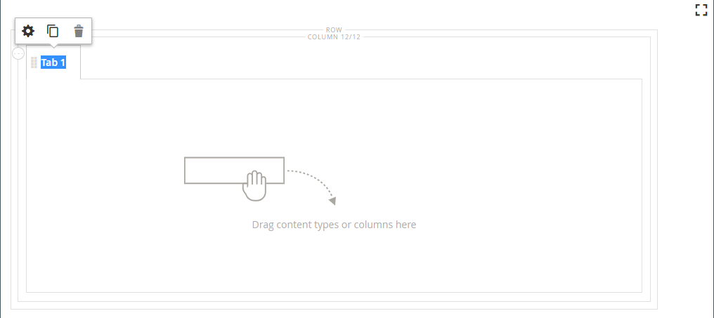
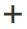

# Layout - Schede

Utilizza il tipo di contenuto _Schede_ per aggiungere un set di schede nella [[!DNL Page Builder] fase](workspace.md#stage). Quando trascinate il segnaposto Schede dal pannello allo stage, inizialmente viene visualizzata una singola scheda predefinita. Puoi aggiungere altre schede per creare un set completo. La larghezza del set di schede è determinata dalla larghezza delle impostazioni relative al contenitore padre e alla spaziatura interna.

{width="500" zoomable="yes"}

{{$include /help/_includes/page-builder-save-timeout.md}}

## Caselle degli strumenti

Quando si utilizza il tipo di contenuto _Schede_, è possibile aggiungere e modificare singole schede e il contenitore Schede che contiene una o più schede. Ogni scheda dispone di una propria casella degli strumenti utilizzata per progettare schede nella fase [!DNL Page Builder].

### Casella degli strumenti Scheda singola

{width="500" zoomable="yes"}

| Strumento | Icona | Descrizione |
|--- |--- |--- |
| Sposta | {width="25"} | Questo controllo accanto all&#39;etichetta della scheda viene utilizzato per spostare la singola scheda in un&#39;altra posizione nel set di schede. |
| Impostazioni | {width="25"} | Apre la pagina Modifica schede, in cui è possibile modificare le proprietà della singola scheda. |
| Duplica | {width="25"} | Crea una copia della scheda. |
| Rimuovi | {width="25"} | Elimina la scheda dal set di schede. |

{style="table-layout:auto"}

### Casella degli strumenti contenitore Schede

{width="500" zoomable="yes"}

| Strumento | Icona | Descrizione |
|--- |--- |--- |
| Sposta | {width="25"} | Sposta il set di schede in un&#39;altra posizione sulla griglia nel contenitore padre. |
| Aggiungi | {width="25"} | Aggiunge una scheda al set di schede. |
| (etichetta) | [!UICONTROL Tabs] | Identifica il contenitore corrente come set di schede. Passa il puntatore del mouse sul bordo superiore del contenitore per visualizzare la casella degli strumenti. |
| Impostazioni | {width="25"} | Apre la pagina Modifica scheda, in cui è possibile modificare le proprietà del contenitore. |
| Nascondi | {width="25"} | Nasconde il contenitore di schede. |
| Spettacolo | {width="25"} | Mostra il contenitore di schede nascosto. |
| Duplica | {width="25"} | Copia la scheda corrente. |
| Rimuovi | {width="25"} | Elimina dall&#39;area di visualizzazione il set di schede corrente. |

{style="table-layout:auto"}

{{$include /help/_includes/page-builder-hidden-element-note.md}}

## Aggiungi una singola scheda

1. Nel pannello [!DNL Page Builder] sotto _[!UICONTROL Layout]_, trascina il segnaposto **[!UICONTROL Tabs]**direttamente nell&#39;area di visualizzazione oppure in una riga o colonna nell&#39;area di visualizzazione.

   {width="600" zoomable="yes"}

1. Fai clic sull&#39;etichetta **[!UICONTROL Tab 1]** per visualizzare la casella degli strumenti delle singole schede e scegli l&#39;icona _Impostazioni_ ( {width="20"} ).

1. Immettere **[!UICONTROL Tab Name]** che si desidera utilizzare come etichetta.

   {width="600" zoomable="yes"}

1. Se necessario, immettere **[!UICONTROL Minimum Height]** per la scheda.

   Questo valore può essere un numero con qualsiasi unità CSS valida (ad esempio `100px`, `50%`, `50em`, `100vh`) o un calcolo (ad esempio `100vh - 237px`).

1. Scegliere un&#39;impostazione **[!UICONTROL Vertical Alignment]** per allineare tutti i contenitori di contenuto aggiunti alla scheda (Superiore, Centrale o Inferiore).

1. Se necessario, impostate le altre opzioni utilizzando come guida le sezioni seguenti:

   - [[!UICONTROL Background]][background]
   - [[!UICONTROL Advanced]][advanced]

1. Nell&#39;angolo superiore destro fare clic su **[!UICONTROL Save]** per applicare le impostazioni e tornare all&#39;area di lavoro [!DNL Page Builder].

## Aggiungere un set di schede

I passaggi seguenti iniziano con una singola scheda e creano un set di tre schede all’interno di un contenitore di schede. Se non si dispone già di una singola scheda, seguire le istruzioni precedenti per aggiungere una singola scheda all&#39;area di visualizzazione.

1. Passa il puntatore del mouse sul contenitore delle schede per visualizzare la casella degli strumenti e scegli l&#39;icona _Aggiungi_ ( {width="20"} ).

1. Fare clic sull&#39;etichetta **[!UICONTROL Tab 2]** per visualizzare il cursore e immettere la propria etichetta per la scheda.

1. Fai di nuovo clic sulla seconda scheda nell&#39;area di visualizzazione e scegli l&#39;icona _Duplica_ ( {width="20"} ).

1. Fare clic sull&#39;etichetta YourName **[!UICONTROL Copy]** per visualizzare il cursore e immettere un&#39;etichetta propria per la terza scheda.

{width="600" zoomable="yes"}

## Spostare una tabulazione all&#39;interno del set

1. Fare clic sulla scheda da spostare.

1. Seleziona e trascina l&#39;icona _Sposta_ ( {width="20"} ), visualizzata immediatamente prima del testo dell&#39;etichetta della scheda, in una nuova posizione all&#39;interno del set di schede.

## Aggiungere contenuto a una scheda

Puoi inserire qualsiasi tipo di contenuto in una scheda, esattamente come si fa per una riga. Per aggiungere un tipo di contenuto di testo come esempio, attenersi alla procedura descritta di seguito.

1. Fai clic sulla scheda in cui desideri aggiungere il contenuto.

1. Nel pannello [!DNL Page Builder], espandi **[!UICONTROL Elements]** e trascina un segnaposto **Testo** nella scheda.

1. Inserisci o incolla del testo nell’editor e utilizza la barra degli strumenti dell’editor per formattarlo come necessario.

   Per ulteriori informazioni sull&#39;utilizzo del tipo di contenuto testo, vedere [Elementi - Testo](text.md).

   {width="500" zoomable="yes"}

1. Nell&#39;angolo superiore destro fare clic su **[!UICONTROL Save]**.

## Modificare le singole impostazioni delle schede

1. Passa il puntatore del mouse su una singola scheda per visualizzare la casella degli strumenti e scegli l&#39;icona _Impostazioni_ ( {width="20"} ).

1. Se necessario, modifica una delle impostazioni di base per la scheda:

   - **[!UICONTROL Tab Name]** - Immettere il testo revisionato per l&#39;etichetta della scheda. Potete anche modificare l&#39;etichetta direttamente sullo stage.

   - **[!UICONTROL Minimum Height]** - Immettere come pixel se si desidera ignorare l&#39;altezza automatica. Ad esempio, potete impostare l&#39;altezza minima in modo che corrisponda all&#39;altezza di un&#39;immagine di sfondo per garantire che sia visibile l&#39;intera immagine.

   - **[!UICONTROL Vertical Alignment]** - Scegliere la posizione verticale dei contenitori di contenuto aggiunti alla scheda.

1. Modificare le altre impostazioni in base alle esigenze utilizzando le sezioni seguenti per i dettagli.

1. Al termine, fare clic su **[!UICONTROL Save]** per applicare le impostazioni e tornare all&#39;area di lavoro [!DNL Page Builder].

### Informazioni di base

- **[!UICONTROL Background Color]** - Specificare il colore di sfondo scegliendo un campione, facendo clic sul selettore del colore o immettendo un nome di colore valido o un valore esadecimale equivalente. Questa impostazione determina il colore di sfondo della riga. Potete anche regolare l&#39;opacità del colore.

  {width="200"}

  È possibile immettere un valore in tre modi:

   - Un nome di colore predefinito, ad esempio `White`

   - Valore esadecimale del colore, ad esempio `#ffffff`

   - Il valore rgba del colore, con percentuale di opacità, ad esempio `rgba(255, 255, 255, 0.75)`

  Per scegliere un colore, fare clic sul campione a sinistra della casella _Nessun colore_.

  {width="600" zoomable="yes"}

  Se fate clic sulla casella del colore per aprire nuovamente il selettore colore, la casella sotto il cursore mostra i valori correnti di rosso, verde, blu e alfa (rgba). L&#39;ultimo numero indica la percentuale di opacità corrente come valore decimale. È possibile utilizzare il dispositivo di scorrimento per regolare l&#39;opacità o immettere il valore decimale desiderato.

  {width="600" zoomable="yes"}

  >[!NOTE]
  >
  >[!DNL Page Builder] supporta anche un livello di trasparenza, o _canale alfa_, nelle immagini di sfondo che possono essere utilizzate per creare sfondi con diversi gradi di opacità.

- **[!UICONTROL Background Image]** - Se necessario, utilizzare gli strumenti forniti per scegliere un&#39;immagine di sfondo da applicare alla scheda:

  | Strumento | Descrizione |
  |--- |--- |
  | [!UICONTROL Upload] | Carica un file di immagine dal computer locale alla raccolta e quindi lo applica come immagine di sfondo per la scheda. |
  | [!UICONTROL Select from Gallery] | Richiede di scegliere un&#39;immagine esistente dalla raccolta come immagine di sfondo per la scheda. |
  | {width="25"} | Consente di trascinare l&#39;immagine nella sezione della fotocamera o di spostarsi sull&#39;immagine nel file system locale. |

  {style="table-layout:auto"}

- **[!UICONTROL Background Mobile Image]** - Se necessario, utilizzare gli stessi strumenti per scegliere un&#39;immagine di sfondo diversa da utilizzare per la visualizzazione sui dispositivi mobili.

- **[!UICONTROL Background Size]** - Scegliere come ridimensionare l&#39;immagine di sfondo in relazione alla larghezza della scheda:

  | Opzione | Descrizione |
  |--- |--- |
  | `Cover` | L’immagine di sfondo copre l’intera larghezza della scheda. |
  | `Contain` | L&#39;immagine di sfondo è limitata alla larghezza dell&#39;area di tabulazione. |
  | `Auto` | Applica le dimensioni dal foglio di stile corrente. |

  {style="table-layout:auto"}

- **[!UICONTROL Background Position]** - Scegliere come ancorare l&#39;immagine di sfondo in relazione alla scheda: `Top Left` / `Top Center` / `Top Right` / `Center Left` / `Center` / `Center Right` / `Bottom Left` / `Bottom Center` / `Bottom Right`

- **[!UICONTROL Background Attachment]** - Scegliere il tipo di allegato per determinare la modalità di spostamento dell&#39;immagine di sfondo in relazione alla pagina di scorrimento:

  | Opzione | Descrizione |
  | --- | --- |
  | `Scroll` | L&#39;immagine di sfondo collegata viene sincronizzata per spostarsi verso il basso durante lo scorrimento della pagina. |
  | `Fixed` | (Non disponibile per dispositivi mobili) L’immagine di sfondo non si sposta quando il contenitore scorre sopra l’immagine ed è fisso nella posizione di sfondo specificata. |

  {style="table-layout:auto"}

- **[!UICONTROL Background Repeat]** - Impostare su `Yes` per ripetere l&#39;immagine di sfondo in modo da riempire lo spazio disponibile nella scheda.

### Avanzate

- Per controllare l&#39;allineamento orizzontale dei contenitori di contenuto aggiunti alla scheda, scegliere un **[!UICONTROL Alignment]**.

  | Opzione | Descrizione |
  | --- | --- |
  | `Default` | Applica l&#39;impostazione predefinita di allineamento specificata nel foglio di stile del tema corrente. |
  | `Left` | Allinea i contenitori di contenuto lungo il bordo sinistro della scheda, tenendo conto della spaziatura specificata. |
  | `Center` | Allinea il contenitore del contenuto al centro della scheda, tenendo conto di eventuali spaziature specificate. |
  | `Right` | Allinea il contenitore di contenuto al bordo destro della scheda, tenendo conto di eventuali spaziature specificate. |

  {style="table-layout:auto"}

- Imposta lo stile **[!UICONTROL Border]** applicato a tutti e quattro i lati del contenitore di schede:

  | Opzione | Descrizione |
  | --- | --- |
  | `Default` | Applica lo stile di bordo predefinito specificato dal foglio di stile associato. |
  | `None` | Non fornisce alcuna indicazione visibile dei bordi del contenitore. |
  | `Dotted` | Il bordo del contenitore viene visualizzato come una linea tratteggiata. |
  | `Dashed` | Il bordo del contenitore viene visualizzato come una linea tratteggiata. |
  | `Solid` | Il bordo del contenitore viene visualizzato come linea continua. |
  | `Double` | Il bordo del contenitore viene visualizzato come una doppia riga. |
  | `Groove` | Il bordo del contenitore viene visualizzato come una linea scanalata. |
  | `Ridge` | Il bordo del contenitore viene visualizzato come una linea scanalata. |
  | `Inset` | Il bordo del contenitore viene visualizzato come una linea interna. |
  | `Outset` | Il bordo del contenitore viene visualizzato come una linea di contorno. |

  {style="table-layout:auto"}

- Se si imposta uno stile di bordo diverso da `None`, completare le opzioni di visualizzazione del bordo:

  {width="600" zoomable="yes"}

  | Opzione | Descrizione |
  | ------ |------------ |
  | [!UICONTROL Border Color] | Specificate il colore scegliendo un campione, facendo clic sul selettore del colore oppure immettendo un nome di colore valido o un valore esadecimale equivalente. |
  | [!UICONTROL Border Width] | Immettere il numero di pixel per lo spessore della linea del bordo. |
  | [!UICONTROL Border Radius] | Immettere il numero di pixel per definire la dimensione del raggio utilizzato per arrotondare ogni angolo del bordo. |

  {style="table-layout:auto"}

  La riga nell&#39;esempio seguente ha un raggio di bordo pari a 15.

  {width="500"}

- (Facoltativo) Specificare i nomi di **[!UICONTROL CSS classes]** dal foglio di stile corrente da applicare al contenitore colonne.

  Separare più nomi di classe con uno spazio.

- Immettere i valori in pixel per **[!UICONTROL Margins and Padding]** per specificare i margini esterni e la spaziatura interna della colonna.

  Immetti ogni valore corrispondente nel diagramma del contenitore di schede.

  | Area contenitore | Descrizione |
  | -------------- | ---------- |
  | [!UICONTROL Margins] | Quantità di spazio vuoto applicata al bordo esterno di tutti i lati del contenitore. Opzioni: `Top` / `Right` / `Bottom` / `Left` |
  | [!UICONTROL Padding] | Quantità di spazio vuoto applicata al bordo interno di tutti i lati del contenitore. Opzioni: `Top` / `Right` / `Bottom` / `Left` |

  {style="table-layout:auto"}

## Modifica impostazioni set di schede

1. Passa il puntatore del mouse sul bordo superiore del contenitore del set di schede per visualizzare la casella degli strumenti e scegli l&#39;icona _Impostazioni_ ( {width="20"} ).

1. Se necessario, modificare **[!UICONTROL Default Active Tab]**.

   Scegliere la scheda del set che si desidera rendere attivo al caricamento della pagina.

1. Immettere **[!UICONTROL Minimum Height]**, in pixel, se si desidera ignorare l&#39;altezza automatica per il set di schede.

1. Per posizionare le schede di navigazione nella parte superiore del set di schede, scegliere **[!UICONTROL Tab Navigation Alignment]** (`Left`, `Center` o `Right`).

   {width="500" zoomable="yes"}

1. Impostare le opzioni avanzate per il set di schede:

   - Per controllare il posizionamento del set di schede all&#39;interno del contenitore principale, scegliere un **[!UICONTROL Alignment]**:

     | Opzione | Descrizione |
     | ------ | ---------- |
     | `Default` | Applica l&#39;impostazione predefinita di allineamento specificata nel foglio di stile del tema corrente. |
     | `Left` | Allinea il set di schede lungo il bordo sinistro del contenitore principale, tenendo conto di tutte le spaziature specificate. |
     | `Center` | Allinea il set di schede al centro del contenitore principale, tenendo conto di tutte le spaziature specificate. |
     | `Right` | Allinea il set di schede lungo il bordo destro del contenitore principale, tenendo conto della spaziatura specificata. |

     {style="table-layout:auto"}

   - Imposta lo stile **[!UICONTROL Border]** applicato a tutti e quattro i lati del contenitore di schede:

     | Opzione | Descrizione |
     | ------ | ---------- |
     | `Default` | Applica lo stile di bordo predefinito specificato dal foglio di stile associato. |
     | `None` | Non fornisce alcuna indicazione visibile dei bordi del contenitore. |
     | `Dotted` | Il bordo del contenitore viene visualizzato come una linea tratteggiata. |
     | `Dashed` | Il bordo del contenitore viene visualizzato come una linea tratteggiata. |
     | `Solid` | Il bordo del contenitore viene visualizzato come linea continua. |
     | `Double` | Il bordo del contenitore viene visualizzato come una doppia riga. |
     | `Groove` | Il bordo del contenitore viene visualizzato come una linea scanalata. |
     | `Ridge` | Il bordo del contenitore viene visualizzato come una linea scanalata. |
     | `Inset` | Il bordo del contenitore viene visualizzato come una linea interna. |
     | `Outset` | Il bordo del contenitore viene visualizzato come una linea di contorno. |

     {style="table-layout:auto"}

   - Se si imposta uno stile di bordo diverso da `None`, completare le opzioni di visualizzazione del bordo:

     | Opzione | Descrizione |
     | ------ |------------ |
     | [!UICONTROL Border Color] | Specificate il colore scegliendo un campione, facendo clic sul selettore del colore oppure immettendo un nome di colore valido o un valore esadecimale equivalente. |
     | [!UICONTROL Border Width] | Immettere il numero di pixel per lo spessore della linea del bordo. |
     | [!UICONTROL Border Radius] | Immettere il numero di pixel per definire la dimensione del raggio utilizzato per arrotondare ogni angolo del bordo. |

     {style="table-layout:auto"}

   - (Facoltativo) Specificare i nomi di **[!UICONTROL CSS classes]** dal foglio di stile corrente da applicare al contenitore di schede.

     Separare più nomi di classe con uno spazio.

   - Immettere i valori, in pixel, per **[!UICONTROL Margins and Padding]** per determinare i margini esterni e la spaziatura interna del contenitore di schede.

     Immetti i valori corrispondenti nel diagramma del contenitore schede.

     | Area contenitore | Descrizione |
     | -------------- | ---------- |
     | [!UICONTROL Margins] | Quantità di spazio vuoto applicata al bordo esterno di tutti i lati del contenitore. Opzioni: `Top` / `Right` / `Bottom` / `Left` |
     | [!UICONTROL Padding] | Quantità di spazio vuoto applicata al bordo interno di tutti i lati del contenitore. Opzioni: `Top` / `Right` / `Bottom` / `Left` |

     {style="table-layout:auto"}

1. Al termine, fare clic su **[!UICONTROL Save]** per applicare le impostazioni e tornare all&#39;area di lavoro [!DNL Page Builder].

[background]: #background
[advanced]: #advanced
