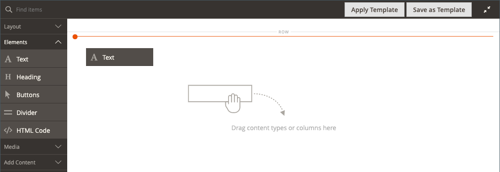

# Elementi - Testo

Utilizza il tipo di contenuto _Testo_ per aggiungere un contenitore di testo con un editor WYSIWYG (&quot;What You See Is What You Get&quot;) in [[!DNL Page Builder] stage](workspace.md#stage). È inoltre possibile aggiungere collegamenti, immagini, [variabili](../systems/variables-predefined.md) e widget al testo dalla barra degli strumenti dell&#39;editor.

{width="700"}

{{$include /help/_includes/page-builder-save-timeout.md}}

## Strumenti dell’editor di testo

Puoi accedere all’editor di testo direttamente dall’area di visualizzazione o da una pagina di impostazioni. Le modifiche apportate direttamente all&#39;area di visualizzazione vengono salvate automaticamente. Per ulteriori informazioni, vedere [Utilizzo dell&#39;editor](../content-design/editor.md).

{width="600"}

## Casella degli strumenti Contenitore testo

{width="600"}

| Strumento | Icona | Descrizione |
| --------- | --------------------- | -------------- |
| Sposta | {width="25"} | Sposta il contenitore di testo in un&#39;altra posizione valida nella pagina. |
| (etichetta) | TESTO | Identifica il contenitore corrente come elemento di testo. |
| Impostazioni | {width="25"} | Apre le proprietà del contenitore di testo in modalità di modifica. |
| Nascondi | {width="25"} | Nasconde il contenitore di testo. |
| Spettacolo | {width="25"} | Mostra il contenitore di testo nascosto. |
| Duplica | {width="25"} | Crea una copia del contenitore di testo. |
| Rimuovi | {width="25"} | Elimina dall&#39;area di visualizzazione il contenitore di testo e il relativo contenuto. |

{style="table-layout:auto"}

{{$include /help/_includes/page-builder-hidden-element-note.md}}

## Aggiungi testo

1. Nel pannello [!DNL Page Builder], espandi **[!UICONTROL Elements]** e trascina un segnaposto **[!UICONTROL Text]** in una riga, colonna o set di schede sull&#39;area di visualizzazione.

   {width="600" zoomable="yes"}

1. Utilizza l’editor per immettere e formattare il testo, in base alle esigenze.

   Per ulteriori informazioni, vedere [Utilizzo dell&#39;editor](../content-design/editor.md).

   {width="600"}

## Creare un collegamento

Il pulsante Inserisci collegamento nell’editor semplifica l’aggiunta di un collegamento ipertestuale a un’immagine nella raccolta. Tuttavia, può anche essere utilizzato per creare un collegamento in linea nel testo, se disponi dell’URL in anticipo. A differenza del pulsante Widget, il pulsante di collegamento Inserisci/Modifica non è integrato con le pagine, i prodotti o le categorie presenti nell&#39;archivio.

Per creare un collegamento per un numero di telefono o un&#39;e-mail, vedere [Aggiunta di variabili personalizzate](../systems/variables-custom.md).

1. Nella vetrina, passa alla pagina che deve essere la destinazione del collegamento e copia le informazioni sul collegamento.

   Puoi utilizzare l’URL completo o un URL relativo che omette il riferimento al dominio dello store.

   URL completo - `https://mystore.com/women/tops-women/tees-women.html`

   URL relativo - `../women/tops-women/tees-women.html`

1. Selezionare il testo nello spazio dell&#39;editor e fare clic su _Inserisci/modifica collegamento_ ( {width="20"} ) sulla barra degli strumenti dell&#39;editor.

   {width="500" zoomable="yes"}

1. Per **[!UICONTROL URL]**, immettere il collegamento relativo preparato.

1. Imposta **[!UICONTROL Target]** su `None`.

   Questa impostazione consente di aprire la pagina nella stessa finestra del browser, anziché aprire una nuova scheda.

1. Per **[!UICONTROL Title]**, immettere `Shop Tees`.

   L&#39;attributo di collegamento `Title` viene utilizzato da alcuni browser come descrizione comando.

1. Per salvare il collegamento e tornare all&#39;area di lavoro [!DNL Page Builder], fare clic su **[!UICONTROL OK]**.

   {width="500" zoomable="yes"}

## Inserisci un&#39;immagine

1. Posizionare il cursore nel testo in cui si desidera inserire l&#39;immagine.

1. Fare clic su _Inserisci/modifica immagine_ ( {width="20"} ) sulla barra degli strumenti dell&#39;editor.

1. Per **[!UICONTROL Source]**, fare clic sull&#39;icona di ricerca per utilizzare l&#39;archivio multimediale per individuare e selezionare un&#39;immagine.

1. Per **[!UICONTROL Image Description]**, immettere un testo descrittivo per l&#39;immagine.

   Questo testo popola l&#39;attributo di collegamento `alt` per l&#39;immagine e viene utilizzato da alcuni browser per l&#39;accessibilità.

1. Immettere la larghezza e l&#39;altezza **[!UICONTROL Dimensions]** in pixel per il rendering dell&#39;immagine sulla pagina.

   Mantieni selezionata la casella di controllo **[!UICONTROL Constrain proportions]** per mantenere automaticamente le proporzioni dell&#39;immagine.

1. Per inserire l&#39;immagine e tornare all&#39;area di lavoro [!DNL Page Builder], fare clic su **[!UICONTROL OK]**.

## Modificare le impostazioni del testo

1. Passa il puntatore del mouse sul contenitore di testo per visualizzare la casella degli strumenti e scegli l&#39;icona _Impostazioni_ ( {width="20"} ).

   >[!NOTE]
   >
   >Poiché il contenitore di testo è strettamente nidificato all&#39;interno di un altro contenitore, verificare di disporre della casella degli strumenti corretta.

1. Aggiorna il contenuto in base alle esigenze.

1. Aggiornare le impostazioni di _[!UICONTROL Advanced]_in base alle esigenze.

   - Per controllare il posizionamento del testo all&#39;interno del contenitore principale, scegliere un **[!UICONTROL Alignment]**:

     | Opzione | Descrizione |
     | ------ |------------ |
     | `Default` | Applica l&#39;impostazione predefinita di allineamento specificata nel foglio di stile del tema corrente. |
     | `Left` | Allinea l&#39;elenco lungo il bordo sinistro del contenitore principale, tenendo conto di eventuali spaziature specificate. |
     | `Center` | Allinea l&#39;elenco al centro del contenitore padre, tenendo conto di eventuali spaziature specificate. |
     | `Right` | Allinea il blocco lungo il bordo destro del contenitore principale, tenendo conto della spaziatura specificata. |

     {style="table-layout:auto"}

   - Imposta lo stile **[!UICONTROL Border]** applicato a tutti e quattro i lati del contenitore di testo:

     | Opzione | Descrizione |
     | ------ |------------ |
     | `Default` | Applica lo stile di bordo predefinito specificato dal foglio di stile associato. |
     | `None` | Non fornisce alcuna indicazione visibile dei bordi del contenitore. |
     | `Dotted` | Il bordo del contenitore viene visualizzato come una linea tratteggiata. |
     | `Dashed` | Il bordo del contenitore viene visualizzato come una linea tratteggiata. |
     | `Solid` | Il bordo del contenitore viene visualizzato come linea continua. |
     | `Double` | Il bordo del contenitore viene visualizzato come una doppia riga. |
     | `Groove` | Il bordo del contenitore viene visualizzato come una linea scanalata. |
     | `Ridge` | Il bordo del contenitore viene visualizzato come una linea scanalata. |
     | `Inset` | Il bordo del contenitore viene visualizzato come una linea interna. |
     | `Outset` | Il bordo del contenitore viene visualizzato come una linea di contorno. |

     {style="table-layout:auto"}

   - Se si imposta uno stile di bordo diverso da `None`, completare le opzioni di visualizzazione del bordo:

     | Opzione | Descrizione |
     | ------ |------------ |
     | [!UICONTROL Border Color] | Specificate il colore scegliendo un campione, facendo clic sul selettore del colore oppure immettendo un nome di colore valido o un valore esadecimale equivalente. |
     | [!UICONTROL Border Width] | Immettere il numero di pixel per lo spessore della linea del bordo. |
     | [!UICONTROL Border Radius] | Immettere il numero di pixel per definire la dimensione del raggio utilizzato per arrotondare ogni angolo del bordo. |

     {style="table-layout:auto"}

   - (Facoltativo) Specificare i nomi di **[!UICONTROL CSS classes]** dal foglio di stile corrente da applicare al contenitore.

     Separare più nomi di classe con uno spazio.

   - Immettere i valori in pixel per **[!UICONTROL Margins and Padding]** per determinare i margini esterni e la spaziatura interna del contenitore di testo.

     Immettere i valori corrispondenti nel diagramma.

     | Area contenitore | Descrizione |
     | -------------- |------------ |
     | [!UICONTROL Margins] | Quantità di spazio vuoto applicata al bordo esterno di tutti i lati del contenitore. Opzioni: `Top` / `Right` / `Bottom` / `Left` |
     | [!UICONTROL Padding] | Quantità di spazio vuoto applicata al bordo interno di tutti i lati del contenitore. Opzioni: `Top` / `Right` / `Bottom` / `Left` |

     {style="table-layout:auto"}

1. Al termine, fare clic su **[!UICONTROL Save]** per applicare le impostazioni e tornare all&#39;area di lavoro [!DNL Page Builder].

<!-- Last updated from includes: 2023-09-11 14:30:19 -->
