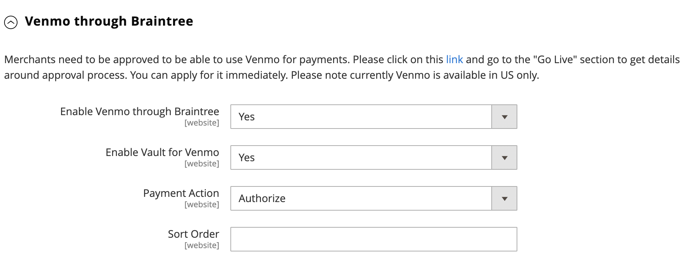

# Braintree

Braintree offre un’esperienza di pagamento completamente personalizzabile con rilevamento di frodi e integrazione PayPal. Supporta [!DNL Apple Pay], [!DNL Google Pay], ACH, Venmo e metodi di pagamento locali. Braintree riduce il carico di conformità PCI per gli esercenti perché la transazione avviene sul sistema Braintree. L&#39;integrazione Braintree Payments è sviluppata da [Gene Commerce](https://www.gene.co.uk/gene-braintree-payments/).

>[!NOTE]
>
>Se esegui l’aggiornamento a 2.4.x da una versione precedente di Adobe Commerce o di un Magento Open Source con l’estensione Braintree di Commerci Marketplace installata, consulta la sezione [Note sull’aggiornamento 2.4](#24-upgrade-notes) alla fine di questa pagina.

## Passaggio 1: ottieni le credenziali Braintree

Vai a [Braintree pagamenti][1] e registratevi per un account.

## Passaggio 2: completare le impostazioni di base

1. Il giorno _Amministratore_ barra laterale, vai a **[!UICONTROL Stores]** > _[!UICONTROL Settings]_>**[!UICONTROL Configuration]**.

1. Nel pannello a sinistra, espandi **[!UICONTROL Sales]** e scegli **[!UICONTROL Payment Methods]**.

   - Se nell’installazione di Commerce sono presenti più siti web, store o visualizzazioni, nell’angolo in alto a sinistra, scegli **[!UICONTROL Store View]** dove si applica la configurazione.

   - In _[!UICONTROL Merchant Location]_, verifica che **[!UICONTROL Merchant Country]**è impostato sulla posizione dell’azienda.

1. Sotto _[!UICONTROL Recommended Solutions]_, nella_[!UICONTROL Braintree Payments] (di [Gene Commerce](https://www.gene.co.uk/gene-braintree-payments/) v4.6.1 - [Note sulla versione](https://support.gene.co.uk/support/solutions/articles/35000228529)_, fare clic su **[!UICONTROL Configure]**.

   {width="600" zoomable="yes"}

1. Per **[!UICONTROL Title]**, immettere un titolo che identifichi Braintree come opzione di pagamento durante il pagamento.

1. Imposta il valore operativo corrente **[!UICONTROL Environment]** per Braintree transazioni a `Sandbox` o `Production`

   Quando esegui il test della configurazione in una sandbox, utilizza solo [numeri di carta di credito][2] che sono consigliati dalla Braintree. Quando si è pronti per passare alla produzione con Braintree, impostare **[!UICONTROL Environment]** a `Production`.

   {width="600" zoomable="yes"}

1. Imposta **[!UICONTROL Payment Action]** a uno dei seguenti elementi:

   - `Authorize Only` - Approva l&#39;acquisto e blocca i fondi. L&#39;importo non viene prelevato dal conto bancario del cliente fino alla vendita _acquisito_ dal commerciante.|
   - `Intent Sale`  - L&#39;importo dell&#39;acquisto è autorizzato e immediatamente prelevato dal conto del cliente. **_Nota:_** Questo valore era  _Autorizza e acquisisci_ nella versione 2.3.x e nelle versioni precedenti.|

1. Inserisci il **[!UICONTROL Sandbox Merchant ID / Merchant ID]** dal tuo account Braintree.

1. Immetti le seguenti credenziali dal tuo account di Braintree:

   - **[!UICONTROL Sandbox Public Key / Public Key]**
   - **[!UICONTROL Sandbox Private Key / Private Key]**

   >[!NOTE]
   >
   >Sono presenti campi separati per entrambi **(Sandbox e produzione)** e gli altri campi vengono riprodotti in base all’ambiente selezionato.

1. Prima di salvare la configurazione, fai clic su **[!UICONTROL Validate Credentials]** per convalidare le credenziali.

1. Imposta **[!UICONTROL Enable Card Payments]** a `Yes`.

   {width="600" zoomable="yes"}

   Se desideri che le informazioni sui clienti vengano memorizzate in modo sicuro, in modo che i clienti non debbano reinserirle ogni volta che effettuano un acquisto, imposta **[!UICONTROL Enable Vault for Card Payments]** a `Yes`.

## Passaggio 3: completare le impostazioni avanzate

1. Espandi  il **[!UICONTROL Advanced Braintree Settings]** sezione.

   {width="550" zoomable="yes"}

1. Per **[!UICONTROL Vault Title]**, inserisci un titolo descrittivo per il riferimento che identifichi l&#39;archivio in cui sono memorizzate le informazioni sulla carta del cliente.

1. Inserisci il **[!UICONTROL Merchant Account ID]** dal tuo account Braintree.

   Se non si specifica il conto esercente da utilizzare, Braintree elabora la transazione utilizzando il proprio conto esercente predefinito.

1. Per offrire un&#39;esperienza di pagamento più rapida con le opzioni di pagamento rapido all&#39;inizio del processo di pagamento, tra cui PayPal, PayLater, Apple Pay e Google Pay, impostare **[!UICONTROL Enable Checkout Express Payments]** a `Yes`.

1. Se si desidera impedire che la transazione venga inviata per la valutazione come parte dei controlli degli strumenti di frode avanzati, per gli ordini inoltrati tramite l&#39;amministratore, impostare **[!UICONTROL Skip Fraud Checks on Admin Orders]** a `Yes`.

1. Imposta il **[!UICONTROL Bypass Fraud Protection Threshold]** in modo che `Advanced Fraud Protection` i controlli vengono ignorati quando la soglia viene raggiunta o superata.

   Se si lascia vuoto questo campo, questa opzione viene disabilitata.

1. Se si desidera che venga salvato un file di registro delle interazioni tra l&#39;archivio e la Braintree, impostare **[!UICONTROL Debug]** a `Yes`.

1. Per richiedere ai clienti di fornire il codice di sicurezza a tre cifre dal retro di una carta di credito, impostare **[!UICONTROL CVV Verification]** a `Yes`.

   Se utilizzi la verifica CVV, assicurati di abilitare AVS e/o CVV in _Impostazioni/Elaborazione_ del tuo account di Braintree.

1. Per inviare le voci del carrello per tutti i metodi di pagamento, impostare **[!UICONTROL Send Card Line Items]** a `Yes`.

1. Per **[!UICONTROL Credit Card Types]**, seleziona ogni carta di credito accettata dal tuo Negozio come pagamento tramite Braintree.

   Per selezionare più tipi di schede, tenere premuto il tasto Ctrl (PC) o il tasto Comando (Mac) e fare clic su ciascuna opzione.

1. Per **[!UICONTROL Sort Order]**, immettere un numero per determinare la sequenza in cui viene visualizzata la Braintree quando viene elencata con altri metodi di pagamento durante il pagamento.

## Passaggio 4: completare le impostazioni del webhook di Braintree

{width="600" zoomable="yes"}

1. Imposta **[!UICONTROL Enable Webhook]** a `Yes` abilitare la funzionalità webhook per la protezione dalle frodi, i pagamenti ACH e i metodi di pagamento locali.

1. Copia l’URL in **[!UICONTROL Fraud Protection URL]** e aggiungerlo al tuo account di Braintree come _[!UICONTROL Webhook Destination URL]_.

   >[!IMPORTANT]
   >
   >Questo URL deve essere sicuro e accessibile al pubblico.

1. Imposta il **[!UICONTROL Fraud Protection Approve Order Status]** per determinare quando la protezione contro le frodi è approvata dalla Braintree.

   Lo stato dell’ordine selezionato viene assegnato all’ordine Commerce.

1. Imposta il **[!UICONTROL Fraud Protection Reject Order Status]** campo per determinare quando la protezione dalle frodi è rifiutata dalla Braintree.

   Lo stato dell’ordine selezionato viene assegnato all’ordine Commerce.

## Passaggio 5: completare le impostazioni specifiche del paese

1. Imposta **[!UICONTROL Payment from Applicable Countries]** a uno dei seguenti elementi:

   - `All Allowed Countries` - Clienti di tutti [paesi](../getting-started/store-details.md#country-options) specificato nella configurazione del negozio può utilizzare questo metodo di pagamento.
   - `Specific Countries` - Dopo aver scelto questa opzione, il _[!UICONTROL Payment from Specific Countries]_viene visualizzato. Tenere premuto il tasto Ctrl (PC) o il tasto Comando (Mac) e selezionare ogni paese nell&#39;elenco in cui i clienti possono effettuare acquisti dal negozio.

   {width="600" zoomable="yes"}

1. Per impostare **[!UICONTROL Country Specific Credit Card Types]**:

   - Clic **[!UICONTROL Add]**.

   - Imposta il **[!UICONTROL Country]** e scegliete ciascuno **[!UICONTROL Allowed Credit Card Type]**.

   - Ripetere l&#39;operazione per identificare le carte di credito accettate da ciascun paese.

## Passaggio 6: completare l&#39;ACH tramite le impostazioni delle Braintree

{width="600" zoomable="yes"}

1. Per includere ACH come opzione di pagamento con Braintree, impostare **[!UICONTROL Enable ACH Direct Debit]** a `Yes`.

1. I clienti possono archiviare il metodo di pagamento con Addebito automatico sul conto bancario (ACH Direct Debit) monouso e memorizzarlo per utilizzarlo in futuro. Una volta effettuato il vaulting, i clienti possono riutilizzare l&#39;addebito diretto ACH senza dover reinserire o autenticare le informazioni di pagamento se impostate **[!UICONTROL Enable Vault for ACH Direct Debit]** a `Yes`.

1. Per **[!UICONTROL Sort Order]** Inserire un numero per determinare la sequenza in cui viene visualizzata l&#39;opzione di pagamento Braintree ACH quando elencata con altre opzioni di pagamento durante l&#39;estrazione.

## Passaggio 7: completare [!UICONTROL Apple Pay] tramite impostazioni Braintree

{width="600" zoomable="yes"}

1. Da includere [!DNL Apple Pay] come opzione di pagamento con Braintree, imposta **[!UICONTROL Enable ApplePay through Braintree]** a `Yes`.

   Assicurati di [verificare il nome di dominio](https://developer.paypal.com/braintree/docs/guides/apple-pay/configuration/javascript/v3) nel tuo account di Braintree.

1. Se desideri poter archiviare le informazioni dei clienti in modo sicuro, in modo che i clienti non debbano reinserirle ogni volta che effettuano un acquisto con Apple Pay, imposta **[!UICONTROL Enable Vault for ApplePay]** a `Yes`.

1. Imposta **[!UICONTROL Payment Action]** a uno dei seguenti elementi:

   - `Authorize Only` - Approva l&#39;acquisto e blocca i fondi. L&#39;importo non viene prelevato dal conto bancario del cliente fino alla vendita _acquisito_ dal mercante.
   - `Intent Sale` - L&#39;importo dell&#39;acquisto è autorizzato e immediatamente prelevato dal conto del cliente.

1. Per **[!UICONTROL Merchant Name]**, immetti il testo che specifica l’etichetta visualizzata ai clienti nella finestra di dialogo Apple Pay.

1. Per **[!UICONTROL Sort Order]** immettere un numero per determinare la sequenza in cui [!DNL Apple Pay] l&#39;opzione di pagamento viene visualizzata quando è elencato con altre opzioni di pagamento durante l&#39;estrazione.

## Passo 8: Completare le impostazioni per i metodi di pagamento locali

1. Per includere i metodi di pagamento locali come opzione di pagamento con Braintree, impostare **[!UICONTROL Enable Local Payment Methods]** a `Yes`.

1. Per **[!UICONTROL Title]**, immettere il testo da utilizzare per l&#39;etichetta visualizzata nella sezione relativa al metodo di pagamento del pagamento di pagamento (valore predefinito: `Local Payments`).

1. Per **[!UICONTROL Fallback Button Text]**, immetti il testo da utilizzare per il pulsante visualizzato nella pagina della Braintree di fallback per reindirizzare il cliente al sito web (ad esempio, `Complete Checkout`).

1. Per **[!UICONTROL Redirect on Fail]**, immettere l&#39;URL in cui i clienti devono essere reindirizzati quando le transazioni del metodo di pagamento locale vengono annullate, non riuscite o rilevano errori. Deve essere la pagina di pagamento per l’estrazione (ad esempio, `https://www.domain.com/checkout#payment`).

1. Per **[!UICONTROL Allowed Payment Methods]**, selezionare il metodo di pagamento locale da abilitare.

   Opzioni: `Bancontact` / `EPS` / `giropay` / `iDeal` / `Klarna Pay Now` / `SOFORT` / `MyBank` / `P24` / `SEPA/ELV Direct Debit` (non ancora supportato)

   {width="600" zoomable="yes"}

   >[!NOTE]
   >
   >L&#39;estensione di Braintree in bundle non supporta tutti i metodi di pagamento locali elencati nel [Braintree documentazione per sviluppatori](https://developer.paypal.com/braintree/docs/guides/local-payment-methods/overview). Sono in fase di sviluppo altri metodi di pagamento locali, che saranno supportati nelle prossime versioni.

1. Per **[!UICONTROL Sort Order]** Immettere un numero per determinare la sequenza in cui viene visualizzato il metodo di pagamento locale quando viene elencato con altre opzioni di pagamento durante il pagamento.

## Passaggio 9: completare [!DNL Google Pay] tramite impostazioni Braintree

{width="600" zoomable="yes"}

1. Da includere [!DNL Google Pay] come opzione di pagamento con Braintree, imposta **[!UICONTROL Enable GooglePay Through Braintree]** a `Yes`.

1. Se desideri poter archiviare le informazioni dei clienti in modo sicuro, in modo che i clienti non debbano reinserirle ogni volta che effettuano un acquisto con Google Pay, imposta **[!UICONTROL Enable Vault for GooglePay]** a `Yes`.

1. Imposta **[!UICONTROL Payment Action]** a uno dei seguenti elementi:

   - `Authorize Only` - Approva l&#39;acquisto e blocca i fondi. L&#39;importo non viene prelevato dal conto bancario del cliente fino alla vendita _acquisito_ dal mercante.
   - `Intent Sale`  - L&#39;importo dell&#39;acquisto è autorizzato e immediatamente prelevato dal conto del cliente.

1. Imposta **[!UICONTROL Button Color]** per determinare il colore del [!DNL Google Pay] pulsante: `White` o `Black`

1. Per **[!UICONTROL Merchant ID]**, immetti l&#39;ID commerciante (fornito da Google).

1. Per **[!UICONTROL Accepted Cards]**, seleziona il tipo di schede utilizzabili da un cliente per effettuare un ordine utilizzando [!DNL Google Pay].

   Opzioni: `Visa` / `MasterCard` / `AMEX` / `Discover` / `JCB`

1. Per **[!UICONTROL Sort Order]** immettere un numero per determinare la sequenza in cui [!DNL Google Pay] viene visualizzato quando viene elencato con altre opzioni di pagamento durante l&#39;estrazione.

## Passaggio 10: Completare le impostazioni di Braintree di Venmo through

1. Per includere Venmo come opzione di pagamento con Braintree, impostare **[!UICONTROL Enable Venmo through Braintree]** a `Yes`.

1. Imposta **[!UICONTROL Enable Vault for Venmo]** a `Yes` per consentire l&#39;utilizzo di un vaulting sicuro per archiviare l&#39;account Venmo dei clienti in modo che non sia necessario accedere nuovamente al loro account Venmo per le transazioni future.

   {width="600" zoomable="yes"}

1. Imposta **[!UICONTROL Payment Action]** a uno dei seguenti elementi:

   - `Authorize Only` - Approva l&#39;acquisto e blocca i fondi. L&#39;importo non viene prelevato dal conto bancario del cliente fino alla vendita _acquisito_ dal mercante.
   - `Intent Sale`  - L&#39;importo dell&#39;acquisto è autorizzato e immediatamente prelevato dal conto del cliente.

1. Per **[!UICONTROL Sort Order]**, immettere un numero per determinare la sequenza in cui viene visualizzato Venmo quando viene elencato con altre opzioni di pagamento durante il pagamento.

## Passo 11: Completare PayPal attraverso le impostazioni di Braintree

{width="550" zoomable="yes"}

1. Per includere PayPal come opzione di pagamento con Braintree, impostare **[!UICONTROL Enable PayPal through Braintree]** a `Yes`.

1. Specifica il metodo di pagamento PayPal tramite Braintree:

   >[!NOTE]
   >
   >o **[!DNL PayPal Credit]** o **[!DNL PayPal PayLater]** possono essere abilitati. Entrambi i metodi non possono essere attivati contemporaneamente.

   - Da includere [!DNL PayPal Credit] come opzione di pagamento con Braintree, imposta **[!UICONTROL Enable PayPal Credit through Braintree]** a `Yes`.

     Quando **Abilita PayPal tramite Braintree** è impostato su `Yes`, viene visualizzato solo questo campo.

     >[!NOTE]
     >
     >PayPal Credit è disponibile solo negli Stati Uniti e nel Regno Unito. Il credito PayPal è disabilitato se il valore selezionato per _[!UICONTROL Merchant Country]_il campo non è `US` o `UK`.

   - Da includere [!DNL PayPal PayLater] come opzione di pagamento con Braintree, imposta **[!UICONTROL Enable PayPal PayLater through Braintree]** a `Yes`.

     Quando **[!UICONTROL Enable PayPal PayLater through Braintree]** è impostato su `Yes`, viene visualizzato solo questo campo.

     Puoi visualizzare i messaggi PayLater sul tuo sito per le offerte, ad esempio _Pagamento in 3_, che consente ai clienti di pagare con tre pagamenti mensili senza interessi. L’integrazione Braintree può visualizzare messaggi sul sito per promuovere questa funzione. Non puoi promuovere le offerte PayLater con altri contenuti, materiale di marketing o materiale.

1. Per **[!UICONTROL Title]**, inserisci un titolo che identifichi l&#39;opzione Braintree pagamento tramite PayPal durante il pagamento.

1. Imposta **[!UICONTROL Vault Enabled]** a `Yes` per abilitare l&#39;utilizzo di un vaulting sicuro per archiviare il conto PayPal dei clienti. Il conto PayPal archiviato può essere utilizzato per transazioni future, riducendo il numero di passaggi per i clienti.

1. Imposta **[!UICONTROL Send Cart Line Items for PayPal]** a `Yes` per inviare gli articoli in linea (articoli dell&#39;ordine) a PayPal insieme a Biglietti regalo, Confezione regalo per gli articoli, Confezione regalo per l&#39;ordine, Credito del negozio, Spedizione e Imposta come articoli in linea.

1. Per **[!UICONTROL Sort Order]**, immettere un numero per determinare la sequenza in cui viene visualizzata l&#39;opzione Braintree pagamento PayPal quando elencata con altre opzioni di pagamento durante il pagamento.

1. Per visualizzare il nome dell&#39;esercente in modo diverso rispetto a quanto definito nel [configurazione archivio](../getting-started/store-details.md#store-information), immetti il nome in **[!UICONTROL Override Merchant Name]** come si desidera che venga visualizzato.

1. Imposta **[!UICONTROL Payment Action]** a uno dei seguenti elementi:

   - `Authorize Only` - Approva l&#39;acquisto e blocca i fondi. L&#39;importo non viene prelevato dal conto bancario del cliente fino alla vendita _acquisito_ dal mercante.
   - `Authorize and Capture` - L&#39;importo dell&#39;acquisto è autorizzato e immediatamente prelevato dal conto del cliente.

1. Imposta **[!UICONTROL Payment from Applicable Countries]** per le transazioni Braintree elaborate da PayPal:

   - `All Allowed Countries` - Clienti di tutti [paesi](../getting-started/store-details.md#country-options) specificato nella configurazione del negozio può utilizzare questo metodo di pagamento.
   - `Specific Countries` - Dopo aver scelto questa opzione, il _[!UICONTROL Payment from Specific Countries]_viene visualizzato. Tenere premuto il tasto Ctrl (PC) o il tasto Comando (Mac) e selezionare ogni paese nell&#39;elenco in cui i clienti possono effettuare acquisti dal negozio.

1. Per richiedere ai clienti di fornire un indirizzo di fatturazione, impostare **[!UICONTROL Require Customer's Billing Address]** a `Yes`.

   >[!NOTE]
   >
   >Questa funzione deve essere abilitata per il tuo account dal Supporto tecnico PayPal.

1. Per salvare un file di registro delle interazioni tra il tuo store e PayPal tramite Braintree, imposta **[!UICONTROL Debug]** a `Yes`.

1. Per visualizzare il pulsante PayPal sia sul mini carrello che sulla pagina del carrello, imposta **[!UICONTROL Display on Shopping Cart]** a `Yes`.

## Passaggio 12: impostazione degli stili

1. Per **[!UICONTROL Location]**, scegli dove vengono riprodotti i pulsanti e i messaggi PayPal: `Mini-Cart and Cart Page`, `Checkout Page`, o `Product Page`

   {width="600" zoomable="yes"}

### [!UICONTROL Mini-Cart and Cart Page]

Le opzioni e le impostazioni di questa sezione variano a seconda dell&#39;impostazione nella _[!UICONTROL Location]_campo.

1. Imposta **[!UICONTROL PayPal Button Type]** a uno dei tre tipi di pulsanti: `PayPal Button` / `PayPal Pay Later Button` / `PayPal Credit Button`

**[!UICONTROL PayPal Button]**

Le opzioni e le impostazioni di questa sezione variano a seconda del tipo di pulsante selezionato nella _[!UICONTROL PayPal Button Type]_campo.

1. Per visualizzare il pulsante PayPal sulla vetrina nella posizione selezionata, impostare **[!UICONTROL Show PayPal Button]** a `Yes`.

1. Per **[!UICONTROL Button Label]**, selezionare l&#39;etichetta del pulsante PayPal: `Paypal`, `Checkout`, `Buynow`, o `Pay`

1. Per **[!UICONTROL Color]**, selezionare il colore del pulsante PayPal: `Blue`, `Black`, `Gold`, o `Silver`

1. Per **[!UICONTROL Shape]**, selezionare la forma pulsante PayPal: `Pill` o `Rectangle`

1. Per **[!UICONTROL Size (Deprecated)]**, selezionare la dimensione del pulsante PayPal: `Medium`, `Large`, o `Responsive`

>[!NOTE]
>
>Il **[!DNL Size(Deprecated)]** Il campo di configurazione è obsoleto e non viene utilizzato per assegnare uno stile ai pulsanti PayPal.

**[!UICONTROL PayLater Messaging]**

1. Da mostrare [!DNL PayLater] messaggi nella vetrina nella posizione selezionata, impostare **[!UICONTROL Show PayLater Messaging]** a `Yes`.

   Questo messaggio include la visualizzazione di [!DNL PayLater] messaggistica per le offerte disponibili ([restrizioni applicate](https://developer.paypal.com/docs/checkout/pay-later/us/)).

1. Per **[!UICONTROL Message Layout]**, seleziona la [!DNL PayLater] layout messaggio: `Text` o `Flex`

1. Per **[!UICONTROL Logo]**, seleziona il tipo di logo PayPal: `Inline`, `Primary`, `Alternative`, o `None`

1. Per **[!UICONTROL Logo Position]**, seleziona la posizione del logo PayPal: `Left`, `Right`, o `Top`

1. Per **[!UICONTROL Text Color]**, seleziona la [!DNL PayLater] colore testo messaggio: `Black`, `White`, `Monochrome`, o `Grayscale`

Quando queste opzioni sono impostate, puoi visualizzare l&#39;anteprima dei pulsanti PayPal e dei messaggi PayLater. Esistono controlli che è possibile utilizzare per applicare le impostazioni o reimpostare i valori:

- Per memorizzare le impostazioni di stile selezionate per i pulsanti e i messaggi PayLater e applicarle alla posizione corrente e al tipo di pulsante corrente, fare clic su **[!UICONTROL Apply]**.

- per memorizzare le impostazioni di stile selezionate per i pulsanti e i valori di messaggistica PayLater e applicarle a tutti i tipi di pulsanti e le posizioni, fare clic su **[!UICONTROL Apply to All Buttons]**.

- Per ripristinare i valori predefiniti consigliati per i pulsanti e i messaggi PayLater e applicarli a tutti i tipi di pulsanti e a tutte le posizioni, fare clic su **[!UICONTROL Reset to Recommended Defaults]**.

## Passaggio 13: completare le impostazioni di verifica 3D

1. Se si desidera aggiungere una fase di verifica per i clienti che utilizzano carte di credito registrate in un programma di verifica, ad esempio _Verificato da VISA_), imposta **[!UICONTROL 3D Secure Verification]** a `Yes`.

   Durante il processo, l&#39;importo della transazione sottomesso per la verifica viene confrontato con l&#39;importo inviato per l&#39;autorizzazione.

2. Per contestare sempre la richiesta 3D Secure per tutte le transazioni, impostare **[!UICONTROL Always request 3DS]** a `Yes`.

3. Per **[!UICONTROL Threshold Amount]**, immettere l&#39;importo minimo dell&#39;ordine necessario per attivare la verifica 3D.

4. Imposta **[!UICONTROL Verify for Applicable Countries]** a uno dei seguenti elementi:

   - `All Allowed Countries` - Clienti di tutti [paesi](../getting-started/store-details.md#country-options) specificato nella configurazione del negozio può utilizzare questo metodo di pagamento.
   - `Specific Countries` - Dopo aver scelto questa opzione, il _[!UICONTROL Verify for Specific Countries]_viene visualizzato. Tenere premuto il tasto Ctrl (PC) o il tasto Comando (Mac) e selezionare ogni paese nell&#39;elenco in cui i clienti possono effettuare acquisti dal negozio.

   {width="600" zoomable="yes"}

## Passaggio 14: configurare i descrittori dinamici Braintree

I seguenti descrittori vengono utilizzati per identificare gli acquisti sugli estratti conto della carta di credito del cliente. Puoi ridurre il numero di chargeback identificando chiaramente l’azienda associata a ogni acquisto. Se i descrittori dinamici non sono abilitati per il tuo account, contatta il supporto Braintree.

{width="600" zoomable="yes"}

1. Inserisci il descrittore dinamico per **[!UICONTROL Name]**, **[!UICONTROL Phone]**, e **[!UICONTROL URL]** secondo le presenti linee guida:

   - **[!UICONTROL Name]** - Il descrittore del nome è composto da due parti, separate da un asterisco (*). Ad esempio:

     `company*myproduct`

     La prima parte del descrittore identifica l’azienda o il DBA e la seconda parte identifica il prodotto. La lunghezza del `company` e `product` parti del descrittore possono essere allocate nei modi seguenti, per una lunghezza combinata fino a 22 caratteri.

     **_Caratteri nel descrittore del nome_**

     _Opzione 1:_ `Company` deve contenere tre caratteri, `Product` può contenere fino a 18 caratteri

     _Opzione 2:_ `Company` deve essere di sette caratteri, `Product` può contenere fino a 14 caratteri

     _Opzione 3_: `Company` deve essere di 12 caratteri, `Product` può contenere fino a nove caratteri

   - **[!UICONTROL Phone]** - Il descrittore telefonico deve contenere tra 10 e 14 caratteri e può includere solo numeri, trattini, parentesi e punti. Ad esempio:

     `9999999999`

     `(999) 999-9999`

     `999.999.9999`

   - **[!UICONTROL URL]** : il descrittore URL rappresenta il nome di dominio e può contenere fino a 13 caratteri. Ad esempio:

     `company.com`

1. Al termine della configurazione di Braintree, fai clic su **[!UICONTROL Save Config]**.

## Note sull’aggiornamento 2.4

A partire da Adobe Commerce e dal Magento Open Source 2.4.0, l’estensione Braintree è inclusa nella versione. Se stai eseguendo la migrazione a Commerce 2.4.x da una versione precedente alla 2.4.0 in cui è installata l’estensione Marketplace Braintree, devi disinstallare tale estensione (`paypal/module-braintree` o `gene/module-braintree`) e aggiorna tutte le personalizzazioni del codice per utilizzare `PayPal_Braintree` spazio dei nomi anziché `Magento_Braintree`. Le impostazioni di configurazione dell’estensione bundle Commerce Braintree Payments di base e l’estensione distribuita su Commerci Marketplace persistono e i pagamenti effettuati con le versioni precedenti possono ancora essere acquisiti, annullati o rimborsati come di consueto.

[1]: https://www.braintreepayments.com/
[2]: https://developers.braintreepayments.com/reference/general/testing/php
