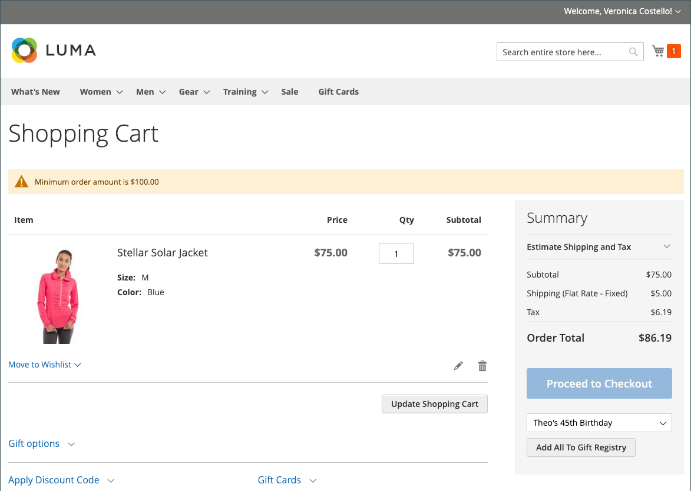
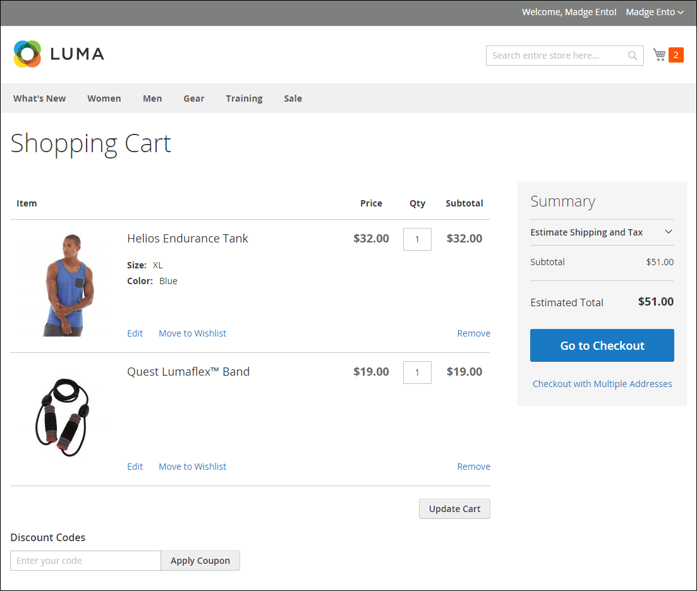
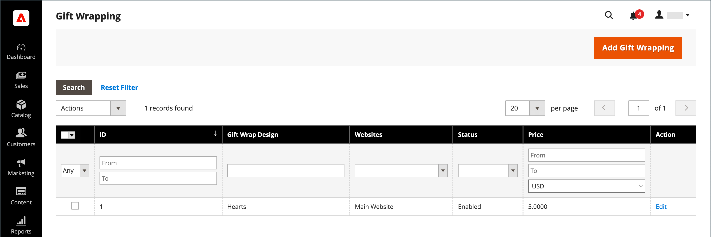

# Configurazione del carrello

La configurazione del carrello determina il modo in cui il carrello funziona per i clienti del negozio, compreso il momento in cui il cliente viene reindirizzato alla pagina del carrello e quali immagini vengono utilizzate per le miniature dei prodotti. È inoltre possibile richiedere un ordine per raggiungere un importo minimo prima dell&#39;inizio del processo di pagamento, specificare il numero di giorni in cui i prezzi quotati rimangono validi e specificare l&#39;ordine degli elementi nella sezione _Totali ordine_.

[**Mini carrello**](#mini-cart) - Configura questa opzione per determinare se l&#39;icona o il collegamento al carrello visualizza il numero di prodotti diversi (o SKU) nel carrello o la quantità totale di tutti gli articoli.

[**Collegamento mini carrello**](#configure-the-cart-link) - Configura questa opzione per determinare se il mini carrello viene visualizzato quando un cliente fa clic sul numero di elementi nell&#39;icona del carrello nella parte superiore della pagina di uno store.

[**Reindirizza al carrello**](#redirect-to-cart)- Configura questa opzione per determinare se la pagina del carrello viene visualizzata ogni volta che un articolo viene aggiunto al carrello o solo quando un cliente sceglie di passare alla pagina.

[**Durata preventivo**](#quote-lifetime) - Configura questa opzione per specificare la durata di validità di un prezzo.

[**Importo minimo dell&#39;ordine**](#minimum-order-amount) - Configura queste opzioni per specificare un importo minimo, dopo aver applicato gli sconti, che i subtotali dell&#39;ordine devono soddisfare e che il messaggio visualizzato nel carrello.

[**Quantità minima ordine**](#minimum-order-quantity) - Configurare queste opzioni per specificare il numero minimo di elementi necessari per effettuare un ordine.

[**Miniature carrello**](#cart-thumbnails) - Configura le opzioni delle miniature del carrello per determinare le miniature visualizzate nel carrello per i prodotti raggruppati o configurabili.

[**Opzioni regalo**](#gift-options) - Configura le opzioni regalo per determinare se i clienti possono aggiungere un messaggio regalo o un biglietto di auguri e se sono disponibili le opzioni per la confezione regalo.

>[!NOTE]
>
>Per informazioni sulla configurazione del processo di estrazione, vedere [Opzioni di estrazione](checkout-process.md).

## Mini carrello

Il _mini carrello_ visualizza un riepilogo degli elementi nel carrello. È attivata per impostazione predefinita e viene visualizzata quando fai clic sul collegamento Carrello nella parte superiore della pagina.
Il collegamento può essere configurato in modo da visualizzare il numero di prodotti (o SKU) diversi nel carrello o la quantità totale di tutti gli articoli.

{width="700" zoomable="yes"}

>[!NOTE]
>
>Per un cliente _registrato_, in alcuni casi il Mini Cart potrebbe non essere sincronizzato automaticamente tra più dispositivi e browser. Per sincronizzare il Mini Cart in questi casi, il cliente può semplicemente aprire la pagina [Carrello acquisti](cart.md) su tale dispositivo o browser.

### Configurare il mini carrello

1. Nella barra laterale _Admin_, passa a **[!UICONTROL Stores]** > _[!UICONTROL Settings]_>**[!UICONTROL Configuration]**.

1. Nel pannello a sinistra, espandi **[!UICONTROL Sales]** e scegli **[!UICONTROL Checkout]**.

1. Espandere  nella sezione _[!UICONTROL Mini Cart]_.

   {width="600" zoomable="yes"}

1. Se l&#39;impostazione è per una visualizzazione archivio specifica, [scegliere la visualizzazione archivio](../configuration-reference/scope-change.md#set-the-scope) in cui si applica la configurazione.

   Quando richiesto, fare clic su **[!UICONTROL OK]** per continuare.

1. Imposta **[!UICONTROL Display Mini Cart]** su uno dei seguenti:

   - `Yes` - Visualizza il mini carrello nelle pagine dello store. L’aspetto della barra laterale dipende dal tema.
   - `No` - Disattiva la visualizzazione del mini carrello nelle pagine dello store.

1. Se la visualizzazione è abilitata, aggiorna le altre opzioni per configurare la visualizzazione:

   - Per **[!UICONTROL Number of Items to Display Scrollbar]**, immettere il numero di elementi che possono essere visualizzati nella barra laterale prima che venga attivata la barra di scorrimento.
   - Per **[!UICONTROL Maximum Display Recently Added Item(s)]**, immetti il numero massimo di elementi aggiunti di recente che desideri visualizzare nel mini carrello.

1. Fare clic su **[!UICONTROL Save Config]**.

### Configurare il collegamento al carrello

1. Nella barra laterale _Admin_, ha raggiunto **[!UICONTROL Stores]** > _[!UICONTROL Settings]_>**[!UICONTROL Configuration]**.

1. Nel pannello a sinistra, espandi **[!UICONTROL Sales]** e scegli **[!UICONTROL Checkout]**.

1. Espandere  nella sezione **[!UICONTROL My Cart Link]**.

1. Imposta **[!UICONTROL Display Cart Summary]** su una delle seguenti impostazioni:

   - `Display item quantities` - Questa impostazione visualizza il numero totale di prodotti nel carrello, aggiungendo le quantità per ciascun prodotto.
   - `Display number of items in cart` - Questa impostazione visualizza il numero di articoli prodotto nel carrello, indipendentemente dalla quantità.

   {width="600" zoomable="yes"}

1. Fare clic su **[!UICONTROL Save Config]**.

## Reindirizza al carrello

La pagina del carrello può essere configurata in modo da essere visualizzata ogni volta che un articolo viene aggiunto al carrello oppure solo quando i clienti scelgono di passare alla pagina. Le informazioni di base sugli elementi presenti nel carrello sono sempre disponibili nel [mini carrello](#mini-cart). La decisione è una questione di bilanciamento dei vantaggi di lasciare che i clienti continuano a fare acquisti, con i vantaggi di incoraggiare i clienti a procedere al pagamento. Potrebbe essere una semplice questione di preferenze personali. Tuttavia, se desideri eseguirne il backup con i numeri, puoi eseguire un test A/B per vedere quale approccio produce un tasso di conversione più elevato.

**_Da configurare quando viene visualizzato il carrello:_**

1. Nella barra laterale _Admin_, passa a **[!UICONTROL Stores]** > _[!UICONTROL Settings]_>**[!UICONTROL Configuration]**.

1. Nel pannello a sinistra, espandi **[!UICONTROL Sales]** e scegli **[!UICONTROL Checkout]**.

1. Espandere  nella sezione **[!UICONTROL Shopping Cart]**.

   {width="600" zoomable="yes"}

1. Se l&#39;impostazione è per una visualizzazione archivio specifica, [scegliere la visualizzazione archivio](../configuration-reference/scope-change.md#set-the-scope) in cui si applica la configurazione.

   Quando richiesto, fare clic su **[!UICONTROL OK]** per continuare.

1. Imposta **[!UICONTROL After Adding a Product Redirect to Shopping Cart]** su uno dei seguenti:

   - `Yes` - Visualizza la pagina del carrello subito dopo l&#39;aggiunta di un prodotto al carrello.
   - `No` - Disattiva il reindirizzamento al carrello dopo l&#39;aggiunta di un prodotto al carrello.

1. Fare clic su **[!UICONTROL Save Config]**.

## Durata offerta

Con l&#39;installazione e l&#39;abilitazione di Adobe Commerce B2B, puoi aggiungere il supporto per la funzione _Quotes_. Questa funzionalità consente agli acquirenti autorizzati di avviare il processo di negoziazione dei prezzi inviando una richiesta dal carrello. Nella griglia _Offerte_ sono elencati tutti i preventivi ricevuti e viene conservata una cronologia delle comunicazioni tra l&#39;acquirente e il venditore. Per ulteriori informazioni sulle funzionalità B2B, vedere [Offerte negoziate](../b2b/quotes.md) nella _Guida utente di Adobe Commerce B2B_.

Puoi determinare per quanto tempo un prezzo è valido impostando la durata dell’offerta del carrello nella configurazione. Ad esempio, se un acquirente lascia un carrello incustodito dopo diversi giorni, il prezzo di offerta per alcuni articoli potrebbe non essere più lo stesso. Per impostazione predefinita, la durata dell&#39;offerta è impostata su 30 giorni.

**_Per configurare la durata del preventivo:_**

1. Nella barra laterale _Admin_, passa a **[!UICONTROL Stores]** > _[!UICONTROL Settings]_>**[!UICONTROL Configuration]**.

1. Nel pannello a sinistra, espandi **[!UICONTROL Sales]** e scegli **[!UICONTROL Checkout]**.

1. Espandere  nella sezione **[!UICONTROL Shopping Cart]**.

   {width="600" zoomable="yes"}

1. Se l&#39;impostazione è per una visualizzazione archivio specifica, [scegliere la visualizzazione archivio](../configuration-reference/scope-change.md#set-the-scope) in cui si applica la configurazione.

   Quando richiesto, fare clic su **[!UICONTROL OK]** per continuare.

1. Per **[!UICONTROL Quote Lifetime (days)]**, immettere il numero di giorni di validità di un prezzo quotato.

1. Fare clic su **[!UICONTROL Save Config]**.

## Importo minimo ordine

La configurazione consente di specificare un importo minimo, dopo l’applicazione degli sconti, che i subtotali dell’ordine devono soddisfare. Gli ordini spediti a più indirizzi possono essere richiesti per soddisfare l&#39;importo minimo dell&#39;ordine per indirizzo. Il pulsante Pagamento diventa disponibile solo una volta raggiunto l&#39;importo minimo dell&#39;ordine.

{width="700" zoomable="yes"}

**_Per configurare un importo minimo per l&#39;ordine:_**

1. Nella barra laterale _Admin_, passa a **[!UICONTROL Stores]** > _[!UICONTROL Settings]_>**[!UICONTROL Configuration]**.

1. Nel pannello a sinistra, espandi **[!UICONTROL Sales]** e scegli **[!UICONTROL Sales]** sotto.

1. Espandere  nella sezione **[!UICONTROL Minimum Order Amount]**.

   {width="600" zoomable="yes"}

1. Per richiedere un ordine minimo, impostare **[!UICONTROL Enable]** su `Yes`.

1. Se l&#39;ordine minimo è abilitato, impostare le opzioni seguenti per configurare il requisito:

   - Immettere **[!UICONTROL Minimum Amount]** richiesto per il subtotale, dopo aver applicato gli sconti.

   - Imposta **[!UICONTROL Include Discount Amount]** su uno dei seguenti:

      - `Yes` - Richiede che il subtotale soddisfi l&#39;importo minimo con eventuali sconti inclusi. Utilizzando un esempio di un minimo di 50 $, se il carrello contiene un top di 60 $ con uno sconto del 25% applicato, il subtotale risultante è di 45 $ e il carrello non raggiungerebbe il minimo.
      - `No` - Richiede che il subtotale soddisfi l&#39;importo minimo senza sconti.

   - Imposta **[!UICONTROL Include Tax to Amount]** su uno dei seguenti:

      - `Yes` - Richiede che il subtotale soddisfi l&#39;importo minimo con l&#39;imposta inclusa.
      - `No` - Richiede che il subtotale soddisfi l&#39;importo minimo senza imposte.

1. È possibile personalizzare le impostazioni dei messaggi per l&#39;importo minimo dell&#39;ordine:

   - Per **[!UICONTROL Description Message]**, immettere il testo che si desidera utilizzare per personalizzare il messaggio visualizzato nella parte superiore del carrello quando il subtotale non raggiunge la quantità minima.

   - Per **[!UICONTROL Error to Show in Shopping Cart]**, immettere il testo che si desidera utilizzare per personalizzare il messaggio di errore del carrello.

   Lascia vuoti i campi di descrizione del messaggio per utilizzare i messaggi predefiniti.

1. Se necessario, configura l’impostazione dell’importo minimo dell’ordine per gli ordini con più indirizzi:

   - Per richiedere che ogni indirizzo in un ordine con più indirizzi soddisfi l&#39;importo minimo dell&#39;ordine, impostare **[!UICONTROL Validate Each Address Separately in Multi-address Checkout]** su `Yes`.

   - È possibile personalizzare le impostazioni dei messaggi per l&#39;importo minimo dell&#39;ordine:

      - **[!UICONTROL Multi-address Description Message]** - Immettere il testo che si desidera utilizzare per personalizzare il messaggio visualizzato nella parte superiore del carrello per gli ordini con più indirizzi che non soddisfano il minimo consentito.

      - **[!UICONTROL Multi-address Error to Show in Shopping Cart]** - Immettere il testo che si desidera utilizzare per personalizzare il messaggio di errore del carrello per gli ordini con più indirizzi che non soddisfano il minimo consentito, immettere il testo nella casella.

     Lascia vuoti i campi di descrizione del messaggio per utilizzare i messaggi predefiniti.

1. Fare clic su **[!UICONTROL Save Config]**.

## Quantità minima ordine

È possibile impostare la quantità minima consentita per un ordine. La quantità minima può anche essere configurata in base a ciascun gruppo di clienti.

1. Vai a **[!UICONTROL Stores]** > _[!UICONTROL Settings]_>**[!UICONTROL Configuration]**.

1. Nel pannello a sinistra, espandi **[!UICONTROL Catalog]** e scegli **[!UICONTROL Inventory]**.

1. Espandere  nella sezione **[!UICONTROL Product Stock Options]**.

   {width="600" zoomable="yes"}

1. Per **[!UICONTROL Minimum Qty Allowed in Shopping Cart]**, impostare la quantità minima del prodotto per un ordine.

   Se necessario, deselezionare la casella di controllo **[!UICONTROL Use system value]** per modificare queste impostazioni.

   - Modificare l&#39;impostazione **[!UICONTROL Customer Group]** in un gruppo specifico e immettere **[!UICONTROL Minimum Qty]** per tale gruppo. Per aggiungere un altro gruppo e un altro limite di quantità, fare clic su **[!UICONTROL Add Minimum Qty]**.

   - Per impostare lo stesso limite di quantità minima per tutti i clienti, mantenere la selezione `ALL GROUPS` e immettere **[!UICONTROL Minimum Qty]**.

1. Fare clic su **[!UICONTROL Save Config]**.

   {width="700" zoomable="yes"}

## Miniature carrello

 (solo Adobe Commerce)

Le miniature visualizzate nel carrello offrono ai clienti una rapida panoramica degli articoli che stanno per acquistare. Tuttavia, per i prodotti con più opzioni, l’immagine potrebbe non corrispondere alla variante del prodotto presente nel carrello. Se il cliente acquista un articolo con un colore specifico, idealmente la miniatura nel carrello dovrebbe corrispondere.

L’immagine di anteprima sia per i prodotti raggruppati che per quelli configurabili può essere impostata in modo da visualizzare l’immagine dal prodotto &quot;principale&quot; o dalla variante di prodotto.

{width="700" zoomable="yes"}

**_Per configurare le miniature del carrello:_**

1. Nella barra laterale _Admin_, passa a **[!UICONTROL Stores]** > _[!UICONTROL Settings]_>**[!UICONTROL Configuration]**.

1. Nel pannello a sinistra, espandi **[!UICONTROL Sales]** e scegli **[!UICONTROL Checkout]**.

1. Espandere  nella sezione **[!UICONTROL Shopping Cart]**.

   {width="600" zoomable="yes"}

1. Impostare **[!UICONTROL Grouped Product Image]** per determinare la miniatura utilizzata nel carrello per [prodotti raggruppati](../catalog/product-create-grouped.md):

   - `Product Thumbnail Itself` - Utilizza la miniatura assegnata alla variante prodotto aggiunta al carrello.
   - `Parent Product Thumbnail` - Utilizza la miniatura assegnata al prodotto principale.

1. Impostare **[!UICONTROL Configurable Product Image]** per determinare la miniatura utilizzata nel carrello per [prodotti configurabili](../catalog/product-create-configurable.md):

   - `Product Thumbnail Itself` - Utilizza la miniatura assegnata alla variante prodotto aggiunta al carrello.
   - `Parent Product Thumbnail` - Utilizza la miniatura assegnata al prodotto principale.

1. Fare clic su **[!UICONTROL Save Config]**.

## Opzioni regalo

La selezione delle opzioni regalo disponibili viene visualizzata nel carrello prima dell&#39;inizio del processo di pagamento. La configurazione delle opzioni regalo determina se i clienti possono aggiungere un messaggio regalo o un biglietto di auguri e se sono disponibili opzioni per la confezione regalo. Ogni articolo nell&#39;ordine può avere un messaggio e una confezione regalo separati. Quando applicati all&#39;intero ordine, i clienti possono anche aggiungere una ricevuta regalo e una cartolina di saluto.

{width="700" zoomable="yes"}

La configurazione Opzioni regalo si applica all’intero sito web, ma può essere ignorata a livello di prodotto.

### Abilita opzioni regalo

1. Nella barra laterale _Admin_, passa a **[!UICONTROL Stores]** > _[!UICONTROL Settings]_>**[!UICONTROL Configuration]**.

1. Nel pannello a sinistra, espandi **[!UICONTROL Sales]** e scegli **[!UICONTROL Sales]** sotto.

1. Espandere  **[!UICONTROL Gift Options]** nella pagina.

   {width="600" zoomable="yes"}

1. Impostare le opzioni del messaggio regalo in base alle proprie preferenze:

   - Per **[!UICONTROL Allow Gift Messages on Order Level]**, selezionare `Yes` per abilitare un singolo messaggio regalo per l&#39;intero ordine.
   - Per **[!UICONTROL Allow Gift Messages for Order Items]**, selezionare `Yes` per consentire l&#39;aggiunta di messaggi regalo separati per singoli articoli nel carrello acquisti.

1.  (solo Adobe Commerce) Imposta le opzioni di confezione regalo in base alle tue preferenze:

   - Per **[!UICONTROL Allow Gift Wrapping on Order Level]**, selezionare `Yes` per abilitare una singola confezione regalo per l&#39;intero ordine.
   - Per **[!UICONTROL Allow Gift Wrapping for Order Items]**, selezionare `Yes` per abilitare l&#39;aggiunta della confezione regalo singolarmente a ogni elemento nel carrello.

   Puoi anche definire [design per confezione regalo](#gift-wrap) diversi, in modo che i clienti possano scegliere la confezione.

1.  (solo Adobe Commerce) Per offrire ai clienti un&#39;opzione per includere una ricevuta regalo, impostare **[!UICONTROL Allow Gift Receipt]** su `Yes`.

1.  (solo Adobe Commerce) Per fornire ai clienti un&#39;opzione per includere una carta stampata, impostare **[!UICONTROL Allow Printed Card]** su `Yes`.

1.  (solo Adobe Commerce) Immetti **[!UICONTROL Default Price for Printed Card]**.

1. Fare clic su **[!UICONTROL Save Config]**.

### Confezione regalo

 (solo Adobe Commerce)

La confezione regalo è disponibile per qualsiasi prodotto che può essere spedito e può essere offerto per singoli articoli o per l&#39;intero ordine. Puoi addebitare un prezzo separato per ogni design regalo e caricare un’immagine in miniatura per ogni design visualizzato come opzione per un prodotto nel carrello. Quando un cliente fa clic sulla miniatura del regalo, viene visualizzata un’immagine a dimensione intera. Durante la revisione dell&#39;estrazione, l&#39;addebito per la consegna regalo viene visualizzato con gli altri [totali per l&#39;estrazione](checkout-totals-sort-order.md) nella sezione _Riepilogo ordine_.

L&#39;immagine a capo regalo deve essere un campione che mostra il motivo ripetuto e può anche includere un campione della barra multifunzione da utilizzare. È possibile scansionare la carta o scattare una fotografia di una confezione. L’immagine caricata può essere un’immagine GIF, JPG o PNG e deve essere quadrata. Nell’esempio seguente, l’immagine a capo regalo caricata è 230 x 230 pixel.

{width="700" zoomable="yes"}

#### Aggiungere un design a capo regalo

1. Nella barra laterale _Admin_, passa a **[!UICONTROL Stores]** > _[!UICONTROL Other Settings]_>**[!UICONTROL Gift Wrapping]**.

   {width="700" zoomable="yes"}

1. Nell&#39;angolo superiore destro fare clic su **[!UICONTROL Add Gift Wrapping]**.

1. Immettere il nome per **[!UICONTROL Gift Wrapping Design]** da visualizzare durante l&#39;estrazione.

   Se necessario, è possibile modificare **[!UICONTROL Scope]** e configurare un nome diverso per ogni visualizzazione dello store.

1. Selezionare **[!UICONTROL Websites]** in cui è disponibile il design del wrapping regalo.

1. Imposta **[!UICONTROL Status]** su `Enabled`.

   Se si dispone di un&#39;opzione di disposizione stagionale, è possibile impostarla su `Disabled` quando non si desidera che l&#39;opzione sia disponibile.

1. Immettere **[!UICONTROL Price]** del design del wrapping regalo.

   Questa impostazione può essere sovrascritta dal prezzo per confezione regalo impostato a livello di prodotto.

   {width="600" zoomable="yes"}

1. Per caricare una miniatura **[!UICONTROL Image]** della confezione regalo, fai clic su **[!UICONTROL Choose File]** e seleziona il file da caricare dalla directory.

   Una miniatura dell&#39;immagine viene visualizzata in _[!UICONTROL Gift Wrapping Information]_dopo il salvataggio del record.

1. Fare clic su **[!UICONTROL Save]**.

#### Modificare un design a capo regalo

1. Nella barra laterale _Admin_, passa a **[!UICONTROL Stores]** > _[!UICONTROL Other Settings]_>**[!UICONTROL Gift Wrapping]**.

1. Trovare il record a capo regalo nell&#39;elenco.

1. Nella colonna _Azione_ fare clic su **[!UICONTROL Edit]**.

   {width="600" zoomable="yes"}

1. Apporta le modifiche necessarie.

1. Fare clic su **[!UICONTROL Save]**.

#### Elimina schemi a capo regalo

Con la griglia _Ritorno a capo automatico_ aperta, utilizzare uno di questi metodi per eliminare le progettazioni a capo automatico.

**_Metodo 1: eliminare un singolo schema di wrapping regalo_**

1. Apri la progettazione della confezione regalo in modalità di modifica.

1. Nella parte superiore dell&#39;area di lavoro fare clic su **[!UICONTROL Delete]**.

1. Quando richiesto, fare clic su **[!UICONTROL OK]** per confermare.

**_Metodo 2: eliminazione di più schemi regalo_**

1. Nella griglia _Ritorno a capo regalo_ selezionare la casella di controllo di ogni schema di Ritorno a capo che si desidera eliminare.

1. Impostare il controllo **[!UICONTROL Actions]** su `Delete`.

1. Fare clic su **[!UICONTROL Submit]**.

### Imposta opzioni regalo

 (solo Adobe Commerce)

I prezzi della confezione regalo e della gift card stampata possono essere configurati in modo da includere o escludere l&#39;imposta o da visualizzare entrambe le opzioni. È inoltre possibile specificare una classe fiscale per questi articoli, a livello globale o a livello di sito Web.

**_Per configurare le imposte sulle opzioni regalo:_**

1. Nella barra laterale _Admin_, passa a **[!UICONTROL Stores]** > _[!UICONTROL Settings]_>**[!UICONTROL Configuration]**.

1. Nel pannello a sinistra, espandi **[!UICONTROL Sales]** e scegli **[!UICONTROL Tax]**.

1. Espandere  nella sezione **[!UICONTROL Tax Classes]**.

   {width="600" zoomable="yes"}

1. Imposta **[!UICONTROL Tax Class for Gift Options]** sulla classe fiscale applicabile.

1. Espandere  nella sezione **[!UICONTROL Orders, Invoices, Credit Memos Display Settings]**.

   {width="600" zoomable="yes"}

1. Imposta **[!UICONTROL Display Gift Wrapping Prices]** su uno dei seguenti:

   - `Excluding Tax`
   - `Including Tax`
   - `Including and Excluding Tax`

1. Imposta **[!UICONTROL Display Printed Card Prices]** su uno dei seguenti:

   - `Excluding Tax`
   - `Including Tax`
   - `Including and Excluding Tax`

1. Fare clic su **[!UICONTROL Save Config]**.
