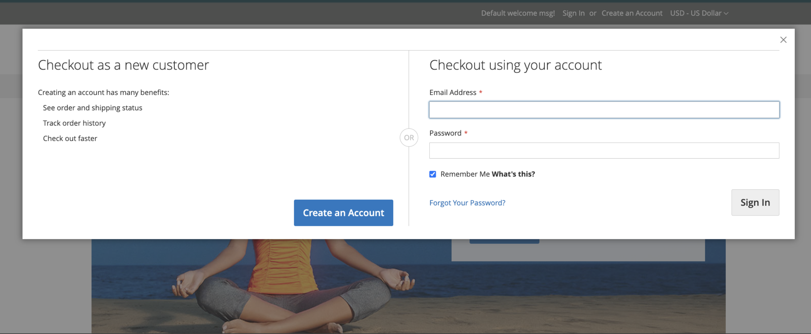

# Persistenza carrello

Un carrello persistente salva un riferimento all’account del cliente sul dispositivo corrente, garantendo che il contenuto del carrello rimanga accessibile alla scadenza della sessione registrata.

Se un cliente viene _ricordato_, il contenuto del carrello rimane accessibile sul dispositivo corrente alla scadenza della sessione di accesso. Alla scadenza della sessione, si accede al carrello del cliente utilizzando la sessione del carrello persistente. Se lo stesso cliente effettua l’accesso su un altro dispositivo o browser e aggiunge qualcosa al carrello, quindi ritorna al dispositivo con una sessione persistente attiva, il carrello viene aggiornato con gli elementi aggiunti.

L’utilizzo di un carrello persistente può ridurre il numero di carrelli abbandonati e aumentare le vendite. Il carrello permanente **non espone** informazioni riservate sull&#39;account in alcun momento.

Per gestire l&#39;utilizzo della persistenza del carrello per il sito o all&#39;interno di specifiche visualizzazioni dello store, puoi [configurare le impostazioni del carrello acquisti persistente](#configure-a-persistent-cart). Per ulteriori informazioni su come queste impostazioni influiscono sull&#39;esperienza dell&#39;acquirente nella vetrina, vedi [Flusso di lavoro del carrello permanente](#persistent-cart-workflow).

>[!NOTE]
>
>La funzionalità del carrello acquisti permanente è disponibile solo per i clienti registrati e connessi. Gli acquirenti ospiti non possono utilizzare la funzione persistente del carrello.

## Flusso di lavoro del carrello persistente

Quando il carrello acquisti permanente è [abilitato](#configure-a-persistent-cart), il flusso di lavoro dipende da:

- I valori delle impostazioni _[!UICONTROL Enable Remember Me]_e_[!UICONTROL Clear Persistence on Log Out]_
- La decisione del cliente di selezionare o deselezionare la casella di controllo _[!UICONTROL Remember Me]_
- Quando il cookie persistente viene cancellato

Alla scadenza della sessione del cliente, un collegamento `Not Jane Smith?` viene visualizzato nell&#39;intestazione della pagina nelle seguenti condizioni:
- il cliente connesso ha selezionato l&#39;opzione _[!UICONTROL Remember Me]_e viene applicato un cookie persistente
- il cliente si disconnette quando il sistema è configurato con _[!UICONTROL Clear Persistence on Sign Out]_impostato su `No`.

Il sistema conserva un record dei contenuti del carrello sul dispositivo corrente, anche se la sessione di accesso scade. Il collegamento `Not Jane Smith?` consente al cliente di terminare la sessione persistente e iniziare a lavorare come ospite o di accedere come un altro cliente o lo stesso cliente.

Se il cliente ha selezionato la casella di controllo _[!UICONTROL Remember Me]_durante l&#39;accesso, l&#39;archivio crea e mantiene un cookie persistente separato. Questo cookie consente di mantenere accessibile il carrello del cliente anche dopo la chiusura del browser o la navigazione a un sito diverso e la scadenza della sessione di accesso.

Se lo stesso cliente visita il tuo negozio utilizzando più browser durante l’accesso o mentre è attiva una sessione persistente, le modifiche apportate dal cliente al contenuto del carrello in un browser si riflettono in altri browser quando la pagina viene aggiornata.

>[!NOTE]
>
>Per garantire la sincronizzazione del carrello tra più dispositivi o browser, i clienti devono accedere a ogni nuovo dispositivo utilizzato per lo shopping. Per i clienti connessi, il contenuto del carrello viene sincronizzato tra più dispositivi e browser, purché abbiano effettuato l’accesso con lo stesso account, indipendentemente dalla configurazione del carrello persistente.

### Comportamento della casella di controllo &quot;Ricorda utente&quot;

I clienti possono selezionare la casella di controllo _[!UICONTROL Remember Me]_nella pagina di accesso, nel popup di autenticazione, negli accessi di checkout o durante la creazione di un nuovo account per mantenere il contenuto del carrello accessibile sul dispositivo corrente alla scadenza della sessione di login.

| Ti Ricordi Di Me? | Risultato |
| ------------ |  ------ |
| Selezionato | Crea un cookie persistente e mantiene il contenuto del carrello accessibile sul dispositivo corrente alla scadenza della sessione di accesso del cliente. |
| Non selezionato | Non crea un cookie persistente e non mantiene il contenuto del carrello accessibile sul dispositivo corrente alla scadenza della sessione di accesso. Tieni presente che il contenuto del carrello viene comunque salvato nell’account del cliente e ricaricato al successivo accesso. |

{style="table-layout:auto"}

{width="600" zoomable="yes"}
{width="600" zoomable="yes"}
{width="600" zoomable="yes"}

### Comportamento Cancella persistenza alla disconnessione

Quando il cliente effettua l&#39;accesso o si registra con l&#39;opzione _Ricorda utente_ selezionata, la configurazione dell&#39;opzione _Cancella persistenza alla disconnessione_ determina il comportamento del carrello persistente.

|  | Cancella persistenza alla disconnessione impostata su Sì | Cancella persistenza alla disconnessione impostata su No |
| ------ | ------ | ------ |
| _Si è ricordato_ che il cliente si disconnette | Elimina sia i cookie di sessione che quelli persistenti in modo che il contenuto del carrello acquisti scompaia sul dispositivo corrente fino a quando lo stesso cliente non effettua di nuovo l’accesso. | Elimina il cookie di sessione ma il cookie persistente rimane attivo. Il contenuto del carrello rimane accessibile sul dispositivo corrente. |
| _Il cliente_ non si disconnette ma il cookie di sessione scade | Il cookie persistente rimane attivo e il contenuto del carrello è accessibile dal dispositivo corrente. | Il cookie persistente rimane attivo e il contenuto del carrello è accessibile dal dispositivo corrente. |

### Esempio di una sessione aperta in un computer condiviso

Jane sta finendo il suo shopping di vacanza come _Ricordato_ cliente connesso. Aggiunge un regalo per John al suo carrello, e qualcosa per sua madre. Poi, va in cucina per uno spuntino e la sua sessione di accesso scade.

John si siede al computer per fare qualche acquisto rapido mentre Jane è in cucina. Senza notare il link `Not Jane Smith?` nella parte superiore della pagina, John trova un bel regalo per Jane e lo aggiunge al carrello. Al momento del check-out, nota che gli indirizzi di spedizione e fatturazione sono precompilati e pensa di aver effettuato l&#39;accesso. John ha talmente fretta da non notare gli elementi aggiuntivi durante la _revisione dell&#39;ordine_ e invia l&#39;ordine. Il carrello di Jane ora è vuoto, e John ha comprato tutti i regali.

## Configurare un carrello permanente

Durante l’impostazione di un carrello permanente, puoi specificare la durata dei cookie e le opzioni che desideri rendere disponibili per le varie attività dei clienti.

Per utilizzare il carrello acquisti persistente, il browser del cliente deve essere impostato in modo da consentire i cookie. Esistono due tipi di cookie utilizzati per le operazioni del carrello:

- **Cookie di sessione** - Durante una singola visita al sito esiste un cookie di sessione a breve termine. Questo cookie scade quando il cliente si disconnette o quando scade la sessione.

- **Cookie persistente** - Un cookie persistente a lungo termine continua a esistere al termine della sessione di accesso. Questo cookie assicura che il contenuto del carrello di un cliente rimanga accessibile quando il cliente si disconnette o la sessione scade.

Per ulteriori informazioni su come queste impostazioni di configurazione influiscono sul flusso di lavoro del cliente, vedere [Flusso di lavoro del carrello permanente](#persistent-cart-workflow).

{{$include /help/_includes/persistent-cart-configuration.md}}

<!-- Last updated from includes: 2024-10-31 10:02:14 -->
