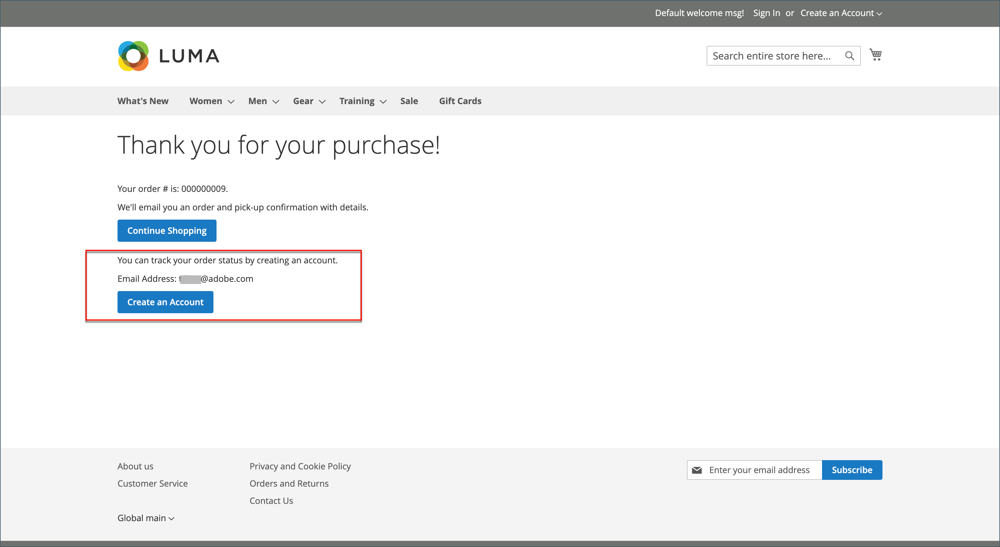

# Pagamento per gli ospiti

Il tuo negozio può essere configurato per richiedere agli acquirenti di aprire un account prima di effettuare un acquisto. L’impostazione predefinita consente agli ospiti di effettuare acquisti, con la possibilità di registrarsi a un account dopo aver completato il processo di pagamento.

{width="600" zoomable="yes"}

**_Per disabilitare l&#39;estrazione guest:_**

1. Nella barra laterale _Admin_, passa a **[!UICONTROL Stores]** > _[!UICONTROL Settings]_>**[!UICONTROL Configuration]**.

1. Nel pannello a sinistra, espandi **[!UICONTROL Sales]** e scegli **[!UICONTROL Checkout]**.

1. Espandere  nella sezione **[!UICONTROL Checkout Options]**.

   {width="700" zoomable="yes"}

Per una descrizione dettagliata di ciascuna di queste impostazioni di configurazione, vedere [Opzioni di estrazione](../configuration-reference/sales/checkout.md#checkout-options) nella _Guida di riferimento alla configurazione_.

1. Se l&#39;impostazione è per una visualizzazione archivio specifica, [scegliere la visualizzazione archivio](../configuration-reference/scope-change.md#set-the-scope) in cui si applica la configurazione.

   Quando richiesto, fare clic su **[!UICONTROL OK]** per continuare.

1. Imposta **[!UICONTROL Allow Guest Checkout]** su `No`.

   Se necessario, deselezionare la casella di controllo **[!UICONTROL Use system value]** per abilitare le modifiche a questa impostazione.

1. Fare clic su **[!UICONTROL Save Config]**.

## Consenti accesso agli ordini degli ospiti per le e-mail registrate

[!BADGE Solo SaaS]{type=Positive url="https://experienceleague.adobe.com/en/docs/commerce/user-guides/product-solutions" tooltip="Applicabile solo ai progetti Adobe Commerce as a Cloud Service (infrastruttura SaaS gestita da Adobe)."}

Una configurazione facoltativa a livello di negozio, disabilitata per impostazione predefinita, consente agli acquirenti ospiti di tenere traccia degli ordini effettuati utilizzando un indirizzo e-mail corrispondente a un account cliente registrato.

Quando questa opzione è attivata, gli ordini di pagamento dei clienti inseriti con un messaggio e-mail registrato rimangono accessibili e vengono visualizzati anche nella cronologia degli ordini del cliente.

Per abilitare questa funzione, passa a **Archivi** > Impostazioni > **Configurazione** > Vendite > **Vendite** > **Pagamento per gli ospiti** e imposta l&#39;impostazione **Consenti accesso agli ordini per gli ospiti per le e-mail registrate** su `Yes`.
