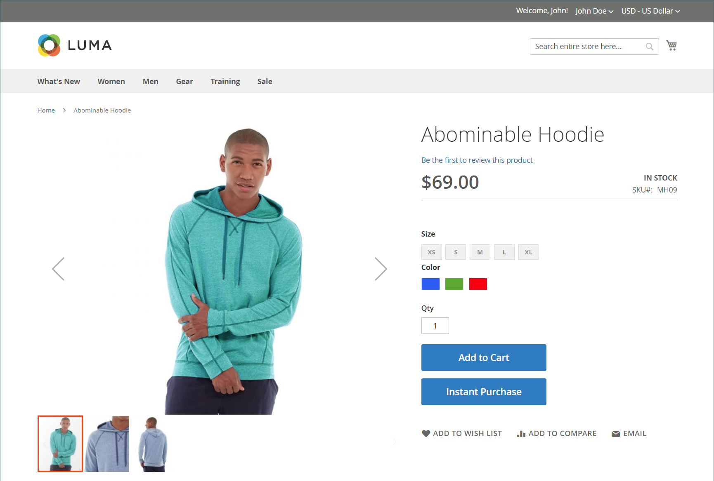

# Acquisto immediato

_Acquisto immediato_ consente ai clienti di velocizzare il processo di pagamento utilizzando le informazioni salvate nel loro account. Quando è attivata, la _Acquisto immediato_ sotto il _Aggiungi al carrello_ sulla pagina del prodotto per i clienti che soddisfano i requisiti.

{width="700" zoomable="yes"}

## Requisiti del cliente

- Il cliente è [accesso eseguito](../customers/customer-sign-in.md) sul loro conto.

- L’account cliente ha un [indirizzo di fatturazione e spedizione predefinito](../customers/account-dashboard-address-book.md).

- Almeno uno [metodo di spedizione](delivery.md) è disponibile per il paese specificato nell&#39;indirizzo di spedizione predefinito.

- L’account cliente ha un [pagamento in deposito](../stores-purchase/stored-payment-methods.md) metodo con vault abilitato.

  I seguenti metodi di pagamento possono essere utilizzati per fornire un accesso sicuro alle informazioni salvate sulla carta di credito:

   - [Braintree carte di credito](braintree.md) L&#39;acquisto immediato non può essere utilizzato con le carte di credito Braintree se 3D Secure è abilitato.
   - [Braintree con PayPal abilitato](braintree.md)
   - [PayPal Payflow Pro](paypal-payflow-pro.md)

## Acquisto immediato sul negozio

1. Nella vetrina, il cliente accede alla pagina del prodotto dell’articolo da acquistare.

1. Seleziona le opzioni e i clic richiesti **[!UICONTROL Instant Purchase]**.

   {width="500" zoomable="yes"}

1. Esamina il **[!UICONTROL Instant Purchase Confirmation]** informazioni e clic **[!UICONTROL OK]** per completare la transazione.

   Nella parte superiore della pagina del prodotto vengono visualizzati un messaggio di conferma e un numero di ordine.

## Configurare l’acquisto immediato

### Passaggio 1: aprire la pagina di configurazione

1. Il giorno _Amministratore_ barra laterale, vai a **[!UICONTROL Stores]** > _[!UICONTROL Settings]_>**[!UICONTROL Configuration]**.

### Passaggio 2: configurare l&#39;insieme di credenziali del metodo di pagamento

Puoi utilizzare l’acquisto istantaneo con Braintree o Payment Services per Adobe Commerce e Magento Open Source. Il vaulting deve essere attivato prima che un acquirente possa utilizzare la funzione di acquisto istantaneo.

Scopri come configurare il metodo di pagamento e abilitare il vaulting per Braintree o Payment Services:

- [Braintree](braintree.md)
- [Documentazione di Payment Services](https://experienceleague.adobe.com/docs/commerce-merchant-services/payment-services/guide-overview.html)

### Passaggio 3: abilitare l’acquisto immediato

1. Nel pannello a sinistra sotto _[!UICONTROL Sales]_, scegliere **[!UICONTROL Sales]**.

1. Espandi  il **[!UICONTROL Instant Purchase]** sezione.

1. Se si tratta di una modifica per una visualizzazione archivio specifica, [scegli la visualizzazione store](../configuration-reference/scope-change.md#set-the-scope) dove si applica la configurazione.

   Quando richiesto, fai clic su **[!UICONTROL OK]** per continuare.

1. Imposta **[!UICONTROL Enabled]** a `Yes`.

1. Inserisci il **[!UICONTROL Button Text]** che desideri visualizzare sul pulsante.

   Il testo del pulsante può essere modificato per ogni visualizzazione store o lingua. Per impostazione predefinita, il testo del pulsante è `Instant Purchase`.

   {width="600" zoomable="yes"}

   Per una descrizione dettagliata di ciascuna di queste impostazioni di configurazione, vedi [Acquisto immediato](../configuration-reference/sales/sales.md#instant-purchase) nel _Guida di riferimento alla configurazione_.

1. Clic **[!UICONTROL Save Config]**.

1. Quando viene richiesto di aggiornare la cache, fare clic su **[!UICONTROL Cache Management]** nel messaggio di sistema e seguire le istruzioni per svuotare la cache.
