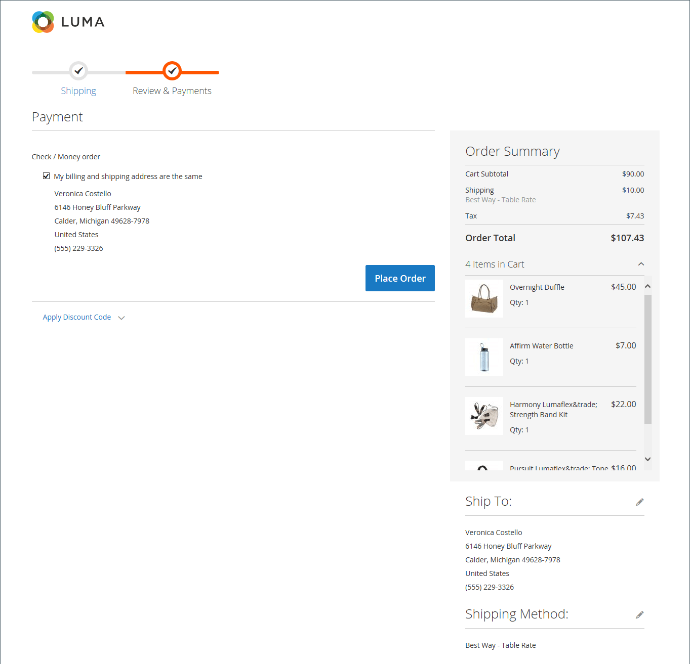

# Processo di pagamento e opzioni

Quando inizia il processo di pagamento, la transazione si sposta su un canale sicuro e crittografato. Nella barra degli indirizzi del browser viene visualizzato un simbolo di lucchetto e l&#39;URL cambia da `http` a `https`.

## Processo

L&#39;obiettivo del processo di pagamento è quello di raccogliere le informazioni necessarie per completare la transazione. La pagina _Estrai_ guida il cliente attraverso ogni passaggio del processo. I clienti che hanno effettuato l&#39;accesso ai loro account possono completare rapidamente l&#39;estrazione, poiché molte delle informazioni sono già presenti nei loro account. I clienti associati a un account società che utilizza ordini fornitore hanno un flusso di lavoro leggermente diverso.

### Spedizione

La prima fase del processo di pagamento consiste nel completare le informazioni relative all&#39;indirizzo di spedizione e nel scegliere il metodo di spedizione. Se il cliente dispone di un account, l&#39;indirizzo di spedizione viene inserito automaticamente, ma può essere modificato se necessario.

 (solo Adobe Commerce) Il formato dell&#39;indirizzo stradale del destinatario e del mittente è determinato dalle proprietà dell&#39;[attributo dell&#39;indirizzo del cliente](../customers/address-attributes.md). L&#39;impostazione di convalida dell&#39;input determina i caratteri validi che possono essere utilizzati in un indirizzo di spedizione.

La barra di avanzamento nella parte superiore della pagina segue ogni fase del processo di pagamento e il Riepilogo ordine mostra che le informazioni immesse finora.

{width="600" zoomable="yes"}

#### Spedisci a un altro indirizzo

1. Se nella rubrica sono presenti altre voci, il cliente trova l&#39;indirizzo in cui deve essere spedito l&#39;ordine.

1. Per selezionare l&#39;indirizzo, fare clic su **[!UICONTROL Ship Here]**.

#### Aggiungi un indirizzo

1. Nella parte inferiore della sezione _[!UICONTROL Shipping Address]_, il cliente fa clic su **[!UICONTROL + New Address]**.

1. Completa il modulo _[!UICONTROL Shipping Address]_.

   Per impostazione predefinita, nel modulo vengono inizialmente visualizzati il nome e il cognome del cliente.

   {width="600" zoomable="yes"}

1. Per salvare il nuovo indirizzo nella rubrica, il cliente seleziona la casella di controllo nella parte inferiore del modulo.

1. Clic su **[!UICONTROL Save Address]**.

   Il nuovo indirizzo viene ora selezionato come indirizzo di spedizione.

   {width="600" zoomable="yes"}

#### Scegli il metodo di spedizione

1. Nell&#39;elenco dei metodi di [spedizione](delivery.md), il cliente sceglie l&#39;opzione che desidera utilizzare.

   {width="600" zoomable="yes"}

1. Fai clic su **[!UICONTROL Next]** per continuare.

### Revisione e pagamenti - Ordine regolare

Durante il secondo passaggio del processo di pagamento, il cliente sceglie il [metodo di pagamento](payments.md) e applica all&#39;acquisto qualsiasi coupon con codici promozionali. È possibile rivedere e modificare tutte le informazioni, se necessario. Se abilitato, il cliente deve accettare i termini e le condizioni della vendita prima di effettuare l&#39;ordine.

>[!NOTE]
>
>Anche se Commerce consente la configurazione di più codici coupon, un cliente può applicare al carrello un solo codice coupon. Per ulteriori informazioni, vedere [Codici coupon](../merchandising-promotions/price-rules-cart-coupon.md).

{width="700" zoomable="yes"}

### Revisione e pagamenti - Ordine di acquisto

 (disponibile solo con Adobe Commerce B2B)

Quando un cliente è associato a una società che ha abilitato [ordini di acquisto](../b2b/purchase-order-flow.md), tutti gli ordini vengono elaborati come ordini di acquisto. I metodi di pagamento disponibili sono determinati dalle impostazioni dell&#39;account aziendale.

1. Il cliente seleziona un metodo di pagamento.

   Quando si utilizza il metodo _Pagamento sul conto_, è possibile utilizzare il campo [!UICONTROL Custom Reference Number] per fare riferimento a un numero di fattura.

1. Il cliente fa clic su **[!UICONTROL Place Purchase Order]**.

   L&#39;ordine di acquisto viene inserito.

Se la società ha impostato [regole di approvazione](../b2b/account-dashboard-approval-rules.md), l&#39;ordine di acquisto viene sottoposto al processo di approvazione. In caso contrario, viene elaborato immediatamente.

{width="700" zoomable="yes"}

### Numero di elementi visualizzati nel riepilogo dell&#39;ordine

Gli utenti amministratori possono modificare il numero massimo di elementi visualizzati nel riepilogo dell’ordine al momento del pagamento per semplificare la visualizzazione con un numero inferiore di prodotti. Per impostazione predefinita, questo valore è impostato su 10.

{width="700" zoomable="yes"}

1. Nella barra laterale _Admin_, passa a **[!UICONTROL Stores]** > _[!UICONTROL Settings]_>**[!UICONTROL Configuration]**.

1. Nel pannello a sinistra, espandi **[!UICONTROL Sales]** e scegli **[!UICONTROL Checkout]**.

1. Espandere  nella sezione **[!UICONTROL Checkout Options]**.

1. Per **[!UICONTROL Maximum Number of Items to Display in Order Summary]**, immettere il numero massimo di elementi da visualizzare.

1. Fare clic su **[!UICONTROL Save Config]**.

   Con questo aggiornamento, il riepilogo degli ordini visualizzato durante il pagamento è limitato alla quantità di articoli specificata.

### Conferma dell’ordine

La conferma dell’ordine viene visualizzata dopo che l’ordine è stato effettuato. Per i clienti registrati, la pagina include il numero di ordine con un collegamento al conto del cliente e un collegamento per generare una ricevuta. Ai clienti registrati viene comunicato di attendersi conferma dell’ordine e informazioni di tracciamento via e-mail. Gli ospiti sono invitati a creare un account per tenere traccia dell&#39;ordine. I clienti registrati possono generare una ricevuta facendo clic su un collegamento.

La pagina di conferma dell&#39;ordine è denominata anche pagina _Operazione riuscita_ e viene utilizzata dai programmi di analisi per tenere traccia delle conversioni.

{width="700" zoomable="yes"}

## Opzioni di pagamento

Le opzioni di checkout controllano vari attributi per la pagina di checkout, incluso il layout. È possibile configurare alcune opzioni per vincolare il pagamento, ad esempio consentire il pagamento come ospite e applicare un contratto di termini e condizioni. Sono inoltre disponibili opzioni per controllare la visualizzazione delle informazioni durante il processo di pagamento.

{width="700" zoomable="yes"}

Per una descrizione dettagliata di ciascuna di queste impostazioni di configurazione, vedere [Opzioni di estrazione](../configuration-reference/sales/checkout.md#checkout-options) nella _Guida di riferimento alla configurazione_.

### Modificare le opzioni di pagamento

1. Nella barra laterale _Admin_, passa a **[!UICONTROL Stores]** > _[!UICONTROL Settings]_>**[!UICONTROL Configuration]**.
1. Nel pannello a sinistra, espandi **[!UICONTROL Sales]** e scegli **[!UICONTROL Checkout]**.
1. Impostate una delle seguenti opzioni necessarie.
1. Fare clic su **[!UICONTROL Save Config]**.

1. Espandere  nella sezione **[!UICONTROL Checkout Options]**.

1. Se le impostazioni sono per una visualizzazione archivio specifica, [scegliere la visualizzazione archivio](../configuration-reference/scope-change.md#set-the-scope) in cui applicare la configurazione.

   Quando richiesto, fare clic su **[!UICONTROL OK]** per continuare.

1. Impostare le opzioni di pagamento.

1. Fare clic su **[!UICONTROL Save Config]**.

### Opzioni di pagamento disponibili

| Campo | [Ambito](../getting-started/websites-stores-views.md#scope-settings) | Descrizione |
|--- |--- |--- |
| [!UICONTROL Enable Onepage Checkout] | Visualizzazione store | Determina se [estrazione di una pagina](checkout-one-page.md) è il formato di estrazione predefinito. Opzioni: Sì / No |
| [!UICONTROL Allow Guest Checkout] | Visualizzazione store | Determina se gli ospiti possono effettuare l&#39;estrazione di [senza registrare](checkout-guest.md) un account con lo store. Opzioni: `Yes` / `No` |
| [!UICONTROL Enable Terms and Conditions] | Visualizzazione store | Determina se i clienti devono accettare i [Termini e condizioni](terms-and-conditions.md) della vendita prima di effettuare un acquisto. Opzioni: `Yes` / `No` |
| [!UICONTROL Display Billing Address On] | Visualizzazione store | Determina la posizione dell&#39;indirizzo di fatturazione durante l&#39;estrazione. Opzioni: `Payment Method` / `Payment Page` |
| [!UICONTROL Maximum Number of Items to Display in Order Summary] | Visualizzazione store | Determina il numero massimo di elementi che possono essere visualizzati nel Riepilogo ordini durante l&#39;estrazione. Il valore predefinito è `10`. |
| [!UICONTROL Enable Address Search] | Sito Web |  (solo Adobe Commerce) determina se i clienti possono utilizzare la funzionalità [ricerca indirizzi](checkout-address-search.md) per _Spedizione_ e i passaggi _Verifica e pagamenti_. Quando questa funzione è abilitata, utilizzare _[!UICONTROL Number of Customer Addresses Limit]_&#x200B;per impostare il numero di indirizzi salvati necessari per attivare questa funzionalità durante l&#39;estrazione. Opzioni: `Yes` / `No` |
| [!UICONTROL Number of Customer Addresses Limit] | Sito Web |  (solo Adobe Commerce) Quando la ricerca degli indirizzi è **[!UICONTROL Enabled]**, determina il numero di indirizzi salvati necessari per attivare questa funzionalità durante l&#39;estrazione. Quando il numero di indirizzi salvati del cliente raggiunge o supera questo numero, viene eseguito il rendering solo dell&#39;indirizzo predefinito nei passaggi _Spedizione_ e _Verifica e pagamenti_. Il cliente può utilizzare una funzione di ricerca per modificare l’indirizzo selezionato. Il valore predefinito è 10. |

{style="table-layout:auto"}
