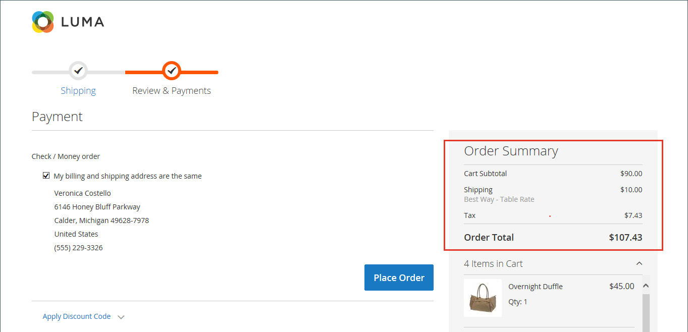

# Ordinamento per i totali di pagamento

Durante la revisione dell&#39;ordine, il totale viene visualizzato nella parte inferiore dell&#39;ordine, con eventuali adeguamenti per sconti, spese di spedizione, credito di magazzino e imposte. L&#39;ordine di ciascun elemento determina la sequenza dei calcoli e viene impostato nella configurazione da un numero assegnato a ciascun elemento. Ad esempio, il Subtotale è il primo elemento della sezione e gli viene assegnato il valore 10. Il Totale complessivo viene visualizzato per ultimo e gli viene assegnato il valore 100. A tutti gli altri elementi della sezione Totali viene assegnato un valore compreso tra tali valori.

{width="700" zoomable="yes"}

**_Per configurare l&#39;ordinamento dei totali di estrazione:_**

1. Il giorno _Amministratore_ barra laterale, vai a **[!UICONTROL Stores]** > _[!UICONTROL Settings]_>**[!UICONTROL Configuration]**.

1. Nel pannello a sinistra, espandi **[!UICONTROL Sales]** e scegliere **[!UICONTROL Sales]** sotto.

1. Espandi  il **[!UICONTROL Checkout Totals Sort Order]** sezione.

   {width="600" zoomable="yes"}

   Per una descrizione dettagliata di ciascuna di queste impostazioni di configurazione, vedi [Ordinamento dei totali di cassa](../configuration-reference/sales/sales.md#checkout-totals-sort-order) nel _Guida di riferimento alla configurazione_.

1. Se l&#39;impostazione è per una visualizzazione archivio specifica, [scegli la visualizzazione store](../configuration-reference/scope-change.md#set-the-scope) dove si applica la configurazione.

   Quando richiesto, fai clic su **[!UICONTROL OK]** per continuare.

1. Per determinare l&#39;ordine in _Totali_ , modificare il numero assegnato a ciascun elemento.

   Più basso è il valore, più precoce sarà la posizione nell&#39;elenco. Nella configurazione predefinita, il subtotale (`10`) è il primo totale e il totale complessivo (`100`) è l&#39;ultimo.

   Se necessario, cancellare il **[!UICONTROL Use system value]** per completare queste modifiche.

1. Clic **[!UICONTROL Save Config]**.
