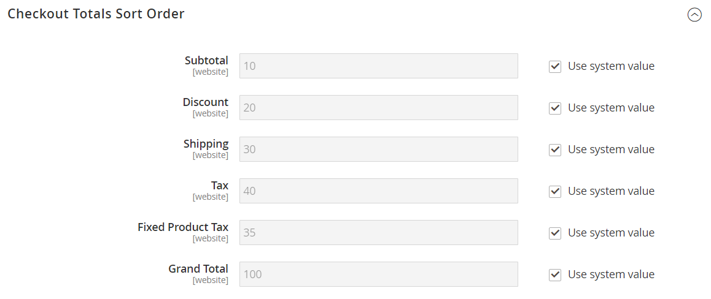

# Ordinamento per i totali di pagamento

Durante la revisione dell&#39;ordine, il totale viene visualizzato nella parte inferiore dell&#39;ordine, con eventuali adeguamenti per sconti, spese di spedizione, credito di magazzino e imposte. L&#39;ordine di ciascun elemento determina la sequenza dei calcoli e viene impostato nella configurazione da un numero assegnato a ciascun elemento. Ad esempio, il Subtotale è il primo elemento della sezione e gli viene assegnato il valore 10. Il Totale complessivo viene visualizzato per ultimo e gli viene assegnato il valore 100. A tutti gli altri elementi della sezione Totali viene assegnato un valore compreso tra tali valori.

{width="700" zoomable="yes"}

**_Per configurare l&#39;ordinamento dei totali di estrazione:_**

1. Nella barra laterale _Admin_, passa a **[!UICONTROL Stores]** > _[!UICONTROL Settings]_>**[!UICONTROL Configuration]**.

1. Nel pannello a sinistra, espandi la sezione **[!UICONTROL Sales]** e scegli **[!UICONTROL Sales]** sotto.

1. Espandere  nella sezione **[!UICONTROL Checkout Totals Sort Order]**.

   {width="600" zoomable="yes"}

   Per una descrizione dettagliata di ciascuna di queste impostazioni di configurazione, vedere [Ordinamento dei totali di estrazione](../configuration-reference/sales/sales.md#checkout-totals-sort-order) nella _Guida di riferimento alla configurazione_.

1. Se l&#39;impostazione è per una visualizzazione archivio specifica, [scegliere la visualizzazione archivio](../configuration-reference/scope-change.md#set-the-scope) in cui si applica la configurazione.

   Quando richiesto, fare clic su **[!UICONTROL OK]** per continuare.

1. Per determinare l&#39;ordine nella sezione _Totali_, modificare il numero assegnato a ogni elemento.

   Più basso è il valore, più precoce sarà la posizione nell&#39;elenco. Nella configurazione predefinita, il subtotale (`10`) è il primo e il totale complessivo (`100`) è l&#39;ultimo.

   Se necessario, deselezionare la casella di controllo **[!UICONTROL Use system value]** per completare le modifiche.

1. Fare clic su **[!UICONTROL Save Config]**.
