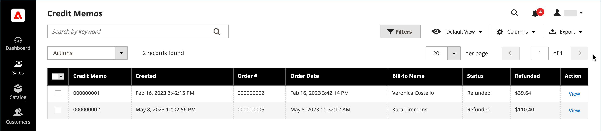

# Note di credito

Una _nota di credito_ è un documento che mostra l&#39;importo dovuto dal cliente per un rimborso completo o parziale. L’importo può essere applicato a un acquisto o rimborsato al cliente. È possibile stampare una nota di credito per un singolo ordine o per più ordini come batch. Prima di poter stampare una nota di accredito, è necessario generarla per l&#39;ordine. Nella pagina _Note di credito_ sono elencate le note di credito emesse ai clienti.

{width="700" zoomable="yes"}

## Metodo di rimborso

Il [metodo di pagamento](payments.md) per l&#39;ordine determina, in una certa misura, il metodo di rimborso di un ordine.

È possibile rimborsare gli ordini in tre modi:

- Credito conto: gli ordini pagati utilizzando un conto di credito possono essere rimborsati come credito conto:
   -  (solo Adobe Commerce) [Archivia credito](../customers/store-credit-using.md)
   -  (disponibile con Adobe Commerce B2B) [Pagamento sull&#39;account](../b2b/enable-basic-features.md#configure-payment-on-account) (metodo offline)
   -  (disponibile con Adobe Commerce B2B) [Credito società](../b2b/credit-company.md)
- [Rimborso online](payments.md#online-payment-methods): gli ordini pagati con carta di credito tramite un gateway di pagamento, ad esempio PayPal o Braintree, vengono rimborsati online tramite il processore di pagamento.
- [Rimborso non in linea](payments.md#offline-payment-methods) - Gli ordini pagati tramite Consegna in contanti ([COD](cash-on-delivery.md)) o tramite [assegno o vaglia postale](check-money-order.md) vengono rimborsati non in linea.

Puoi emettere un rimborso o un accredito conto offline (se abilitato) per qualsiasi metodo di pagamento.

Un ordine pagato da Cash on Delivery ([COD](cash-on-delivery.md)) o da [assegno o vaglia postale](check-money-order.md) è rimborsato offline.

## Flusso di lavoro di rimborso

1. **Azione di pagamento** - Se la configurazione [Azione di pagamento](credit-memo-create.md#payment-action-setting) è impostata su `Authorize`, è necessario generare una fattura prima di creare una nota di credito. Procedere con il passaggio 2. Se è impostato su `Authorize and Capture`, è già stata generata una fattura. Procedere con il passaggio 3.

1. **Genera fattura** - [Crea una fattura](invoices.md#create-an-invoice) per l&#39;ordine, in modo da poter inviare un rimborso al cliente tramite nota di credito.

1. **Crea nota di credito** - [Emetti una nota di credito](credit-memo-create.md) nell&#39;amministratore per un [acquisto di credito](credit-memo-create.md#issue-a-refund-for-a-credit-purchase) o un [assegno o vaglia postale](credit-memo-create.md#issue-an-offline-refund-for-check-or-money-order).

## Descrizioni delle colonne

| Colonna | Descrizione |
|--- |--- |
| [!UICONTROL Select] | Selezionare le caselle di controllo per gli elementi della nota di accredito da sottoporre a un&#39;azione oppure utilizzare il controllo di selezione nell&#39;intestazione di colonna. Opzioni: `Select All` / `Deselect All` |
| [!UICONTROL Credit Memo] | Identificatore numerico univoco assegnato quando viene inviata una richiesta di una nota di credito. |
| [!UICONTROL Created] | La data e l&#39;ora in cui il buyer ha presentato per la prima volta la richiesta di una nota di credito. |
| [!UICONTROL Order#] | ID ordine dell’ordine di cui vengono restituiti i prodotti. |
| [!UICONTROL Order Date] | La data e l&#39;ora in cui l&#39;acquirente ha effettuato un ordine. |
| [!UICONTROL Bill-to Name] | Il nome della persona responsabile del pagamento dell’ordine. |
| [!UICONTROL Status] | Indica lo stato corrente di una richiesta di nota di accredito. |
| [!UICONTROL Refunded] | Importo totale rimborsato dall&#39;ordine. |
| [!UICONTROL Actions] | **[!UICONTROL View]** - Apre la richiesta di una nota di accredito e mantiene un record della negoziazione tra l&#39;acquirente e il venditore. |
| [!UICONTROL Order Status] | Indica lo stato dell’ordine. |
| [!UICONTROL Purchased From] | Indica la visualizzazione del sito Web, del punto vendita e del punto vendita in cui è stato effettuato l&#39;ordine. |
| [!UICONTROL Billing Address] | L’indirizzo di fatturazione del cliente che ha effettuato l’ordine. |
| [!UICONTROL Shipping Address] | L’indirizzo dove deve essere spedito l’ordine. |
| [!UICONTROL Customer Name] | Il nome e il cognome del cliente che ha effettuato l’ordine. |
| [!UICONTROL Email] | L’indirizzo e-mail della persona che ha effettuato l’ordine. |
| [!UICONTROL Customer Group] | Il gruppo di clienti a cui è assegnato il cliente. |
| [!UICONTROL Payment Method] | Il metodo di pagamento da utilizzare per il pagamento. |
| [!UICONTROL Shipping Information] | Il metodo da utilizzare per spedire l’ordine. |
| [!UICONTROL Subtotal] | Il subtotale dell&#39;ordine, senza spedizione e movimentazione, e le imposte. |
| [!UICONTROL Shipping & Handling] | Importo addebitato per la spedizione e la movimentazione. |
| [!UICONTROL Adjustment Refund] | L&#39;importo che viene aggiunto all&#39;importo totale rimborsato come rimborso aggiuntivo. |
| [!UICONTROL Adjustment Fee] | Importo sottratto dall&#39;importo totale rimborsato. |
| [!UICONTROL Grand Total] | Totale ordine. |

{style="table-layout:auto"}
