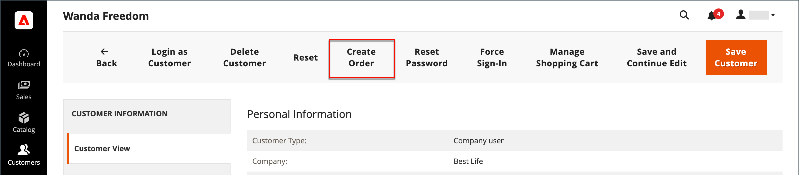

# Crea un ordine

Per i clienti registrati che necessitano di assistenza, puoi creare un intero ordine direttamente dall’Amministratore. Il _[!UICONTROL Create New Order]_il modulo include tutte le informazioni necessarie per il normale processo di pagamento, con i riepiloghi attività del dashboard account del cliente.

{width="700" zoomable="yes"}

## Passaggio 1: creare un ordine

1. Il giorno _Amministratore_ barra laterale, fai clic su **[!UICONTROL Customers]**.

1. Individuare il cliente nella griglia.

1. In _Azione_ , fare clic su **[!UICONTROL Edit]**.

1. Nell’intestazione del workspace, fai clic su **[!UICONTROL Create Order]**.

   {width="700" zoomable="yes"}

   Puoi anche creare un ordine in [Area di lavoro ordini](orders.md#orders-workspace) facendo clic su **[!UICONTROL Create New Order]**.

## Passaggio 2: Aggiungere prodotti

Se il tuo Negozio ha più visualizzazioni, scegli la visualizzazione del Negozio in cui deve essere effettuato l’ordine.

### Aggiungi prodotti da [!UICONTROL Customer's Activities] barra laterale

Puoi trasferire gli articoli nel carrello dalla lista dei desideri di un cliente o da qualsiasi articolo visualizzato di recente, confrontato o ordinato.

1. Espandi  una delle seguenti sezioni:

   - **[!UICONTROL Wish List]**
   - **[!UICONTROL Last Ordered Items]**
   - **[!UICONTROL Products in Comparison List]**
   - **[!UICONTROL Recently Compared Products]**
   - **[!UICONTROL Recently Viewed Products]**

1. Seleziona la casella di controllo di ciascun prodotto nel pannello a sinistra.

1. Scorri verso il basso e fai clic su **[!UICONTROL Update Changes]**.

   L&#39;elemento viene visualizzato nel modulo d&#39;ordine.

   {width="600" zoomable="yes"}

### Aggiungi prodotti dal catalogo

1. Clic **[!UICONTROL Add Products]**.

   {width="600" zoomable="yes"}

1. Nella griglia, seleziona la casella di controllo di ciascun prodotto da aggiungere al carrello e immetti **[!UICONTROL Qty]** da acquistare.

   {width="600" zoomable="yes"}

   >[!NOTE]
   >
   >La griglia di selezione dei prodotti mostra sempre i prezzi base regolari per i prodotti, senza sconti e senza le regole di prezzo applicate al carrello o al gruppo. Il prezzo finale del prodotto viene calcolato solo quando il prodotto viene aggiunto a un ordine/carrello.

1. Configurare le opzioni di prodotto disponibili:

   - Clic **[!UICONTROL Configure]**.

   - Completa le opzioni in base alle esigenze.

   - Clic **[!UICONTROL OK]**.

   - Clic **[!UICONTROL Add Selected Product(s) to Order]** per aggiornare il carrello.

1. Se un prodotto è configurato per [opzioni regalo](../catalog/product-gift-options.md), imposta le opzioni in base alle esigenze.

1. Sostituisci il prezzo di un articolo, se necessario:

   - Seleziona la **[!UICONTROL Custom Price]** e inserire il nuovo prezzo nella casella sottostante.

   - Per aggiornare i totali del carrello, fai clic su **[!UICONTROL Update Items and Quantities]**.

   {width="600" zoomable="yes"}

1. Completare le sezioni seguenti in base alle esigenze dell&#39;ordine:

   - [!UICONTROL Order Currency]
   - [!UICONTROL Apply Coupon Codes / Gift Card Code]
   - [!UICONTROL Payment Method]
   - [!UICONTROL Shipping Method]
   - [!UICONTROL Order Comments]

>[!NOTE]
>
>Consulta la [Guida ai servizi di pagamento](https://experienceleague.adobe.com/docs/commerce-merchant-services/payment-services/create-order.html) per ulteriori informazioni sui metodi di pagamento per supportare questa funzionalità quando l’estensione Payment Services è installata e configurata.

## Passaggio 3: sottomettere l&#39;ordine

Clic **[!UICONTROL Submit Order]**.

Viene inviata una conferma al cliente che può visualizzare i dettagli dell&#39;ordine dal proprio account.
