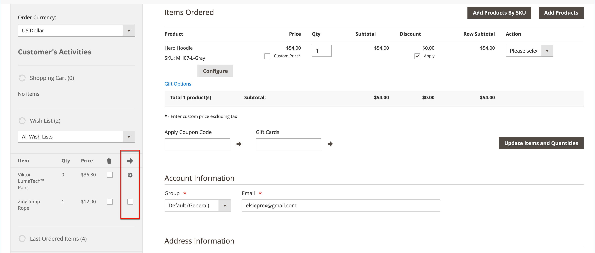

# Crea un ordine

Per i clienti registrati che necessitano di assistenza, puoi creare un intero ordine direttamente dall’Amministratore. Il modulo _[!UICONTROL Create New Order]_&#x200B;include tutte le informazioni necessarie per il normale processo di pagamento, con i riepiloghi attività dal dashboard account del cliente.

{width="700" zoomable="yes"}

## Passaggio 1: creare un ordine

1. Nella barra laterale _Admin_, fai clic su **[!UICONTROL Customers]**.

1. Individuare il cliente nella griglia.

1. Nella colonna _Azione_ fare clic su **[!UICONTROL Edit]**.

1. Nell&#39;intestazione dell&#39;area di lavoro fare clic su **[!UICONTROL Create Order]**.

   {width="700" zoomable="yes"}

   Puoi anche creare un ordine nell&#39;[Area di lavoro ordini](orders.md#orders-workspace) facendo clic su **[!UICONTROL Create New Order]**.

## Passaggio 2: Aggiungere prodotti

Se il tuo Negozio ha più visualizzazioni, scegli la visualizzazione del Negozio in cui deve essere effettuato l’ordine.

### Aggiungi prodotti dalla barra laterale [!UICONTROL Customer's Activities]

Puoi trasferire gli articoli nel carrello dalla lista dei desideri di un cliente o da qualsiasi articolo visualizzato di recente, confrontato o ordinato.

1. Espandere  in una delle sezioni seguenti:

   - **[!UICONTROL Wish List]**
   - **[!UICONTROL Last Ordered Items]**
   - **[!UICONTROL Products in Comparison List]**
   - **[!UICONTROL Recently Compared Products]**
   - **[!UICONTROL Recently Viewed Products]**

1. Seleziona la casella di controllo di ciascun prodotto nel pannello a sinistra.

1. Scorrere verso il basso e fare clic su **[!UICONTROL Update Changes]**.

   L&#39;elemento viene visualizzato nel modulo d&#39;ordine.

   {width="600" zoomable="yes"}

### Aggiungi prodotti dal catalogo

1. Fare clic su **[!UICONTROL Add Products]**.

   {width="600" zoomable="yes"}

1. Nella griglia, selezionare la casella di controllo di ciascun prodotto da aggiungere al carrello e immettere **[!UICONTROL Qty]** da acquistare.

   {width="600" zoomable="yes"}

   >[!NOTE]
   >
   >La griglia di selezione dei prodotti mostra sempre i prezzi base regolari per i prodotti, senza sconti e senza le regole di prezzo applicate al carrello o al gruppo. Il prezzo finale del prodotto viene calcolato solo quando il prodotto viene aggiunto a un ordine/carrello.

1. Configurare le opzioni di prodotto disponibili:

   - Fare clic su **[!UICONTROL Configure]**.

   - Completa le opzioni in base alle esigenze.

   - Fare clic su **[!UICONTROL OK]**.

   - Fare clic su **[!UICONTROL Add Selected Product(s) to Order]** per aggiornare il carrello.

1. Se un prodotto è configurato per [opzioni regalo](../catalog/product-gift-options.md), impostare le opzioni in base alle esigenze.

1. Sostituisci il prezzo di un articolo, se necessario:

   - Selezionare la casella di controllo **[!UICONTROL Custom Price]** e immettere il nuovo prezzo nella casella seguente.

   - Per aggiornare i totali del carrello, fare clic su **[!UICONTROL Update Items and Quantities]**.

   {width="600" zoomable="yes"}

1. Completare le sezioni seguenti in base alle esigenze dell&#39;ordine:

   - [!UICONTROL Order Currency]
   - [!UICONTROL Apply Coupon Codes / Gift Card Code]
   - [!UICONTROL Payment Method]
   - [!UICONTROL Shipping Method]
   - [!UICONTROL Order Comments]
   - [[!UICONTROL [Attributi ordine personalizzati]]](../stores-purchase/order-processing.md#custom-order-attributes)

>[!NOTE]
>
>Per ulteriori informazioni sui metodi di pagamento per supportare questa funzionalità quando l&#39;estensione Payment Services è installata e configurata, vedere la [Guida di Payment Services](https://experienceleague.adobe.com/en/docs/commerce/payment-services/guide-overview).

## Passaggio 3: sottomettere l&#39;ordine

Fare clic su **[!UICONTROL Submit Order]**.

Viene inviata una conferma al cliente che può visualizzare i dettagli dell&#39;ordine dal proprio account.
