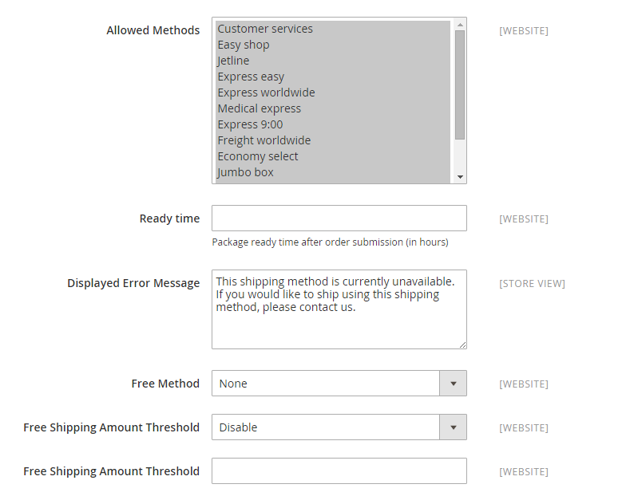

# DHL

DHL offre servizi internazionali integrati e soluzioni personalizzate per la gestione e il trasporto di lettere, merci e informazioni.

## Passaggio 1: Abilitare DHL

1. Il giorno _Amministratore_ barra laterale, vai a **[!UICONTROL Stores]** > _[!UICONTROL Settings]_>**[!UICONTROL Configuration]**.

1. Nel pannello a sinistra, espandi **[!UICONTROL Sales]** e scegli **[!UICONTROL Delivery Methods]**.

1. Espandi  il **[!UICONTROL DHL]** sezione.

   >[!NOTE]
   >
   >Se necessario, cancellare prima **[!UICONTROL Use system value]** per modificare le seguenti impostazioni come descritto.

1. Imposta **[!UICONTROL Enabled for Checkout]** a `Yes`.

1. In genere, è possibile accettare il valore predefinito **[!UICONTROL Gateway URL]**.

   Se DHL ha fornito un URL alternativo, immettere tale valore in questo campo.

1. Utilizzare le credenziali fornite da DHL per completare i campi seguenti:

   - **[!UICONTROL Access ID]**
   - **[!UICONTROL Password]**
   - **[!UICONTROL Account Number]**

{width="600" zoomable="yes"}

## Passaggio 2: inserire la descrizione del pacchetto e la tariffa di movimentazione

1. In **[!UICONTROL Content Type]** selezionare l&#39;opzione che descrive meglio il tipo di pacchetto spedito:

   - `Documents`
   - `Non documents`

1. Configura le opzioni relative alle commissioni di gestione in base alle tue esigenze.

   La tariffa di movimentazione è facoltativa e viene visualizzata come un supplemento che viene aggiunto al costo di spedizione DHL. Se si desidera includere una tariffa di imballaggio, eseguire le operazioni seguenti:

   - Per **[!UICONTROL Calculate Handling Fee]**, selezionare il metodo che si desidera utilizzare per calcolare le tariffe di imballaggio:

      - `Fixed`
      - `Percentage`

   - Per **[!UICONTROL Handling Applied]**, seleziona la modalità di applicazione delle tariffe di imballaggio:

      - `Per Order`
      - `Per Package`

   - Per **[!UICONTROL Handling Fee]**, immettere l&#39;importo da addebitare, in base al metodo scelto per calcolare l&#39;importo.

     Ad esempio, se l&#39;addebito è basato su un addebito fisso, immettere l&#39;importo come decimale, ad esempio `4.90`. Tuttavia, se la commissione di gestione si basa su una percentuale dell&#39;ordine, immettere l&#39;importo come percentuale. Ad esempio, se si sta addebitando il 6% dell&#39;ordine, immettere il valore come `.06`.

   - Per consentire il frazionamento del peso totale dell&#39;ordine in modo da garantire un calcolo accurato delle spese di spedizione, impostare **[!UICONTROL Divide Order Weight]** a `Yes`.

   - Imposta il **[!UICONTROL Weight Unit]** dell&#39;imballaggio in uno dei seguenti modi:

      - `Pounds`
      - `Kilograms`

   - Imposta il **[!UICONTROL Size]** di una confezione tipica a una delle seguenti condizioni:

      - `Regular`
      - `Specific`

     Se si sceglie `Specific`, immetti il **[!UICONTROL Height]**, **[!UICONTROL Depth]**, e **[!UICONTROL Width]** della confezione in centimetri.

   {width="600" zoomable="yes"}

## Passaggio 3: specificare i metodi di consegna consentiti

1. Per **[!UICONTROL Allowed Methods]**, scegli ogni metodo che desideri rendere disponibile ai clienti.

   Per selezionare più metodi, tenere premuto Ctrl (PC) o Comando (Mac) e fare clic su ciascuna opzione.

   Per visualizzare l’elenco corretto dei metodi di consegna, devi prima specificare [Paese di origine](../configuration-reference/sales/shipping-settings.md).

1. Per **[!UICONTROL Ready Time]**, immettere il numero di ore dopo l&#39;invio di un ordine per il quale un pacchetto è pronto per la spedizione.

1. Modifica il **[!UICONTROL Displayed Error Message]** secondo necessità.

   Questo messaggio viene visualizzato quando un metodo selezionato non è disponibile.

1. Se desideri fornire un [Spedizione gratuita](shipping-free.md) opzione tramite DHL, impostare le opzioni di spedizione gratuita.

   - Per **[!UICONTROL Free Method]**, scegliere il metodo che si preferisce utilizzare per la spedizione gratuita.

   - Imposta **[!UICONTROL Free Shipping Amount Threshold]**:

     `Enable` - Se offri Spedizione gratuita con ordine minimo, inserisci il **[!UICONTROL Minimum Order Amount for Free Shipping]**.

     `Disable` - Non si applica spedizione gratuita DHL a qualsiasi ordine.

     Questa impostazione è simile a quella dello standard _Spedizione gratuita_ metodo, ma viene visualizzato nella sezione DHL in modo che i clienti sappiano quale metodo viene utilizzato per il loro ordine.

   - Per **[!UICONTROL Free Shipping Amount Threshold]**, immettere l&#39;importo minimo per un ordine per la spedizione gratuita.

     {width="600" zoomable="yes"}

## Passaggio 4: specificare i paesi applicabili

1. Imposta **[!UICONTROL Ship to Applicable Countries]** a uno dei seguenti elementi:

   - `All Allowed Countries`
   - `Specific Countries`

   Se la spedizione viene effettuata in paesi specifici, selezionare ciascun paese dal campo **[!UICONTROL Ship to Specific Countries]** elenco.

1. Imposta **[!UICONTROL Show Method if Not Applicable]**:

   `Yes` - Mostra DHL come metodo di spedizione durante il pagamento, anche se non applicabile all&#39;ordine.

   `No` - Mostra DHL come metodo di spedizione durante il pagamento solo se applicabile.

1. Per creare un file di registro con i dettagli delle spedizioni DHL effettuate dal tuo store, imposta **[!UICONTROL Debug]** a `Yes`.

1. Per **[!UICONTROL Sort Order]**, immettere un numero per determinare la sequenza in cui DHL viene visualizzato quando viene elencato con altri metodi di consegna durante il check-out.

   `0` = innanzitutto, `1` = secondo, `2` = terzo e così via.

1. Clic **[!UICONTROL Save Config]**.

   {width="600" zoomable="yes"}
