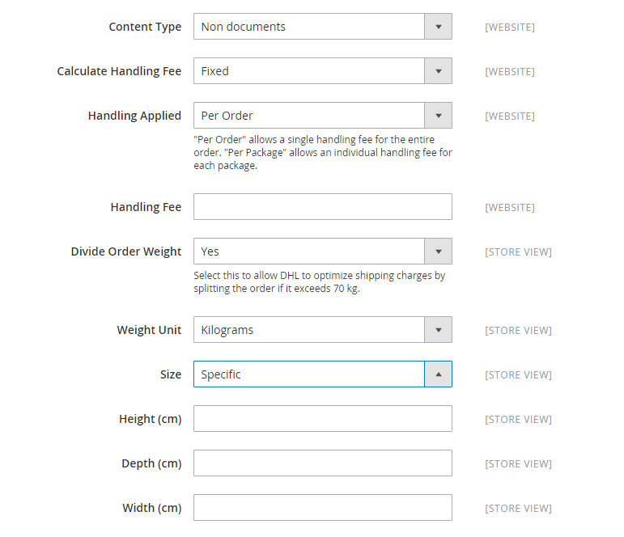

# DHL

DHL offre servizi internazionali integrati e soluzioni personalizzate per la gestione e il trasporto di lettere, merci e informazioni.

## Passaggio 1: Abilitare DHL

1. Nella barra laterale _Admin_, passa a **[!UICONTROL Stores]** > _[!UICONTROL Settings]_>**[!UICONTROL Configuration]**.

1. Nel pannello a sinistra, espandi **[!UICONTROL Sales]** e scegli **[!UICONTROL Delivery Methods]**.

1. Espandere  nella sezione **[!UICONTROL DHL]**.

   >[!NOTE]
   >
   >Se necessario, deselezionare la casella di controllo **[!UICONTROL Use system value]** per modificare le impostazioni seguenti come descritto.

1. Imposta **[!UICONTROL Enabled for Checkout]** su `Yes`.

1. Impostare **[!UICONTROL DHL Type]** su `DHL REST` se si utilizza l&#39;API REST DHL.

   Se si utilizza l&#39;API XML DHL, impostare **[!UICONTROL DHL Type]** su `DHL XML`.

   >[!NOTE]
   >
   >L&#39;API REST di DHL è il metodo preferito per l&#39;integrazione con DHL. L’API XML è obsoleta e potrebbe essere rimossa nelle versioni future.

1. Utilizzare le credenziali fornite da DHL per completare i campi seguenti:

Se si utilizza l&#39;API REST DHL, è necessario fornire le seguenti credenziali:

    - **[!UICONTROL API KEY]**
    - **[!UICONTROL API SECRET]**

Se si utilizza l&#39;API XML DHL, è necessario fornire le seguenti credenziali:

    - **[!UICONTROL Access ID]**
    - **[!UICONTROL Password]**
    - **[!UICONTROL Account Number]**

{width="600" zoomable="yes"}

## Passaggio 2: inserire la descrizione del pacchetto e la tariffa di movimentazione

1. Nell&#39;elenco **[!UICONTROL Content Type]** selezionare l&#39;opzione che descrive meglio il tipo di pacchetto spedito:

   - `Documents`
   - `Non documents`

1. Configura le opzioni relative alle commissioni di gestione in base alle tue esigenze.

   La tariffa di movimentazione è facoltativa e viene visualizzata come un supplemento che viene aggiunto al costo di spedizione DHL. Se si desidera includere una tariffa di imballaggio, eseguire le operazioni seguenti:

   - Per **[!UICONTROL Calculate Handling Fee]**, selezionare il metodo che si desidera utilizzare per calcolare le commissioni di gestione:

      - `Fixed`
      - `Percentage`

   - Per **[!UICONTROL Handling Applied]**, selezionare la modalità di applicazione delle tariffe di gestione:

      - `Per Order`
      - `Per Package`

   - Per **[!UICONTROL Handling Fee]**, immettere l&#39;importo da addebitare, in base al metodo scelto per calcolare l&#39;importo.

     Ad esempio, se l&#39;addebito è basato su una tariffa fissa, immettere l&#39;importo come decimale, ad esempio `4.90`. Tuttavia, se la commissione di gestione si basa su una percentuale dell&#39;ordine, immettere l&#39;importo come percentuale. Ad esempio, se si sta addebitando il 6% dell&#39;ordine, immettere il valore come `6`.

   - Per consentire il frazionamento del peso totale dell&#39;ordine per garantire un calcolo accurato delle spese di spedizione, impostare **[!UICONTROL Divide Order Weight]** su `Yes`.

   - Impostare **[!UICONTROL Weight Unit]** del pacchetto su uno dei seguenti elementi:

      - `Pounds`
      - `Kilograms`

   - Impostare **[!UICONTROL Size]** di un pacchetto tipico su uno dei seguenti:

      - `Regular`
      - `Specific`

     Se si sceglie `Specific`, immettere **[!UICONTROL Height]**, **[!UICONTROL Depth]** e **[!UICONTROL Width]** del pacchetto in centimetri.

   >[!NOTE]
   >
   >Se non viene specificata alcuna dimensione, ciascuna assumerà come valore predefinito un valore minimo di 3.

   {width="600" zoomable="yes"}

## Passaggio 3: specificare i metodi di consegna consentiti

1. Per **[!UICONTROL Allowed Methods]**, scegliere ogni metodo che si desidera rendere disponibile ai clienti.

   Per selezionare più metodi, tenere premuto Ctrl (PC) o Comando (Mac) e fare clic su ciascuna opzione.

   Per visualizzare l&#39;elenco corretto dei metodi di consegna, è necessario innanzitutto specificare il [Paese di origine](../configuration-reference/sales/shipping-settings.md).

1. Per **[!UICONTROL Ready Time]**, immettere il numero di ore dopo l&#39;invio di un ordine per cui un pacchetto è pronto per la spedizione.

1. Modificare **[!UICONTROL Displayed Error Message]** in base alle esigenze.

   Questo messaggio viene visualizzato quando un metodo selezionato non è disponibile.

1. Se desideri fornire un&#39;opzione [Spedizione gratuita](shipping-free.md) tramite DHL, imposta le opzioni di spedizione gratuita.

   - Per **[!UICONTROL Free Method]**, scegliere il metodo che si preferisce utilizzare per la spedizione gratuita.

   - Imposta **[!UICONTROL Free Shipping Amount Threshold]**:

     `Enable` - Se si offre la spedizione gratuita con un ordine minimo, immettere **[!UICONTROL Minimum Order Amount for Free Shipping]**.

     `Disable` - Non applica la spedizione DHL gratuita ad alcun ordine.

     Questa impostazione è simile a quella del metodo standard _Spedizione gratuita_, ma viene visualizzata nella sezione DHL in modo che i clienti sappiano quale metodo viene utilizzato per l&#39;ordine.

   - Per **[!UICONTROL Free Shipping Amount Threshold]**, immettere l&#39;importo minimo per un ordine per la spedizione gratuita.

     {width="600" zoomable="yes"}

## Passaggio 4: specificare i paesi applicabili

1. Imposta **[!UICONTROL Ship to Applicable Countries]** su uno dei seguenti:

   - `All Allowed Countries`
   - `Specific Countries`

   Se si effettua la spedizione in paesi specifici, selezionare ogni paese dall&#39;elenco **[!UICONTROL Ship to Specific Countries]**.

1. Imposta **[!UICONTROL Show Method if Not Applicable]**:

   `Yes` - Mostra DHL come metodo di spedizione durante il pagamento, anche se non applicabile all&#39;ordine.

   `No` - Mostra DHL come metodo di spedizione durante il pagamento solo se applicabile.

1. Per creare un file di registro con i dettagli delle spedizioni DHL effettuate dal tuo archivio, imposta **[!UICONTROL Debug]** su `Yes`.

1. DHL fornisce un&#39;opzione **[!UICONTROL sandbox mode]**. Se si utilizza la modalità sandbox, impostare **[!UICONTROL sandbox mode]** su `Yes`.
Se si utilizza la modalità Live, impostare **[!UICONTROL sandbox mode]** su `No`.

   >[!NOTE]
   >
   >La modalità sandbox viene utilizzata solo a scopo di test. Ti consente di testare la tua integrazione con DHL senza influire sul tuo negozio live.

1. Per **[!UICONTROL Sort Order]**, immettere un numero per determinare la sequenza in cui DHL viene visualizzato quando viene elencato con altri metodi di consegna durante l&#39;estrazione.

   `0` = primo, `1` = secondo, `2` = terzo e così via.

1. Fare clic su **[!UICONTROL Save Config]**.

   {width="600" zoomable="yes"}
