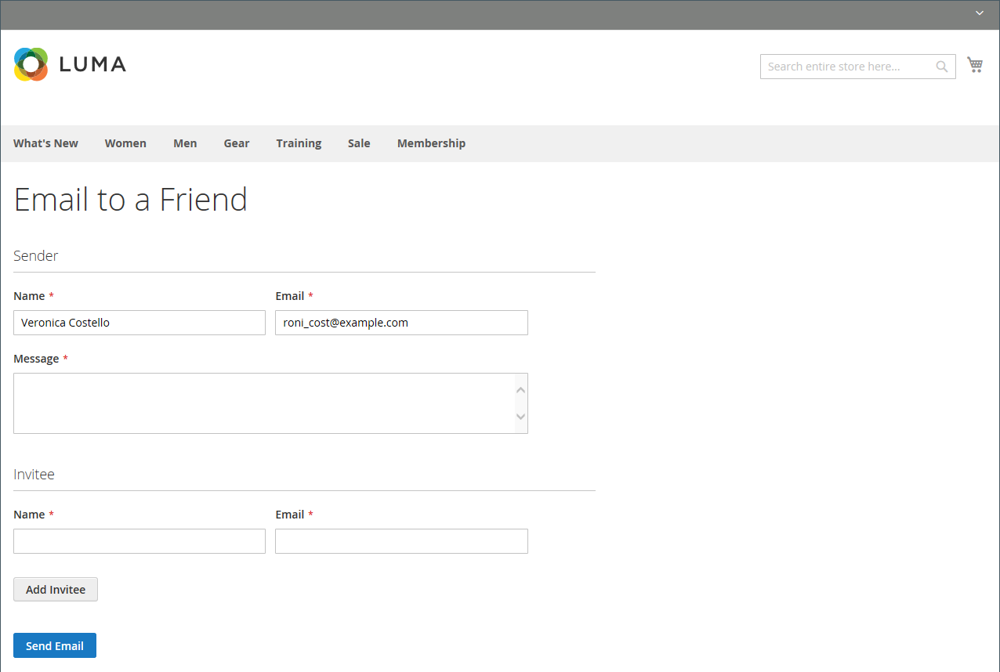

# Invia un&#39;e-mail a un amico

Il collegamento E-mail consente ai clienti di condividere facilmente con gli amici i collegamenti ai prodotti. Nell’archivio Luma demo, il collegamento E-mail viene visualizzato come icona di busta. Il modello di messaggio può essere personalizzato per la tua voce e il tuo marchio. Per evitare lo spamming, puoi limitare il numero di destinatari per ogni e-mail e il numero di prodotti che possono essere condivisi in un periodo di un’ora.

{width="700" zoomable="yes"}

## Configurare e-mail-a-friend

1. Nella barra laterale _Admin_, passa a **[!UICONTROL Stores]** > _[!UICONTROL Settings]_>**[!UICONTROL Configuration]**.

1. Nel pannello a sinistra, espandi **[!UICONTROL Catalog]** e scegli **[!UICONTROL Email to a Friend]**.

1. Espandere  nella sezione **[!UICONTROL Email Templates]** e impostare le opzioni:

   {width="600" zoomable="yes"}

   Per una descrizione dettagliata di ciascuna di queste impostazioni di configurazione, vedere [Modelli e-mail](../configuration-reference/catalog/email-to-a-friend.md) nella _Guida di riferimento alla configurazione_.

   Per modificare l&#39;impostazione predefinita di qualsiasi campo, deselezionare la casella di controllo **[!UICONTROL Use system value]** per rendere modificabile il campo.

   - Imposta **[!UICONTROL Enabled]** su `Yes`.

   - Impostare **[!UICONTROL Select Email Template]** sul modello da utilizzare come base per i messaggi.

   - Se desideri richiedere che solo i clienti registrati possano inviare e-mail agli amici, imposta **[!UICONTROL Allow for Guests]** su `No`.

   - Per **[!UICONTROL Max Recipients]**, immettere il numero massimo di amici che possono essere presenti nella lista di distribuzione per un singolo messaggio.

   - Per **[!UICONTROL Max Products Sent in 1 Hour]**, immetti il numero massimo di prodotti che possono essere condivisi da un singolo utente con gli amici in un periodo di un&#39;ora.

   - Impostare **[!UICONTROL Limit Sending By]** su uno dei seguenti metodi per identificare il mittente delle e-mail:

     `IP Address` - (scelta consigliata) Identifica il mittente in base all&#39;indirizzo IP del computer utilizzato per inviare le e-mail.

     `Cookie (unsafe)` - Identifica il mittente tramite il cookie del browser. Questo metodo è meno efficace perché il mittente può eliminare il cookie per aggirare il limite.

1. Al termine, fare clic su **[!UICONTROL Save Config]**.

## Invia un&#39;e-mail a un amico sul vetrina

Quando questa funzione è configurata, i clienti dei negozi seguono questi passaggi per condividere le informazioni sui prodotti con gli amici.

1. In una pagina del catalogo, il cliente fa clic sul collegamento **[!UICONTROL Email]**.

1. Se la funzione è configurata solo per gli utenti registrati, effettua una delle seguenti operazioni:

   - Accedi al tuo account cliente.
   - Registrati per un nuovo account.

1. Completa **[!UICONTROL Message]** e immette il destinatario **[!UICONTROL Name]** e **[!UICONTROL Email Address]**.

   Se necessario, il cliente può aggiungere altri destinatari:

   - Clic su **[!UICONTROL Add Invitee]**.

   - Immette **[!UICONTROL Name]** e **[!UICONTROL Email Address]** della persona aggiuntiva.

     Possono inviare il messaggio a tutte le persone aggiuntive consentite dalla configurazione. È possibile rimuovere l&#39;invitato aggiunto facendo clic sul collegamento **[!DNL Remove]**.

1. Quando è pronto per inviare il messaggio, fa clic su **[!UICONTROL Send Email]**.

   {width="700" zoomable="yes"}
