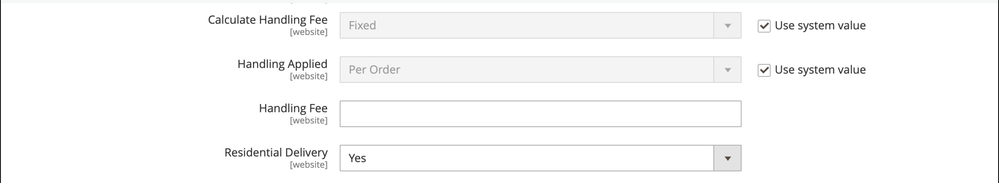

# FedEx

FedEx è una delle più grandi società di servizi di trasporto marittimo al mondo, che fornisce servizi di trasporto aereo, merci e di terra con diversi livelli di priorità.

{width="700" zoomable="yes"}

>[!NOTE]
>
>FedEx può utilizzare [peso dimensionale](carriers.md#dimensional-weight) per determinare alcune tariffe di spedizione. Tuttavia, Adobe Commerce e il Magento Open Source supportano solo il calcolo delle spese di spedizione basato sul peso.

## Fase 1: Registrati per la produzione di servizi Web FedEx

Sono necessari un account commerciante FedEx e la registrazione per l&#39;accesso alla produzione dei servizi Web FedEx. Dopo aver creato un account FedEx, leggere la pagina delle informazioni dell&#39;account di produzione, quindi fare clic sul collegamento _Ottieni chiave di produzione_ nella parte inferiore della pagina per registrarsi e ottenere una chiave.

>[!NOTE]
>
>Assicurati di copiare o annotare la chiave di autenticazione. È necessario impostare FedEx nelle impostazioni di spedizione Commerce.

## Passaggio 2: abilitare FedEx per il tuo Negozio

1. Nella barra laterale _Admin_, passa a **[!UICONTROL Stores]** > _[!UICONTROL Settings]_>**[!UICONTROL Configuration]**.

1. Nel pannello a sinistra, espandi **[!UICONTROL Sales]** e scegli **[!UICONTROL Delivery Methods]**.

1. Espandere  nella sezione **[!UICONTROL FedEx]**.

1. Imposta **[!UICONTROL Enabled for Checkout]** su `Yes`.

1. Per **[!UICONTROL Title]**, immettere un titolo che identifichi il metodo di spedizione FedEx durante il pagamento.

1. Immetti le seguenti informazioni dal tuo account FedEx:

   - **[!UICONTROL Account ID]**
   - **[!UICONTROL Api Key]**
   - **[!UICONTROL Secret Key]**

1. Se hai configurato una sandbox FedEx e desideri lavorare nell&#39;ambiente di test, imposta **[!UICONTROL Sandbox Mode]** su `Yes`.

   >[!NOTE]
   >
   >Ricorda di impostare la modalità sandbox su `No` quando sei pronto a offrire FedEx come metodo di spedizione ai tuoi clienti.

   {width="600" zoomable="yes"}

## Passaggio 3: Descrizione del pacchetto e spese di imballaggio

1. Impostare **[!UICONTROL Pickup Type]** sul metodo di prelievo utilizzato per le spedizioni.

   - `DropOff at Fedex Location` - (impostazione predefinita) indica che le spedizioni vengono effettuate presso la stazione FedEx locale.
   - `Contact Fedex to Schedule` - Indica che hai contattato FedEx per richiedere un prelievo.
   - `Use Scheduled Pickup` - Indica che la spedizione viene prelevata come parte di un prelievo pianificato regolare.
   - `On Call` - Indica che il prelievo è pianificato chiamando FedEx.
   - `Package Return Program` - Indica che la spedizione viene prelevata dal programma di restituzione dei pacchetti terrestri FedEx.
   - `Regular Stop` - Indica che la spedizione viene prelevata al normale programma di prelievo.
   - `Tag` - Indica che il prelievo della spedizione è specifico per una richiesta di prelievo di tag di chiamata rapida o di chiamata di terra. Questo è applicabile solo per un&#39;etichetta di spedizione di ritorno.

1. Per **[!UICONTROL Packages Request Type]**, selezionare il tipo di richiesta che meglio descrive la preferenza quando si suddivide un ordine in più spedizioni:

   - `Divide to equal weight (one request)`
   - `Use origin weight (few requests)`

1. Per **[!UICONTROL Packaging]**, selezionare il tipo di imballaggio FedEx utilizzato in genere per spedire i prodotti dal tuo negozio.

1. Impostare **[!UICONTROL Weight Unit]** sull&#39;unità di misura utilizzata nelle impostazioni locali.

   - `Pounds`
   - `Kilograms`

1. Immetti il **[!UICONTROL Maximum Package Weight]** consentito per le spedizioni FedEx.

   Il peso massimo predefinito di FedEx è di 150 libbre. Per ulteriori informazioni, rivolgiti al tuo corriere. Il valore predefinito è consigliato, a meno che tu non abbia stipulato accordi speciali con FedEx. Per ulteriori informazioni, vedere [Peso dimensionale](carriers.md#dimensional-weight).

   {width="600" zoomable="yes"}

1. Configura le opzioni relative alle commissioni di gestione in base alle tue esigenze.

   La tariffa di imballaggio è facoltativa e non è visibile durante il pagamento. Se si desidera includere una tariffa di imballaggio, eseguire le operazioni seguenti:

   - Imposta **[!UICONTROL Calculate Handling Fee]**:

      - `Fixed Fee`
      - `Percentage`

   - Per **[!UICONTROL Handling Applied]**, scegliere uno dei metodi seguenti per la gestione delle commissioni:

      - `Per Order`
      - `Per Package`

   - Immettere **[!UICONTROL Handling Fee]** come importo `fixed` o `percentage`, a seconda del metodo di calcolo.

1. Impostare **[!UICONTROL Residential Delivery]** su uno dei seguenti, a seconda che si venda business-to-consumer (B2C) o business-to-business (B2B).

   - `Yes` - Per consegne residenziali B2C.
   - `No` - Per consegne residenziali B2B.

   {width="600" zoomable="yes"}

## Fase 4: Metodi consentiti e paesi applicabili

1. Impostare **[!UICONTROL Allowed Methods]** per ogni metodo di spedizione che si desidera offrire.

   Quando si scelgono i metodi, considerare il proprio account FedEx, la frequenza e le dimensioni delle spedizioni e se si consentono spedizioni internazionali. Puoi offrire tutti i metodi desiderati, ad esempio:

   - Priorità Europa
   - Opzioni per il giorno di consegna: 1 giorno di trasporto, 2 giorni di trasporto, 2 giorni, 2 giorni AM, 3 giorni di trasporto
   - Opzioni nazionali-Express Saver, Terra, Primo, Pernottamento, Consegna a domicilio, Standard Overnight
   - Opzioni internazionali-International Economy, Intl Economy Freight, International First, International Ground, International, Priority Intl
   - Opzioni di priorità-Trasporto, Priorità notte
   - Smart Post-Se offre il metodo Smart Post (immetti l&#39;**ID hub**)
   - Opzioni di trasporto-Trasporto, trasporto nazionale

1. Se desideri fornire un&#39;opzione [Spedizione gratuita](shipping-free.md) tramite FedEx, imposta le opzioni di spedizione gratuita.

   - Impostare **[!UICONTROL Free Method]** sul metodo da utilizzare per la spedizione gratuita. Se non desideri offrire la spedizione gratuita tramite FedEx, scegli `None`.

   - Per richiedere un importo minimo per un ordine che qualifichi la spedizione gratuita con FedEx, impostare **[!UICONTROL Enable Free Shipping Threshold]** su `Enable`. Immettere quindi il valore minimo in **[!UICONTROL Free Shipping Amount Threshold]**.

   Questa impostazione è simile a quella del metodo di spedizione gratuita standard, ma viene visualizzata nella sezione FedEx durante il pagamento, in modo che i clienti sappiano quale metodo viene utilizzato per il loro ordine.

1. Se necessario, modificare **[!UICONTROL Displayed Error Message]**.

   Questa casella di testo è preimpostata con un messaggio predefinito, ma è possibile immettere un messaggio diverso da visualizzare se FedEx non è più disponibile.

   {width="600" zoomable="yes"}

1. Imposta **[!UICONTROL Ship to Applicable Countries]**:

   - `All Allowed Countries` - I clienti di tutti i [paesi](../getting-started/store-details.md#country-options) specificati nella configurazione dell&#39;archivio possono utilizzare questo metodo di consegna.

   - `Specific Countries` - Quando si sceglie questa opzione, viene visualizzato l&#39;elenco _Spedisci a paesi specifici_. Seleziona ogni paese nell’elenco in cui può essere utilizzato questo metodo di consegna.

1. Se si desidera conservare un registro di tutte le comunicazioni tra lo store e il sistema FedEx, impostare **[!UICONTROL Debug]** su `Yes`.

1. Imposta **[!UICONTROL Show Method if Not Applicable]**:

   - `Yes` - Mostra tutti i metodi di spedizione FedEx ai clienti, indipendentemente dalla loro disponibilità.
   - `No` - Mostra solo i metodi di spedizione FedEx applicabili all&#39;ordine.

1. Per **[!UICONTROL Sort Order]**, immettere un numero per determinare la sequenza in cui viene visualizzato FedEx quando elencato con altri metodi di consegna durante l&#39;estrazione.

   `0` = primo, `1` = secondo, `2` = terzo e così via.

1. Fare clic su **[!UICONTROL Save Config]**.

   {width="600" zoomable="yes"}

>[!NOTE]
>
>Commerce dichiara sempre il prezzo dell&#39;ordine completo a FedEx durante il calcolo delle spese di spedizione. Questo comportamento non può essere modificato.
