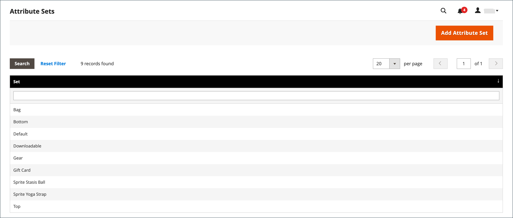

# Imposta sui prodotti fissi (FPT)

Alcune giurisdizioni fiscali hanno un&#39;imposta fissa che deve essere aggiunta a determinati tipi di prodotti. È possibile impostare un _imposta sul prodotto fissa_ (FPT) come necessario per il calcolo delle imposte del tuo negozio. In alcuni paesi, l&#39;FPT può essere utilizzato per istituire una tassa sui rifiuti di apparecchiature elettriche ed elettroniche (WEEE). Questa imposta è nota anche come _tassa ecologica_ o _ecotassa_, e viene raccolto su alcuni tipi di componenti elettronici per compensare i costi di riciclaggio. Si tratta di un importo fisso, piuttosto che di una percentuale del prezzo del prodotto.

Le imposte sui prodotti fisse vengono applicate a livello di articolo, in base al prodotto. In alcune giurisdizioni, questa imposta è soggetta a un calcolo di imposta supplementare pari al %. La giurisdizione fiscale potrebbe inoltre disporre di regole relative al modo in cui il prezzo del prodotto viene visualizzato ai clienti, con o senza imposte. Accertatevi di conoscere le regole e di impostare le opzioni di visualizzazione FPT di conseguenza.

Presta attenzione quando si quotano i prezzi FPT in e-mail, perché la differenza di prezzo può influenzare la fiducia dei clienti nei loro ordini. Ad esempio, se si visualizzano i prezzi di revisione dell&#39;ordine senza visualizzare FPT, i clienti che acquistano articoli con FPT associato visualizzano un totale che include l&#39;importo dell&#39;imposta FPT, ma senza un raggruppamento dettagliato. La differenza di prezzo potrebbe indurre alcuni clienti ad abbandonare i loro carrelli perché il totale è diverso dall&#39;importo previsto.

## Prezzi di visualizzazione FPT

| FPT | Impostazione e calcolo della visualizzazione | |
|--- |--- |---|
| Non tassato | **[!UICONTROL Excluding FPT]** | FPT viene visualizzato come riga separata nel carrello e il valore viene utilizzato nei calcoli fiscali appropriati. |
| | **[!UICONTROL Including FPT]** | FPT viene aggiunto al prezzo base di un articolo, ma non è incluso nei calcoli basati su regole fiscali. |
| | **[!UICONTROL Excluding FPT, FPT Description, Final Price]** | I prezzi vengono visualizzati senza l&#39;importo o la descrizione FPT. FPT non è incluso nei calcoli basati su regole fiscali. |
| Tassato | **[!UICONTROL Excluding FPT]** | FPT viene visualizzato come riga separata nel carrello e il valore viene utilizzato nei calcoli fiscali appropriati. |
| | **[!UICONTROL Including FPT]** | FPT è incluso nel prezzo di un articolo e non è richiesta alcuna modifica ai calcoli delle imposte. |
| | **[!UICONTROL Excluding FPT, FPT Description, Final Price]** | I prezzi vengono visualizzati senza l&#39;importo o la descrizione FPT. Tuttavia, FPT è incluso nei calcoli basati su regole fiscali. |

{style="table-layout:auto"}

## Configura FPT

L&#39;imposta fissa sui prodotti (FPT) [tipo di input](../catalog/attributes-input-types.md) crea una sezione di campi per la gestione delle imposte per ogni area.

Le seguenti istruzioni mostrano come impostare un&#39;imposta fissa sui prodotti per il tuo negozio, utilizzando &quot;eco tax&quot; come esempio. Dopo aver impostato l&#39;ambito dell&#39;imposta e i paesi e gli stati in cui l&#39;imposta viene applicata, e a seconda delle opzioni scelte, i campi di input possono variare in base ai requisiti locali. Per ulteriori informazioni, consulta [Creare attributi di prodotto](../catalog/attribute-product-create.md).

### Passaggio 1: abilitare l&#39;imposta sul prodotto fissa

1. Il giorno _Amministratore_ barra laterale, vai a **[!UICONTROL Stores]** > _[!UICONTROL Settings]_>**[!UICONTROL Configuration]**.

1. Nel pannello a sinistra, espandi **[!UICONTROL Sales]** e scegli **[!UICONTROL Tax]**.

1. Espandi  il **[!UICONTROL Fixed Product Taxes]** sezione.

1. Imposta **[!UICONTROL Enable FPT]** a `Yes`.

1. Per determinare il modo in cui le imposte sui prodotti fisse vengono utilizzate nei prezzi dei punti vendita, scegliere l&#39;impostazione FPT per ciascuna delle seguenti ubicazioni di visualizzazione dei prezzi:

   - **[!UICONTROL Display Prices in Product Lists]**
   - **[!UICONTROL Display Prices on Product View Page]**
   - **[!UICONTROL Display Prices in Sales Modules]**
   - **[!UICONTROL Display Prices in Emails]**

   Opzioni (uguali per ciascuna):

   - `Including FPT Only`
   - `Including FPT and FPT description`
   - `Excluding FPT. Including FPT description and final price`
   - `Excluding FPT`

1. Imposta **[!UICONTROL Apply Tax to FPT]** secondo necessità.

1. Imposta **[!UICONTROL Include FPT in Subtotal]** secondo necessità.

   {width="600" zoomable="yes"}

   Per una descrizione dettagliata di ciascuna di queste impostazioni di configurazione, vedi [Imposte fisse sui prodotti](../configuration-reference/sales/tax.md#fixed-product-taxes) nel _Guida di riferimento alla configurazione_.

1. Al termine, fai clic su **[!UICONTROL Save Config]**.

### Passaggio 2: creare un attributo FPT

1. Il giorno _Amministratore_ barra laterale, vai a **[!UICONTROL Stores]** > _[!UICONTROL Attributes]_>**[!UICONTROL Product]**.

1. Nell’angolo superiore destro, fai clic su **[!UICONTROL Add New Attribute]** ed effettuare le seguenti operazioni:

   - Per **[!UICONTROL Default Label]**, immettere un&#39;etichetta che identifichi l&#39;attributo.

   - Imposta **[!UICONTROL Catalog Input for Store Owner]** a `Fixed Product Tax`.

   {width="600" zoomable="yes"}

1. Espandi  il **[!UICONTROL Advanced Attribute Properties]** e impostare le opzioni di proprietà:

   - **[!UICONTROL Attribute Code]** - Inserisci un identificatore univoco in minuscolo, senza spazi o caratteri speciali. La lunghezza massima è di 30 caratteri. È possibile lasciare il campo vuoto per il testo del campo Etichetta predefinita.

   - **[!UICONTROL Add to Column Options]** - Se si desidera che il campo FPT venga visualizzato nel [Elenco prodotti](../catalog/products-list.md), impostato su `Yes`.

   - **[!UICONTROL Use in Filter Options]** - Se desideri essere in grado di [filter](../getting-started/admin-workspace.md) prodotti nella griglia in base al valore del campo FPT, impostato su `Yes`.

   {width="600" zoomable="yes"}

1. (Facoltativo) Nel pannello a sinistra, scegli **[!UICONTROL Manage Labels]** e inserisci un’etichetta da utilizzare al posto dell’etichetta predefinita per ogni visualizzazione store.

   {width="600" zoomable="yes"}

1. Al termine, fai clic su **[!UICONTROL Save Attribute]**.

1. Quando richiesto, aggiorna il [cache](../systems/cache-management.md).

### Passaggio 3: aggiungere l&#39;attributo FPT a una serie di attributi

1. Il giorno _Amministratore_ barra laterale, vai a **[!UICONTROL Stores]** > _[!UICONTROL Attributes]_>**[!UICONTROL Attribute Set]**.

1. Nell&#39;elenco fare clic sul set di attributi per aprire il record in modalità di modifica.

   {width="600" zoomable="yes"}

1. Trascina l’attributo FPT dall’elenco **[!UICONTROL Unassigned Attributes]** a destra della pagina **[!UICONTROL Groups]** nella colonna centrale.

   Ogni cartella del gruppo corrisponde a una sezione di informazioni sul prodotto. È possibile posizionare l&#39;attributo in qualsiasi punto si desideri che venga visualizzato quando il prodotto è aperto in modalità di modifica.

   {width="600" zoomable="yes"}

1. Al termine, fai clic su **[!UICONTROL Save]**.

1. Ripetere questo passaggio per ogni serie di attributi che deve includere l&#39;imposta sul prodotto fissa.

### Passaggio 4: applicare il FTP a prodotti specifici

1. Il giorno _Amministratore_ barra laterale, vai a **[!UICONTROL Catalog]** > **[!UICONTROL Products]**.

1. Apri il prodotto che necessita di un&#39;imposta sul prodotto fissa in modalità di modifica.

1. Trova il **[!UICONTROL FPT]** sezione dei campi aggiunti al set di attributi e fare clic su **[!UICONTROL Add Tax]**.

1. Specifica l’imposta applicabile per il prodotto:

   {width="600" zoomable="yes"}

   - Se la tua istanza Commerce dispone di più siti web, scegli il **[!UICONTROL Website]** e valuta di base. In questo esempio, il campo è impostato per impostazione predefinita su `All Websites [USD]`.

   - Imposta **[!UICONTROL Country/State]** all&#39;area in cui si applica l&#39;imposta sul prodotto fissa.

   - Per **[!UICONTROL Tax]**, immettere l&#39;imposta sul prodotto fissa come importo decimale.

1. Per aggiungere altre imposte sui prodotti fisse, fare clic su **[!UICONTROL Add Tax]** e ripetere il processo.

1. Al termine, fai clic su **[!UICONTROL Save]**.
