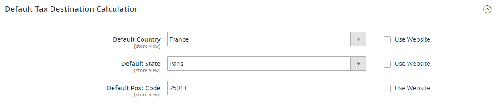

# Linee guida fiscali per paese

## Configurazione imposta USA

Queste impostazioni consigliate possono essere utilizzate per la maggior parte delle configurazioni fiscali per i negozi negli Stati Uniti.

| Opzione imposta | Consiglio |
|--- |--- |
| Carica prezzi catalogo | IVA esclusa |
| FPT | No, perché l&#39;FPT non è tassato. |
| Imposta basata su | Origine spedizione |
| Calcolo delle imposte | Sul totale |
| Spedizione fiscale? | No |
| Applica sconto | Al lordo delle imposte |
| Commento | Tutte le zone fiscali hanno la stessa priorità; idealmente, una zona per lo stato e una o più zone per la ricerca del codice postale. |

{style="table-layout:auto"}

### Classi di imposta

| Classe imposta | Impostazione consigliata |
|--- |--- |
| Classe imposta per la spedizione | Nessuno |

{style="table-layout:auto"}

### Impostazioni di calcolo

| Opzione | Impostazione consigliata |
|--- |--- |
| [!UICONTROL Tax Calculation Method Based On] | `Total` |
| [!UICONTROL Tax Calculation Based On] | `Shipping Origin` |
| [!UICONTROL Catalog Prices] | `Excluding Tax` |
| [!UICONTROL Shipping Prices] | `Excluding Tax` |
| [!UICONTROL Apply Customer Tax] | `After Discount` |
| [!UICONTROL Apply Discount on Prices] | `Excluding Tax` |

{style="table-layout:auto"}

### Calcolo destinazione imposta predefinita

| Opzione | Impostazione consigliata |
|--- |--- |
| [!UICONTROL Default Country] | `United States` |
| [!UICONTROL Default State] | Stato in cui si trova l&#39;impresa. |
| [!UICONTROL Default Post Code] | Il codice postale utilizzato nelle aree fiscali. |

{style="table-layout:auto"}

### Impostazioni visualizzazione prezzo

| Opzione | Impostazione consigliata |
|--- |--- |
| [!UICONTROL Display Product Prices in Catalog] | `Excluding Tax` |
| [!UICONTROL Display Shipping Prices] | `Excluding Tax` |

{style="table-layout:auto"}

### Impostazioni di visualizzazione del carrello

| Opzione | Impostazione consigliata |
|--- |--- |
| [!UICONTROL Display Prices] | `Excluding Tax` |
| [!UICONTROL Display Subtotal] | `Excluding Tax` |
| [!UICONTROL Display Shipping Amount] | `Excluding Tax` |
| [!UICONTROL Display Gift Wrapping Prices] | `Excluding Tax` |
| [!UICONTROL Display Printed Card Prices] | `Excluding Tax` |
| [!UICONTROL Include Tax in Grand Total] | `Yes` |
| [!UICONTROL Display Full Tax Summary] | `Yes` |
| [!UICONTROL Display Zero Tax Subtotal] | `Yes` |

{style="table-layout:auto"}

### Ordini, fatture, note di accredito e impostazioni di visualizzazione

| Opzione | Impostazione consigliata |
|--- |--- |
| [!UICONTROL Display Prices] | `Excluding Tax` |
| [!UICONTROL Display Subtotal] | `Excluding Tax` |
| [!UICONTROL Display Shipping Amount] | `Excluding Tax` |
| [!UICONTROL Include Tax in Grand Total] | `Yes` |
| [!UICONTROL Display Full Tax Summary] | `Yes` |
| [!UICONTROL Display Zero Tax Subtotal] | `Yes` |

{style="table-layout:auto"}

### Imposte fisse sui prodotti (FPT)

| Opzione | Impostazione consigliata |
|--- |--- |
| [!UICONTROL Enable FPT] | `No`, tranne che in California. |

{style="table-layout:auto"}

## Configurazione imposta Regno Unito

Queste impostazioni consigliate possono essere utilizzate per la maggior parte delle configurazioni fiscali per i negozi nel Regno Unito.

### Configurazione imposta B2C (Regno Unito)

| Opzione imposta | Consiglio |
|--- |--- |
| Carica prezzi catalogo | IVA esclusa |
| FPT | Sì, inclusi FPT e descrizione |
| Imposta basata su | [!UICONTROL Shipping Address] |
| Calcolo delle imposte | Sul totale |
| Spedizione fiscale? | Sì |
| Applica sconto | Al lordo delle imposte, sconto sui prezzi, incluse le imposte. |
| Commento | Per gli esercenti che registrano le fatture dei fornitori (IVA inclusa). |

{style="table-layout:auto"}

### Configurazione imposta B2B Regno Unito

| Opzione imposta | Consiglio |
|--- |--- |
| Carica prezzi catalogo | IVA esclusa |
| FPT | Sì, inclusi FPT e descrizione |
| Imposta basata su | [!UICONTROL Shipping Address] |
| Calcolo delle imposte | Su elemento |
| Spedizione fiscale? | Sì |
| Applica sconto | Al lordo delle imposte, sconto sui prezzi, incluse le imposte. |
| Commento | Affinché gli esercenti B2B forniscano considerazioni più semplici sulla catena di approvvigionamento dell’IVA. Il calcolo dell&#39;imposta sulla riga è valido; tuttavia, verificare con la propria giurisdizione fiscale. L&#39;impostazione presuppone che un commerciante si trovi nella catena di fornitura e che le merci vendute siano utilizzate da altri fornitori per sconti IVA e così via. Questa definizione consente di individuare facilmente le imposte per articolo per generare più rapidamente gli sconti.   **_Nota:_**Alcune giurisdizioni richiedono diverse strategie di arrotondamento non attualmente supportate da Commerce e non tutte le giurisdizioni consentono l’imposta a livello di articolo o di riga. |

{style="table-layout:auto"}

## Configurazione imposta Canada

>[!IMPORTANT]
>
>I commercianti che si trovano in una provincia GST/PST (Montreal) devono creare una regola fiscale unica e mostrare un importo di imposta combinato. In caso di domande, rivolgiti a un’autorità fiscale qualificata. Per informazioni sui requisiti fiscali di province specifiche, vedere: [Revenu Québec][1], [Governo del Saskatchewan][2], e [Manitoba Informazioni per i fornitori][3]

| Opzione imposta | Consiglio |
|--- |--- |
| Carica prezzi catalogo | IVA esclusa |
| FPT | Sì, inclusi FPT, descrizione e applicazione dell&#39;imposta a FPT. |
| Imposta basata su | Origine spedizione |
| Calcolo delle imposte | Sul totale |
| Spedizione fiscale? | Sì |
| Applica sconto | Al lordo delle imposte |

{style="table-layout:auto"}

Nell&#39;esempio seguente viene illustrato come impostare le aliquote fiscali GST per il Canada e le aliquote imposte PST per il Saskatchewan, con regole fiscali che calcolano e visualizzano le due aliquote. Queste informazioni descrivono un esempio di configurazione; assicurati di verificare le aliquote e le regole corrette per le giurisdizioni fiscali. Quando si impostano le imposte, impostare l&#39;ambito di archiviazione in modo da applicare la configurazione a tutti i negozi e i siti Web applicabili.

- L’imposta fissa sui prodotti è inclusa per i beni rilevanti come attributo del prodotto.
- In Quebec, PST viene indicato come TVQ. Se desideri impostare una tariffa per Quebec, assicurati di utilizzare TVQ come identificatore.

### Passaggio 1: Completare le impostazioni di calcolo delle imposte

1. Il giorno _Amministratore_ barra laterale, vai a **[!UICONTROL Stores]** > _[!UICONTROL Settings]_>**[!UICONTROL Configuration]**.

1. Per una configurazione multisito, imposta **[!UICONTROL Store View]** al sito web e al negozio di destinazione della configurazione.

1. Nel pannello a sinistra, espandi **[!UICONTROL Sales]** e scegli **[!UICONTROL Tax]**.

1. Fai clic su per espandere ogni sezione della pagina e completare le impostazioni seguenti:

#### Impostazioni calcolo imposta

| Campo | Impostazione consigliata |
|--- |--- |
| [!UICONTROL Tax Calculation Method Based On] | `Total` |
| [!UICONTROL Tax Calculation Based On] | `Shipping Address` |
| [!UICONTROL Catalog Prices] | `Excluding Tax` |
| [!UICONTROL Shipping Prices] | `Excluding Tax` |
| [!UICONTROL Apply Customer Tax] | `After Discount` |
| [!UICONTROL Apply Discount on Prices] | `Excluding Tax` |
| [!UICONTROL Apply Tax On] | `Custom Price` (se disponibile) |

{style="table-layout:auto"}

#### Classi imposta

| Campo | Impostazione consigliata |
|--- |--- |
| [!UICONTROL Tax Class for Shipping] | `Shipping` (spedizione tassata) |

{style="table-layout:auto"}

#### Calcolo destinazione imposta predefinita

| Campo | Impostazione consigliata |
|--- |--- |
| [!UICONTROL Default Country] | `Canada` |
| [!UICONTROL Default State] | (a seconda dei casi) |
| [!UICONTROL Default Postal Code] | `*` (asterisco) |

{style="table-layout:auto"}

#### Impostazioni di visualizzazione carrello

| Campo | Impostazione consigliata |
|--- |--- |
| [!UICONTROL Include Tax in Grand Total] | `Yes` |
| [!UICONTROL Display Full Tax Summary] | `Yes` |
| [!UICONTROL Display Zero in Tax Subtotal] | `Yes` |

{style="table-layout:auto"}

#### Imposte fisse sui prodotti

| Campo | Impostazione consigliata |
|--- |--- |
| [!UICONTROL Enable FPT] | `Yes` |
| Tutte le impostazioni di visualizzazione FPT | `Including FPT and FPT description` |
| [!UICONTROL Apply Discounts to FPT] | `No` |
| [!UICONTROL Apply Tax to FPT] | `Yes` |
| [!UICONTROL Include FPT in Subtotal] | `No` |

{style="table-layout:auto"}

### Passaggio 2: imposta su beni e servizi (GST) canadese

Per stampare il numero GST su fatture e altri documenti di vendita, includerlo nel nome delle aliquote fiscali applicabili. L&#39;elenco GST viene visualizzato come parte dell&#39;importo dell&#39;elenco GST in qualsiasi riepilogo di ordini.

#### Gestisci aree e aliquote fiscali

| Campo | Impostazione consigliata |
|--- |--- |
| [!UICONTROL Tax Identifier] | `Canada-GST` |
| [!UICONTROL Country] | `Canada` |
| [!UICONTROL State] | `*` (asterisco) |
| [!UICONTROL Zip/Post is Range] | `No` |
| [!UICONTROL Zip/Post Code] | `*` (asterisco) |
| [!UICONTROL Rate Percent] | `5.0000` |

{style="table-layout:auto"}

### Passaggio 3: imposta sulle vendite provinciale canadese (PST)

Imposta un&#39;altra aliquota per la provincia applicabile.

#### Informazioni sull&#39;aliquota

| Campo | Impostazione consigliata |
|--- |--- |
| [!UICONTROL Tax Identifier] | `Canada-SK-PST` |
| [!UICONTROL Country] | `Canada` |
| [!UICONTROL State] | `Saskatchewan` |
| [!UICONTROL Zip/Post is Range] | `No` |
| [!UICONTROL Zip/Post Code] | `*` (asterisco) |
| [!UICONTROL Rate Percent] | `5.0000` |

{style="table-layout:auto"}

### Passaggio 4: creare una regola fiscale GST

Per evitare di comporre l&#39;imposta e visualizzare correttamente l&#39;imposta calcolata come voci di riga separate per GST e PST, impostare priorità diverse per ogni regola e selezionare **Calcola solo subtotale** casella di controllo. Ogni imposta viene visualizzata come una voce distinta, ma gli importi dell&#39;imposta non vengono composti.

#### Informazioni sulle regole fiscali

| Campo | Impostazione consigliata |
|--- |--- |
| Nome | `Retail-Canada-GST` |
| [!UICONTROL Customer Tax Class] | `Retail Customer` |
| [!UICONTROL Product Tax Class] | `Taxable GoodsShipping` |
| [!UICONTROL Tax Rate] | `Canada-GST` |
| [!UICONTROL Priority] | `0` |
| [!UICONTROL Calculate off subtotal only] | Selezionare questa casella di controllo. |
| [!UICONTROL Sort Order] | `0` |

{style="table-layout:auto"}

### Passaggio 5: creare una regola fiscale PST per Saskatchewan

Per questa regola fiscale, assicurati di impostare la priorità su 0 e selezionare la **Calcola solo subtotale** casella di controllo. Ogni imposta viene visualizzata come una voce distinta, ma gli importi dell&#39;imposta non vengono composti.

#### Informazioni sulle regole fiscali

| Campo | Impostazione consigliata |
|--- |--- |
| [!UICONTROL Name] | `Retail-Canada-PST` |
| [!UICONTROL Customer Tax Class] | `Retail Customer` |
| [!UICONTROL Product Tax Class] | `Taxable GoodsShipping` |
| [!UICONTROL Tax Rate] | `Canada-SK-PT` |
| [!UICONTROL Priority] | `1` |
| [!UICONTROL Calculate off subtotal only] | Selezionare questa casella di controllo. |
| [!UICONTROL Sort Order] | `0` |

{style="table-layout:auto"}

### Passaggio 6: salvare e verificare i risultati

1. Al termine, fai clic su **[!UICONTROL Save Config]**.

1. Torna alla vetrina e crea un ordine di esempio per testare i risultati.

## Configurazione imposta UE

L&#39;esempio seguente mostra un negozio con sede in Francia che vende più di 100.000 euro in Francia e più di 100.000 euro in Germania.

- I calcoli delle imposte vengono gestiti a livello di sito Web.
- Le opzioni di conversione della divisa e di visualizzazione delle imposte sono controllate singolarmente a livello di visualizzazione del negozio (selezionare la casella di controllo Usa sito Web per sostituire l&#39;impostazione predefinita).
- Impostando il paese di imposta predefinito, è possibile visualizzare in modo dinamico l&#39;imposta corretta per la giurisdizione.
- L’imposta fissa sui prodotti è inclusa per i beni rilevanti come attributo del prodotto.
- Potrebbe essere necessario modificare il catalogo per assicurarsi che venga visualizzato nella vista corretta per categoria/sito Web/store.

### Passaggio 1: creare tre classi di imposta prodotto

In questo esempio si presume che non siano necessarie più classi di imposta sui prodotti con riduzione IVA.

1. Creare una classe di imposta prodotto standard IVA.

1. Creare una classe di imposta prodotto con riduzione IVA.

1. Creare una classe di imposta sul prodotto esente da IVA.

### Fase 2: creazione di aliquote fiscali per Francia e Germania

Crea le seguenti aliquote:

| Aliquote fiscali | Impostazioni |
|--- |--- |
| Francia - StandardVAT | Paese: Francia  Stato/regione: *  CAP: *  Tasso: 20% |
| Francia - IVA ridotta | Paese: Francia  Stato/regione: *  CAP: *  Tasso: 5% |
| Germania - StandardVAT | Paese: Germania  Stato/regione: *  CAP: * Tariffa: 19% |
| Germania - IVA ridotta | Paese: Germania  Stato/regione: *  CAP: *  Percentuale: 7% |

{style="table-layout:auto"}

### Passaggio 3: impostare le regole fiscali

Crea le seguenti regole fiscali:

| Regole fiscali | Impostazioni |
|--- |--- |
| Retail-Francia-StandardVAT | Classe cliente: Cliente al dettaglio  Classe imposta: standard IVA  Aliquota: France-StandardVAT  Priorità: 0  Ordinamento: 0 |
| Retail-France-ReducedVAT | Classe cliente: Cliente al dettaglio  Classe imposta: IVA ridotta  Aliquota: IVA ridotta in Francia  Priorità: 0  Ordinamento: 0 |
| Retail-Germania-StandardVAT | Classe cliente: Cliente al dettaglio  Classe imposta: standard IVA  Aliquota: Germania-IVA standard  Priorità: 0  Ordinamento: 0 |
| Retail-Germany-ReducedVAT | Classe cliente: Cliente al dettaglio  Classe imposta: IVA ridotta  Aliquota: IVA ridotta in Germania  Priorità: 0  Ordinamento: 0 |

{style="table-layout:auto"}

### Passaggio 4: configurare una vetrina per la Germania

1. Il giorno _Amministratore_ barra laterale, vai a **[!UICONTROL Stores]** > _[!UICONTROL Settings]_>**[!UICONTROL All Stores]**.

1. Nel sito Web predefinito, crea una visualizzazione Store per **[!UICONTROL Germany]**.

1. Quindi, effettuare le seguenti operazioni:

   - Il giorno _Amministratore_ barra laterale, vai a **[!UICONTROL Stores]** > _[!UICONTROL Settings]_>**[!UICONTROL Configuration]**.

   - Nell&#39;angolo in alto a sinistra, imposta **[!UICONTROL Default Config]** al negozio francese.

   - Nella pagina Generale espandere  il **[!UICONTROL Countries Options]** e impostare il paese predefinito su `France`.

   - Completare le opzioni internazionali in base alle esigenze.

1. Nell&#39;angolo in alto a sinistra, scegliere il tedesco **[!UICONTROL Store View]**.

1. Il giorno _Generale_ page, espandi  **[!UICONTROL Countries Options]** e imposta il paese predefinito su `Germany`.

1. Completare le opzioni internazionali in base alle esigenze.

### Passaggio 5: configurare le impostazioni relative alle imposte per la Francia

Completa le seguenti impostazioni fiscali generali:

| Campo | Impostazione consigliata |
|--- |--- |
| [[!UICONTROL Tax Classes]](../configuration-reference/sales/tax.md#tax-classes) |  |
| [!UICONTROL Tax Class for Shipping] | `Shipping` (spedizione tassata) |
| [[!UICONTROL Calculation Settings]](../configuration-reference/sales/tax.md#calculation-settings) |  |
| [!UICONTROL Tax Calculation Method Based On] | `Total` |
| [!UICONTROL Tax Calculation Based On] | `Shipping Address` |
| [!UICONTROL Catalog Prices] | `Including Tax` |
| [!UICONTROL Shipping Prices] | `Including Tax` |
| [!UICONTROL Apply Customer Tax] | `After Discount` |
| [!UICONTROL Apply Discount on Prices] | `Including Tax` |
| [!UICONTROL Apply Tax On] | `Custom Price if available` |
| [[!UICONTROL Default Tax Destination Calculation]](../configuration-reference/sales/tax.md#default-tax-destination-calculation) |  |
| [!UICONTROL Default Country] | `France` |
| [!UICONTROL Default State] |  |
| [!UICONTROL Default Postal Code] | `*` (asterisco) |
| [[!UICONTROL Fixed Product taxes]](../configuration-reference/sales/tax.md#fixed-product-taxes) |  |
| [!UICONTROL Enable FPT] | `Yes` |
| [!UICONTROL All FPT Display Settings] | `Including FPT and FPT description` |
| [!UICONTROL Apply Discounts to FPT] | `No` |
| [!UICONTROL Apply Tax to FPT] | `Yes` |
| [!UICONTROL Include FPT in Subtotal] | `Yes` |

{style="table-layout:auto"}

### Passaggio 6: configurare le impostazioni relative alle imposte per la Germania

1. Il giorno _Amministratore_ barra laterale, vai a **[!UICONTROL Stores]** > _[!UICONTROL Settings]_>**[!UICONTROL Configuration]**.

1. Nell&#39;angolo in alto a destra, imposta **[!UICONTROL Store View]** per visualizzare il negozio tedesco e fare clic su **[!UICONTROL OK]** per confermare.

1. Nel pannello a sinistra, espandi **[!UICONTROL Sales]** e scegli **[!UICONTROL Tax]**.

1. In **[!UICONTROL Default Tax Destination Calculation]** eseguire le operazioni seguenti:

   - Cancella **[!UICONTROL Use Website]** casella di controllo dopo ogni campo,

   - Per corrispondere alle impostazioni di spedizione del sito [punto di origine](shipping-settings.md#point-of-origin), aggiorna i seguenti valori:

      - Paese predefinito
      - Stato predefinito
      - Codice postale predefinito

     Questa impostazione garantisce che l&#39;imposta venga calcolata correttamente quando i prezzi dei prodotti includono l&#39;imposta.

     {width="600" zoomable="yes"}

1. Al termine, fai clic su **[!UICONTROL Save Config]**.

[1]: https://www.revenuquebec.ca/en/businesses/
[2]: https://www.saskatchewan.ca/finance
[3]: https://www.gov.mb.ca/finance/taxation/bulletins/004.pdf
