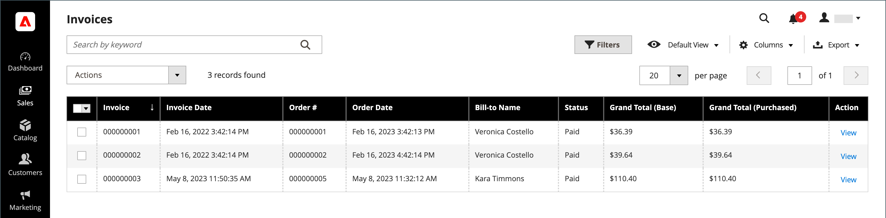
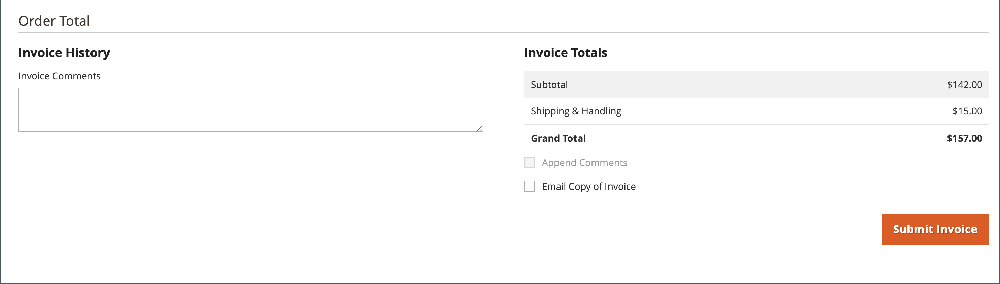

# Fatture

Una fattura è una registrazione del pagamento di un ordine. È possibile utilizzare più fatture [creato](#create-an-invoice) per un singolo ordine, e ciascuno può includere quanti o pochi dei prodotti acquistati che specifichi. Puoi anche creare [fatture PDF pronte per la stampa](#print-invoices) come documenti di vendita per i clienti.

Il giorno _Amministratore_ barra laterale, vai a **[!UICONTROL Sales]** > _Operazioni_ > **Fatture** per aprire _Fatture_ e accedere alle fatture create.

{width="700" zoomable="yes"}

## Descrizioni delle colonne

| Colonna | Descrizione |
|--- |--- |
| [!UICONTROL Select] | Selezionare le caselle di controllo per le virgolette da sottoporre a un&#39;azione oppure utilizzare il controllo di selezione nell&#39;intestazione di colonna. Opzioni: `Select All` / `Deselect All` |
| [!UICONTROL Invoice] | Identificatore numerico univoco assegnato quando una fattura viene inviata dall&#39;amministratore. Quando vengono visualizzati i dettagli della fattura, questo numero viene visualizzato nella parte superiore della pagina, invece del nome del preventivo. |
| [!UICONTROL Invoice Date] | Data e ora in cui l&#39;amministratore ha inviato la fattura per la prima volta. |
| [!UICONTROL Order#] | Identificatore numerico univoco assegnato quando un ordine viene effettuato da un acquirente. Quando vengono visualizzati i dettagli della fattura, questo numero viene visualizzato come collegamento nel blocco Informazioni su ordine e conto. |
| [!UICONTROL Order Date] | La data e l&#39;ora in cui il cliente ha effettuato un ordine. |
| [!UICONTROL Bill-to Name] | Il nome della persona responsabile del pagamento dell’ordine. |
| [!UICONTROL Status] | Indica lo stato corrente di una fattura. Lo stato può essere modificato solo dall&#39;azione dell&#39;acquirente o del venditore. |
| [!UICONTROL Grand Total (Base)] | Il prezzo totale dei prodotti da acquistare. L’importo totale viene visualizzato nella valuta di base del sito web e nella valuta della vetrina. |
| [!UICONTROL Grand Total (purchase)] | Il totale complessivo dei prodotti acquistati nell’ordine. L’importo totale viene visualizzato nella valuta di base del sito web e nella valuta della vetrina. |
| [!UICONTROL Purchased From] | Visualizzazione sito Web/negozio/negozio da cui è stata creata la fattura. |
| [!UICONTROL Billing Address] | L’indirizzo di fatturazione del cliente che ha effettuato l’ordine. |
| [!UICONTROL Shipping Address] | L’indirizzo dove deve essere spedito l’ordine. |
| [!UICONTROL Customer Name] | Nome e cognome del cliente che riceve la fattura. |
| [!UICONTROL Email] | Indirizzo e-mail del cliente che riceve la fattura. |
| [!UICONTROL Customer Group] | Gruppo di clienti assegnato al cliente che riceve la fattura. |
| [!UICONTROL Payment Method] | Il metodo di pagamento da utilizzare per il pagamento. |
| [!UICONTROL Shipping Information] | Il metodo da utilizzare per spedire l’ordine. |
| [!UICONTROL Subtotal] | Il subtotale dell&#39;ordine, senza spedizione e movimentazione, e le imposte. |
| [!UICONTROL Shipping and Handling] | Importo addebitato per la spedizione e la movimentazione. |
| [!UICONTROL Action] | **[!UICONTROL View]** - apre la fattura in modalità di modifica. |

{style="table-layout:auto"}

## Crea una fattura

Quando si crea una fattura per un ordine, questa viene spostata in uno stato in cui non può essere annullata o modificata. Una nuova pagina fattura è simile a un ordine completato, con alcuni campi aggiuntivi. Ogni attività correlata a un ordine è indicata nella sezione Commenti della fattura.

Normalmente, gli ordini vengono fatturati e acquisiti all&#39;avvio del processo di spedizione. Se il metodo di pagamento è un ordine di acquisto o se [azione di pagamento](../configuration-reference/sales/payment-methods.md#payment-actions) è impostato su `Authorize and Capture`, l&#39;ordine viene fatturato e il pagamento viene acquisito durante il pagamento. È possibile generare una fattura con un documento di trasporto e stampare le etichette di spedizione dal conto del vettore. Un singolo ordine può essere suddiviso in spedizioni parziali, fatturate separatamente, se necessario.

Quando lo stato dei nuovi ordini è impostato su `Processing`, l’opzione per _Fattura automaticamente tutti gli articoli_ diventa disponibile nella configurazione. Alcuni metodi di pagamento con carta di credito completano la fase di fatturazione come parte del processo quando [azione di pagamento](../configuration-reference/sales/payment-methods.md#payment-actions) è impostato su `Authorize and Capture`. In questo caso, il pulsante Fattura non viene visualizzato e l&#39;ordine è pronto per la spedizione.

>[!NOTE]
>
>Le fatture non vengono create automaticamente per gli ordini effettuati utilizzando `Gift Card`, `Store Credit`, `Reward Points`, o altri metodi di pagamento offline.

È necessario generare una fattura per l&#39;ordine prima di stamparlo. Per visualizzare o stampare il PDF, scarica e installa un lettore di PDF come [Adobe Acrobat Reader][1].

**_Per fatturare un ordine:_**

1. Il giorno _Amministratore_ barra laterale, vai a **[!UICONTROL Sales]** > _[!UICONTROL Operations]_>**[!UICONTROL Orders]**.

1. Trova l&#39;ordine cliente con lo stato `Processing` nella griglia. Quindi, effettua le seguenti operazioni:

1. In _Azione_ , fare clic su **[!UICONTROL View]**.

1. Nell&#39;intestazione dell&#39;ordine cliente, scegliere **[!UICONTROL Invoice]** opzione.

   >[!NOTE]
   >
   >Il _[!UICONTROL Invoice]_non viene visualizzata quando [azione di pagamento](../configuration-reference/sales/payment-methods.md#payment-actions) per specifici [metodo di pagamento](../configuration-reference/sales/payment-methods.md) è impostato su `Authorize and Capture`, che genera automaticamente una fattura. Ciò si verifica anche se l’ordine viene effettuato e l’azione di pagamento per il metodo di pagamento è impostata su `Authorize` e l’ordine viene fatturato.

   {width="700" zoomable="yes"}

   La nuova pagina fattura è simile a una pagina ordine completata, con campi aggiuntivi che è possibile modificare.

1. Se gli articoli sono pronti per la spedizione, generare un documento di trasporto per la spedizione contemporaneamente alla creazione della fattura:

   - In _Informazioni spedizione_ , fare clic sul pulsante **[!UICONTROL Create Shipment]** per selezionarla.

     Il record di spedizione viene creato contemporaneamente alla generazione della fattura.

   - Includi un numero di tracciamento:

      - Clic **[!UICONTROL Add Tracking Number]**.
      - Immetti le informazioni di tracciamento: _[!UICONTROL Carrier]_,_[!UICONTROL Title]_, e _[!UICONTROL Number]_

     {width="600" zoomable="yes"}

   - Facoltativamente, generare una fattura parziale:

      - In _Articoli da fatturare_ , aggiorna la sezione **[!UICONTROL Qty to Invoice]** per includere solo articoli specifici nella fattura.
      - Quindi, fai clic su **[!UICONTROL Update Qty's]**.

        {width="600" zoomable="yes"}

1. Se per l&#39;ordine è stato utilizzato un metodo di pagamento online, impostare **[!UICONTROL Amount]** all&#39;opzione appropriata.

1. Per inviare una notifica tramite posta elettronica ai clienti quando viene generata la fattura, eseguire le operazioni seguenti:

   - Seleziona la **[!UICONTROL Email Copy of Invoice]** casella di controllo.

   - Inserisci qualsiasi **[!UICONTROL Invoice Comments]**. Per includere i commenti nell’e-mail di notifica, contrassegna l’opzione **[!UICONTROL Append Comments]** casella di controllo.

1. Al termine, fai clic su **[!UICONTROL Submit Invoice]** nella parte inferiore della pagina.

   **_Metodo di pagamento online:_**

   {width="600" zoomable="yes"}

   **_Metodo di pagamento offline:_**

   {width="600" zoomable="yes"}

   Lo stato dell’ordine cambia da `Pending` a `Complete`.

   {width="600" zoomable="yes"}

## Stampa fatture

Le fatture possono essere stampate singolarmente o come batch. Tuttavia, prima di poter stampare una fattura, è necessario generarla per l&#39;ordine. È possibile caricare un logo ad alta risoluzione per una fattura PDF pronta per la stampa e includere [ID ordine](../stores-purchase/sales-documents.md#add-reference-ids) nell’intestazione. Per personalizzare il modello di fattura con il logo e l&#39;indirizzo, vedere [Requisiti per il logo PDF](../stores-purchase/sales-documents.md#image-formats).

>[!NOTE]
>
>Per visualizzare o stampare il PDF, è necessario disporre di un lettore di PDF. Puoi scaricare [Adobe Reader][1] senza alcun costo.

### Stampa una singola fattura

1. Il giorno _Amministratore_ barra laterale, vai a **[!UICONTROL Sales]** > _[!UICONTROL Operations]_>**[!UICONTROL Invoices]**.

1. In _[!UICONTROL Invoices]_individuare la fattura e fare clic su **[!UICONTROL View]**nel_ Azione _colonna.

1. Nella parte superiore della fattura, fare clic su **[!UICONTROL Print]** per generare un PDF della fattura.

1. Salva il PDF generato in un file o stamparlo.

### Stampa più fatture

1. Il giorno _Amministratore_ barra laterale, vai a **[!UICONTROL Sales]** > _[!UICONTROL Operations]_>**[!UICONTROL Invoices]**.

1. In _[!UICONTROL Invoices]_griglia, selezionare la casella di controllo per ogni fattura da stampare.

1. Imposta il **[!UICONTROL Actions]** controllo a `PDF Invoices`.

   {width="600" zoomable="yes"}

Le fatture vengono salvate in un unico file PDF che può essere inviato a una stampante o salvato.

## Risorse per la risoluzione dei problemi

Per informazioni sulla risoluzione dei problemi relativi alle fatture, vedere quanto segue _Knowledge Base del supporto Commerce_ articoli:

- [Impossibile fatturare i prodotti del bundle virtuale e semplice](https://experienceleague.adobe.com/docs/commerce-knowledge-base/kb/support-tools/patches/v1-0-9/mdva-30889-magento-patch-can-t-invoice-bundle-products-virtual-and-simple.html)
- [Fattura senza informazioni sul credito del negozio](https://experienceleague.adobe.com/docs/commerce-knowledge-base/kb/support-tools/patches/v1-0-8/mdva-31150-magento-patch-invoice-without-store-credit-info.html)
- [L&#39;imposta viene visualizzata sulla fattura con uno sconto del 100%](https://experienceleague.adobe.com/docs/commerce-knowledge-base/kb/support-tools/patches/v1-0-22/mdva-35773-tax-appears-on-invoice-with-100-discount.html)
- [Le fatture ordine non vengono inviate automaticamente](https://experienceleague.adobe.com/docs/commerce-knowledge-base/kb/support-tools/patches/v1-0-13/mdva-32545-magento-patch-order-invoices-don-t-send-automatically.html)

[1]: https://www.adobe.com/acrobat/pdf-reader.html "Scarica Adobe Reader"
