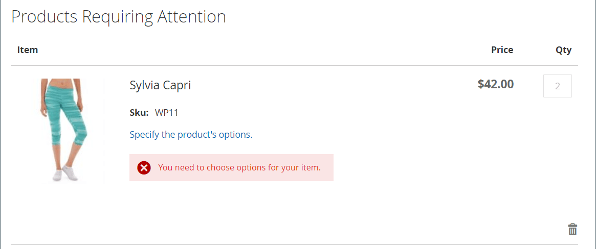

# Ordina per SKU

{{ee-feature}}

Una &#39;SKU&#39; è una &#39;Stock Keeping Unit&#39;. Le SKU generalmente aiutano i venditori online a identificare le caratteristiche più importanti del prodotto come: dimensioni, colore, prezzo e materiale. Gli ID prodotto sono diversi dagli SKU:

- `Product ID` è una serie sequenziale di numeri utilizzati internamente per identificare i prodotti e non disponibili per i clienti.
- `SKU` viene generato dal venditore, in genere in base al nome del prodotto e agli attributi per il marketing o il tracciamento interno. Ad esempio: T-shirt blu, cotone, taglia media: T-COT-MED-BL. Se necessario, il venditore può modificare la SKU.

Normalmente, una SKU comprende una serie di abbreviazioni che indicano le caratteristiche distintive del prodotto. La lunghezza massima dello SKU è di 64 caratteri. Le SKU sono importanti per tenere traccia e gestire in modo efficace l’inventario, pertanto la loro corretta configurazione è fondamentale per l’e-commerce.

_Ordina per SKU_ è un [widget](../content-design/widgets.md) che può essere visualizzato nel negozio per comodità di tutti gli acquirenti o reso disponibile solo agli acquirenti di gruppi specifici di clienti. Gli acquirenti possono inserire le informazioni relative allo SKU e alla quantità direttamente nel blocco Ordina per SKU oppure caricare un file CSV dal proprio account cliente. Indipendentemente dalla configurazione, l’ordine in base allo SKU è sempre disponibile per gli amministratori di store.

{width="700" zoomable="yes"}

## Configurare l’ordine per SKU

1. Nella barra laterale _Admin_, passa a **[!UICONTROL Stores]** > _[!UICONTROL Settings]_>**[!UICONTROL Configuration]**.

1. Nel pannello a sinistra, espandi la sezione **[!UICONTROL Sales]** e scegli **[!UICONTROL Sales]** sotto.

1. Espandere  nella sezione **[!UICONTROL Order by SKU Settings]**.

1. Imposta **[!UICONTROL Enable Order by SKU on my Account in Storefront]** su uno dei seguenti:

   - `Yes, for Everyone` - Il blocco Ordina per SKU è disponibile nel negozio per ogni acquirente.
   - `Yes, for Specified Customer Groups` - L&#39;ordine per SKU è disponibile solo per i membri di un gruppo di clienti specifico, ad esempio `Wholesale`.
   - `No` - Il blocco Ordina per SKU non viene visualizzato nella vetrina e la pagina Ordina per SKU non è disponibile nell&#39;account cliente.

   {width="600" zoomable="yes"}

1. Fare clic su **[!UICONTROL Save Config]**.

 (solo Adobe Commerce B2B) _**Per abilitare la funzione Ordina per SKU, disabilitare la funzione Ordine rapido:**_

1. Vai a **[!UICONTROL Stores]** > _[!UICONTROL Settings]_>**[!UICONTROL Configuration]**.

1. Nel pannello a sinistra in _[!UICONTROL General]_, scegli **[!UICONTROL B2B Features]**

1. Espandere  nella sezione **[!UICONTROL B2B Features]**.

1. Imposta **[!UICONTROL Enable Quick Order]** su `No`.

   La funzionalità [Ordine rapido](../b2b/quick-order.md) consente ai clienti e agli ospiti di effettuare rapidamente gli ordini in base allo SKU o al nome del prodotto.

## Esperienza vetrina

Quando la funzionalità è configurata per lo store, i clienti possono ordinare per SKU da qualsiasi pagina che include il widget _Ordina per SKU_ o dal dashboard dell&#39;account.

### Ordina per SKU dal blocco della pagina

1. Nel blocco _Ordina per SKU_, il cliente immette **[!UICONTROL SKU]** e **[!UICONTROL Qty]** dell&#39;elemento da ordinare.

1. Per aggiungere un altro elemento, fare clic su **[!UICONTROL Add Row]** e ripetere il processo.

1. Clic su **[!UICONTROL Add to Cart]**.

### Ordina per SKU da un account cliente

1. Dalla vetrina, il cliente accede al proprio account.

1. Nel pannello a sinistra, seleziona **[!UICONTROL Order by SKU]**.

1. Aggiunge singoli elementi in base alle preferenze:

   _**Aggiunge ogni elemento per SKU:**_

   - Immette **[!UICONTROL SKU]** e **[!UICONTROL Qty]** dell&#39;elemento da ordinare.

   - Per aggiungere altri elementi in base alle esigenze, fai clic su _Aggiungi riga_  e si ripete per tutti gli elementi necessari.

   - Clic su **[!UICONTROL Add to Cart]**.

   _**Carica un file CSV con più elementi:**_

   - Prepara un file CSV](../systems/data-csv.md) dei dati di [importazione (valore separato da virgole) che include colonne per `SKU` e `Qty`.

   {width="500" zoomable="yes"}

   - Per caricare il file CSV, fai clic su **[!UICONTROL Choose File]** e seleziona il file da caricare.

   - Clic su **[!UICONTROL Add to Cart]**.

   Se uno dei prodotti dispone di opzioni aggiuntive, al cliente viene richiesto dal carrello che il prodotto richiede attenzione.

   {width="600" zoomable="yes"}

   >[!NOTE]
   >
   >Se sono presenti SKU duplicate, le quantità vengono combinate in una riga nel carrello. Il cliente può modificare la quantità di qualsiasi articolo e fare clic su **[!UICONTROL Update Shopping Cart]** per ricalcolare i totali.

