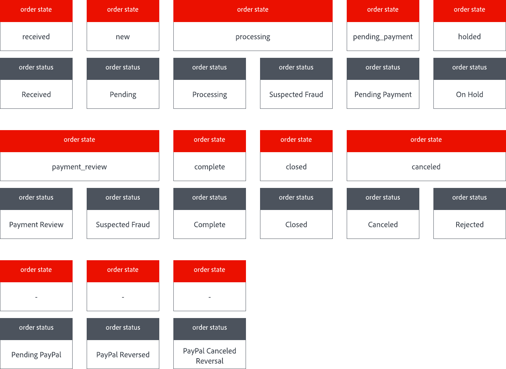
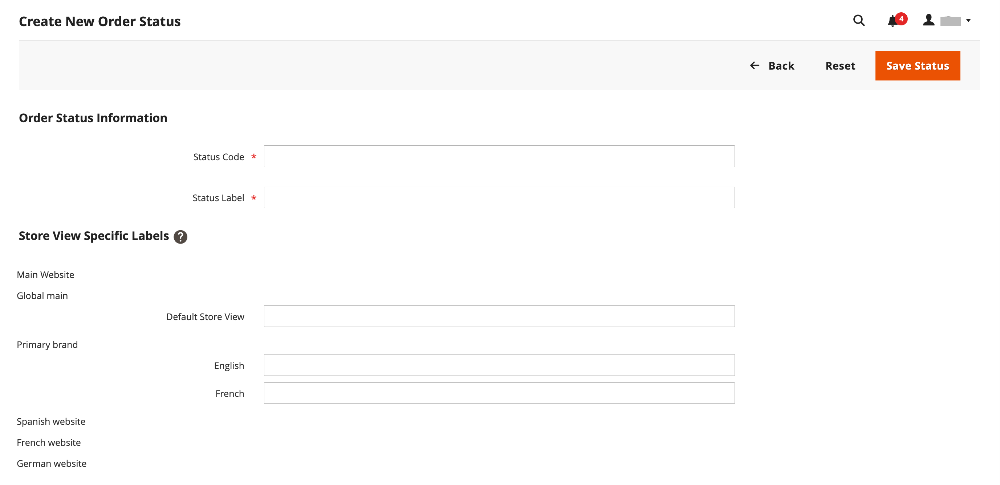
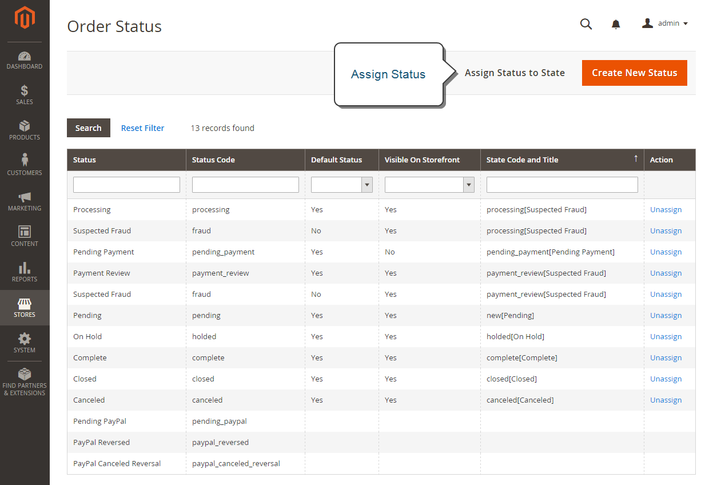

# Stato ordine

Tutti gli ordini hanno uno stato dell&#39;ordine associato a una fase nel [flusso di lavoro](order-processing.md) di elaborazione dell&#39;ordine.\
La differenza tra gli stati dell&#39;ordine e gli stati dell&#39;ordine è che **[!UICONTROL order states]** vengono utilizzati a livello di programmazione. Non sono
visibile ai clienti o agli utenti amministratori. Essi determinano il flusso di un ordine e quali operazioni sono possibili per un
in un determinato stato.\
**[!UICONTROL Order statuses]** vengono utilizzati per comunicare lo stato di un ordine ai clienti e agli utenti amministratori.
Puoi creare stati di ordine aggiuntivi per allinearli alle tue esigenze operative. È possibile visualizzare gli stati degli ordini
l’avanzamento al di fuori di Adobe Commerce, ad esempio il prelievo degli ordini e l’avanzamento della consegna. Non hanno alcun impatto sull’ordine
flusso di lavoro di elaborazione.\
Ogni stato dell&#39;ordine è associato a uno stato dell&#39;ordine. Il tuo Negozio dispone di un set di stati dell&#39;ordine predefiniti e
impostazioni dello stato dell&#39;ordine.

{width="700" zoomable="yes"}

Lo stato di ciascun ordine è visualizzato nella colonna _Stato_ della griglia _Ordini_.

{width="700" zoomable="yes"}

>[!TIP]
>
>Un ordine parzialmente rimborsato rimane nello stato `Processing` fino alla spedizione di **_tutti_** gli articoli ordinati (inclusi gli articoli rimborsati). Lo stato dell&#39;ordine non cambia in `Complete` finché ogni articolo nell&#39;ordine non è stato spedito.

## Flusso di lavoro per stato ordine

## Stato predefinito

| Stato ordine | Codice di stato |                                                                                                                                                                                                                                                                                        |
|--------------------------|----------------------------|----------------------------------------------------------------------------------------------------------------------------------------------------------------------------------------------------------------------------------------------------------------------------------------|
| Ricevuto | `received` | Questo stato è lo stato iniziale degli ordini inseriti quando è abilitato il posizionamento asincrono degli ordini. |
| Sospetta frode | `fraud` | A volte gli ordini pagati tramite PayPal o un altro gateway di pagamento sono contrassegnati come _Sospetta frode_. Questo stato significa che l’ordine non dispone di una fattura emessa e che anche l’e-mail di conferma non viene inviata. |
| Elaborazione | `processing` | Quando lo stato dei nuovi ordini è impostato su &quot;Elaborazione&quot;, l&#39;opzione _Fattura automaticamente tutti gli articoli_ diventa disponibile nella configurazione. Le fatture non vengono create automaticamente per gli ordini effettuati utilizzando la Gift Card, il Credito del Negozio, i Punti premio o altri metodi di pagamento offline. |
| Pagamento in sospeso | `pending_payment` | Questo stato viene utilizzato se l&#39;ordine viene creato e viene utilizzato PayPal o un metodo di pagamento simile. Ciò significa che il cliente è stato indirizzato al sito web del gateway dei pagamenti, ma non sono ancora state ricevute informazioni sulla restituzione. Questo stato cambia quando il cliente paga. |
| Revisione pagamento | `payment_review` | Questo stato viene visualizzato quando PayPal revisione pagamenti è attivato. |
| In sospeso | `pending` | Questo stato indica che non sono state sottomesse fatture e spedizioni. |
| In attesa | `holded` | Questo stato può essere assegnato solo manualmente. Puoi mettere in attesa qualsiasi ordine. |
| Completa | `complete` | Questo stato indica che l&#39;ordine è stato creato, pagato e spedito al cliente. |
| Chiuso | `closed` | Questo stato indica che a un ordine è stata assegnata una nota di credito e che il cliente ha ricevuto un rimborso. |
| Annullato | `canceled` | Questo stato viene assegnato manualmente nell’amministratore o, per alcuni gateway di pagamento, quando il cliente non paga entro il tempo specificato. |
| Rifiutato | `rejected` | Questo stato indica che un ordine è stato rifiutato durante l’elaborazione asincrona dell’ordine. Ciò si verifica quando si verifica un errore durante il posizionamento dell’ordine asincrono. |
| Storno annullato da PayPal | `paypay_canceled_reversal` | Questo stato indica che PayPal ha annullato lo storno. |
| PayPal in sospeso | `pending_paypal` | Questo stato significa che l&#39;ordine è stato ricevuto da PayPal, ma il pagamento non è ancora stato elaborato. |
| PayPal stornato | `paypal_reversed` | Questo stato indica che PayPal ha annullato la transazione. |

{style="table-layout:auto"}

## Stato ordine personalizzato

Oltre alle impostazioni predefinite per lo stato dell&#39;ordine, è possibile creare impostazioni personalizzate per lo stato dell&#39;ordine, assegnarle agli stati dell&#39;ordine e impostarne gli stati predefiniti. Lo stato dell’ordine indica la posizione dell’ordine all’interno del flusso di lavoro di elaborazione dell’ordine e lo stato dell’ordine assegna un’etichetta traducibile significativa alla posizione dell’ordine. Ad esempio, potrebbe essere necessario uno stato dell&#39;ordine personalizzato come `packaging"`, `backordered` o uno stato specifico per le proprie esigenze. Puoi creare un nome descrittivo per lo stato personalizzato e assegnarlo allo stato dell’ordine associato nel flusso di lavoro.

>[!NOTE]
>
>Nel flusso di lavoro dell’ordine vengono utilizzati solo i valori predefiniti dello stato dell’ordine personalizzati. I valori di stato personalizzati che non sono impostati come predefiniti possono essere utilizzati solo nella sezione dei commenti dell’ordine.

{width="700" zoomable="yes"}

### Creare uno stato dell’ordine personalizzato

1. Nella barra laterale _Admin_, passa a **[!UICONTROL Stores]** > _[!UICONTROL Settings]_>**[!UICONTROL Order Status]**.

1. Nell&#39;angolo superiore destro fare clic su **[!UICONTROL Create New Status]**.

   {width="600" zoomable="yes"}

1. Aggiorna la sezione _[!UICONTROL Order Status Information]_:

   - Immettere **[!UICONTROL Status Code]** come riferimento interno. Il primo carattere deve essere una lettera (a-z) e il resto può essere costituito da qualsiasi combinazione di lettere e numeri (0-9). Utilizza il carattere di sottolineatura invece di uno spazio.

   - Per **[!UICONTROL Status Label]**, immettere un&#39;etichetta che identifichi l&#39;impostazione dello stato sia in Admin che in storefront.

1. Nella sezione _[!UICONTROL Store View Specific Labels]_immettere le etichette necessarie per le diverse visualizzazioni dello store.

1. Fare clic su **[!UICONTROL Save Status]**.

### Assegnare uno stato dell&#39;ordine a uno stato

1. Nella pagina _Stato ordine_ fare clic su **[!UICONTROL Assign Status to State]**.

   {width="600" zoomable="yes"}

1. Aggiornare la sezione **[!UICONTROL Assignment Information]**, eseguire le operazioni seguenti:

   - Scegliere il **[!UICONTROL Order Status]** che si desidera assegnare. Sono elencate per etichetta di stato.

   - Imposta **[!UICONTROL Order State]** nel punto del flusso di lavoro a cui appartiene lo stato dell&#39;ordine.

     >[!NOTE]
     >
     >L&#39;elenco **_[!UICONTROL Order State]_** include gli stati degli ordini assegnati predefiniti. Ad esempio, viene visualizzato lo stato dell&#39;ordine predefinito `Pending` invece del valore dello stato dell&#39;ordine `New`.

   - Per impostare questo stato come predefinito per lo stato dell&#39;ordine, selezionare la casella di controllo **[!UICONTROL Use Order Status as Default]**.

     >[!NOTE]
     >
     >Nel flusso di lavoro dell&#39;ordine vengono utilizzati solo gli stati dell&#39;ordine predefiniti. Gli stati non predefiniti possono essere impostati solo nella sezione **[!UICONTROL Order Comments]** dell&#39;Admin.

   - Per rendere visibile questo stato dalla vetrina, selezionare la casella di controllo **[!UICONTROL Visible On Storefront]**.

   {width="600" zoomable="yes"}

1. Fare clic su **[!UICONTROL Save Status Assignment]**.

### Modifica uno stato ordine esistente

1. Nella griglia _[!UICONTROL Order Status]_, aprire il record di stato in modalità di modifica.

1. Aggiorna le impostazioni dello stato in base alle esigenze.

1. Fare clic su **[!UICONTROL Save Status]**.

### Rimuovere uno stato di ordine da uno stato assegnato

>[!NOTE]
>
>Non è possibile annullare l&#39;assegnazione di un&#39;impostazione di stato da uno stato se lo stato è in uso.

1. Nella griglia _[!UICONTROL Order Status]_, trovare il record dello stato dell&#39;ordine da annullare l&#39;assegnazione.

1. Nella colonna _[!UICONTROL Action]_all&#39;estrema destra della riga, fare clic sul collegamento **[!UICONTROL Unassign]**.

   Nella parte superiore dell’area di lavoro viene visualizzato un messaggio che informa che lo stato dell’ordine è stato revocato. Sebbene l&#39;etichetta dello stato dell&#39;ordine sia ancora visualizzata nell&#39;elenco, non è più assegnata a uno stato. Impossibile eliminare le impostazioni dello stato dell&#39;ordine.

>[!NOTE]
>
>Se lo stato predefinito dell&#39;ordine viene rimosso dallo stato dell&#39;ordine, _**un altro**_ stato dell&#39;ordine è _**impostato automaticamente**_ come predefinito per questo stato dell&#39;ordine.

## Notifica

I clienti possono tenere traccia dello stato dei loro ordini in base a [feed RSS](../merchandising-promotions/social-rss.md) se il feed RSS dell&#39;ordine è abilitato nella configurazione. Quando questa opzione è attivata, in ogni ordine viene visualizzato un collegamento al feed RSS.

### Abilita notifica stato ordine

1. Nella barra laterale _Admin_, passa a **[!UICONTROL Stores]** > _[!UICONTROL Settings]_>**[!UICONTROL Configuration]**.

1. Nel pannello a sinistra, espandi **[!UICONTROL Catalog]** e scegli **[!UICONTROL RSS Feeds]** sotto.

1. Espandere  nella sezione **[!UICONTROL Order]**.

1. Imposta **[!UICONTROL Customer Order Status Notification]** su `Enable`.

   {width="600" zoomable="yes"}

1. Al termine, fare clic su **[!UICONTROL Save Config]**.

### Configurare le notifiche e-mail per i nuovi ordini

1. Nella barra laterale _Admin_, passa a **[!UICONTROL Stores]** > _[!UICONTROL Settings]_>**[!UICONTROL Configuration]**.

1. Nel pannello a sinistra, espandi **[!UICONTROL Sales]** e scegli **[!UICONTROL Sales Emails]** sotto.

1. Espandere  nella sezione **[!UICONTROL Order]**.

   {width="600" zoomable="yes"}

1. Imposta **[!UICONTROL New Order Confirmation Email Sender]** su uno dei seguenti:

   - `General Contact`
   - `Sales Representative`
   - `Customer Support`
   - `Custom Email 1`
   - `Custom Email 2`

1. Scegli i modelli da utilizzare per ogni tipo di cliente:

   - **[!UICONTROL New Order Confirmation Template]** - Scegliere un modello da utilizzare per i clienti con un account store registrato.
   - **[!UICONTROL New Order Confirmation Template for Guest]** - Scegliere un modello da utilizzare per i clienti guest senza un account store registrato.

1. Per notificare il nuovo ordine a un&#39;altra persona, ad esempio un responsabile commerciale, immettere l&#39;indirizzo di posta elettronica in **[!UICONTROL Send Order Email Copy To]**.

   Puoi aggiungere più indirizzi e-mail se è necessario più di un destinatario.

1. Impostare **[!UICONTROL Send Order Email Copy Method]** su uno dei seguenti valori:

   - `Bcc` - Viene inviata una sola e-mail relativa al nuovo ordine sia al cliente che al destinatario aggiuntivo, ma il cliente non vede che l&#39;e-mail ricevuta è stata inviata anche al destinatario aggiuntivo.
   - `Separate Email` - Vengono inviate due e-mail separate, una al destinatario e una al cliente.

1. Al termine, fare clic su **[!UICONTROL Save Config]**.
