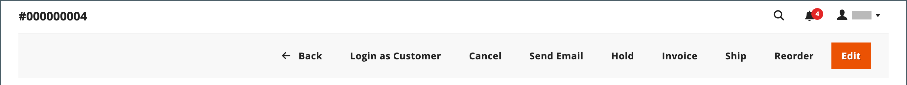

# Aggiornare un ordine

Quando si aiuta un cliente che ha effettuato un ordine, è necessario determinare lo stato dell&#39;ordine. Le opzioni disponibili per un ordine `Pending` sono diverse dalle opzioni per un ordine `Processing`. Per ulteriori informazioni, vedere [Elaborare un ordine](order-processing.md).

## Ordini in sospeso

Dopo che un cliente ha effettuato un ordine, ma prima della ricezione del pagamento, l&#39;ordine è nello stato `Pending`. È possibile modificare l&#39;ordine, bloccarlo o annullarlo completamente. Nella barra dei pulsanti di un ordine in sospeso sono elencate le azioni disponibili per un ordine.

{width="600" zoomable="yes"}

Se si modificano parti sostanziali di un ordine, l&#39;ordine originale viene annullato e viene generato un nuovo ordine. È tuttavia possibile modificare l&#39;indirizzo di fatturazione o di spedizione senza generare un nuovo ordine.

| Pulsante | Descrizione |
|--- |--- |
| **[!UICONTROL Back]** | Torna alla pagina Ordini senza salvare le modifiche. |
| **[!UICONTROL Login as Customer]** | Consente a un utente amministratore di assistere i clienti con i loro ordini. |
| **[!UICONTROL Cancel]** | Annulla l&#39;ordine in sospeso. |
| **[!UICONTROL Send Email]** | Invia al cliente un&#39;e-mail relativa all&#39;ordine in sospeso. |
| **[!UICONTROL Hold]** / **[!UICONTROL Unhold]** | Modifica lo stato dell&#39;ordine in sospeso in `On Hold`. Per rilasciare il blocco, scegliere _[!UICONTROL Unhold]_. |
| **[!UICONTROL Invoice]** | Crea una [fattura](invoices.md#create-an-invoice) dall&#39;ordine in sospeso convertendo l&#39;ordine in una fattura e modifica lo stato dell&#39;ordine in `processing`. |
| **[!UICONTROL Ship]** | Crea un record [spedizione](shipments.md#create-a-shipment) per l&#39;ordine. |
| **[!UICONTROL Reorder]** | Crea un nuovo ordine in sospeso duplicato dell&#39;ordine in sospeso corrente. |
| **[!UICONTROL Edit]** | Apre un ordine in sospeso in modalità di modifica. Il pulsante Modifica è disponibile solo per gli ordini in sospeso o per gli ordini basati su [preventivi](../b2b/quotes.md) negoziati. |

{style="table-layout:auto"}

## Ordini di elaborazione

Un ordine entra in uno stato `Processing` quando:

* Il pagamento per un ordine viene ricevuto/acquisito e la fattura viene generata quando l&#39;azione di pagamento è impostata su `Authorize and Capture`.
* Una transazione ordine è autorizzata, ma il pagamento non viene ancora acquisito quando l&#39;azione di pagamento è impostata su `Authorize`.

La [configurazione azione di pagamento](../configuration-reference/sales/payment-methods.md#payment-actions) determina le azioni di ordine disponibili dopo la creazione di un ordine.

Non è possibile modificare sostanzialmente un ordine `Processing`, ma è possibile modificare l&#39;indirizzo di fatturazione e di spedizione.

{width="600" zoomable="yes"}

>[!NOTE]
>
>Quando l&#39;azione di pagamento del metodo di pagamento è impostata su `Authorize and Capture`, viene creata automaticamente una fattura quando il cliente effettua un ordine. In questo caso, è possibile rimborsare i fondi utilizzando una [nota di credito](credit-memo-create.md), ma non è possibile [annullare](#cancel-a-pending-order) o [annullare](#void-a-processing-order) l&#39;ordine.

| Pulsante | Descrizione |
|--- |--- |
| **[!UICONTROL Back]** | Torna alla pagina Ordini senza salvare le modifiche. |
| **[!UICONTROL Send Email]** | Invia un&#39;e-mail relativa all&#39;ordine al cliente. |
| **[!UICONTROL Void]** | [Annulla](#void-a-processing-order) una transazione ordine o una transazione ordine parziale. |
| **[!UICONTROL Credit Memo]** | Avvia il processo per creare una [nota di credito](credit-memo-create.md). |
| **[!UICONTROL Hold]** / **[!UICONTROL Unhold]** | Modifica lo stato dell&#39;ordine cliente in `On Hold`. Per rilasciare il blocco dell&#39;ordine cliente, scegliere _[!UICONTROL Unhold]_. |
| **[!UICONTROL Reorder]** | Crea un nuovo ordine in sospeso basato sull&#39;ordine corrente. |
| **[!UICONTROL Create Returns]** |  (solo Adobe Commerce) avvia il processo per [restituire](returns.md) uno o più elementi dall&#39;ordine. |

{style="table-layout:auto"}

## Annullare un ordine di elaborazione

Quando un ordine è ancora nello stato `Processing` e l&#39;integrazione del pagamento è impostata su `Authorize` (non su `Authorize and Capture`), è possibile solo annullare una transazione o annullare un ordine. [L&#39;annullamento di un ordine](#cancel-a-pending-order) comporta anche l&#39;annullamento dell&#39;autorizzazione.

Quando un ordine viene effettuato utilizzando un metodo di pagamento con l&#39;azione di pagamento impostata su `Authorize and Capture`, è possibile rimborsare i fondi tramite nota di accredito, ma non è possibile annullarlo perché è fatturato e il pagamento viene acquisito.

Il metodo di pagamento determina le azioni di pagamento disponibili. Per ulteriori informazioni, consulta [Azioni di pagamento](../configuration-reference/sales/payment-methods.md#payment-actions).

**_Per annullare un ordine:_**

1. Nella barra laterale _Admin_, passa a **[!UICONTROL Sales]** > _[!UICONTROL Operations]_>**[!UICONTROL Orders]**.

1. Nella colonna **[!UICONTROL Action]** dell&#39;ordine da modificare fare clic su **[!UICONTROL View]**.

1. Fare clic su **[!UICONTROL Void]** per annullare l&#39;ordine.

1. Al prompt, fare clic su **[!UICONTROL OK]** per annullare l&#39;ordine.

È possibile emettere i rimborsi necessari utilizzando una [nota di credito](credit-memo-create.md) dopo l&#39;acquisizione dei fondi. È inoltre possibile creare una [autorizzazione di restituzione merce (RMA)](returns.md) rilasciata per la restituzione dei prodotti. Per ulteriori informazioni, vedere [Elaborazione di un ordine](order-processing.md).

## Modificare un ordine in sospeso

1. Nella barra laterale _Admin_, passa a **[!UICONTROL Sales]** > _[!UICONTROL Operations]_>**[!UICONTROL Orders]**.

1. Nella colonna **[!UICONTROL Action]** dell&#39;ordine da modificare fare clic su **[!UICONTROL View]**.

1. Fare clic su **[!UICONTROL Edit]**.

   {width="600" zoomable="yes"}

1. Al prompt, fare clic su **[!UICONTROL OK]** per continuare la modifica.

1. Aggiorna l’ordine in base alle esigenze.

1. Applica le modifiche:
   * Per salvare le modifiche apportate all&#39;indirizzo di fatturazione o di spedizione, fare clic su **[!UICONTROL Save]**.
   * Per salvare le modifiche apportate agli elementi riga e rielaborare l&#39;ordine, fare clic su **[!UICONTROL Submit Order]**.

## Blocca un ordine

Se il metodo di pagamento preferito dal cliente non è disponibile o se l&#39;articolo è temporaneamente esaurito, è possibile bloccare l&#39;ordine.

1. Nella griglia _Ordini_, individuare l&#39;ordine `Pending` che si desidera bloccare.

1. Nella colonna _Azione_ fare clic su **[!UICONTROL View]**.

1. Fare clic su **[!UICONTROL Hold]** per bloccare l&#39;ordine.

Per rimuovere il blocco di un ordine, modificarlo di nuovo e fare clic su **[!UICONTROL Unhold]**.

## Annullare un ordine in sospeso

L&#39;annullamento di un ordine ne modifica lo stato da `Pending` a `Canceled`.

1. Nella griglia _[!UICONTROL Orders]_, trovare l&#39;ordine in sospeso da annullare.

1. Nella colonna _[!UICONTROL Action]_fare clic su **[!UICONTROL View]**.

1. Fare clic su **[!UICONTROL Cancel]** per annullare l&#39;ordine.

Lo stato dell&#39;ordine è ora `Canceled`.
