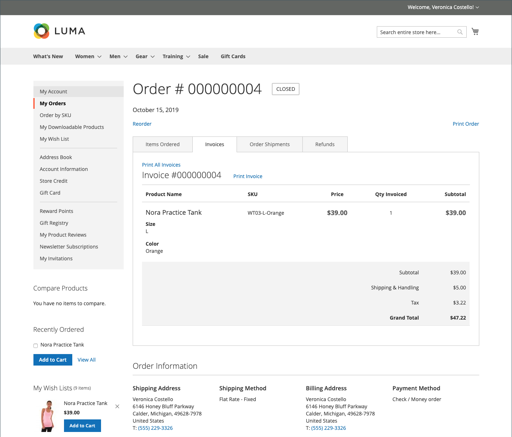
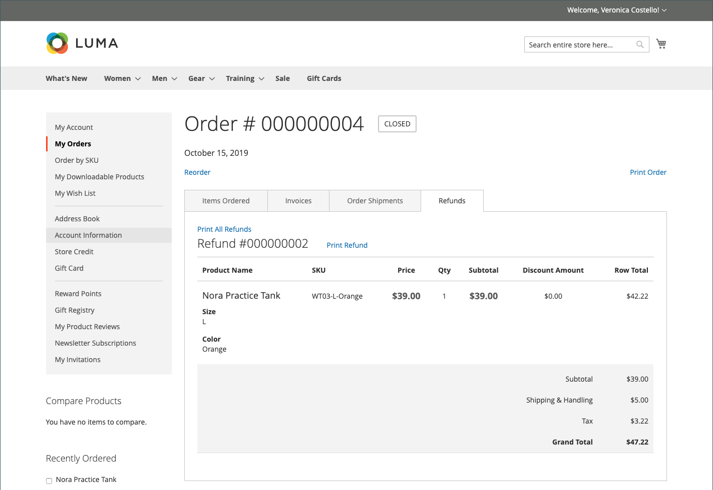

# Gestione ordini vetrina

I clienti hanno accesso a tutti i loro ordini dal loro account. Gli ordini possono essere visualizzati, filtrati, tracciati e risottomessi come nuovi ordini. A seconda dello stato dell&#39;ordine, i clienti possono stampare gli ordini, le fatture, le spedizioni e i record di rimborso.

## Filtra ordini

{{b2b-feature}}

Il tuo iniziale _[!UICONTROL My Orders]_i risultati contengono anche ordini corrispondenti da parte di utenti subordinati di tutti i siti web all’interno dell’istanza di commerce. Un cliente associato a un account società può filtrare l&#39;elenco degli ordini per trovare rapidamente i record all&#39;interno dei risultati. Per visualizzare le opzioni del filtro, il cliente fa clic su **[!UICONTROL Filter]**, e clic **[!UICONTROL Close]**per nascondere i filtri.

{width="700" zoomable="yes"}

| Filtro | Descrizione |
| ------ | ----------- |
| [!UICONTROL SKU or Product Name] | Immette uno SKU o un nome di prodotto. |
| [!UICONTROL Order Number] | Può essere un numero di ordine completo o parziale. |
| [!UICONTROL Order Status] | Seleziona un valore dal menu a discesa per filtrare per stato. |
| [!UICONTROL Invoice Number] | Inserisce un numero di fattura completo o parziale. |
| [!UICONTROL Order Date] | Imposta uno o entrambi i campi data per filtrare per data ordine. |
| [!UICONTROL Created by] | Filtra gli ordini aziendali per creatore dell&#39;ordine. |
| [!UICONTROL Order Total] | Imposta i valori minimo, massimo o entrambi per filtrare in base al totale dell&#39;ordine. |

## Visualizza un ordine

Un cliente trova l’ordine nell’elenco e fa clic su **[!UICONTROL View Order]**. Dall’ordine aperto, possono eseguire una delle seguenti operazioni:

{width="700" zoomable="yes"}

### Visualizza prodotti ordinati di recente

Il **[!UICONTROL Recent Orders]** viene visualizzato nella barra laterale e sul **[!UICONTROL My Account]** pagina per i clienti che hanno effettuato l’accesso dopo aver effettuato un ordine. Vengono visualizzati cinque prodotti dell’ultimo acquisto.

Il cliente può leggere i prodotti nel carrello selezionando i prodotti e facendo clic su **[!UICONTROL Add to Cart]**. È inoltre possibile visualizzare l&#39;ultimo ordine facendo clic su **[!UICONTROL View all]**, che reindirizza al _[!UICONTROL My Account]_pagina e **[!UICONTROL Recent Orders]**blocco.

### Ordine di stampa

1. Il cliente fa clic **[!UICONTROL Print Order]**.

1. Per completare la stampa, seguire le istruzioni della finestra di dialogo Stampa.

### Stampa fatture

1. Il giorno **[!UICONTROL Invoices]** , il cliente fa clic su una delle seguenti opzioni:

   - **[!UICONTROL Print All Invoices]**

   - **[!UICONTROL Print Invoice]**

   {width="700" zoomable="yes"}

1. Utilizza la finestra di dialogo Stampa per completare la stampa.

### Stampa spedizioni

1. Il giorno **[!UICONTROL Order Shipments]** , il cliente fa clic su una delle seguenti opzioni:

   - **[!UICONTROL Print All Shipments]**

   - **[!UICONTROL Print Shipment]**

   {width="700" zoomable="yes"}

1. Utilizza la finestra di dialogo Stampa per completare la stampa.

### Tracciare una spedizione

1. Il giorno **[!UICONTROL Order Shipments]** , fare clic su **[!UICONTROL Track this Shipment]**.

   Tutte le informazioni di tracciamento disponibili vengono visualizzate in una finestra popup.

1. Quando è pronto, il cliente fa clic su **[!UICONTROL Close Window]**.

### Stampa rimborsi

1. Il giorno **Rimborsi** , il cliente fa clic su una delle seguenti opzioni:

   - **Stampa tutti i rimborsi**

   - **Stampa rimborso**

   {width="700" zoomable="yes"}

1. Utilizza la finestra di dialogo Stampa per completare la stampa.

I riordini sono disponibili per i clienti quando [_Consenti riordino_](reorders-allow.md) l&#39;opzione di configurazione è abilitata.

Un cliente può avviare la funzionalità di riordino per un ordine specifico da due pagine:

- Pagina I miei ordini
- Pagina Vista ordine

## Riordini

Il _[!UICONTROL Reorder]_viene visualizzato nell’elenco con gli ordini vicini al_[!UICONTROL View]_ collegamento.

{width="700" zoomable="yes"}

**Caso 1.** Tutti i prodotti dell&#39;ordine sono disponibili per il riordino

Il cliente viene reindirizzato al carrello e tutti i prodotti vengono aggiunti al carrello.

**Caso 2.** Alcuni/tutti i prodotti dell&#39;ordine non sono disponibili per il riordino

>[!NOTE]
>
>È possibile riordinare `Not Visible Individually` prodotti.

Il _[!UICONTROL Reorder]_il collegamento non viene visualizzato sul_[!UICONTROL My Orders]_ e _[!UICONTROL View Order]_pagine.

{width="700" zoomable="yes"}

>[!TIP]
>
>Se il carrello non è vuoto e il cliente fa clic **[!UICONTROL Reorder]** (dal [!UICONTROL My Orders] o [!UICONTROL Order View] ), i prodotti esistenti rimangono nel carrello con i prodotti di riordino aggiunti.

## Annulla ordini

L’opzione Annulla è disponibile per i clienti quando [_Consenti annullamento_](cancel-allow.md) l&#39;opzione di configurazione è abilitata.

Il cliente può avviare la funzionalità di annullamento per un ordine specifico da tre pagine:

- Pagina I miei ordini
- Pagina Vista ordine
- Pagina Il mio account

Il _[!UICONTROL Cancel Order]_viene visualizzato accanto al_[!UICONTROL Reorder]_ collegamento. Se non è possibile annullare l’ordine, il collegamento non viene visualizzato.

{width="700" zoomable="yes"}

Per eseguire l’annullamento, il cliente:

1. Clic **[!UICONTROL Cancel Order]**

1. Fornisce un motivo di annullamento

   {width="700" zoomable="yes"}

   Puoi personalizzare i motivi dell’annullamento in [_Consenti annullamento_](cancel-allow.md) pagina.

1. Clic **[!UICONTROL Confirm]**

   {width="700" zoomable="yes"}

   Dopo l’annullamento, gli ordini in _[!UICONTROL Pending]_stato, modifica in_[!UICONTROL Canceled]_ stato, gli ordini che erano in _[!UICONTROL Processing]_stato, modifica in_[!UICONTROL Closed]_ e un rimborso.

   Al termine dell’annullamento, viene inviata un’e-mail al cliente.

   {width="700" zoomable="yes"}

   Le informazioni sull&#39;annullamento vengono aggiunte alla cronologia degli ordini del cliente. Viene visualizzato nelle note dell&#39;ordine e nella scheda della cronologia dei commenti.

   {width="700" zoomable="yes"}

   {width="700" zoomable="yes"}

   Se per qualche motivo l’ordine è cambiato in uno stato che non può essere annullato e il cliente non ha aggiornato la pagina, viene comunque visualizzato il collegamento per annullare l’ordine. Tuttavia, quando tenta di annullare, viene visualizzato un messaggio di errore.

   {width="700" zoomable="yes"}

   Dopo aver aggiornato la pagina, puoi vedere che l’ordine era già stato completato ed è per questo che l’annullamento non ha funzionato.

   {width="700" zoomable="yes"}
