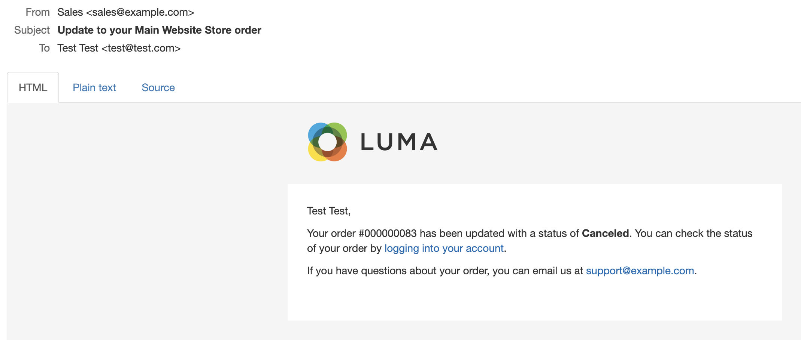

# Gestione ordini vetrina

I clienti hanno accesso a tutti i loro ordini dal loro account. Gli ordini possono essere visualizzati, filtrati, tracciati e risottomessi come nuovi ordini. A seconda dello stato dell&#39;ordine, i clienti possono stampare gli ordini, le fatture, le spedizioni e i record di rimborso.

## Filtra ordini

{{b2b-feature}}

I risultati iniziali di _[!UICONTROL My Orders]_&#x200B;contengono anche ordini corrispondenti di utenti subordinati da tutti i siti Web all&#39;interno dell&#39;istanza di Commerce. Un cliente associato a un account società può filtrare l&#39;elenco degli ordini per trovare rapidamente i record all&#39;interno dei risultati. Per visualizzare le opzioni di filtro, il cliente fa clic su **[!UICONTROL Filter]**&#x200B;e fa clic su **[!UICONTROL Close]**&#x200B;per nascondere i filtri.

{width="700" zoomable="yes"}

| Filtro | Descrizione |
| ------ | ----------- |
| [!UICONTROL SKU or Product Name] | Immette uno SKU o un nome di prodotto. |
| [!UICONTROL Order Number] | Può essere un numero di ordine completo o parziale. |
| [!UICONTROL Order Status] | Seleziona un valore dal menu a discesa per filtrare per stato. |
| [!UICONTROL Invoice Number] | Inserisce un numero di fattura completo o parziale. |
| [!UICONTROL Order Date] | Imposta uno o entrambi i campi data per filtrare per data ordine. |
| [!UICONTROL Created by] | Filtra gli ordini aziendali per creatore dell&#39;ordine. |
| [!UICONTROL Order Total] | Imposta i valori minimo, massimo o entrambi per filtrare in base al totale dell&#39;ordine. |

## Visualizza un ordine

Un cliente trova l&#39;ordine nell&#39;elenco e fa clic su **[!UICONTROL View Order]**. Dall’ordine aperto, possono eseguire una delle seguenti operazioni:

{width="700" zoomable="yes"}

### Visualizza prodotti ordinati di recente

Il blocco **[!UICONTROL Recent Orders]** viene visualizzato nella barra laterale e nella pagina **[!UICONTROL My Account]** per i clienti che hanno effettuato l&#39;accesso dopo aver effettuato un ordine. Vengono visualizzati cinque prodotti dell’ultimo acquisto.

Il cliente può leggere i prodotti nel carrello selezionando i prodotti e facendo clic su **[!UICONTROL Add to Cart]**. È inoltre possibile visualizzare l&#39;ultimo ordine facendo clic su **[!UICONTROL View all]**, che reindirizza alla pagina _[!UICONTROL My Account]_&#x200B;e al blocco **[!UICONTROL Recent Orders]**.

### Ordine di stampa

1. Il cliente fa clic su **[!UICONTROL Print Order]**.

1. Per completare la stampa, seguire le istruzioni della finestra di dialogo Stampa.

### Stampa fatture

1. Nella scheda **[!UICONTROL Invoices]**, il cliente fa clic su una delle opzioni seguenti:

   - **[!UICONTROL Print All Invoices]**

   - **[!UICONTROL Print Invoice]**

   {width="700" zoomable="yes"}

1. Utilizza la finestra di dialogo Stampa per completare la stampa.

### Stampa spedizioni

1. Nella scheda **[!UICONTROL Order Shipments]**, il cliente fa clic su una delle opzioni seguenti:

   - **[!UICONTROL Print All Shipments]**

   - **[!UICONTROL Print Shipment]**

   {width="700" zoomable="yes"}

1. Utilizza la finestra di dialogo Stampa per completare la stampa.

### Tracciare una spedizione

1. Nella scheda **[!UICONTROL Order Shipments]**, fare clic su **[!UICONTROL Track this Shipment]**.

   Tutte le informazioni di tracciamento disponibili vengono visualizzate in una finestra popup.

1. Quando è pronto, il cliente fa clic su **[!UICONTROL Close Window]**.

### Stampa rimborsi

1. Nella scheda **Rimborsi**, il cliente fa clic su una delle opzioni seguenti:

   - **Stampa tutti i rimborsi**

   - **Rimborso per la stampa**

   {width="700" zoomable="yes"}

1. Utilizza la finestra di dialogo Stampa per completare la stampa.

I reordini sono disponibili per i clienti quando l&#39;opzione di configurazione [_Consenti riordino_](reorders-allow.md) è abilitata.

Un cliente può avviare la funzionalità di riordino per un ordine specifico da due pagine:

- Pagina I miei ordini
- Pagina Vista ordine

## Riordini

Il collegamento _[!UICONTROL Reorder]_&#x200B;viene visualizzato nell&#39;elenco con gli ordini vicini al collegamento&#x200B;_[!UICONTROL View]_.

{width="700" zoomable="yes"}

**Caso 1.** Tutti i prodotti dell&#39;ordine sono disponibili per il riordino

Il cliente viene reindirizzato al carrello e tutti i prodotti vengono aggiunti al carrello.

**Caso 2.** Alcuni/tutti i prodotti dell&#39;ordine non sono disponibili per il riordino

>[!NOTE]
>
>È possibile riordinare `Not Visible Individually` prodotti.

Il collegamento _[!UICONTROL Reorder]_&#x200B;non viene visualizzato nelle pagine&#x200B;_[!UICONTROL My Orders]_ e _[!UICONTROL View Order]_.

{width="700" zoomable="yes"}

>[!TIP]
>
>Se il carrello non è vuoto e il cliente fa clic su **[!UICONTROL Reorder]** (dalla pagina [!UICONTROL My Orders] o [!UICONTROL Order View]), i prodotti esistenti rimangono nel carrello con i prodotti di riordino aggiunti.

## Annulla ordini

L&#39;opzione Annulla è disponibile per i clienti quando è abilitata l&#39;opzione di configurazione [_Consenti annullamento_](cancel-allow.md).

Il cliente può avviare la funzionalità di annullamento per un ordine specifico da tre pagine:

- Pagina I miei ordini
- Pagina Vista ordine
- Pagina Il mio account

Il collegamento _[!UICONTROL Cancel Order]_&#x200B;viene visualizzato accanto al collegamento&#x200B;_[!UICONTROL Reorder]_. Se non è possibile annullare l’ordine, il collegamento non viene visualizzato.

{width="700" zoomable="yes"}

Per eseguire l’annullamento, il cliente:

1. Clic su **[!UICONTROL Cancel Order]**

1. Fornisce un motivo di annullamento

   {width="700" zoomable="yes"}

   È possibile personalizzare i motivi di annullamento nella pagina [_Consenti annullamento_](cancel-allow.md).

1. Clic su **[!UICONTROL Confirm]**

   {width="700" zoomable="yes"}

   Dopo l&#39;annullamento, verranno elaborati gli ordini con stato _[!UICONTROL Pending]_, lo stato&#x200B;_[!UICONTROL Canceled]_, gli ordini con stato _[!UICONTROL Processing]_, lo stato&#x200B;_[!UICONTROL Closed]_ e un rimborso.

   Al termine dell’annullamento, viene inviata un’e-mail al cliente.

   {width="700" zoomable="yes"}

   Le informazioni sull&#39;annullamento vengono aggiunte alla cronologia degli ordini del cliente. Viene visualizzato nelle note dell&#39;ordine e nella scheda della cronologia dei commenti.

   {width="700" zoomable="yes"}

   {width="700" zoomable="yes"}

   Se per qualche motivo l’ordine è cambiato in uno stato che non può essere annullato e il cliente non ha aggiornato la pagina, viene comunque visualizzato il collegamento per annullare l’ordine. Tuttavia, quando tenta di annullare, viene visualizzato un messaggio di errore.

   {width="700" zoomable="yes"}

   Dopo aver aggiornato la pagina, puoi vedere che l’ordine era già stato completato ed è per questo che l’annullamento non ha funzionato.

   {width="700" zoomable="yes"}
